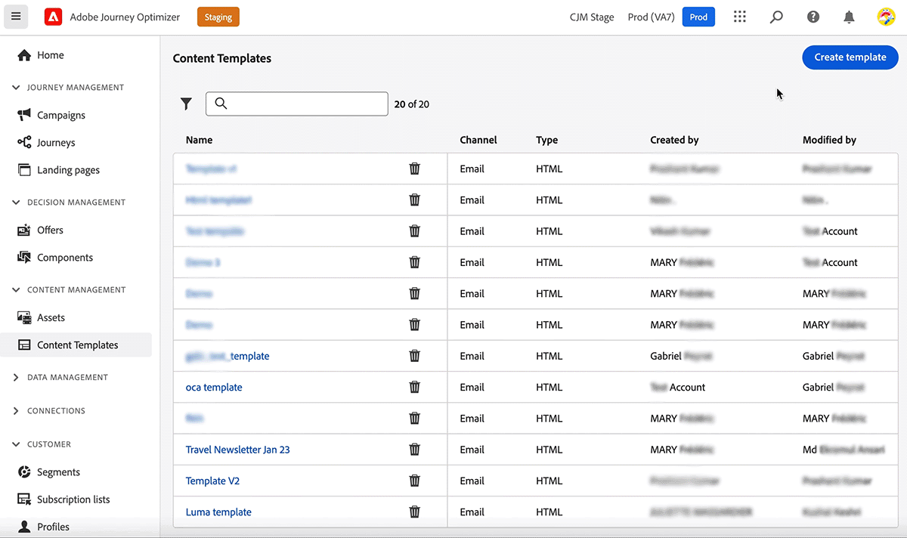

# Introduzione ai modelli di contenuto {#content-templates}

>[!NOTE]
>
>A partire da marzo 2025, i modelli di contenuto di tipo HTML sono diventati obsoleti. È comunque possibile utilizzare i modelli di contenuto HTML esistenti creati in precedenza in [!DNL Journey Optimizer].

Per accelerare e migliorare la progettazione, creare modelli autonomi per riutilizzare facilmente i contenuti personalizzati in [!DNL Journey Optimizer] campagne e percorsi.

Questa funzionalità consente agli utenti orientati ai contenuti di lavorare su modelli al di fuori di campagne o percorsi. Gli utenti marketing possono quindi riutilizzare e adattare questi modelli di contenuto autonomo all’interno dei propri percorsi o campagne.

<!---->

Ad esempio, un utente all’interno dell’azienda può concentrarsi esclusivamente sul contenuto e non avere accesso a campagne o percorsi. Questo utente può creare un modello e-mail che gli esperti marketing della tua organizzazione possono selezionare come punto di partenza per tutte le e-mail.

Puoi creare modelli di contenuto per i canali E-mail, Push, In-app, SMS e Direct Mail.

>[!AVAILABILITY]
>
>Al momento i modelli di contenuto non sono disponibili per il canale web.

Per creare, modificare ed eliminare modelli di contenuto, assicurarsi di disporre dell&#39;autorizzazione **[!DNL Manage library items]** inclusa nel profilo di prodotto **[!DNL Content Library Manager]**. [Ulteriori informazioni](../administration/ootb-product-profiles.md#content-library-manager)

➡️ [Scopri come creare e utilizzare i modelli in questo video](#video-templates)

>[!NOTE]
>
>Puoi anche creare e gestire modelli di contenuto utilizzando le API. Per ulteriori informazioni, consulta la [documentazione delle API Journey Optimizer](https://developer.adobe.com/journey-optimizer-apis/references/content){target="_blank"}.

## Video introduttivo {#video-templates}

Scopri come creare, modificare e utilizzare i modelli di contenuto in [!DNL Journey Optimizer].

>[!VIDEO](https://video.tv.adobe.com/v/3413743/?quality=12)
