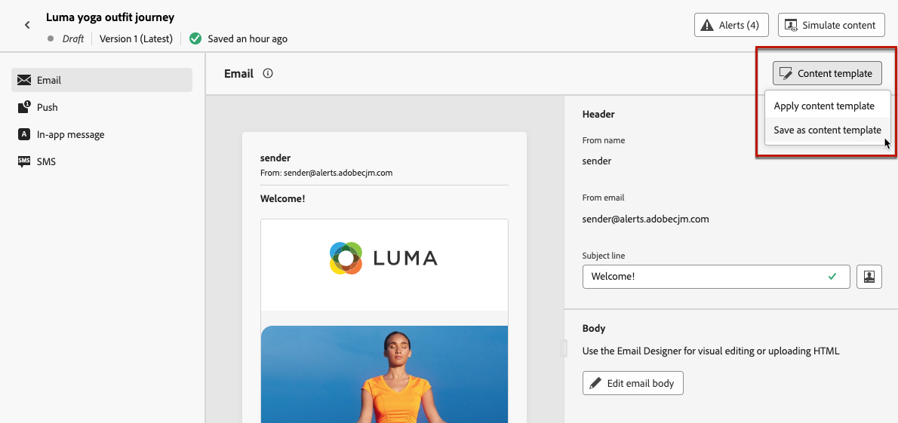

# Utilizzare i modelli di contenuto {#content-templates}

Per un processo di progettazione accelerato e migliorato, puoi creare modelli autonomi per riutilizzare facilmente i contenuti personalizzati in [!DNL Journey Optimizer] campagne e percorsi.

Questa funzionalità consente agli utenti orientati ai contenuti di lavorare su modelli al di fuori di campagne o percorsi. Gli utenti marketing possono quindi riutilizzare e adattare questi modelli di contenuto autonomo all’interno dei propri percorsi o campagne.

<!---->

>[!NOTE]
>
>Al momento i modelli di contenuto non sono disponibili per il canale web.

Ad esempio, un utente all’interno dell’azienda è solo responsabile dei contenuti e quindi non ha accesso a campagne o percorsi. Tuttavia, questo utente può creare un modello e-mail che gli esperti marketing della tua organizzazione potranno selezionare per l’utilizzo in tutte le e-mail come punto di partenza.

Puoi anche creare e gestire modelli di contenuto utilizzando le API. Per ulteriori informazioni, consulta [Documentazione delle API di Journey Optimizer](https://developer.adobe.com/journey-optimizer-apis/references/content/){target="_blank"}.

➡️ [Scopri come creare e utilizzare i modelli in questo video](#video-templates)

>[!CAUTION]
>
>Per creare, modificare ed eliminare i modelli di contenuto, è necessario disporre del **[!DNL Manage library items]** autorizzazione inclusa nel **[!DNL Content Library Manager]** profilo di prodotto. [Ulteriori informazioni](../administration/ootb-product-profiles.md#content-library-manager)

## Accedere ai modelli e gestirli {#access-manage-templates}

Per accedere all&#39;elenco dei modelli di contenuto, selezionare **[!UICONTROL Gestione dei contenuti]** > **[!UICONTROL Modelli di contenuto]** dal menu a sinistra.

Tutti i modelli creati nella sandbox corrente, da un percorso o da una campagna utilizzando **[!UICONTROL Salva come modello]** opzione, dal menu **[!UICONTROL Modelli di contenuto]** menu -. [Scopri come creare modelli](#create-content-templates)

Puoi ordinare i modelli di contenuto in base a:
* Tipo
* Channel
* Data di creazione o modifica
* Tag - [Ulteriori informazioni sui tag](../start/search-filter-categorize.md#tags)

Puoi anche scegliere di visualizzare solo gli elementi creati o modificati personalmente.

<!--Select the **[!UICONTROL Grid view]** mode to display each template as a thumbnail. 

>[!NOTE]
>
>Currently proper thumbnails can only be generated for HTML-type email content templates.

When you update a content, you may have to wait a few seconds before the changes are reflected in the thumbnail.

-->

* Per modificare il contenuto di un modello, fai clic sull’elemento desiderato dall’elenco e seleziona **[!UICONTROL Modifica contenuto]**.

  

* Per eliminare un modello, selezionare **[!UICONTROL Altre azioni]** accanto al modello desiderato e seleziona **[!UICONTROL Elimina]**.

  

>[!NOTE]
>
>Quando si modifica o si elimina un modello, le campagne o i percorsi che includono il contenuto creato utilizzando questo modello non sono interessati.

## Creare modelli di contenuto {#create-content-templates}

>[!CONTEXTUALHELP]
>id="ajo_create_template"
>title="Definire un modello di contenuto personalizzato"
>abstract="Crea da zero un modello personalizzato autonomo per rendere i contenuti riutilizzabili in più percorsi e campagne."

Esistono due modi per creare modelli di contenuto:

* Creare un modello di contenuto da zero utilizzando la barra a sinistra **[!UICONTROL Modelli di contenuto]** menu. [Scopri come](#create-template-from-scratch)

* Quando progetti il contenuto all’interno di una campagna o di un percorso, salvalo come modello. [Scopri come](#save-as-template)

Una volta salvato, il modello di contenuto è disponibile per l’utilizzo in una campagna o in un percorso. Creato da zero o da un contenuto precedente, ora puoi utilizzare questo modello per creare qualsiasi contenuto in [!DNL Journey Optimizer]. [Scopri come](#use-content-templates)

>[!NOTE]
>
>* Le modifiche apportate ai modelli di contenuto non vengono propagate a campagne o percorsi, sia che siano live o bozze.
>
>* Allo stesso modo, quando i modelli vengono utilizzati in una campagna o in un percorso, eventuali modifiche apportate al contenuto della campagna e del percorso non influiscono sul modello di contenuto utilizzato in precedenza.

### Crea modello da zero {#create-template-from-scratch}

Per creare un modello di contenuto da zero, effettua le seguenti operazioni.

1. Accedere all’elenco dei modelli di contenuto tramite **[!UICONTROL Gestione dei contenuti]** > **[!UICONTROL Modelli di contenuto]** menu a sinistra.

1. Seleziona **[!UICONTROL Crea modello]**.

1. Inserisci i dettagli del modello e seleziona il canale desiderato.

   

   >[!NOTE]
   >
   >Attualmente sono disponibili tutti i canali eccetto Web.

1. Scegli un **[!UICONTROL Tipo]** per il canale selezionato.

   

   * Per **[!UICONTROL E-mail]**, se selezioni **[!UICONTROL Contenuto]**, è possibile definire [Oggetto](../email/create-email.md#define-email-content) come parte del modello. Se si seleziona **[!UICONTROL HTML]**, è possibile definire solo il contenuto del corpo dell’e-mail.

   * Per **[!UICONTROL SMS]**, **[!UICONTROL Push]**, **[!UICONTROL In-app]** e **[!UICONTROL Direct mailing]**, per il canale corrente è disponibile solo il tipo predefinito. È comunque necessario selezionarlo.

1. Seleziona o crea tag Adobe Experience Platform da **[!UICONTROL Tag]** per categorizzare il modello e migliorare la ricerca. [Ulteriori informazioni](../start/search-filter-categorize.md#tags)

1. Per assegnare al modello etichette di utilizzo dei dati personalizzate o di base, puoi selezionare **[!UICONTROL Gestisci accesso]**. [Ulteriori informazioni su OLAC (Object Level Access Control)](../administration/object-based-access.md).

1. Clic **[!UICONTROL Crea]** e progettare i contenuti in base alle esigenze, nello stesso modo in cui si farebbe per qualsiasi contenuto all’interno di un percorso o di una campagna, in base al canale selezionato.

   

   Scopri come creare contenuti per i diversi canali nelle sezioni seguenti:
   * [Definire il contenuto delle e-mail](../email/get-started-email-design.md)
   * [Definire il contenuto push](../push/design-push.md)
   * [Definire il contenuto degli SMS](../sms/create-sms.md#sms-content)
   * [Definire il contenuto della direct mailing](../direct-mail/create-direct-mail.md)
   * [Definire il contenuto in-app](../in-app/design-in-app.md)

1. Se stai creando un’ **[!UICONTROL E-mail]** modello con **[!UICONTROL HTML]** testo, puoi verificare il contenuto. [Scopri come](#test-template)

1. Quando il modello è pronto, fai clic su **[!UICONTROL Salva]**.

1. Fai clic sulla freccia accanto al nome del modello per tornare al **[!UICONTROL Dettagli]** schermo.

   

Questo modello è ora pronto per essere utilizzato quando si crea qualsiasi contenuto in [!DNL Journey Optimizer]. [Scopri come](#use-content-templates)

### Salva come modello {#save-as-template}

>[!CONTEXTUALHELP]
>id="ajo_messages_depecrated_inventory"
>title="Scopri come effettuare la migrazione dei messaggi"
>abstract="Il 25 luglio 2022 il menu Messaggi è stato rimosso e i messaggi vengono ora creati direttamente da un percorso. Per riutilizzare i messaggi precedenti nei percorsi, devi salvarli come modelli."

Durante la progettazione di qualsiasi contenuto in una campagna o in un percorso, puoi salvarlo per un riutilizzo futuro. Per farlo, segui la procedura indicata di seguito.

1. Dal messaggio **[!UICONTROL Modifica contenuto]** , fare clic su **[!UICONTROL Modello di contenuto]** pulsante.

1. Seleziona **[!UICONTROL Salva come modello di contenuto]** dal menu a discesa.

   

   Se si è nel [E-mail Designer](../email/get-started-email-design.md), è inoltre possibile selezionare questa opzione dal menu **[!UICONTROL Altro]** in alto a destra.

   

1. Aggiungi un nome e una descrizione per questo modello.

   

   >[!NOTE]
   >
   >Il canale e il tipo correnti vengono compilati automaticamente e non possono essere modificati. Per i modelli e-mail creati da [E-mail Designer](../email/get-started-email-design.md), il **[!UICONTROL HTML]** viene selezionato automaticamente.

1. Seleziona o crea un tag Adobe Experience Platform da **Tag** per categorizzare il modello. [Ulteriori informazioni](../start/search-filter-categorize.md#tags)

1. Per assegnare al modello etichette di utilizzo dei dati personalizzate o di base, puoi selezionare **[!UICONTROL Gestisci accesso]**. [Ulteriori informazioni](../administration/object-based-access.md).

1. Fai clic su **[!UICONTROL Salva]**.

1. Il modello viene salvato in **[!UICONTROL Modelli di contenuto]** , accessibile dalla [!DNL Journey Optimizer] menu dedicato. Diventa un modello di contenuto autonomo accessibile, modificato ed eliminato come qualsiasi altro elemento dell’elenco. [Ulteriori informazioni](#access-manage-templates)

Ora puoi utilizzare questo modello per creare qualsiasi contenuto in [!DNL Journey Optimizer]. [Scopri come](#use-content-templates)

>[!NOTE]
>
>Qualsiasi modifica apportata a tale nuovo modello non viene propagata al contenuto da cui proviene. Analogamente, quando il contenuto originale viene modificato all’interno di tale contenuto, il nuovo modello non viene modificato.

## Test dei modelli di contenuto e-mail {#test-template}

Puoi testare il rendering di alcuni modelli e-mail, creati da zero o da un contenuto esistente. A questo scopo, segui i passaggi riportati qui sotto.

>[!CAUTION]
>
>I modelli di contenuto attualmente in fase di test sono disponibili solo per **[!UICONTROL E-mail]** modelli con **[!UICONTROL HTML]** tipo.

1. Accedere all’elenco dei modelli di contenuto tramite **[!UICONTROL Gestione dei contenuti]** > **[!UICONTROL Modelli di contenuto]** e seleziona un modello di e-mail.

1. Clic **[!UICONTROL Modifica contenuto]** dal **[!UICONTROL Proprietà modello]**.

1. Clic **[!UICONTROL Simula contenuto]** e seleziona un profilo di test per controllare il rendering. [Ulteriori informazioni](../content-management/preview-test.md)

   

1. Puoi inviare una bozza per testare il contenuto e farla approvare da alcuni utenti interni prima di utilizzarla in un percorso o in una campagna.

   * A tale scopo, fare clic sul pulsante **[!UICONTROL Invia bozza]** e seguire i passaggi descritti in [questa sezione](../content-management/proofs.md).

   * Prima di inviare la bozza, è necessario selezionare [superficie e-mail](../configuration/channel-surfaces.md) che verranno utilizzati per testare il contenuto.

     

>[!CAUTION]
>
>Il tracciamento attuale non è supportato durante il test dei modelli di contenuto e-mail, il che significa che gli eventi di tracciamento, i parametri UTM e i collegamenti alle pagine di destinazione non saranno efficaci nelle bozze inviate da un modello. Per verificare il tracciamento: [utilizzare il modello di contenuto](../email/use-email-templates.md) in un messaggio e-mail e [invia una bozza](../content-management/preview-test.md#send-proofs).

## Utilizzare i modelli di contenuto {#use-content-templates}

Durante la creazione di contenuti per qualsiasi canale (eccetto Web) in [!DNL Journey Optimizer], puoi utilizzare un modello personalizzato che:

* Creato da zero utilizzando **[!UICONTROL Modelli di contenuto]** menu. [Ulteriori informazioni](#create-template-from-scratch)

* Salvato da un contenuto esistente in un percorso o in una campagna utilizzando **[!UICONTROL Salva come modello di contenuto]** opzione. [Ulteriori informazioni](#save-as-template)

Per iniziare a creare i contenuti con uno di questi modelli, segui i passaggi indicati di seguito.

1. In una campagna o in un percorso, dopo aver selezionato **[!UICONTROL Modifica contenuto]**, fare clic su **[!UICONTROL Modello di contenuto]** pulsante.

1. Seleziona **[!UICONTROL Applica modello di contenuto]**.

   

1. Seleziona dall’elenco il modello desiderato. Vengono visualizzati solo i modelli compatibili con il canale e/o il tipo selezionati.

   

   >[!NOTE]
   >
   >Da questa schermata, puoi anche creare un nuovo modello utilizzando il pulsante dedicato, che apre una nuova scheda.

1. Clic **[!UICONTROL Conferma]**. Il modello viene applicato al contenuto.

1. Continua a modificare il contenuto come desiderato.

>[!NOTE]
>
>Per iniziare a progettare un’e-mail da un modello di contenuto utilizzando [E-mail Designer](../email/get-started-email-design.md), segui i passaggi descritti in [questa sezione](../email/use-email-templates.md).

## Video introduttivo {#video-templates}

Scopri come creare, modificare e utilizzare i modelli di contenuto in [!DNL Journey Optimizer].

>[!VIDEO](https://video.tv.adobe.com/v/3413743/?quality=12)
