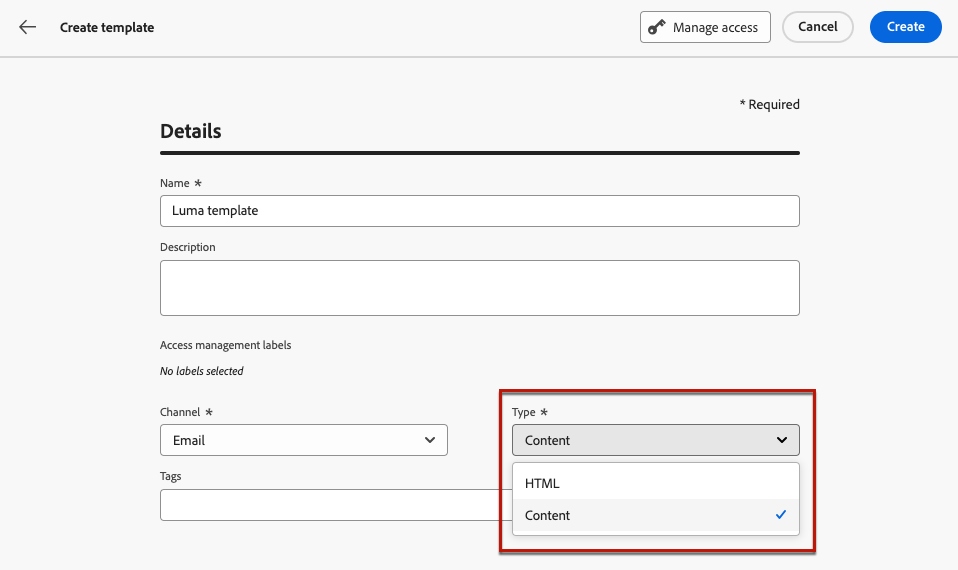

# Creare modelli di contenuto {#create-content-templates}

>[!CONTEXTUALHELP]
>id="ajo_create_template"
>title="Definire un modello di contenuto personalizzato"
>abstract="Crea da zero un modello personalizzato autonomo per rendere i contenuti riutilizzabili in più percorsi e campagne."

Esistono due modi per creare modelli di contenuto:

* Crea un modello di contenuto da zero utilizzando la barra a sinistra del menu **[!UICONTROL Modelli di contenuto]**. [Scopri come](#create-template-from-scratch)

* Quando progetti il contenuto all’interno di una campagna o di un percorso, salvalo come modello. [Scopri come](#save-as-template)

Una volta salvato, il modello di contenuto è disponibile per l’utilizzo in una campagna o in un percorso. Indipendentemente dal fatto che sia stato creato da zero o da un contenuto precedente, è ora possibile utilizzare questo modello per creare qualsiasi contenuto in [!DNL Journey Optimizer]. [Scopri come](#use-content-templates)

>[!NOTE]
>
>* Le modifiche apportate ai modelli di contenuto non vengono propagate a campagne o percorsi, sia che siano live o bozze.
>
>* Allo stesso modo, quando i modelli vengono utilizzati in una campagna o in un percorso, eventuali modifiche apportate al contenuto della campagna e del percorso non influiscono sul modello di contenuto utilizzato in precedenza.

## Crea modello da zero {#create-template-from-scratch}

Per creare un modello di contenuto da zero, effettua le seguenti operazioni.

1. Accedi all&#39;elenco dei modelli di contenuto tramite il menu a sinistra **[!UICONTROL Gestione contenuto]** > **[!UICONTROL Modelli di contenuto]**.

1. Seleziona **[!UICONTROL Crea modello]**.

1. Inserisci i dettagli del modello e seleziona il canale desiderato.

   

   >[!NOTE]
   >
   >Attualmente sono disponibili tutti i canali eccetto Web.

1. Scegli un **[!UICONTROL Tipo]** per il canale selezionato.

   

   * Per **[!UICONTROL E-mail]**, se selezioni **[!UICONTROL Contenuto]**, puoi definire la [riga oggetto](../email/create-email.md#define-email-content) come parte del modello. Se selezioni **[!UICONTROL HTML]**, puoi definire solo il contenuto del corpo dell&#39;e-mail.

   * Per **[!UICONTROL SMS]**, **[!UICONTROL Push]**, **[!UICONTROL In-App]** e **[!UICONTROL Direct Mail]**, è disponibile solo il tipo predefinito per il canale corrente. È comunque necessario selezionarlo.

1. Seleziona o crea tag Adobe Experience Platform dal campo **[!UICONTROL Tag]** per categorizzare il modello ai fini di una ricerca migliorata. [Ulteriori informazioni](../start/search-filter-categorize.md#tags)

1. Per assegnare etichette di utilizzo dei dati personalizzate o di base al modello, è possibile selezionare **[!UICONTROL Gestisci accesso]**. [Ulteriori informazioni sul controllo degli accessi a livello di oggetto](../administration/object-based-access.md).

1. Fai clic su **[!UICONTROL Crea]** e progetta il contenuto in base alle esigenze, come faresti per qualsiasi contenuto all&#39;interno di un percorso o di una campagna, in base al canale selezionato.

   

   Scopri come creare contenuti per i diversi canali nelle sezioni seguenti:
   * [Definire il contenuto delle e-mail](../email/get-started-email-design.md)
   * [Definire il contenuto push](../push/design-push.md)
   * [Definire il contenuto degli SMS](../sms/create-sms.md#sms-content)
   * [Definire il contenuto della direct mailing](../direct-mail/create-direct-mail.md)
   * [Definire il contenuto in-app](../in-app/design-in-app.md)

1. Se stai creando un modello di **[!UICONTROL E-mail]** con tipo **[!UICONTROL HTML]**, puoi testare il contenuto. [Scopri come](#test-template)

1. Quando il modello è pronto, fai clic su **[!UICONTROL Salva]**.

1. Fai clic sulla freccia accanto al nome del modello per tornare alla schermata **[!UICONTROL Dettagli]**.

   

Questo modello è ora pronto per essere utilizzato quando si crea qualsiasi contenuto in [!DNL Journey Optimizer]. [Scopri come](#use-content-templates)

## Salvare il contenuto come modello di contenuto {#save-as-template}

>[!CONTEXTUALHELP]
>id="ajo_messages_depecrated_inventory"
>title="Scopri come effettuare la migrazione dei messaggi"
>abstract="Il 25 luglio 2022 il menu Messaggi è stato rimosso e i messaggi vengono ora creati direttamente da un percorso. Per riutilizzare i messaggi precedenti nei percorsi, devi salvarli come modelli."

Durante la progettazione di qualsiasi contenuto in una campagna o in un percorso, puoi salvarlo per un riutilizzo futuro. Per farlo, segui la procedura indicata di seguito.

1. Dalla schermata **[!UICONTROL Modifica contenuto]** del messaggio, fare clic sul pulsante **[!UICONTROL Modello contenuto]**.

1. Seleziona **[!UICONTROL Salva come modello di contenuto]** dal menu a discesa.

   

   Se ti trovi in [E-mail Designer](../email/get-started-email-design.md), puoi anche selezionare questa opzione dall&#39;elenco a discesa **[!UICONTROL Altro]** in alto a destra dello schermo.

   

1. Aggiungi un nome e una descrizione per questo modello.

   

   >[!NOTE]
   >
   >Il canale e il tipo correnti vengono compilati automaticamente e non possono essere modificati. Per i modelli di posta elettronica creati da [E-mail Designer](../email/get-started-email-design.md), il tipo **[!UICONTROL HTML]** viene selezionato automaticamente.

1. Seleziona o crea un tag Adobe Experience Platform dal campo **Tag** per categorizzare il modello. [Ulteriori informazioni](../start/search-filter-categorize.md#tags)

1. Per assegnare etichette di utilizzo dei dati personalizzate o di base al modello, è possibile selezionare **[!UICONTROL Gestisci accesso]**. [Ulteriori informazioni](../administration/object-based-access.md).

1. Fai clic su **[!UICONTROL Salva]**.

1. Il modello viene salvato nell&#39;elenco **[!UICONTROL Modelli di contenuto]**, accessibile dal menu dedicato [!DNL Journey Optimizer]. Diventa un modello di contenuto autonomo accessibile, modificato ed eliminato come qualsiasi altro elemento dell’elenco. [Ulteriori informazioni](#access-manage-templates)

È ora possibile utilizzare questo modello per creare qualsiasi contenuto in [!DNL Journey Optimizer]. [Scopri come](#use-content-templates)

>[!NOTE]
>
>Qualsiasi modifica apportata a tale nuovo modello non viene propagata al contenuto da cui proviene. Analogamente, quando il contenuto originale viene modificato all’interno di tale contenuto, il nuovo modello non viene modificato.
