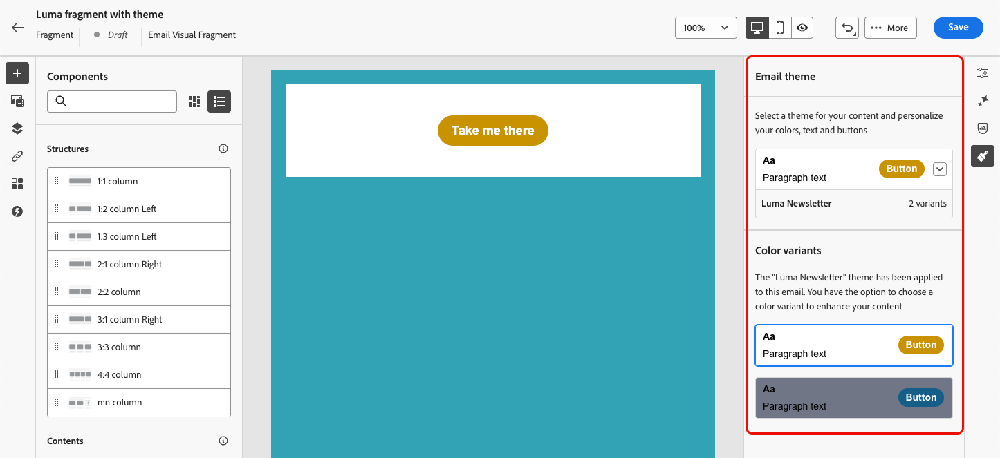

# Creare un frammento {#create-fragments}

>[!CONTEXTUALHELP]
>id="ajo_create_visual_fragment"
>title="Seleziona il tipo visivo"
>abstract="Crea un frammento visivo autonomo per rendere il contenuto riutilizzabile in un messaggio e-mail all’interno di un percorso, di una campagna o di un modello di contenuto."
>additional-url="https://experienceleague.adobe.com/it/docs/journey-optimizer/using/channels/email/design-email/add-content/use-visual-fragments" text="Aggiungere frammenti visivi alle e-mail"

>[!CONTEXTUALHELP]
>id="ajo_create_expression_fragment"
>title="Seleziona il tipo di espressione"
>abstract="Crea da zero un frammento di espressione autonomo per rendere i contenuti riutilizzabili in più percorsi e campagne. Quando utilizzi l’editor di personalizzazione, puoi sfruttare tutti i frammenti di espressione che sono stati creati nella sandbox corrente."
>additional-url="https://experienceleague.adobe.com/it/docs/journey-optimizer/using/content-management/personalization/personalization-build-expressions" text="Utilizzare l’editor di personalizzazione"

I frammenti possono essere creati da zero dal menu a sinistra **[!UICONTROL Frammenti]**. Inoltre, è possibile anche salvare una parte del contenuto esistente come frammento durante la progettazione. [Scopri come](save-fragments.md#)

Una volta salvato, il frammento è disponibile per l’utilizzo in un percorso, una campagna o un modello. Puoi utilizzare questo frammento quando crei qualsiasi contenuto all’interno di percorsi e campagne. Consulta [Aggiungere frammenti visivi](../email/use-visual-fragments.md) e [Sfruttare frammenti di espressione](../personalization/use-expression-fragments.md).

Per creare un frammento, segui la procedura riportata di seguito.

## Definire le proprietà del frammento {#properties}

1. Accedi all&#39;elenco di frammenti tramite il menu a sinistra **[!UICONTROL Gestione contenuto]** > **[!UICONTROL Frammenti]**.

1. Seleziona **[!UICONTROL Crea frammento]** e compila il nome e la descrizione del frammento (se necessario).

   

1. Seleziona o crea tag Adobe Experience Platform dal campo **[!UICONTROL Tag]** per categorizzare il frammento per una ricerca migliorata. [Scopri come utilizzare i tag unificati](../start/search-filter-categorize.md#tags)

1. Selezionare il tipo di frammento: **Frammento visivo** o **Frammento di espressione**. [Ulteriori informazioni](../content-management/fragments.md#visual-expression)

   >[!NOTE]
   >
   >Attualmente, i frammenti visivi sono disponibili solo per il canale **E-mail**.

1. Se stai creando un frammento di espressione, seleziona il tipo di codice che desideri utilizzare: **[!UICONTROL HTML]**, **[!UICONTROL JSON]** o **[!UICONTROL Text]**.

   

1. Per assegnare etichette di utilizzo dei dati personalizzate o di base al frammento, fare clic sul pulsante **[!UICONTROL Gestisci accesso]** nella sezione superiore della schermata. [Ulteriori informazioni sul controllo degli accessi a livello di oggetto](../administration/object-based-access.md).

1. Fai clic su **[!UICONTROL Crea]** per progettare il contenuto del frammento.

## Progettare il contenuto del frammento {#content}

Dopo aver configurato le proprietà del frammento, viene aperto l’editor di e-mail o di personalizzazione e il Designer, a seconda del tipo di frammento che si sta creando.

>[!NOTE]
>
>Gli [attributi contestuali](../personalization/personalization-build-expressions.md) non sono supportati nei frammenti.
>
>Quando il tracciamento è abilitato in un percorso o in una campagna, se aggiungi collegamenti a un frammento e quest’ultimo viene utilizzato in un messaggio, tali collegamenti vengono tracciati come tutti gli altri collegamenti inclusi nel messaggio. [Ulteriori informazioni su collegamenti e tracciamento](../email/message-tracking.md)

* Per i frammenti visivi, modifica il contenuto in base alle esigenze, come faresti per qualsiasi e-mail all’interno di un percorso o di una campagna. [Ulteriori informazioni](../email/get-started-email-design.md)

  

  Per applicare rapidamente uno stile specifico adatto al tuo marchio e design, puoi applicare al frammento un [tema](../email/apply-email-themes.md).

  

  >[!CAUTION]
  >
  >I frammenti non sono compatibili tra le modalità Usa temi e Stile manuale. Quando utilizzi un frammento nel contenuto dell’e-mail, accertati di applicare un tema definito per questo frammento. [Ulteriori informazioni](../email/apply-email-themes.md#leverage-themes-fragment)

* Per i frammenti di espressione, utilizza l&#39;editor di personalizzazione [!DNL Journey Optimizer] con tutte le funzionalità di personalizzazione e authoring per creare il contenuto del frammento. [Ulteriori informazioni](../personalization/personalization-build-expressions.md)

  

Quando il contenuto è pronto, fai clic sul pulsante **[!UICONTROL Salva]**.

>[!NOTE]
>
>I frammenti visivi non possono superare i 100 KB. I frammenti di espressioni non possono superare i 200 KB.

Il frammento viene creato e aggiunto all&#39;elenco di frammenti con lo stato **[!UICONTROL Bozza]**. Puoi visualizzarlo in anteprima e pubblicarlo per renderlo disponibile in percorsi e campagne.

## Anteprima e pubblicazione del frammento {#publish}

>[!NOTE]
>
>Per pubblicare un frammento, è necessario disporre dell&#39;autorizzazione utente [Pubblica frammento](../administration/ootb-product-profiles.md#content-library-manager).

Se il frammento è pronto per essere pubblicato, puoi visualizzarlo in anteprima e pubblicarlo per renderlo disponibile nei tuoi percorsi e campagne. A questo scopo, segui i passaggi riportati qui sotto.

1. Torna alla schermata di creazione del frammento dopo averne progettato il contenuto oppure aprilo dall’elenco dei frammenti.

1. Nel campo **[!UICONTROL Tag]** è disponibile un&#39;anteprima del frammento che consente di verificarne il rendering. Se devi apportare delle modifiche, fai clic sul pulsante **[!UICONTROL Modifica]** nella sezione superiore della schermata per aprire E-mail Designer o l&#39;editor di personalizzazione, a seconda del tipo di frammento. [Ulteriori informazioni](manage-fragments.md#edit-fragments)

   

1. Fai clic sul pulsante **[!UICONTROL Pubblica]** nell&#39;angolo superiore destro per pubblicare il frammento.

1. Se il frammento viene utilizzato in un percorso o in una campagna live, viene visualizzato un messaggio per informarti. Fai clic sul collegamento **[!UICONTROL Ulteriori informazioni]** per accedere all&#39;elenco dei percorsi e/o delle campagne a cui si fa riferimento. [Scopri come esplorare i riferimenti di un frammento](../content-management/manage-fragments.md#explore-references)

   {width="70%" align="center"}

   Fai clic su **[!UICONTROL Conferma]** per pubblicare il frammento e aggiornarlo nei percorsi/campagne live che lo utilizzano.

Il frammento è ora **[!UICONTROL Live]** e diventa disponibile quando crei qualsiasi contenuto nel Designer e-mail o nell&#39;editor di personalizzazione di [!DNL Journey Optimizer].

* [Scopri come utilizzare i frammenti visivi](../email/use-visual-fragments.md)
* [Scopri come utilizzare i frammenti di espressione](../personalization/use-expression-fragments.md)
