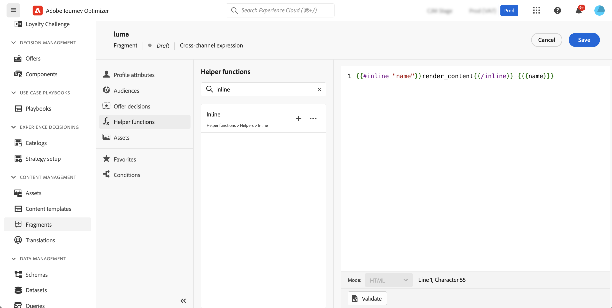

# Frammenti personalizzabili {#customizable-fragments}

I frammenti utilizzati in una campagna o in un’azione di percorso vengono bloccati per impostazione predefinita a causa dell’ereditarietà. Ciò significa che qualsiasi modifica apportata a un frammento viene propagata automaticamente a tutte le campagne e a tutti i percorsi in cui viene utilizzato il frammento. Con i frammenti personalizzabili, campi specifici all’interno di un frammento possono essere definiti come modificabili quando il frammento viene aggiunto a un’azione di una campagna o di un percorso. Supponiamo ad esempio di avere un frammento con un banner, del testo e un pulsante. È possibile designare come modificabili alcuni campi, ad esempio l’URL di destinazione dell’immagine o del pulsante. Questo consente agli utenti di modificare questi elementi quando incorporano il frammento nella campagna o nel percorso, offrendo un’esperienza personalizzata senza influire sul frammento originale.

I frammenti personalizzabili eliminano la necessità di interrompere l’ereditarietà dei frammenti, che in precedenza impediva la propagazione delle modifiche centralizzate a livello di frammento alle campagne e ai percorsi. Questo approccio consente di regolare le parti di contenuto al momento dell’utilizzo, offrendo la flessibilità di ignorare i valori predefiniti con dettagli specifici del contesto.

Sfruttando frammenti personalizzabili, puoi gestire e personalizzare in modo efficiente i contenuti senza creare blocchi di contenuto completamente nuovi o interrompere l’ereditarietà dal frammento originale. In questo modo, le modifiche apportate a livello di frammento vengono comunque propagate, consentendo la necessaria personalizzazione a livello di campagna o di percorso.

I frammenti visivi e di espressione possono essere contrassegnati come personalizzabili. Per istruzioni dettagliate su come procedere con ciascun tipo di frammento, consulta le sezioni seguenti.

## Aggiungere campi modificabili nei frammenti visivi {#visual}

Per rendere modificabili parti di un frammento visivo, effettua le seguenti operazioni:

>[!NOTE]
>
>I campi modificabili possono essere aggiunti ai componenti **image**, **text** e **button**. Per i componenti di **HTML**, i campi modificabili vengono aggiunti utilizzando l&#39;editor di personalizzazione, in modo simile ai frammenti di espressione. [Scopri come aggiungere un campo modificabile nei componenti e nei frammenti di espressione di HTML](#expression)

1. Apri la schermata di modifica del contenuto del frammento.

1. Seleziona il componente nel frammento in cui desideri configurare i campi modificabili.

1. Il riquadro delle proprietà del componente viene visualizzato sul lato destro. Seleziona la scheda **Campi modificabili**, quindi attiva l&#39;opzione **Abilita edizione**.

1. Tutti i campi che possono essere modificati per il componente selezionato sono elencati nel riquadro. I campi disponibili per la modifica dipendono dal tipo di componente selezionato.

   Nell’esempio seguente, è consentita la modifica dell’URL del pulsante &quot;Fai clic qui&quot;.

   

1. Fare clic su **Panoramica** per controllare tutti i campi modificabili e i relativi valori predefiniti.

   In questo esempio, il campo URL del pulsante viene visualizzato con il valore predefinito definito nel componente. Questo valore sarà personalizzabile dagli utenti dopo che avranno aggiunto il frammento al loro contenuto.

   

1. Al termine dell’operazione, salva le modifiche per aggiornare il frammento.

1. Dopo aver aggiunto il frammento in un messaggio e-mail, gli utenti potranno personalizzare tutti i campi modificabili configurati nel frammento. [Scopri come personalizzare i campi modificabili in un frammento visivo](../email/use-visual-fragments.md#customize-fields)

## Aggiungere campi modificabili nei componenti HTML e nei frammenti di espressione {#expression}

Per rendere modificabili parti di un componente HTML o di un frammento di espressione, è necessario utilizzare una sintassi specifica nell’editor espressioni. Ciò comporta la dichiarazione di una **variabile** con un valore predefinito che gli utenti possono ignorare dopo aver aggiunto il frammento al loro contenuto.

Ad esempio, supponi di voler creare un frammento da aggiungere alle e-mail e di consentire agli utenti di personalizzare un colore specifico utilizzato in posizioni diverse, ad esempio cornici o colori di sfondo dei pulsanti. Durante la creazione del frammento, devi dichiarare una variabile con un **ID univoco**, ad esempio &quot;color&quot;, e chiamarla nelle posizioni desiderate nel contenuto del frammento in cui desideri applicare questo colore. Quando aggiungono il frammento al contenuto, gli utenti possono personalizzare il colore utilizzato ovunque venga fatto riferimento alla variabile.

Per i componenti HTML, solo elementi specifici possono diventare campi modificabili. Per ulteriori informazioni, espandi la sezione seguente.

+++Elementi modificabili nei componenti di HTML:

Gli elementi riportati di seguito possono diventare campi modificabili in un componente HTML:

* Parte di testo
* Un URL completo per un collegamento o un’immagine (non funziona con una parte di URL)
* Intera proprietà CSS (non funziona con la proprietà parziale)

Ad esempio, nel codice seguente, ogni elemento evidenziato in rosso può diventare una proprietà:

{width="70%"}

+++

Per dichiarare una variabile e utilizzarla nel frammento, effettua le seguenti operazioni:

1. Apri il frammento di espressione, quindi modificane il contenuto nell’editor di personalizzazione. Per i componenti di HTML, selezionare il componente nel frammento e fare clic sul pulsante **Mostra codice sorgente**.

   

1. Dichiara la variabile che desideri che gli utenti modifichino. Passa al menu **Funzioni helper** nel riquadro di navigazione a sinistra e aggiungi la funzione helper **inline**. La sintassi per dichiarare e chiamare la variabile viene aggiunta automaticamente nel contenuto.

   

1. Sostituire `"name"` con un ID univoco per identificare il campo modificabile.

   >[!NOTE]
   >
   >L’ID del campo deve essere univoco e non deve contenere spazi. Questo ID deve essere utilizzato ovunque nel contenuto in cui desideri visualizzare il valore della variabile.

1. Adatta la sintassi in base alle tue esigenze aggiungendo i parametri descritti nella tabella seguente:

   | Azione | Parametro | Esempio |
   | ------- | ------- | ------- |
   | Dichiara un campo modificabile con un **valore predefinito**. Quando aggiungi il frammento al contenuto, questo valore predefinito viene utilizzato se non lo personalizzi. | Aggiungi il valore predefinito tra i tag in linea. | `{{#inline "editableFieldID"}}default_value{{/inline}}` |
   | Definisci una **etichetta** per il campo modificabile. Questa etichetta verrà visualizzata nel Designer e-mail quando si modificano i campi del frammento. | `name="title"` | `{{#inline "editableFieldID" name="title"}}default_value{{/inline}}` |
   | Dichiara un campo modificabile contenente una **Origine immagine** che deve essere pubblicata. | `assetType="image"` | `{{#inline "editableFieldID" assetType="image"}}default_value{{/inline}}` |
   | Dichiara un campo modificabile contenente un **URL** che deve essere tracciato. Tieni presente che i blocchi predefiniti predefiniti &quot;URL pagina mirror&quot; e &quot;Collegamento per annullare l’abbonamento&quot; non possono diventare campi modificabili. | `assetType="url"` | `{{#inline "editableFieldID" assetType="url"}}default_value{{/inline}}` |

1. Utilizza la sintassi `{{{name}}}` nel codice in ogni posizione in cui desideri visualizzare il valore del campo modificabile. Sostituisci `name` con l&#39;ID univoco del campo definito in precedenza.

   

1. Salva il frammento.

Quando aggiungono il frammento al contenuto dell’e-mail, gli utenti possono ora ignorare i valori predefiniti delle variabili con i valori scelti:

* Per i frammenti di espressione, viene utilizzata una sintassi specifica per sostituire i valori delle variabili. [Scopri come personalizzare i campi modificabili in un frammento di espressione](../personalization/use-expression-fragments.md#customize-fields)

* Per i componenti HTML, la variabile viene visualizzata nell’elenco dei campi modificabili nel Designer e-mail. [Scopri come personalizzare i campi modificabili in un frammento visivo](../email/use-visual-fragments.md#customize-fields)

## Esempio di frammento di espressione modificabile {#example}

Nell’esempio seguente, viene creato un frammento di espressione che presenta nuove raccolte sportive. Per impostazione predefinita, nel frammento viene visualizzato il seguente contenuto: *Ulteriori informazioni? Non perderti la nostra ultima collezione di sport!*

Vogliamo consentire agli utenti di sostituire &quot;sport&quot; in questi contenuti con lo sport di loro scelta. Esempio: *Ulteriori informazioni? Non perdere la nostra ultima raccolta di yoga!*

Per eseguire questa operazione:

1. Dichiara una variabile &quot;sport&quot; con l’ID &quot;sport&quot;.

   Per impostazione predefinita, se gli utenti non modificano il valore della variabile dopo l&#39;aggiunta del frammento nel contenuto, verrà visualizzato il valore definito tra i tag `{{#inline}}` e `{{/inline}}`, ovvero &quot;sport&quot;.

1. Aggiungi la sintassi ``{{{sport}}}`` nel contenuto del frammento in cui desideri visualizzare il valore della variabile, ovvero &quot;sport&quot; per impostazione predefinita, o il valore scelto dagli utenti.

   

1. Quando si aggiunge il frammento di espressione al contenuto, gli utenti possono modificare il valore della variabile a loro scelta direttamente dall’editor di espressioni. [Scopri come personalizzare i campi modificabili in un frammento di espressione](../personalization/use-expression-fragments.md#customize-fields)

   
