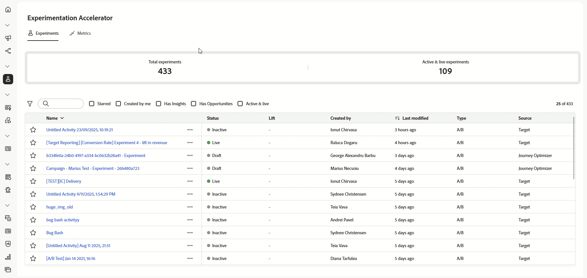

# Introduzione all’acceleratore di sperimentazione Journey Optimizer {#content-experiment}

>[!BEGINSHADEBOX]

**In questa pagina:** scopri come Adobe Journey Optimizer Experimentation Accelerator centralizza gli esperimenti di Adobe Target e Adobe Journey Optimizer per eseguire test adattivi, ottenere informazioni basate sull&#39;intelligenza artificiale e tenere traccia delle metriche delle prestazioni chiave.

>[!ENDSHADEBOX]

>[!AVAILABILITY]
>
>**Journey Optimizer Experimentation Accelerator** richiede una licenza a pagamento per la clientela e si integra perfettamente con Adobe Target o Adobe Journey Optimizer.

**Journey Optimizer Experimentation Accelerator** è uno strumento potente progettato per semplificare e migliorare il processo di sperimentazione. Integrandosi con Adobe Target e Adobe Journey Optimizer, fornisce una piattaforma centralizzata per la gestione, l’analisi e l’ottimizzazione degli esperimenti. Sfruttando gli insight basati sull’IA e i test adattivi, Journey Optimizer Experimentation Accelerator ti consente di prendere decisioni in base ai dati, migliorare le strategie di marketing e promuovere risultati misurabili.

I vantaggi chiave includono:

* **Sperimentazione più veloce**: esegui test adattivi e sempre attivi con modelli che si adeguano nel tempo.

* **Piattaforma unificata**: gestisci tutti gli esperimenti da Adobe Target e Journey Optimizer in un’unica posizione.

* **Insight basati sull’IA**: vengono visualizzati automaticamente i risultati chiave, i driver delle prestazioni e le nuove opportunità.

* **Targeting più intelligente**: utilizza i dati comportamentali e di contenuto per dare priorità agli esperimenti ad alto impatto.

* **Monitoraggio KPI**: tieni traccia di metriche quali incremento e affidabilità negli esperimenti.

* **Collaborazione fluida**: condividi facilmente i risultati e gestisci i ruoli del team con avvisi in tempo reale.

➡️ [Accedi alla documentazione di Journey Optimizer Experimentation Accelerator](https://experienceleague.adobe.com/it/docs/experimentation-accelerator/using/overview)
