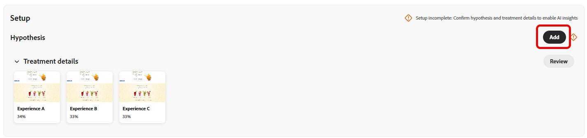

# Tracciare gli esperimenti {#monitor}

La scheda **[!UICONTROL Esperimenti]** centralizza il tracciamento e l&#39;analisi dei test da Adobe Journey Optimizer e Adobe Target. Puoi visualizzare tutti gli esperimenti, esaminare i KPI e filtrare o cercare per individuare test specifici.

## Dashboard di {#dashboard}

Quando accedi alla scheda Esperimenti, tutti gli esperimenti disponibili da Journey Optimizer e Adobe Target sono elencati in una vista consolidata. Questo consente di rivedere e confrontare rapidamente gli esperimenti su entrambe le piattaforme in un’unica posizione.
L’elenco Esperimenti include:

* Esperimenti Journey Optimizer creati in Campagne o Percorsi.

* Esperimenti di Adobe Target disponibili nella sandbox predefinita di produzione di Journey Optimizer collegata alla stessa organizzazione IMS.

La sezione KPI fornisce metriche chiave, tra cui il numero totale di esperimenti creati e il numero attualmente in corso, offrendo un’istantanea dell’attività di sperimentazione complessiva

Accedere ai filtri facendo clic su , che offre opzioni specifiche del contesto, ad esempio il filtro per **[!UICONTROL Tipo]**, **[!UICONTROL Starred]**, **[!UICONTROL Stato]** o **[!UICONTROL Source]**. Ad esempio, puoi filtrare per mostrare solo gli esperimenti attivi da Journey Optimizer.

In alternativa, individua rapidamente l’esperimento digitandone il nome nella barra di ricerca.

## Monitorare gli esperimenti {#monitor-page}

Per accedere e monitorare gli esperimenti, seleziona l&#39;esperimento configurato in precedenza dall&#39;elenco degli esperimenti dalla scheda **[!UICONTROL Esperimenti]** oppure utilizza il menu avanzato per **[!UICONTROL Visualizzare i dettagli]** o **[!UICONTROL Aprire nell&#39;origine]**.

La pagina dei dettagli dell’esperimento è suddivisa nella seguente sezione:

* [Risultato esperimento](#experiment-outcome)
* [Ipotesi](#hypothesis)
* [Dettagli](#details)
* [Opportunità](#opportunities)
* [Risultati](#results)
* [Approfondimenti sulla sperimentazione](#insights)

### Risultato esperimento {#experiment-outcome}

Il **[!UICONTROL Risultato esperimento]** ti offre una visualizzazione rapida della variante vincente nell&#39;esperimento.

### Configura {#set-up}

L&#39;**[!UICONTROL ipotesi]** acquisisce le modifiche pianificate da testare e documenta l&#39;impatto previsto sulla metrica principale. Definendo una chiara **[!UICONTROL Ipotesi]** si garantisce che ogni esperimento abbia un obiettivo misurabile, facilitando la valutazione dei risultati e determinando se le modifiche portano a miglioramenti significativi.

Tieni presente che per generare [approfondimenti esperimento](#insights) devi confermare i dettagli di ipotesi e trattamento e la rilevanza statistica da raggiungere.

1. Fai clic su **[!UICONTROL Aggiungi]** per creare una **[!UICONTROL ipotesi]** per l&#39;esperimento.

   

1. Inserisci la **[!UICONTROL ipotesi]** specificando le modifiche apportate e il modo in cui influiranno sulla metrica principale.

   Fai clic su **[!UICONTROL Salva]**.

1. Fai clic su **[!UICONTROL Rivedi]** per aggiungere o sostituire l&#39;immagine per ogni trattamento.

   

1. Le immagini del trattamento vengono generate automaticamente, ma se necessario, puoi selezionare **[!UICONTROL Aggiungi immagine]** o **[!UICONTROL Sostituisci immagine]** per caricare uno screenshot preferito dai file locali per i tuoi **[!UICONTROL Trattamenti]**.

   Tieni presente che lo screenshot deve acquisire l’intera pagina.

1. Se necessario, fai clic sull&#39;icona  per aggiornare l&#39;ipotesi **[!UICONTROL 2&rbrace;.]**

Una volta completata la configurazione di **[!UICONTROL Ipotesi]**, potrai ottenere [Informazioni](#insights) e [Opportunità](#opportunities) preziose.

### Dettagli {#details}

Il widget **[!UICONTROL Effetto esperimento]** fornisce una visualizzazione dettagliata di come l&#39;esperimento ha influenzato i segmenti di pubblico di destinazione. Presenta indicatori chiave delle prestazioni che consentono di valutare il coinvolgimento e il comportamento, tra cui:

* **[!UICONTROL Metrica di successo]** da Journey Optimizer o la **[!UICONTROL Metrica primaria]** da Adobe Target a seconda di ciò che è stato configurato durante la creazione dell&#39;esperimento.

* **[!UICONTROL Visitatori]**: numero totale di visitatori univoci esposti all&#39;esperimento.

Puoi anche visualizzare un’istantanea in tempo reale delle prestazioni del trattamento principale tramite le metriche seguenti:

* **[!UICONTROL Leader corrente]**: identifica il trattamento che attualmente fornisce le prestazioni migliori.

* **[!UICONTROL Incremento rispetto al basale]**: misura il miglioramento percentuale del trattamento iniziale rispetto al controllo o al basale.

* **[!UICONTROL Metrica di successo]** da Journey Optimizer o la **[!UICONTROL Metrica primaria]** da Adobe Target a seconda di ciò che è stato configurato durante la creazione dell&#39;esperimento.

Nella parte inferiore del widget, puoi trovare un breve riepilogo della configurazione dell’esperimento, tra cui:

* **[!UICONTROL Metrica di successo]** da Journey Optimizer o la **[!UICONTROL Metrica primaria]** da Adobe Target a seconda di ciò che è stato configurato durante la creazione dell&#39;esperimento.

* **[!UICONTROL Numero di trattamenti]**: il numero totale di varianti testate.

* **[!UICONTROL Pubblico]**: i segmenti utente definiti di destinazione durante l&#39;esperimento.

### Opportunità {#opportunities}

>[!AVAILABILITY]
>
>La funzione Opportunità è limitata agli esperimenti con modifiche basate su testo.

Il pannello **[!UICONTROL Opportunità]** visualizza i consigli generati dall&#39;intelligenza artificiale progettati per migliorare le prestazioni dei test e allinearsi agli obiettivi di business e ai KPI più ampi.

Tieni presente che per generare opportunità di esperimento devi prima [confermare i dettagli di ipotesi e trattamento](#set-up).

1. Sfoglia l&#39;opportunità suggerita e fai clic su **[!UICONTROL Visualizza opportunità]**.

   

1. Quando si seleziona un&#39;opportunità, viene aperta la finestra **Dettagli opportunità**, in cui viene descritto un trattamento o una variante specifica suggeriti da Journey Optimizer Experimentation Accelerator. Questa visualizzazione include:

   * **[!UICONTROL Ipotesi]**: un&#39;ipotesi generata dall&#39;intelligenza artificiale che spiega il risultato previsto del trattamento suggerito.

   * **[!UICONTROL Motivazione]**: spiegazione del motivo per cui Journey Optimizer Experimentation Accelerator ha suggerito questa opportunità.

   * **[!UICONTROL Valutazione dell&#39;opportunità]**: una doppia valutazione del consiglio basata su:

      * **[!UICONTROL Potenziale di apprendimento]**: una stima della quantità di nuovi insight che l&#39;opportunità potrebbe fornire, in base alla differenza rispetto a quanto è stato testato in precedenza.

      * **[!UICONTROL Potenziale di conversione]**: stima della probabilità che l&#39;opportunità superi i trattamenti correnti, in base alle somiglianze con strategie che hanno sempre funzionato bene.
   <!--
   * **[!UICONTROL New text treatment example]**: Words or phrases that demonstrate the style the AI recommends using.
   -->

   

1. Puoi quindi aggiungerlo direttamente all&#39;esperimento selezionando **[!UICONTROL Apri esperimento]**.

1. Se l&#39;esperimento originale è stato creato e gestito in Adobe Journey Optimizer, questa azione aprirà il **[!UICONTROL Pannello Sperimentazione contenuto]** all&#39;interno della campagna.

   Per gli esperimenti provenienti da **[!DNL Adobe Target]**, le modifiche suggerite verranno invece caricate nel flusso di lavoro di sperimentazione di **[!DNL Adobe Target]**.

   ➡️ [Ulteriori informazioni nella documentazione di Adobe Target](https://experienceleague.adobe.com/it/docs/target/using/activities/abtest/test-ab)

1. Nella vista dell&#39;esperimento sono accessibili le stesse **[!UICONTROL opportunità di sperimentazione]** di IA emerse da Journey Optimizer Experimentation Accelerator.

   Seleziona **[!UICONTROL Visualizza]** per aprire i dettagli dell&#39;opportunità.

1. Per applicare le modifiche suggerite, selezionando **[!UICONTROL Modifica esperimento]** è possibile modificare direttamente l&#39;esperimento esistente.

### Risultati {#results}

La tabella **[!UICONTROL Risultati]** fornisce una suddivisione dettagliata delle prestazioni di ciascun trattamento all&#39;interno di un esperimento. Questi indicatori aiutano a valutare l’efficacia, il coinvolgimento degli utenti e l’impatto complessivo sui risultati aziendali chiave:

* **[!UICONTROL Luogo]**: posizione di classificazione del trattamento in base alle prestazioni, che indica il confronto con altri trattamenti.

* **[!UICONTROL Metrica di successo]** da Journey Optimizer o la **[!UICONTROL Metrica primaria]** da Adobe Target a seconda di ciò che è stato configurato durante la creazione dell&#39;esperimento.

* **[!UICONTROL Persone]**: numero di profili utente qualificati come profili target per i messaggi.

* **[!UICONTROL Incremento]**: misura del miglioramento percentuale del tasso di conversione di un determinato trattamento rispetto al basale.

* **[!UICONTROL Affidabilità]**: prova che un determinato trattamento è uguale al trattamento basale. [Ulteriori informazioni](../content-management/experiment-calculations.md#understand-confidence)

* **[!UICONTROL Tasso di conversione]**: percentuale di profili che hanno completato l&#39;azione desiderata (ad esempio, acquisto, iscrizione) dopo aver visto il trattamento.

### Insight esperimento {#insights}

>[!AVAILABILITY]
>
>La funzione Approfondimenti sperimentazione è limitata agli esperimenti con modifiche basate su testo.

**[!UICONTROL Informazioni sull&#39;esperimento]** sono informazioni generate da IA derivate da questo esperimento. Queste informazioni diventano disponibili una volta che l’esperimento raggiunge la rilevanza statistica e fornisce una comprensione contestuale di ciò che ha contribuito al suo successo. Evidenziano gli attributi chiave presenti nel trattamento vincente, distinti dal controllo, che probabilmente hanno influenzato il risultato.

Tieni presente che per generare informazioni sull&#39;esperimento devi prima [confermare i dettagli relativi a ipotesi e trattamento](#set-up) e la rilevanza statistica da raggiungere.

Fai clic su **[!UICONTROL Visualizza dettagli]** per ulteriori informazioni su ogni approfondimento.

 

