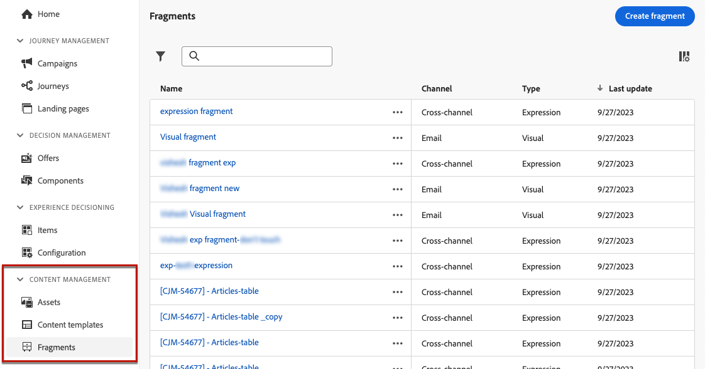

# Introduzione ai frammenti {#fragments}

>[!BEGINSHADEBOX]

**In questa pagina:** Introduzione ai frammenti di contenuto visivo ed espressivo in Adobe Journey Optimizer, componenti riutilizzabili che è possibile compilare una volta e fare riferimento a più e-mail in più campagne e percorsi.

>[!ENDSHADEBOX]

>[!CONTEXTUALHELP]
>id="ajo_create_fragment"
>title="Definisci il tuo frammento"
>abstract="Crea e gestisci frammenti autonomi per rendere il contenuto riutilizzabile in più percorsi e campagne."
>additional-url="https://experienceleague.adobe.com/it/docs/journey-optimizer/using/content-management/fragments/create-fragments" text="Creare i frammenti"

Un frammento è un componente riutilizzabile a cui è possibile fare riferimento in una o più e-mail in [!DNL Journey Optimizer] campagne e percorsi. Questa funzionalità ti consente di precreare più blocchi di contenuto personalizzati che possono essere utilizzati dagli utenti di marketing per assemblare rapidamente i contenuti delle e-mail in un processo di progettazione migliorato.

➡️ [Scopri come gestire, creare e utilizzare frammenti in questi video](#video-fragments)

Per utilizzare al meglio i frammenti:

* **Crea frammenti personalizzati**: crea frammenti visivi o di espressione, da zero o salvando il contenuto come frammento. [Scopri come creare un frammento](create-fragments.md). Inoltre, puoi sfruttare l&#39;API REST del contenuto **Journey Optimizer** per gestire i frammenti di contenuto. Per ulteriori informazioni, consulta la [documentazione delle API Journey Optimizer](https://developer.adobe.com/journey-optimizer-apis/references/content){target="_blank"}.
* **Riutilizza i frammenti:** Utilizzali il numero di volte necessario nel contenuto. Vedi [Aggiungere frammenti visivi](../email/use-visual-fragments.md) e [Sfruttare frammenti di espressione](../personalization/use-expression-fragments.md)

>[!NOTE]
>
>I **[!UICONTROL frammenti]** descritti in questa pagina sono componenti **content** riutilizzabili. Sono diversi da:
>
>* **[Frammenti di Percorso](../building-journeys/journey-fragments.md)**: set riutilizzabili di nodi di percorso inseriti in percorsi.
>* **[Frammenti di contenuto di AEM](../integrations/aem-fragments.md)**: contenuto creato in Adobe Experience Manager e utilizzato in [!DNL Journey Optimizer].

## Prima di iniziare {#fragment-prerequisites}

Per creare, modificare, archiviare e pubblicare frammenti sono necessarie le autorizzazioni **[!DNL Manage library items]** e **[Pubblica frammento]** incluse nel profilo del prodotto **[!DNL Content Library Manager]**. [Ulteriori informazioni](../administration/ootb-product-profiles.md#content-library-manager)

In questa versione si applicano le seguenti limitazioni:

* **I frammenti visivi** sono disponibili solo per il canale e-mail.
* **I frammenti di espressione** non sono disponibili per il canale in-app.

Ulteriori guardrail applicabili ai frammenti sono disponibili in [questa sezione](../start/guardrails.md#fragments-guardrails).

## Frammenti di visualizzazione ed espressione {#visual-expression}

Sono disponibili due tipi di frammenti:

* I **frammenti visivi** sono blocchi visivi predefiniti che è possibile riutilizzare in più consegne di posta elettronica utilizzando [E-mail Designer](../email/get-started-email-design.md) o in [modelli di contenuto](../email/use-email-templates.md).
* I **Frammenti di espressione** sono espressioni predefinite disponibili in una voce dedicata nell&#39;[editor di personalizzazione](../personalization/personalization-build-expressions.md).

Tutti i frammenti creati sono accessibili dal menu a sinistra **[!UICONTROL Gestione contenuto]** > **[!UICONTROL Frammenti]**. [Scopri come gestire i frammenti](../content-management/manage-fragments.md)

## Video introduttivo {#video-fragments}

Scopri come gestire, creare e utilizzare **frammenti visivi** in [!DNL Journey Optimizer].

>[!VIDEO](https://video.tv.adobe.com/v/3419932/?quality=12)

Scopri come gestire, creare e utilizzare **frammenti di espressione** in [!DNL Journey Optimizer].

>[!VIDEO](https://video.tv.adobe.com/v/3424587/?quality=12)
