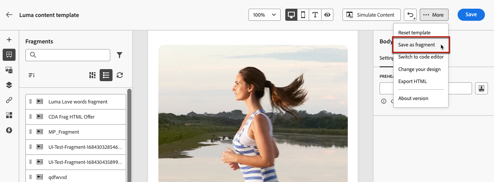

# Utilizzare i frammenti {#fragments}

>[!CONTEXTUALHELP]
>id="ajo_create_fragment"
>title="Definire i propri frammenti"
>abstract="Crea e gestisci frammenti autonomi per consentire il riutilizzo dei contenuti in più percorsi e campagne."
>additional-url="https://experienceleague.adobe.com/docs/journey-optimizer/using/personalized-dynamic-content/reusable-content/fragments.html#create-fragments" text="Creare frammenti"

Un frammento è un componente riutilizzabile a cui è possibile fare riferimento in una o più e-mail in [!DNL Journey Optimizer] campagne e percorsi.

Questa funzionalità consente di precreare più blocchi di contenuto personalizzati che possono essere utilizzati dagli utenti di marketing per assemblare rapidamente i contenuti delle e-mail in un processo di progettazione migliorato.

➡️ [Scopri come gestire, creare e utilizzare i frammenti in questi video](#video-fragments)

Per utilizzare al meglio i frammenti:

* Crea frammenti personalizzati. Puoi creare frammenti visivi o frammenti di espressione. [Ulteriori informazioni](#create-fragments)

* Utilizzale il numero di volte necessario nel contenuto. Consulta [Aggiungere frammenti visivi](../email/use-visual-fragments.md) e [Sfruttare i frammenti di espressione](../personalization/use-expression-fragments.md)

## Prima di iniziare {#fragment-prerequisites}

Per creare, modificare e archiviare i frammenti, è necessario disporre del **[!DNL Manage Library Items]** autorizzazione inclusa nel **[!DNL Content Library Manager]** profilo di prodotto. [Ulteriori informazioni](../administration/ootb-product-profiles.md#content-library-manager)

In questa versione si applicano le seguenti limitazioni:

* I frammenti visivi sono disponibili solo per il canale e-mail

* I frammenti di espressione non sono disponibili per i canali web e in-app

## Accedere e gestire i frammenti {#access-manage-fragments}

Per accedere all’elenco dei frammenti, seleziona **[!UICONTROL Gestione dei contenuti]** > **[!UICONTROL Frammenti]** dal menu a sinistra.

Tutti i frammenti creati nella sandbox corrente: [dal **[!UICONTROL Frammenti]** menu](#create-fragments), utilizzando [Salva come frammento](#save-as-fragment) opzione - vengono visualizzati.

Puoi filtrare i frammenti in base ai seguenti elementi:

* Tipo: **[!UICONTROL Visivo]** o **[!UICONTROL Espressione]**
* Tag
* Data di creazione o modifica

Puoi scegliere di visualizzare tutti i frammenti o solo gli elementi creati o modificati dall’utente corrente.

È inoltre possibile visualizzare **[!UICONTROL Archiviato]** frammenti. [Ulteriori informazioni](#archive-fragments)

Dalla sezione **[!UICONTROL Altre azioni]** accanto a ciascun frammento, puoi:

* Duplica un frammento.

* Utilizza il **[!UICONTROL Esplora riferimenti]** per visualizzare i percorsi, le campagne o i modelli in cui viene utilizzato. [Ulteriori informazioni](#explore-references)

* Copia un frammento in un’altra sandbox. <!--Learn more?-->

* Archivia un frammento. [Ulteriori informazioni](#archive-fragments)

* Modificare le proprietà di un frammento [tag](../start/search-filter-categorize.md#tags).

### Modifica frammenti {#edit-fragments}

Per modificare un frammento, effettua le seguenti operazioni.

1. Fai clic sull’elemento desiderato da **[!UICONTROL Frammenti]** elenco.
1. Dalle proprietà del frammento puoi [esplorare i riferimenti](#explore-references), [gestirne l’accesso](../administration/object-based-access.md), e aggiorna i dettagli del frammento, tra cui [tag](../start/search-filter-categorize.md#tags).

   

1. Seleziona il pulsante corrispondente per modificare il contenuto, come faresti per creare un frammento da zero. [Ulteriori informazioni](#create-from-scratch)

>[!NOTE]
>
>Quando modifichi un frammento, le modifiche vengono propagate automaticamente a tutto il contenuto che lo utilizza, ad eccezione del contenuto utilizzato in **[!UICONTROL Live]** percorsi o campagne. Puoi anche interrompere l’ereditarietà dal frammento originale. Per ulteriori informazioni, consulta [Aggiungi frammenti visivi alle e-mail](../email/use-visual-fragments.md#break-inheritance) e [Sfruttare i frammenti di espressione](../personalization/use-expression-fragments.md#break-inheritance) sezioni.

### Esplora riferimenti {#explore-references}

Puoi visualizzare l’elenco dei percorsi, delle campagne e dei modelli di contenuto che attualmente utilizzano un frammento.

A tale scopo, seleziona **[!UICONTROL Esplora riferimenti]** dall&#39; **[!UICONTROL Altre azioni]** nell’elenco dei frammenti o dalla schermata delle proprietà del frammento.

Seleziona una scheda per scegliere tra percorsi, campagne, modelli e frammenti. Puoi visualizzarne lo stato e fare clic su un nome da reindirizzare all’elemento corrispondente in cui si fa riferimento al frammento.

>[!NOTE]
>
>Se il frammento viene utilizzato in un percorso, una campagna o un modello con un’etichetta che impedisce l’accesso, viene visualizzato un messaggio di avviso sopra la scheda selezionata. [Ulteriori informazioni su OLAC (Object Level Access Control)](../administration/object-based-access.md)

### Archivia frammenti {#archive-fragments}

Puoi eliminare dall’elenco i frammenti gli elementi che non sono più rilevanti per il tuo marchio.

A tale scopo, fare clic sul pulsante **[!UICONTROL Altre azioni]** accanto al frammento desiderato e seleziona **[!UICONTROL Archivia]**. Scomparirà dall’elenco dei frammenti, impedendo agli utenti di utilizzarlo in e-mail o modelli futuri.

>[!NOTE]
>
>Se archivi un frammento utilizzato in un contenuto, <!--it will remain in the email or template, but you won't be able to select it from the fragment list to edit it-->tale contenuto non sarà interessato.

Per annullare l’archiviazione di un frammento, applica il filtro **[!UICONTROL Archiviato]** elementi e seleziona **[!UICONTROL Annulla archiviazione]** dal **[!UICONTROL Altre azioni]** menu. Ora è nuovamente accessibile dall’elenco dei frammenti e può essere utilizzato in qualsiasi e-mail o modello.

## Creare frammenti {#create-fragments}

Esistono due modi per creare i frammenti:

* Creare un frammento da zero utilizzando **[!UICONTROL Frammenti]** menu dedicato. [Scopri come](#create-from-scratch)

* Durante la progettazione di un contenuto, salva una parte del contenuto come frammento. [Scopri come](#save-as-fragment)

Una volta salvato, il frammento è disponibile per l’utilizzo in un percorso, una campagna o un modello. Sia che sia creato da zero o da un contenuto esistente, ora puoi utilizzare questo frammento durante la creazione di qualsiasi contenuto in [!DNL Journey Optimizer]. Consulta [Aggiungere frammenti visivi](../email/use-visual-fragments.md) e [Sfruttare i frammenti di espressione](../personalization/use-expression-fragments.md)

### Crea da zero {#create-from-scratch}

Per creare un frammento da zero, segui la procedura riportata di seguito.

1. [Accedere all’elenco dei frammenti](#access-manage-fragments) tramite **[!UICONTROL Gestione dei contenuti]** > **[!UICONTROL Frammenti]** menu a sinistra.

1. Seleziona **[!UICONTROL Crea frammento]**.

1. Inserisci i dettagli del frammento, ovvero nome e descrizione (se necessario).

   

1. Seleziona il tipo di frammento: [Frammento visivo](#create-visual-fragment) o [Frammento di espressione](#create-expression-fragment).

1. Per assegnare etichette di utilizzo dei dati personalizzate o di base al frammento, seleziona **[!UICONTROL Gestisci accesso]**. [Ulteriori informazioni su OLAC (Object Level Access Control)](../administration/object-based-access.md).

1. Seleziona o crea tag Adobe Experience Platform da **[!UICONTROL Tag]** per categorizzare il frammento per una ricerca migliore. [Ulteriori informazioni](../start/search-filter-categorize.md#tags)

1. Fai clic su **[!UICONTROL Crea]**.

### Creare un frammento visivo {#create-visual-fragment}

>[!CONTEXTUALHELP]
>id="ajo_create_visual_fragment"
>title="Seleziona il tipo di elemento visivo"
>abstract="Crea un frammento visivo indipendente per rendere il contenuto riutilizzabile in un messaggio e-mail all’interno di un percorso, di una campagna o di un modello di contenuto."
>additional-url="https://experienceleague.adobe.com/docs/journey-optimizer/using/email/design-email/add-content/use-visual-fragments.html" text="Aggiungi frammenti visivi alle e-mail"

1. [Creare un frammento](#create-from-scratch) dal **[!UICONTROL Gestione dei contenuti]** > **[!UICONTROL Frammenti]** menu a sinistra e selezionare **[!UICONTROL Frammento visivo]** tipo.

   >[!NOTE]
   >
   >Attualmente, per i frammenti visivi solo il **E-mail** canale è supportato.

1. Il [E-mail Designer](../email/get-started-email-design.md) visualizzazioni. Modifica il contenuto in base alle esigenze, come faresti per qualsiasi e-mail all’interno di un percorso o di una campagna.

   >[!NOTE]
   >
   >Puoi aggiungere campi di personalizzazione e contenuto dinamico, ma gli attributi contestuali non sono supportati nei frammenti.

   

1. Quando il frammento è pronto, fai clic su **[!UICONTROL Salva]**. Viene aggiunto al [elenco frammenti](#access-manage-fragments).

1. Se necessario, fai clic sulla freccia accanto al nome del frammento per tornare al **[!UICONTROL Dettagli]** e modificarlo.

   

Questo frammento è ora pronto per essere utilizzato durante la creazione di qualsiasi [email](../email/get-started-email-design.md) o [modello di contenuto](content-templates.md) entro [!DNL Journey Optimizer]. [Scopri come](../email/use-visual-fragments.md)

### Creare un frammento di espressione {#create-expression-fragment}

>[!CONTEXTUALHELP]
>id="ajo_create_expression_fragment"
>title="Seleziona il tipo di espressione"
>abstract="Crea un frammento di espressione autonomo per rendere il contenuto riutilizzabile in più percorsi e campagne. Quando utilizzi l’editor espressioni, puoi sfruttare tutti i frammenti di espressione creati nella sandbox corrente."
>additional-url="https://experienceleague.adobe.com/docs/journey-optimizer/using/personalized-dynamic-content/personalization/expression-editor/use-expression-fragments.html" text="Sfruttare i frammenti di espressione"

1. [Creare un frammento](#create-from-scratch) dal **[!UICONTROL Gestione dei contenuti]** > **[!UICONTROL Frammenti]** menu a sinistra e selezionare **[!UICONTROL Frammento di espressione]** tipo.

1. Selezionare il tipo di codice che si desidera utilizzare: **[!UICONTROL HTML]**, **[!UICONTROL JSON]** o **[!UICONTROL Testo]**.

   

   <!--Expression fragments can be used in any channel.-->

1. Fai clic su **[!UICONTROL Crea]**. Viene aperto l’editor espressioni.

1. Puoi sfruttare [!DNL Journey Optimizer] Editor espressioni con tutte le sue funzionalità di personalizzazione e authoring. [Ulteriori informazioni](../personalization/personalization-build-expressions.md)

   

1. Quando il frammento è pronto, fai clic su **[!UICONTROL Salva]**. Viene aggiunto al [elenco frammenti](#access-manage-fragments).

1. Se necessario, fai clic sulla freccia accanto al nome del frammento per tornare al **[!UICONTROL Dettagli]** e modificarlo.

Questo frammento è ora pronto per essere utilizzato quando crei qualsiasi contenuto all’interno del [!DNL Journey Optimizer] Editor espressioni. [Scopri come](../personalization/use-expression-fragments.md)

## Salva come frammento {#save-as-fragment}

Durante la modifica del contenuto in [!DNL Journey Optimizer], puoi salvare tutto o parte del contenuto come frammento per riutilizzarlo in futuro.

### Salva come frammento visivo {#save-as-visual-fragment}

Durante la progettazione di un [modello di contenuto](content-templates.md) o un [email](../email/get-started-email-design.md) in una campagna o in un percorso, puoi salvare una parte del contenuto come frammento visivo. Per farlo, segui la procedura indicata di seguito.

1. In [E-mail Designer](../email/get-started-email-design.md), fai clic sui puntini di sospensione in alto a destra dello schermo.

1. Seleziona **[!UICONTROL Salva come frammento]** dal menu a discesa.

   

1. Il **[!UICONTROL Salva come frammento]** schermo. Seleziona gli elementi da includere nel frammento, inclusi i campi di personalizzazione e il contenuto dinamico. Gli attributi contestuali non sono supportati nei frammenti.

   >[!CAUTION]
   >
   >Potete selezionare solo le sezioni adiacenti. Non puoi selezionare una struttura vuota o un altro frammento.

   

1. Fai clic su **[!UICONTROL Crea]**. Inserisci i dettagli del frammento, ovvero nome e descrizione (se necessario).

1. Per assegnare etichette di utilizzo dei dati personalizzate o di base al frammento, seleziona **[!UICONTROL Gestisci accesso]**. [Ulteriori informazioni su OLAC (Object Level Access Control)](../administration/object-based-access.md).

1. Seleziona o crea tag Adobe Experience Platform da **Tag** per categorizzare il modello e migliorare la ricerca. [Ulteriori informazioni](../start/search-filter-categorize.md#tags)

1. Clic **[!UICONTROL Crea]** di nuovo. Il frammento viene salvato in aggiunto al [elenco frammenti](#access-manage-fragments), accessibile dalla [!DNL Journey Optimizer] menu dedicato.

   Diventa un frammento autonomo che può essere [accesso eseguito](#access-manage-fragments), [modificato](#edit-fragments) e [archiviato](#archive-fragments) come qualsiasi altro elemento di tale elenco.

Ora puoi utilizzare questo frammento durante la creazione di qualsiasi [email](../email/get-started-email-design.md) o [modello di contenuto](content-templates.md) entro [!DNL Journey Optimizer]. [Scopri come](../email/use-visual-fragments.md)

>[!NOTE]
>
>Eventuali modifiche apportate al nuovo frammento non vengono propagate all’e-mail o al modello di origine. Allo stesso modo, quando il contenuto originale viene modificato all’interno dell’e-mail o del modello, il nuovo frammento non viene modificato.

### Salva come frammento di espressione {#save-as-expression-fragment}

>[!CONTEXTUALHELP]
>id="ajo_perso_library"
>title="Salva come frammento di espressione"
>abstract="Il [!DNL Journey Optimizer] L’editor espressioni ti consente di salvare il contenuto come frammenti di espressione. Queste espressioni sono quindi disponibili per creare contenuti personalizzati."

Il [!DNL Journey Optimizer] L’editor espressioni ti consente di salvare il contenuto come frammenti di espressione. Queste espressioni sono quindi disponibili per creare contenuti personalizzati.

Per salvare il contenuto come frammento di espressione, effettua le seguenti operazioni.

1. In [Editor espressioni](../personalization/personalization-build-expressions.md) , genera un&#39;espressione, quindi fai clic su **[!UICONTROL Salva come frammento]**.

1. Nel riquadro di destra, immettere un nome e una descrizione per l&#39;espressione in modo che gli utenti possano trovarla più facilmente.

   

1. Clic **[!UICONTROL Salva frammento]**.

   <!--An expression fragment cannot be nested inside another fragment.-->

1. Il frammento di espressione viene aggiunto al [elenco frammenti](#access-manage-fragments). Ora puoi utilizzarlo per creare contenuti personalizzati.

>[!NOTE]
>
>Le espressioni non possono superare i 200 KB.

## Video introduttivo {#video-fragments}

Scopri come gestire, creare e utilizzare i frammenti visivi in [!DNL Journey Optimizer].

>[!VIDEO](https://video.tv.adobe.com/v/3419932/?quality=12)

Scopri come gestire, creare e utilizzare i frammenti di espressione in [!DNL Journey Optimizer].

>[!VIDEO](https://video.tv.adobe.com/v/3424587/?quality=12)
