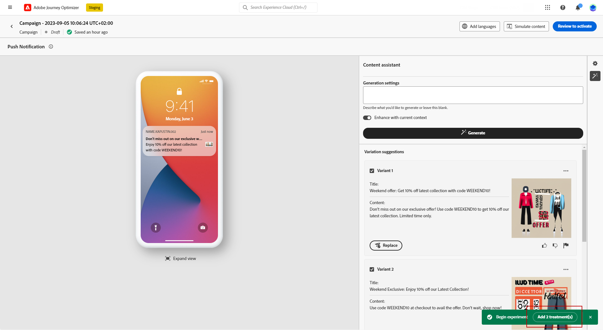

# Generazione di contenuti con l’Assistente contenuti {#title-content-assistant}

>[!BEGINSHADEBOX]

**Sommario**

* [Introduzione all’Assistente contenuti](gs-generative.md)
* **[Generare contenuti con l’Assistente contenuti](generative-content.md)**
* [Generare immagini con l’assistente contenuti](generative-image.md)

>[!ENDSHADEBOX]

Dopo aver creato e personalizzato i messaggi, porta il contenuto al livello successivo con l’Assistente contenuti.

Sfruttando l’assistente contenuto, puoi ottimizzare l’impatto del messaggio sperimentando con contenuti diversi. Ogni variante è considerata come un trattamento univoco, per misurare e confrontare quale contenuto genera efficacemente più clic.

In questo esempio particolare, scopri come inviare una notifica push coinvolgente utilizzando l’esperimento sui contenuti. Segui questi passaggi:

1. Dopo aver creato e configurato la campagna di notifica push, fai clic su **[!UICONTROL Creare contenuti]**.

1. Utilizzare l&#39;Assistente alla generazione per modificare **[!UICONTROL Titolo]**.

   Accanto al tuo **[!UICONTROL Intestazione]** , fare clic su **[!UICONTROL Modifica con Assistente alla generazione del testo]**.

   

1. Dalla sezione **[!UICONTROL Azione utente]** , selezionare il **[!UICONTROL Ottimizzazione del testo]**:

   * **[!UICONTROL Riepiloga]**: utilizza questa opzione per abbreviare il testo e mantenere l’essenziale.

   * **[!UICONTROL Elaborare]**: utilizza questa opzione per espandere il contenuto con ulteriori varianti creative dall’Assistente contenuto.

   

1. Scegli il tono delle varianti con il **[!UICONTROL Cambia il tono della voce]** menu.

1. Dalla sezione **[!UICONTROL Modulo libero]** , puoi anche scegliere di fornire un messaggio per perfezionare meglio i risultati.

   

1. Una volta trovata la variante appropriata, fai clic su **[!UICONTROL Variante utente]** allora **[!UICONTROL Applica]**.

   

1. Dopo aver personalizzato **[!UICONTROL Corpo]** della notifica push, seleziona **[!UICONTROL Mostra assistente contenuto]**.

   In questo caso, è già disponibile un elenco di varianti che utilizzano il contenuto originale.

   

1. Ottimizza il contenuto descrivendo cosa desideri generare.

   Abilita **[!UICONTROL Migliora con il contenuto corrente]** Opzione per l’Assistente contenuto di personalizzare il nuovo contenuto in base al messaggio, al nome della campagna e al pubblico selezionato.

1. Clic **[!UICONTROL Sostituisci]** per modificare il contenuto o selezionare più **[!UICONTROL Variante]** per creare **[!UICONTROL Trattamenti]** per la tua sperimentazione e fai clic su **Aggiungi trattamenti X**.

   

1. Accedere a **[!UICONTROL Impostazioni esperimento]** o **[!UICONTROL Azioni]** menu per personalizzare ulteriormente il tuo esperimento. [Ulteriori informazioni](../campaigns/content-experiment.md)

   

1. Dopo aver definito il contenuto del messaggio, fai clic sul pulsante **[!UICONTROL Simula contenuto]** per controllare il rendering e verifica le impostazioni di personalizzazione con i profili di test. [Ulteriori informazioni](../email/preview.md)

1. Quando l’esperimento sui contenuti è pronto, dalla pagina di riepilogo della campagna puoi fare clic su **[!UICONTROL Controlla per attivare]** per visualizzare un riepilogo della campagna. Gli avvisi vengono visualizzati se un parametro è errato o mancante.

1. Prima di avviare la campagna, verifica che tutte le configurazioni siano corrette, quindi fai clic su **[!UICONTROL Attiva]**.

Dopo aver configurato correttamente la sperimentazione e la campagna, puoi tracciare la campagna nel rapporto della campagna. [Ulteriori informazioni](../reports/campaign-global-report.md#experimentation-report)
