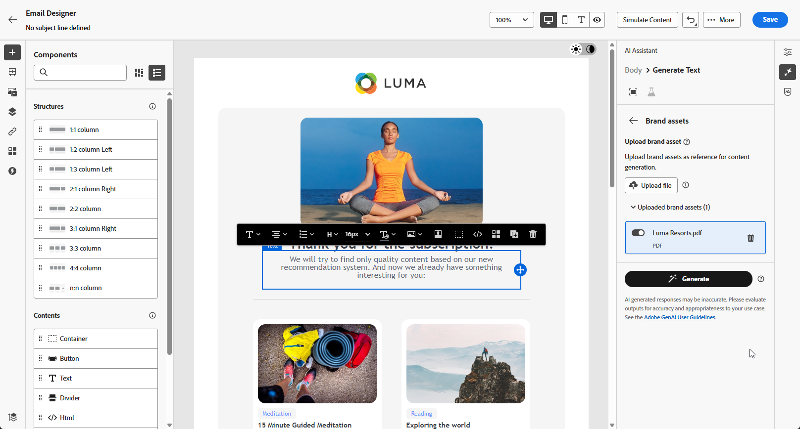

# Generazione di e-mail con IA Assistant Content Accelerator {#generative-email}

>[!IMPORTANT]
>
>Prima di iniziare a utilizzare questa funzionalità, leggi l’articolo sui relativi [Guardrail e limitazioni](gs-generative.md#generative-guardrails).
> 
>
>È necessario accettare un [contratto per l&#39;utente](https://www.adobe.com/legal/licenses-terms/adobe-dx-gen-ai-user-guidelines.html) prima di poter utilizzare l&#39;Acceleratore contenuto dell&#39;Assistente di intelligenza artificiale in Journey Optimizer. Per ulteriori informazioni, contatta il tuo rappresentante Adobe.

Dopo aver creato e personalizzato le e-mail, sfrutta la potenza di AI Assistant Content Accelerator in Journey Optimizer, basata sull’intelligenza artificiale generativa, per migliorare il contenuto.

Utilizza AI Assistant Content Accelerator in Journey Optimizer per migliorare l’efficacia delle campagne creando e-mail complete, frammenti di testo personalizzati e immagini personalizzate che parlano direttamente al tuo pubblico, aumentando il coinvolgimento e l’interazione.

Esplora le schede riportate di seguito per scoprire come utilizzare l’Acceleratore dei contenuti dell’Assistente di intelligenza artificiale in Journey Optimizer.

>[!BEGINTABS]

>[!TAB Generazione e-mail completa]

Nell’esempio seguente, sfrutteremo IA Assistant Content Accelerator per perfezionare un modello e-mail esistente.

1. Dopo aver creato e configurato la tua campagna e-mail, fai clic su **[!UICONTROL Modifica contenuto]**.

   Per ulteriori informazioni su come configurare la tua campagna e-mail, consulta [questa pagina](../campaigns/create-campaign.md).

1. Personalizza il layout in base alle esigenze e accedi al menu **[!UICONTROL Assistente AI]**.

   {zoomable="yes"}

1. Abilita l&#39;opzione **[!UICONTROL Usa contenuto originale]** per l&#39;Acceleratore contenuto dell&#39;Assistente di intelligenza artificiale per personalizzare il nuovo contenuto in base al contenuto selezionato.

1. Ottimizzare il contenuto descrivendo cosa si desidera generare nel campo **[!UICONTROL Prompt]**.

   Se stai cercando assistenza per creare il prompt, accedi alla **[!UICONTROL Libreria prompt]** che fornisce una vasta gamma di idee per migliorare le campagne.

   {zoomable="yes"}

1. Puoi attivare/disattivare le opzioni **[!UICONTROL Oggetto]** e **[!UICONTROL Preintestazione]** per includerle nella generazione della variante.

1. Personalizza la richiesta con l&#39;opzione **[!UICONTROL Impostazioni testo]**:

   * **[!UICONTROL Strategia di comunicazione]**: scegli lo stile di comunicazione più adatto al testo generato.
   * **[!UICONTROL Tono]**: il tono dell&#39;e-mail dovrebbe risuonare con il pubblico. Che tu voglia essere informativo, giocoso o persuasivo, l’Assistente AI può adattare il messaggio di conseguenza.

   {zoomable="yes"}

1. Scegli le **[!UICONTROL impostazioni immagine]**:

   * **[!UICONTROL Tipo di contenuto]**: categorizza la natura dell&#39;elemento visivo, distinguendo tra diverse forme di rappresentazione visiva come foto, immagini o immagini.
   * **[!UICONTROL Intensità visiva]**: è possibile controllare l&#39;impatto dell&#39;immagine regolandone l&#39;intensità. Un&#39;impostazione più bassa (2) creerà un aspetto più morbido e più contenuto, mentre un&#39;impostazione più alta (10) renderà l&#39;immagine più vibrante e visivamente potente.
   * **[!UICONTROL Colore e tono]**: l&#39;aspetto complessivo dei colori all&#39;interno di un&#39;immagine e l&#39;umore o l&#39;atmosfera che trasmette.
   * **[!UICONTROL Illuminazione]**: si riferisce al fulmine presente in un&#39;immagine, che ne forma l&#39;atmosfera ed evidenzia elementi specifici.
   * **[!UICONTROL Composizione]**: si riferisce alla disposizione degli elementi all&#39;interno della cornice di un&#39;immagine

   {zoomable="yes"}

1. Dal menu **[!UICONTROL Risorse per i marchi]**, fai clic su **[!UICONTROL Carica risorsa per i marchi]** per aggiungere eventuali risorse per i marchi contenenti contenuto che possa fornire ulteriore contesto all&#39;Assistente IA o selezionarne una caricata in precedenza.

   I file precedentemente caricati sono disponibili nel menu a discesa **[!UICONTROL Risorse del brand caricate]**. È sufficiente attivare o disattivare le risorse da includere nella generazione.

   {zoomable="yes"}

1. Una volta completato il prompt, fai clic su **[!UICONTROL Genera]**.

1. Sfoglia le **[!UICONTROL Varianti]** generate e fai clic su **[!UICONTROL Anteprima]** per visualizzare una versione a schermo intero della variante selezionata.

1. Passa all&#39;opzione **[!UICONTROL Perfeziona]** nella finestra **[!UICONTROL Anteprima]** per accedere ad altre funzioni di personalizzazione:

   * **[!UICONTROL Riformula]**: l&#39;Assistente di intelligenza artificiale può riformulare il messaggio in diversi modi, mantenendo la scrittura fresca e coinvolgente per diversi tipi di pubblico.

   * **[!UICONTROL Usa un linguaggio più semplice]**: sfrutta l&#39;Assistente AI per semplificare la lingua, garantendo chiarezza e accessibilità a un pubblico più ampio.

   Puoi anche modificare il **[!UICONTROL Tono]** e la **[!UICONTROL Strategia di comunicazione]** del tuo testo.

   {zoomable="yes"}

1. Una volta trovato il contenuto appropriato, fai clic su **[!UICONTROL Seleziona]**.

   Puoi anche abilitare l’esperimento per il contenuto. [Ulteriori informazioni](generative-experimentation.md)

1. Inserisci campi di personalizzazione per personalizzare il contenuto delle e-mail in base ai dati dei profili. Quindi, fai clic sul pulsante **[!UICONTROL Simula contenuto]** per controllare il rendering e controlla le impostazioni di personalizzazione con i profili di test. [Ulteriori informazioni](../personalization/personalize.md)

Una volta definiti il contenuto, il pubblico e la pianificazione, puoi preparare la tua campagna e-mail. [Ulteriori informazioni](../campaigns/review-activate-campaign.md)

>[!TAB Generazione solo testo]

Nell’esempio seguente, sfrutteremo AI Assistant Content Accelerator per migliorare il contenuto dell’e-mail.

1. Dopo aver creato e configurato la tua campagna e-mail, fai clic su **[!UICONTROL Modifica contenuto]**.

   Per ulteriori informazioni su come configurare la tua campagna e-mail, consulta [questa pagina](../email/create-email.md).

1. Seleziona un **[!UICONTROL componente testo]** per eseguire il targeting solo di un contenuto specifico. e accedere al menu **[!UICONTROL Assistente AI]**.

   {zoomable="yes"}

1. Abilita l&#39;opzione **[!UICONTROL Usa contenuto originale]** per l&#39;Acceleratore contenuto dell&#39;Assistente di intelligenza artificiale per personalizzare il nuovo contenuto in base al contenuto selezionato.

1. Ottimizzare il contenuto descrivendo cosa si desidera generare nel campo **[!UICONTROL Prompt]**.

   Se stai cercando assistenza per creare il prompt, accedi alla **[!UICONTROL Libreria prompt]** che fornisce una vasta gamma di idee per migliorare le campagne.

   {zoomable="yes"}

1. Personalizza la richiesta con l&#39;opzione **[!UICONTROL Impostazioni testo]**:

   * **[!UICONTROL Strategia di comunicazione]**: scegli lo stile di comunicazione più adatto al testo generato.
   * **[!UICONTROL Tono]**: il tono dell&#39;e-mail dovrebbe risuonare con il pubblico. Che tu voglia essere informativo, giocoso o persuasivo, l’Assistente AI può adattare il messaggio di conseguenza.
   * **Lunghezza testo**: utilizza il cursore per selezionare la lunghezza desiderata del testo.

   {zoomable="yes"}

1. Dal menu **[!UICONTROL Risorse per i marchi]**, fai clic su **[!UICONTROL Carica risorsa per i marchi]** per aggiungere eventuali risorse per i marchi contenenti contenuto che possa fornire ulteriore contesto all&#39;Assistente IA o selezionarne una caricata in precedenza.

   I file precedentemente caricati sono disponibili nel menu a discesa **[!UICONTROL Risorse del brand caricate]**. È sufficiente attivare o disattivare le risorse da includere nella generazione.

   {zoomable="yes"}

1. Una volta completato il prompt, fai clic su **[!UICONTROL Genera]**.

1. Sfoglia le **[!UICONTROL Varianti]** generate e fai clic su **[!UICONTROL Anteprima]** per visualizzare una versione a schermo intero della variante selezionata.

1. Passa all&#39;opzione **[!UICONTROL Perfeziona]** nella finestra **[!UICONTROL Anteprima]** per accedere ad altre funzioni di personalizzazione:

   * **[!UICONTROL Utilizza come contenuto di riferimento]**: la variante scelta fungerà da contenuto di riferimento per generare altri risultati.

   * **[!UICONTROL Elaborare]**: l&#39;Assistente AI può aiutarti a espandere argomenti specifici, fornendo ulteriori dettagli per una migliore comprensione e coinvolgimento.

   * **[!UICONTROL Riepiloga]**: informazioni lunghe possono sovraccaricare i destinatari delle e-mail. Utilizza l’Assistente per l’intelligenza artificiale per condensare i punti chiave in riepiloghi chiari e concisi che catturino l’attenzione e li incoraggino a leggere ulteriormente.

   * **[!UICONTROL Riformula]**: l&#39;Assistente AI può riformulare il messaggio in diversi modi, mantenendo la scrittura fresca e coinvolgente per diversi tipi di pubblico.

   * **[!UICONTROL Usa un linguaggio più semplice]**: sfrutta l&#39;Assistente AI per semplificare la lingua, garantendo chiarezza e accessibilità a un pubblico più ampio.

   Puoi anche modificare il **[!UICONTROL Tono]** e la **[!UICONTROL Strategia di comunicazione]** del tuo testo.

   {zoomable="yes"}

1. Una volta trovato il contenuto appropriato, fai clic su **[!UICONTROL Seleziona]**.

   Puoi anche abilitare l’esperimento per il contenuto. [Ulteriori informazioni](generative-experimentation.md)

1. Inserisci campi di personalizzazione per personalizzare il contenuto delle e-mail in base ai dati dei profili. Quindi, fai clic sul pulsante **[!UICONTROL Simula contenuto]** per controllare il rendering e controlla le impostazioni di personalizzazione con i profili di test. [Ulteriori informazioni](../personalization/personalize.md)

Una volta definiti il contenuto, il pubblico e la pianificazione, puoi preparare la tua campagna e-mail. [Ulteriori informazioni](../campaigns/review-activate-campaign.md)

>[!TAB Generazione solo immagini]

Nell’esempio seguente, scopri come sfruttare AI Assistant Content Accelerator per ottimizzare e migliorare le risorse, garantendo un’esperienza più semplice da usare.

1. Dopo aver creato e configurato la tua campagna e-mail, fai clic su **[!UICONTROL Modifica contenuto]**.

   Per ulteriori informazioni su come configurare la tua campagna e-mail, consulta [questa pagina](../email/create-email.md).

1. Seleziona la risorsa da modificare con l’Acceleratore contenuto dell’Assistente di intelligenza artificiale.

1. Dal menu di destra, selezionare **[!UICONTROL Assistente AI]**.

   {zoomable="yes"}

1. Abilita l&#39;opzione **[!UICONTROL Stile riferimento]** per l&#39;Acceleratore contenuto dell&#39;Assistente IA per personalizzare il nuovo contenuto in base al contenuto di riferimento. Puoi anche caricare un’immagine per aggiungere contesto alla variante.

1. Ottimizzare il contenuto descrivendo cosa si desidera generare nel campo **[!UICONTROL Prompt]**.

   Se stai cercando assistenza per creare il prompt, accedi alla **[!UICONTROL Libreria prompt]** che fornisce una vasta gamma di idee per migliorare le campagne.

   {zoomable="yes"}

1. Personalizza il prompt con l&#39;opzione **[!UICONTROL Impostazioni immagine]**:

   * **[!UICONTROL Proporzioni]**: determina la larghezza e l&#39;altezza della risorsa. È possibile scegliere tra rapporti comuni, ad esempio 16:9, 4:3, 3:2 o 1:1, oppure immettere una dimensione personalizzata.
   * **[!UICONTROL Tipo di contenuto]**: categorizza la natura dell&#39;elemento visivo, distinguendo tra diverse forme di rappresentazione visiva come foto, immagini o immagini.
   * **[!UICONTROL Intensità visiva]**: è possibile controllare l&#39;impatto dell&#39;immagine regolandone l&#39;intensità. Un&#39;impostazione più bassa (2) creerà un aspetto più morbido e più contenuto, mentre un&#39;impostazione più alta (10) renderà l&#39;immagine più vibrante e visivamente potente.
   * **[!UICONTROL Colore e tono]**: l&#39;aspetto complessivo dei colori all&#39;interno di un&#39;immagine e l&#39;umore o l&#39;atmosfera che trasmette.
   * **[!UICONTROL Illuminazione]**: si riferisce al fulmine presente in un&#39;immagine, che ne forma l&#39;atmosfera ed evidenzia elementi specifici.
   * **[!UICONTROL Composizione]**: si riferisce alla disposizione degli elementi all&#39;interno della cornice di un&#39;immagine

   {zoomable="yes"}

1. Dal menu **[!UICONTROL Risorse per i marchi]**, fai clic su **[!UICONTROL Carica risorsa per i marchi]** per aggiungere eventuali risorse per i marchi contenenti contenuto che possa fornire ulteriore contesto all&#39;Assistente IA o selezionarne una caricata in precedenza.

   I file precedentemente caricati sono disponibili nel menu a discesa **[!UICONTROL Risorse del brand caricate]**. È sufficiente attivare o disattivare le risorse da includere nella generazione.

1. Una volta completata la configurazione del prompt, fai clic su **[!UICONTROL Genera]**.

1. Sfoglia i **[!UICONTROL suggerimenti varianti]** per trovare la risorsa desiderata.

   Fai clic su **[!UICONTROL Anteprima]** per visualizzare una versione a schermo intero della variante selezionata.

1. Scegliere **[!UICONTROL Genera simili]** se si desidera visualizzare le immagini correlate a questa variante.

1. Una volta trovato il contenuto appropriato, fai clic su **[!UICONTROL Seleziona]**.

   Puoi anche abilitare l’esperimento per il contenuto. [Ulteriori informazioni](generative-experimentation.md)

1. Dopo aver definito il contenuto del messaggio, fai clic sul pulsante **[!UICONTROL Simula contenuto]** per controllare il rendering e verifica le impostazioni di personalizzazione con i profili di test. [Ulteriori informazioni](../personalization/personalize.md)

1. Una volta definiti il contenuto, il pubblico e la pianificazione, puoi preparare la tua campagna e-mail. [Ulteriori informazioni](../campaigns/review-activate-campaign.md)

>[!ENDTABS]

## Video introduttivo {#video}

Scopri come utilizzare AI Assistant Content Accelerator in Journey Optimizer per generare e-mail, testo o immagini complete.

>[!VIDEO](https://video.tv.adobe.com/v/3433552)
