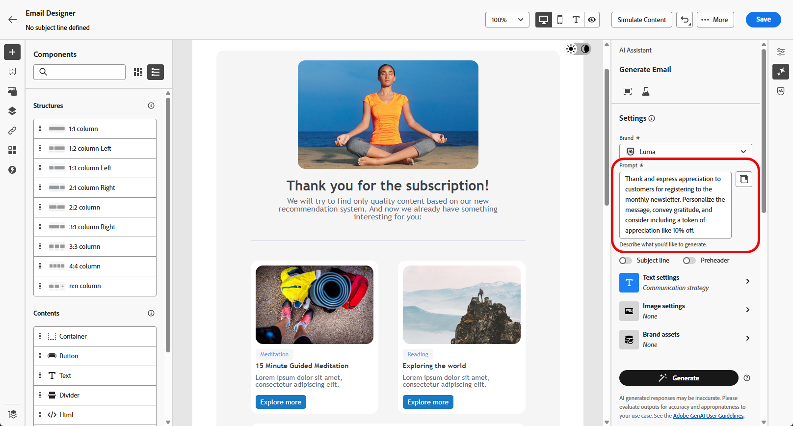

# Generazione di e-mail con l’Assistente IA {#generative-email}

>[!BEGINSHADEBOX]

**Sommario**

* [Introduzione all’assistente IA](gs-generative.md)
* **[Generazione di e-mail con l’Assistente AI](generative-email.md)**
* [Generazione di SMS con l’Assistente IA](generative-sms.md)
* [Generazione push con l’Assistente AI](generative-push.md)
* [Esperimento sui contenuti con l’Assistente AI](generative-experimentation.md)

>[!ENDSHADEBOX]

>[!NOTE]
>
>Prima di iniziare a utilizzare questa funzionalità, leggi l’articolo sui relativi [Guardrail e limitazioni](gs-generative.md#generative-guardrails).

Dopo aver creato e personalizzato le e-mail, sfrutta la potenza dell’Assistente per l’intelligenza artificiale in Journey Optimizer, basata sull’intelligenza artificiale generativa, per migliorare i contenuti.

Utilizza l’Assistente AI per migliorare l’efficacia delle campagne creando e-mail complete, frammenti di testo personalizzati e immagini personalizzate che parlano direttamente al pubblico, aumentando il coinvolgimento e l’interazione.

Esplora le schede seguenti per scoprire come utilizzare l’Assistente IA in Journey Optimizer.

>[!BEGINTABS]

>[!TAB Generazione e-mail completa]

Nell’esempio seguente, sfrutteremo l’assistente AI per perfezionare un modello e-mail esistente.

1. Dopo aver creato e configurato la campagna e-mail, fai clic su **[!UICONTROL Modifica contenuto]**.

   Per ulteriori informazioni su come configurare la campagna e-mail, consulta [questa pagina](../campaigns/create-campaign.md).

1. Personalizza l’e-mail in base alle esigenze e accedi al **[!UICONTROL Assistente AI]** menu.

   {zoomable=&quot;yes&quot;}

1. Abilita **[!UICONTROL Usa contenuto originale]** Opzione per l’Assistente AI per personalizzare il nuovo contenuto in base al contenuto della campagna, al nome e al pubblico selezionato.

   La richiesta deve essere sempre associata al contenuto corrente.

1. Ottimizza il contenuto descrivendo cosa desideri generare nel **[!UICONTROL Prompt]** campo.

   Se stai cercando assistenza per creare il tuo prompt, accedi al **[!UICONTROL Libreria dei prompt]** che offre una vasta gamma di idee per migliorare le tue campagne.

   {zoomable=&quot;yes&quot;}

1. È possibile attivare/disattivare **[!UICONTROL Oggetto]** e **[!UICONTROL Preheader]** opzioni per includerle nella generazione delle varianti.

1. Clic **[!UICONTROL Carica risorsa marchio]** per aggiungere qualsiasi risorsa del brand contenente contenuti che possano fornire ulteriore contesto, utilizza l’Assistente per l’intelligenza artificiale o selezionane una caricata in precedenza.

   {zoomable=&quot;yes&quot;}

1. Personalizza il prompt con le diverse opzioni:

   * **[!UICONTROL Strategia di comunicazione]**: scegli lo stile di comunicazione più adatto al testo generato.
   * **[!UICONTROL Lingua]**: seleziona la lingua in cui desideri generare il contenuto.
   * **[!UICONTROL Tono]**: il tono dell’e-mail dovrebbe risuonare con il pubblico. Che tu voglia essere informativo, giocoso o persuasivo, l’Assistente AI può adattare il messaggio di conseguenza.

   {zoomable=&quot;yes&quot;}

1. Una volta completato il prompt, fai clic su **[!UICONTROL Genera]**.

1. Sfoglia il generato **[!UICONTROL Varianti]** e fai clic su **[!UICONTROL Anteprima]** per visualizzare una versione a schermo intero della variante selezionata.

1. Accedi a **[!UICONTROL Perfeziona]** all&#39;interno del **[!UICONTROL Anteprima]** finestra per accedere ad altre funzioni di personalizzazione:

   * **[!UICONTROL Riformula]**: l’Assistente AI può riformulare il messaggio in diversi modi, mantenendo la scrittura fresca e coinvolgente per diversi tipi di pubblico.

   * **[!UICONTROL Utilizza un linguaggio più semplice]**: sfrutta l’Assistente AI per semplificare la lingua, garantendo chiarezza e accessibilità a un pubblico più ampio.

   {zoomable=&quot;yes&quot;}

1. Una volta trovato il contenuto appropriato, fai clic su **[!UICONTROL Seleziona]**.

   Puoi anche abilitare l’esperimento per il contenuto. [Ulteriori informazioni](generative-experimentation.md)

1. Inserisci campi di personalizzazione per personalizzare il contenuto delle e-mail in base ai dati dei profili. Quindi, fai clic su **[!UICONTROL Simula contenuto]** per controllare il rendering e controllare le impostazioni di personalizzazione con i profili di test. [Ulteriori informazioni](../personalization/personalize.md)

Una volta definiti il contenuto, il pubblico e la pianificazione, puoi preparare la tua campagna e-mail. [Ulteriori informazioni](../campaigns/review-activate-campaign.md)

>[!TAB Generazione testo]

Nell’esempio seguente, sfrutteremo l’assistente AI per migliorare il contenuto dell’e-mail.

1. Dopo aver creato e configurato la campagna e-mail, fai clic su **[!UICONTROL Modifica contenuto]**.

   Per ulteriori informazioni su come configurare la campagna e-mail, consulta [questa pagina](../email/create-email.md).

1. Seleziona un **[!UICONTROL Componente testo]** per impostare come destinazione solo un contenuto specifico. e accedere al **[!UICONTROL Assistente AI]** menu.

   {zoomable=&quot;yes&quot;}

1. Abilita **[!UICONTROL Usa contenuto originale]** Opzione per l’Assistente AI per personalizzare il nuovo contenuto in base al contenuto della campagna, al nome e al pubblico selezionato.

   La richiesta deve essere sempre associata al contenuto corrente.

1. Ottimizza il contenuto descrivendo cosa desideri generare nel **[!UICONTROL Prompt]** campo.

   Se stai cercando assistenza per creare il tuo prompt, accedi al **[!UICONTROL Libreria dei prompt]** che offre una vasta gamma di idee per migliorare le tue campagne.

   {zoomable=&quot;yes&quot;}

1. Clic **[!UICONTROL Carica risorsa marchio]** per aggiungere qualsiasi risorsa del brand contenente contenuti che possano fornire ulteriore contesto all’Assistente AI.

   {zoomable=&quot;yes&quot;}

1. Personalizza il prompt con le diverse opzioni:

   * **[!UICONTROL Strategia di comunicazione]**: seleziona l’approccio di comunicazione desiderato per il testo generato.
   * **[!UICONTROL Lingua]**: scegli la lingua per il contenuto della variante.
   * **[!UICONTROL Tono]**: assicurati che il testo sia appropriato per il pubblico e lo scopo.
   * **[!UICONTROL Lunghezza]**: seleziona la lunghezza del contenuto utilizzando il cursore intervallo.

   {zoomable=&quot;yes&quot;}

1. Una volta completato il prompt, fai clic su **[!UICONTROL Genera]**.

1. Sfoglia il generato **[!UICONTROL Varianti]** e fai clic su **[!UICONTROL Anteprima]** per visualizzare una versione a schermo intero della variante selezionata.

1. Accedi a **[!UICONTROL Perfeziona]** all&#39;interno del **[!UICONTROL Anteprima]** finestra per accedere ad altre funzioni di personalizzazione:

   * **[!UICONTROL Utilizza come contenuto di riferimento]**: la variante scelta fungerà da contenuto di riferimento per la generazione di altri risultati.

   * **[!UICONTROL Elaborare]**: l’Assistente AI può aiutarti a espandere argomenti specifici, fornendo ulteriori dettagli per una migliore comprensione e coinvolgimento.

   * **[!UICONTROL Riepiloga]**: informazioni lunghe possono sovraccaricare i destinatari delle e-mail. Utilizza l’Assistente per l’intelligenza artificiale per condensare i punti chiave in riepiloghi chiari e concisi che catturino l’attenzione e li incoraggino a leggere ulteriormente.

   * **[!UICONTROL Riformula]**:L’Assistente AI può riformulare il messaggio in diversi modi, mantenendo la scrittura fresca e coinvolgente per diversi tipi di pubblico.

   * **[!UICONTROL Utilizza un linguaggio più semplice]**: sfrutta l’Assistente AI per semplificare la lingua, garantendo chiarezza e accessibilità a un pubblico più ampio.

   {zoomable=&quot;yes&quot;}

1. Una volta trovato il contenuto appropriato, fai clic su **[!UICONTROL Seleziona]**.

   Puoi anche abilitare l’esperimento per il contenuto. [Ulteriori informazioni](generative-experimentation.md)

1. Inserisci campi di personalizzazione per personalizzare il contenuto delle e-mail in base ai dati dei profili. Quindi, fai clic su **[!UICONTROL Simula contenuto]** per controllare il rendering e controllare le impostazioni di personalizzazione con i profili di test. [Ulteriori informazioni](../personalization/personalize.md)

Una volta definiti il contenuto, il pubblico e la pianificazione, puoi preparare la tua campagna e-mail. [Ulteriori informazioni](../campaigns/review-activate-campaign.md)

>[!TAB Generazione di immagini]

Nell’esempio seguente, scopri come sfruttare l’Assistente AI per ottimizzare e migliorare le risorse, garantendo un’esperienza più semplice da usare.

1. Dopo aver creato e configurato la campagna e-mail, fai clic su **[!UICONTROL Modifica contenuto]**.

   Per ulteriori informazioni su come configurare la campagna e-mail, consulta [questa pagina](../email/create-email.md).

1. Compila il **[!UICONTROL Dettagli di base]** per la tua campagna. Al termine, fai clic su **[!UICONTROL Modifica contenuto e-mail]**.

1. Seleziona la risorsa da modificare con l’Assistente AI.

1. Dal menu di destra, seleziona **[!UICONTROL Assistente AI]**.

   {zoomable=&quot;yes&quot;}

1. Abilita **[!UICONTROL Stile di riferimento]** per l’Assistente AI per personalizzare nuovi contenuti in base al contenuto di riferimento. Puoi anche caricare un’immagine per aggiungere contesto alla variante.

   La richiesta deve essere sempre associata al contenuto corrente.

1. Ottimizza il contenuto descrivendo cosa desideri generare nel **[!UICONTROL Prompt]** campo.

   Se stai cercando assistenza per creare il tuo prompt, accedi al **[!UICONTROL Libreria dei prompt]** che offre una vasta gamma di idee per migliorare le tue campagne.

   {zoomable=&quot;yes&quot;}

1. Clic **[!UICONTROL Carica risorsa marchio]** per aggiungere qualsiasi risorsa del brand contenente contenuti che possano fornire ulteriore contesto all’Assistente AI.

1. Personalizza il prompt con le diverse opzioni:

   * **[!UICONTROL Proporzioni]**: determina la larghezza e l’altezza della risorsa. È possibile scegliere tra rapporti comuni, ad esempio 16:9, 4:3, 3:2 o 1:1, oppure immettere una dimensione personalizzata.
   * **[!UICONTROL Colore e tonalità]**: l’aspetto complessivo dei colori all’interno di un’immagine e l’umore o l’atmosfera che trasmette.
   * **[!UICONTROL Tipo di contenuto]**: categorizza la natura dell’elemento visivo, distinguendo tra diverse forme di rappresentazione visiva come foto, grafica o arte.
   * **[!UICONTROL Illuminazione]**: si riferisce al fulmine presente in un’immagine, che ne forma l’atmosfera ed evidenzia elementi specifici.
   * **[!UICONTROL Composizione]**: si riferisce alla disposizione degli elementi nel fotogramma di un’immagine

   {zoomable=&quot;yes&quot;}

1. Una volta completata la configurazione del prompt, fai clic su **[!UICONTROL Genera]**.

1. Sfoglia **[!UICONTROL Suggerimenti varianti]** per trovare la risorsa desiderata.

   Fai clic su **[!UICONTROL Anteprima]** per visualizzare una versione a schermo intero della variante selezionata.

   {zoomable=&quot;yes&quot;}

1. Scegli **[!UICONTROL Mostra simili]** se desideri visualizzare le immagini correlate a questa variante.

   {zoomable=&quot;yes&quot;}

1. Una volta trovato il contenuto appropriato, fai clic su **[!UICONTROL Seleziona]**.

   Puoi anche abilitare l’esperimento per il contenuto. [Ulteriori informazioni](generative-experimentation.md)

1. Dopo aver definito il contenuto del messaggio, fai clic sul pulsante **[!UICONTROL Simula contenuto]** per controllare il rendering e verifica le impostazioni di personalizzazione con i profili di test. [Ulteriori informazioni](../personalization/personalize.md)

1. Una volta definiti il contenuto, il pubblico e la pianificazione, puoi preparare la tua campagna e-mail. [Ulteriori informazioni](../campaigns/review-activate-campaign.md)

>[!ENDTABS]

## Video introduttivo {#video}

Scopri come utilizzare l’assistente AI per generare e-mail, testo o immagini completi.

>[!VIDEO](https://video.tv.adobe.com/v/3428341)
