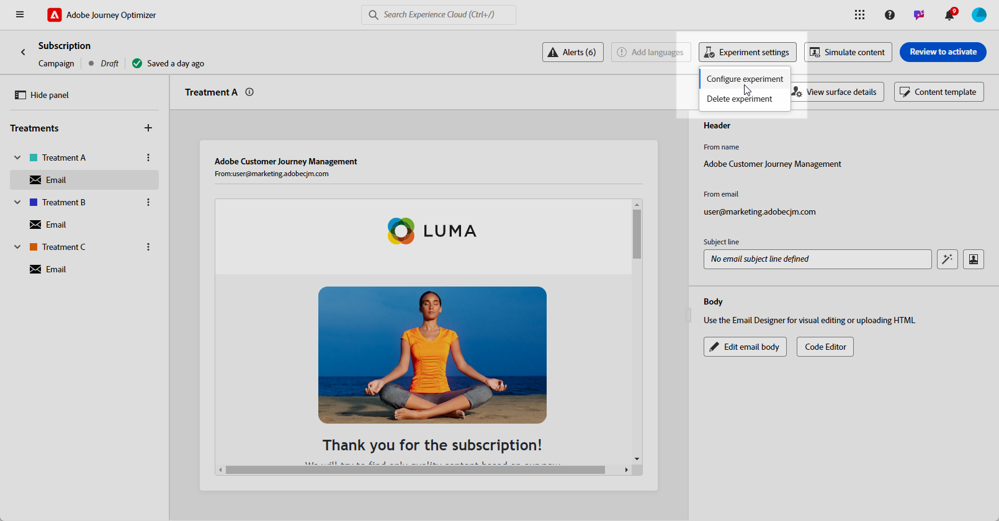

# Esperimento sui contenuti con l’Assistente AI {#generative-experimentation}

>[!BEGINSHADEBOX]

**Sommario**

* [Introduzione all’assistente IA](gs-generative.md)
* [Generazione di e-mail con l’Assistente IA](generative-email.md)
* [Generazione di SMS con l’Assistente IA](generative-sms.md)
* [Generazione push con l’Assistente AI](generative-push.md)
* Esperimento sui contenuti con l’Assistente AI

>[!ENDSHADEBOX]

Dopo aver creato e personalizzato i messaggi, eleva il contenuto con l’Assistente IA in Adobe Journey Optimizer, che include la funzione Esperimento contenuti. Questo strumento consente di definire più trattamenti di consegna, con contenuti diversi, per misurare le prestazioni per il pubblico di destinazione.

1. Crea la campagna e utilizza l’assistente AI per generare le varianti.

   In questo esempio, abbiamo generato un’e-mail di conferma dell’abbonamento con un codice promozionale.

   

1. Sfoglia il generato **[!UICONTROL Varianti]** e fai clic su **[!UICONTROL Anteprima]** per visualizzare una versione a schermo intero della variante selezionata.

   

1. Seleziona **[!UICONTROL Abilita esperimento]** per iniziare a creare **[!UICONTROL Trattamenti]** per la tua sperimentazione.

1. Seleziona le Varianti da includere nell’esperimento.

1. Clic **Aggiungi trattamenti X**.

   

1. Dalla finestra Esperimento contenuti, accedi a **[!UICONTROL Impostazioni esperimento]** per configurare l’esperimento. [Ulteriori informazioni sull’esperimento sui contenuti](../campaigns/content-experiment.md)

   

1. Quando l’esperimento sui contenuti è pronto, dalla pagina di riepilogo della campagna puoi fare clic su **[!UICONTROL Controlla per attivare]** per visualizzare un riepilogo della campagna. Gli avvisi vengono visualizzati se un parametro è errato o mancante. [Ulteriori informazioni](../campaigns/content-experiment.md#treatment-experiment)

1. Prima di avviare la campagna, verifica che tutte le configurazioni siano corrette, quindi fai clic su **[!UICONTROL Attiva]**.

Dopo aver configurato e personalizzato correttamente la campagna, puoi tracciare la campagna nel rapporto della campagna. [Ulteriori informazioni](../reports/campaign-global-report.md)
