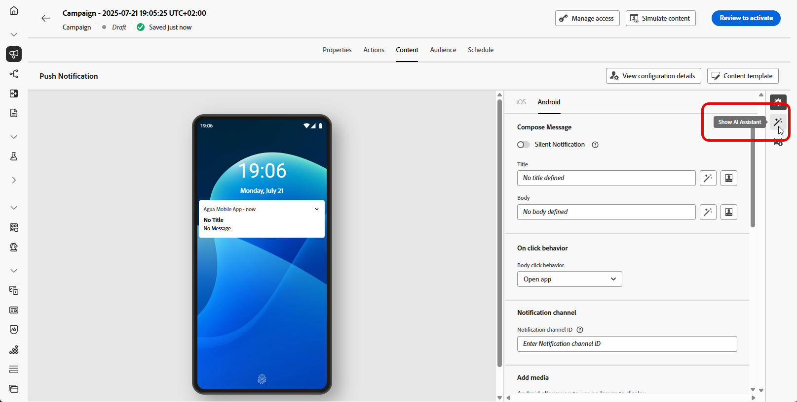

# Generare contenuti completi con l’Assistente AI {#generative-full-content}

>[!IMPORTANT]
>
>Prima di iniziare a utilizzare questa funzionalità, leggi l’articolo sui relativi [Guardrail e limitazioni](gs-generative.md#generative-guardrails).
> 
>
>Prima di poter utilizzare l&#39;Assistente di intelligenza artificiale in Journey Optimizer, devi accettare un [contratto utente](https://www.adobe.com/it/legal/licenses-terms/adobe-dx-gen-ai-user-guidelines.html). Per ulteriori informazioni, contatta il tuo rappresentante Adobe.

Utilizza l’Assistente AI in Journey Optimizer per generare esperienze di contenuti complete per i canali e-mail, web, di destinazione e di notifica push. Ai Assistant consente di ottimizzare l’impatto delle consegne creando contenuti completi che suonano con il pubblico.

## Per e-mail e canali web {#email-web-channels}

L’Assistente AI può produrre esperienze di contenuto complete per le campagne e-mail, le pagine web e le pagine di destinazione, generando sia testo che immagini. Questa robusta funzionalità consente di creare contenuti coinvolgenti e on-brand che si connettono con il pubblico in tutti i punti di contatto digitali.

### Accedere e configurare {#access-configure}

Prima di iniziare la creazione di contenuti con l’Assistente AI, è necessario configurare la campagna o il percorso e aprire l’editor di contenuti. Utilizza i passaggi seguenti per preparare l’area di lavoro e accedere al pannello dell’Assistente AI.

1. Creare e configurare la campagna o il percorso:
   * **E-mail**: dopo aver creato e configurato la tua campagna e-mail, fai clic su **[!UICONTROL Modifica contenuto]**. [Ulteriori informazioni](../campaigns/create-campaign.md)
   * **Web**: dopo aver creato e configurato la pagina Web, fare clic su **[!UICONTROL Modifica pagina Web]**. [Ulteriori informazioni](../web/create-web.md)
   * **Pagina di destinazione**: dopo aver creato e configurato la pagina di destinazione, fai clic su **[!UICONTROL Apri Designer]**. [Ulteriori informazioni](../landing-pages/create-lp.md)

1. Dal menu di destra, selezionare **[!UICONTROL Assistente AI]** (o **[!UICONTROL Mostra Assistente contenuto]** per Web).

   {zoomable="yes"}

### Genera contenuto {#generate-content}

Con l’Assistente AI aperto, ora puoi configurare le impostazioni di generazione per creare contenuti che corrispondano agli obiettivi del tuo marchio e della tua campagna. Personalizza i parametri di testo e immagine, aggiungi risorse del brand e fornisci prompt per guidare l’intelligenza artificiale nella generazione di varianti rilevanti per il pubblico.

1. Seleziona il tuo **[!UICONTROL marchio]** per garantire che i contenuti generati dall&#39;intelligenza artificiale siano in linea con le specifiche del tuo marchio. [Ulteriori informazioni](brands.md) sui marchi.

1. Ottimizzare il contenuto descrivendo cosa si desidera generare nel campo **[!UICONTROL Prompt]**.

   Se stai cercando assistenza per creare il prompt, accedi alla **[!UICONTROL Libreria prompt]** che fornisce una vasta gamma di idee per migliorare le campagne. [Ulteriori informazioni sulle best practice per i prompt](ai-assistant-prompting-guide.md)

   {zoomable="yes"}

1. **Per le e-mail**, puoi attivare/disattivare le opzioni **[!UICONTROL Oggetto]** e **[!UICONTROL Preheader]** per includerle nella generazione delle varianti.

1. Personalizza la richiesta con l&#39;opzione **[!UICONTROL Impostazioni testo]**:

   * **[!UICONTROL Strategia di comunicazione]**: scegli lo stile di comunicazione più adatto al testo generato.
   * **[!UICONTROL Lingue]**: scegli la lingua del contenuto generato.
   * **[!UICONTROL Tono]**: il tono dovrebbe risuonare con il tuo pubblico. Che tu voglia essere informativo, giocoso o persuasivo, AI Assistant può adattare il messaggio di conseguenza.

     {zoomable="yes"}

1. Scegli le **[!UICONTROL impostazioni immagine]**:

   * **[!UICONTROL Tipo di contenuto]**: categorizza la natura dell&#39;elemento visivo, distinguendo tra diverse forme di rappresentazione visiva come foto, immagini o immagini.
   * **[!UICONTROL Intensità visiva]**: è possibile controllare l&#39;impatto dell&#39;immagine regolandone l&#39;intensità. Un&#39;impostazione più bassa (2) creerà un aspetto più morbido e più contenuto, mentre un&#39;impostazione più alta (10) renderà l&#39;immagine più vibrante e visivamente potente.
   * **[!UICONTROL Colore e tono]**: l&#39;aspetto complessivo dei colori all&#39;interno di un&#39;immagine e l&#39;umore o l&#39;atmosfera che trasmette.
   * **[!UICONTROL Illuminazione]**: si riferisce al fulmine presente in un&#39;immagine, che ne forma l&#39;atmosfera ed evidenzia elementi specifici.
   * **[!UICONTROL Composizione]**: si riferisce alla disposizione degli elementi all&#39;interno della cornice di un&#39;immagine

     {zoomable="yes"}

1. Dal menu **[!UICONTROL Contenuto di riferimento]**, fai clic su **[!UICONTROL Carica file]** per aggiungere qualsiasi risorsa del marchio contenente contenuto che possa fornire un&#39;Assistente di IA per l&#39;analisi del contesto aggiuntivo o selezionarne una caricata in precedenza.

   I file precedentemente caricati sono disponibili nel menu a discesa **[!UICONTROL Contenuto di riferimento caricato]**. È sufficiente attivare o disattivare le risorse da includere nella generazione.

   {zoomable="yes"}

1. Una volta completato il prompt, fai clic su **[!UICONTROL Genera]**.

### Perfezionare e finalizzare {#refine-finalize}

Dopo aver generato le varianti di contenuto, puoi perfezionare i risultati per garantire che soddisfino esattamente le tue esigenze. Rivedi l’allineamento del brand, regola il tono e la lingua e prepara il contenuto per l’attivazione nella campagna o nel percorso.

1. Dopo la generazione, sfoglia le **[!UICONTROL Varianti]**.

1. Fai clic sull&#39;icona percentuale per visualizzare il **[!UICONTROL punteggio di allineamento del brand]** e identificare eventuali disallineamenti con il brand.

   Ulteriori informazioni sul [Punteggio di allineamento del marchio](brands-score.md).

   {zoomable="yes"}

1. Fai clic su **[!UICONTROL Anteprima]** per visualizzare una versione a schermo intero della variante selezionata o su **[!UICONTROL Applica]** per sostituire il contenuto corrente.

1. Passa all&#39;opzione **[!UICONTROL Perfeziona]** nella finestra **[!UICONTROL Anteprima]** per accedere ad altre funzioni di personalizzazione:

   * **[!UICONTROL Riformulazione]**: riscrivere il messaggio conservandone il significato. Questa opzione consente di generare una formulazione alternativa, migliorare il flusso o regolare la formulazione senza modificare il messaggio principale.

   * **[!UICONTROL Usa un linguaggio più semplice]**: sfrutta l&#39;Assistente AI per semplificare la lingua, garantendo chiarezza e accessibilità a un pubblico più ampio.

   * **[!UICONTROL Traduci]**: semplifica la lingua per garantire chiarezza e accessibilità a un pubblico più ampio.

   * **[!UICONTROL Cambia tono]**: regola il tono del messaggio per adattarlo al tuo stile di comunicazione, rendendolo più amichevole, professionale, urgente o ispiratore.

   * **[!UICONTROL Modifica strategia di comunicazione]**: modifica l&#39;approccio di messaggistica in base agli obiettivi, ad esempio la creazione di messaggi urgenti o l&#39;enfasi sull&#39;aspetto interessante.

     {zoomable="yes"}

1. Apri la scheda **[!UICONTROL Allineamento marchio]** per vedere come il contenuto si allinea alle [linee guida per il marchio](brands.md).

1. Una volta trovato il contenuto appropriato, fai clic su **[!UICONTROL Seleziona]**.

   Puoi anche abilitare l’esperimento per il contenuto. [Ulteriori informazioni](generative-experimentation.md)

1. Inserisci campi di personalizzazione per personalizzare il contenuto in base ai dati dei profili. Quindi, fai clic sul pulsante **[!UICONTROL Simula contenuto]** per controllare il rendering e controlla le impostazioni di personalizzazione con i profili di test. [Ulteriori informazioni](../personalization/personalize.md)

1. Rivedi e attiva il contenuto:
   * **E-mail**: una volta definiti il contenuto, il pubblico e la pianificazione, puoi preparare la tua campagna e-mail. [Ulteriori informazioni](../campaigns/review-activate-campaign.md)
   * **Web**: una volta definite le impostazioni della campagna Web e modificato il contenuto come desiderato, puoi rivedere e attivare la campagna Web. [Ulteriori informazioni](../web/create-web.md#activate-web-campaign)
   * **Pagina di destinazione**: quando la pagina di destinazione è pronta, puoi pubblicarla per renderla disponibile per l&#39;utilizzo in un messaggio. [Ulteriori informazioni](../landing-pages/create-lp.md#publish-landing-page)

## Per canali mobili {#mobile-channels}

L’Assistente AI supporta anche la generazione di contenuti per le notifiche push per dispositivi mobili, consentendoti di creare titoli, messaggi e immagini coinvolgenti per le app mobili. Questo consente di mantenere una comunicazione coerente e di alta qualità su tutti i punti di contatto dei clienti, compresi i dispositivi mobili.

### Accedere e configurare {#mobile-access-configure}

Per utilizzare l’Assistente AI per le notifiche push, configura innanzitutto la campagna push e apri l’editor di contenuti. I passaggi seguenti ti guideranno attraverso la preparazione della campagna e l’accesso agli strumenti di AI Assistant.

1. Dopo aver creato e configurato la campagna di notifica push, fai clic su **[!UICONTROL Modifica contenuto]**.

   Per ulteriori informazioni su come configurare la campagna di notifica push, consulta [questa pagina](../push/create-push.md).

1. Compila i **[!UICONTROL Dettagli di base]** per la tua campagna. Al termine, fai clic su **[!UICONTROL Modifica contenuto]**.

1. Personalizza la notifica push in base alle esigenze. [Ulteriori informazioni](../push/design-push.md)

1. Accedere al menu **[!UICONTROL Mostra Assistente AI]**.

   {zoomable="yes"}

### Genera contenuto {#mobile-generate-content}

Dopo aver effettuato l’accesso all’Assistente AI per le notifiche push, puoi configurare le impostazioni di generazione per creare contenuti coinvolgenti per dispositivi mobili. Definisci le preferenze di testo e immagine, seleziona le risorse del brand e utilizza i prompt per generare varianti di notifica push che coinvolgono gli utenti mobili.

1. Abilita l&#39;opzione **[!UICONTROL Usa contenuto originale]** per l&#39;Assistente AI per personalizzare nuovi contenuti in base al contenuto selezionato.

1. Seleziona il tuo **[!UICONTROL marchio]** per garantire che i contenuti generati dall&#39;intelligenza artificiale siano in linea con le specifiche del tuo marchio. [Ulteriori informazioni](brands.md) sui marchi.

   La funzione Marchi viene rilasciata come versione beta privata e sarà progressivamente disponibile per tutti i clienti nelle versioni future.

1. Ottimizzare il contenuto descrivendo cosa si desidera generare nel campo **[!UICONTROL Prompt]**.

   Se stai cercando assistenza per creare il prompt, accedi alla **[!UICONTROL Libreria prompt]** che fornisce una vasta gamma di idee per migliorare le campagne.

   {zoomable="yes"}

1. Scegli il campo da generare: **[!UICONTROL Titolo]**, **[!UICONTROL Messaggio]** e/o **[!UICONTROL Immagine]**.

1. Personalizza la richiesta con l&#39;opzione **[!UICONTROL Impostazioni testo]**:

   * **[!UICONTROL Strategia di comunicazione]**: scegli lo stile di comunicazione più adatto al testo generato.
   * **[!UICONTROL Lingue]**: scegli la lingua del contenuto generato.
   * **[!UICONTROL Tono]**: il tono delle notifiche push dovrebbe risuonare con il pubblico. Che tu voglia essere informativo, giocoso o persuasivo, AI Assistant può adattare il messaggio di conseguenza.

     {zoomable="yes"}

1. Scegli le **[!UICONTROL impostazioni immagine]**:

   * **[!UICONTROL Tipo di contenuto]**: categorizza la natura dell&#39;elemento visivo, distinguendo tra diverse forme di rappresentazione visiva come foto, immagini o immagini.
   * **[!UICONTROL Intensità visiva]**: è possibile controllare l&#39;impatto dell&#39;immagine regolandone l&#39;intensità. Un&#39;impostazione più bassa (2) creerà un aspetto più morbido e più contenuto, mentre un&#39;impostazione più alta (10) renderà l&#39;immagine più vibrante e visivamente potente.
   * **[!UICONTROL Colore e tono]**: l&#39;aspetto complessivo dei colori all&#39;interno di un&#39;immagine e l&#39;umore o l&#39;atmosfera che trasmette.
   * **[!UICONTROL Illuminazione]**: si riferisce al fulmine presente in un&#39;immagine, che ne forma l&#39;atmosfera ed evidenzia elementi specifici.
   * **[!UICONTROL Composizione]**: si riferisce alla disposizione degli elementi all&#39;interno della cornice di un&#39;immagine

     {zoomable="yes"}

1. Dal menu **[!UICONTROL Contenuto di riferimento]**, fai clic su **[!UICONTROL Carica file]** per aggiungere qualsiasi risorsa del marchio contenente contenuto che possa fornire un&#39;Assistente di IA per l&#39;analisi del contesto aggiuntivo o selezionarne una caricata in precedenza.

   I file precedentemente caricati sono disponibili nel menu a discesa **[!UICONTROL Contenuto di riferimento caricato]**. È sufficiente attivare o disattivare le risorse da includere nella generazione.

1. Una volta completato il prompt, fai clic su **[!UICONTROL Genera]**.

### Perfezionare e finalizzare {#mobile-refine-finalize}

Dopo aver esaminato le varianti di notifica push generate, puoi lucidare il contenuto alla perfezione. Utilizza gli strumenti di ottimizzazione per regolare lingua e tono, verificare l’allineamento del brand e personalizzare il contenuto prima di attivare la campagna push.

1. Sfoglia le **[!UICONTROL Varianti]** generate.

1. Fai clic sull&#39;icona percentuale per visualizzare il **[!UICONTROL punteggio di allineamento del brand]** e identificare eventuali disallineamenti con il brand.

   Ulteriori informazioni sul [Punteggio di allineamento del marchio](brands-score.md).

   {zoomable="yes"}

1. Fai clic su **[!UICONTROL Anteprima]** per visualizzare una versione a schermo intero della variante selezionata oppure fai clic su **[!UICONTROL Applica]** per sostituire il contenuto corrente.

1. Passa all&#39;opzione **[!UICONTROL Perfeziona]** nella finestra **[!UICONTROL Anteprima]** per accedere ad altre funzioni di personalizzazione:

   * **[!UICONTROL Utilizza come contenuto di riferimento]**: la variante scelta fungerà da contenuto di riferimento per generare altri risultati.

   * **[!UICONTROL Riformulazione]**: riscrivere il messaggio conservandone il significato. Questa opzione consente di generare una formulazione alternativa, migliorare il flusso o regolare la formulazione senza modificare il messaggio principale.

   * **[!UICONTROL Usa un linguaggio più semplice]**: sfrutta l&#39;Assistente AI per semplificare la lingua, garantendo chiarezza e accessibilità a un pubblico più ampio.

   * **[!UICONTROL Cambia tono]**: regola il tono del messaggio per adattarlo al tuo stile di comunicazione, rendendolo più amichevole, professionale, urgente o ispiratore.

   * **[!UICONTROL Modifica strategia di comunicazione]**: modifica l&#39;approccio di messaggistica in base agli obiettivi, ad esempio la creazione di messaggi urgenti o l&#39;enfasi sull&#39;aspetto interessante.

     {zoomable="yes"}

1. Apri la scheda **[!UICONTROL Allineamento marchio]** per vedere come il contenuto si allinea alle [linee guida per il marchio](brands.md).

1. Una volta trovato il contenuto appropriato, fai clic su **[!UICONTROL Seleziona]**.

   Puoi anche abilitare l’esperimento per il contenuto. [Ulteriori informazioni](generative-experimentation.md)

1. Inserisci campi di personalizzazione per personalizzare il contenuto delle notifiche push in base ai dati dei profili. Quindi, fai clic sul pulsante **[!UICONTROL Simula contenuto]** per controllare il rendering e controlla le impostazioni di personalizzazione con i profili di test. [Ulteriori informazioni](../personalization/personalize.md)

Una volta definiti il contenuto, il pubblico e la pianificazione, sei pronto per preparare la tua campagna push. [Ulteriori informazioni](../campaigns/review-activate-campaign.md)

## Video introduttivo {#video}

Scopri come utilizzare l’Assistente AI in Journey Optimizer per generare esperienze di contenuti complete.

>[!VIDEO](https://video.tv.adobe.com/v/3433552)
