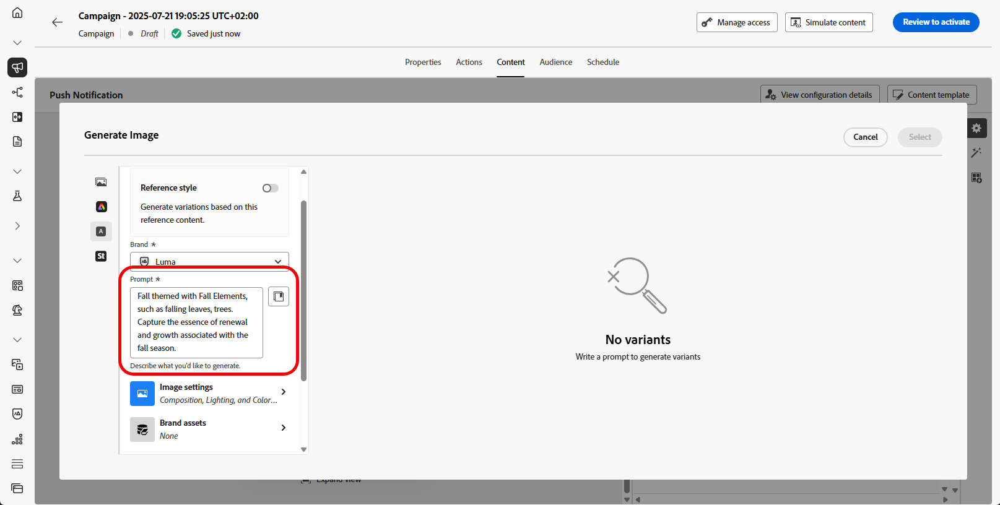

# Generare immagini con l’Assistente AI {#generative-image}

>[!IMPORTANT]
>
>Prima di iniziare a utilizzare questa funzionalità, leggi l’articolo sui relativi [Guardrail e limitazioni](gs-generative.md#generative-guardrails).
> 
>
>Prima di poter utilizzare l&#39;Assistente di intelligenza artificiale in Journey Optimizer, devi accettare un [contratto utente](https://www.adobe.com/it/legal/licenses-terms/adobe-dx-gen-ai-user-guidelines.html). Per ulteriori informazioni, contatta il tuo rappresentante Adobe.

Utilizza l’Assistente AI in Journey Optimizer per generare contenuti visivi coinvolgenti che migliorano i messaggi tra e-mail, web, pagine di destinazione e notifiche push. AI Assistant consente di ottimizzare e migliorare le risorse, garantendo al pubblico un’esperienza più coinvolgente e di facile utilizzo.

## Per e-mail e canali web {#email-web-channels}

L’Assistente AI può generare esperienze visive complete per le campagne e-mail, le esperienze web e le pagine di destinazione. Questa funzionalità consente di produrre immagini sul marchio che catturano l’attenzione e che risuonano con il pubblico in diversi punti di contatto digitali.

### Accedere e configurare {#access-configure}

Per iniziare a generare le immagini con l’Assistente AI, configura innanzitutto la campagna o il percorso e apri l’editor di contenuti. Segui i passaggi seguenti per preparare l’area di lavoro e accedere al pannello dell’Assistente IA.

1. Creare e configurare la campagna o il percorso:
   * **E-mail**: dopo aver creato e configurato la tua campagna e-mail, fai clic su **[!UICONTROL Modifica contenuto]**. [Ulteriori informazioni](../email/create-email.md)
   * **Web**: dopo aver creato e configurato la pagina Web, fare clic su **[!UICONTROL Modifica pagina Web]**. [Ulteriori informazioni](../web/create-web.md)
   * **Pagina di destinazione**: dopo aver creato e configurato la pagina di destinazione, fai clic su **[!UICONTROL Modifica contenuto]**. [Ulteriori informazioni](../landing-pages/create-lp.md)

1. Seleziona la risorsa da modificare con l’Assistente AI.

1. Dal menu di destra, selezionare **[!UICONTROL Assistente AI]** (o **[!UICONTROL Mostra Assistente AI]** per il Web).

   {zoomable="yes"}

### Genera contenuto {#generate-content}

Scopri come creare prompt efficaci e configurare le impostazioni delle immagini per generare immagini visivamente coinvolgenti con l’Assistente AI. Personalizza parametri quali proporzioni, intensità visiva e illuminazione per creare immagini in linea con gli obiettivi del tuo marchio e della tua campagna.

1. Abilita l&#39;opzione **[!UICONTROL Stile riferimento]** affinché l&#39;Assistente AI personalizzi nuovi contenuti in base al contenuto di riferimento. Puoi anche caricare un’immagine per aggiungere contesto alla variante.

1. Seleziona il tuo **[!UICONTROL marchio]** per garantire che i contenuti generati dall&#39;intelligenza artificiale siano in linea con le specifiche del tuo marchio. [Ulteriori informazioni](brands.md) sui marchi.

1. Ottimizzare il contenuto descrivendo cosa si desidera generare nel campo **[!UICONTROL Prompt]**.

   Se stai cercando assistenza per creare il prompt, accedi alla **[!UICONTROL Libreria prompt]** che fornisce una vasta gamma di idee per migliorare le campagne.

   {zoomable="yes"}

1. Personalizza il prompt con l&#39;opzione **[!UICONTROL Impostazioni immagine]**:

   * **[!UICONTROL Proporzioni]**: determina la larghezza e l&#39;altezza della risorsa. È possibile scegliere tra rapporti comuni quali 16:9, 4:3, 3:2 o 1:1 oppure immettere una dimensione personalizzata.
   * **[!UICONTROL Tipo di contenuto]**: categorizza la natura dell&#39;elemento visivo, distinguendo tra diverse forme di rappresentazione visiva come foto, immagini o immagini.
   * **[!UICONTROL Intensità visiva]**: è possibile controllare l&#39;impatto dell&#39;immagine regolandone l&#39;intensità. Un&#39;impostazione più bassa (2) creerà un aspetto più morbido e più contenuto, mentre un&#39;impostazione più alta (10) renderà l&#39;immagine più vibrante e visivamente potente.
   * **[!UICONTROL Colore e tono]**: l&#39;aspetto complessivo dei colori all&#39;interno di un&#39;immagine e l&#39;umore o l&#39;atmosfera che trasmette.
   * **[!UICONTROL Illuminazione]**: si riferisce al fulmine presente in un&#39;immagine, che ne forma l&#39;atmosfera ed evidenzia elementi specifici.
   * **[!UICONTROL Composizione]**: si riferisce alla disposizione degli elementi all&#39;interno della cornice di un&#39;immagine

   {zoomable="yes"}

1. Dal menu **[!UICONTROL Risorse per i marchi]**, fai clic su **[!UICONTROL Carica risorsa per i marchi]** per aggiungere qualsiasi risorsa per i marchi contenente contenuto che possa fornire un&#39;Assistente IA per l&#39;analisi del contesto aggiuntivo o selezionarne una caricata in precedenza.

   I file precedentemente caricati sono disponibili nel menu a discesa **[!UICONTROL Risorse del brand caricate]**. È sufficiente attivare o disattivare le risorse da includere nella generazione.

1. Una volta completata la configurazione del prompt, fai clic su **[!UICONTROL Genera]**.

1. Sfoglia i **[!UICONTROL suggerimenti varianti]** per trovare la risorsa desiderata.

   Fai clic su **[!UICONTROL Anteprima]** per visualizzare una versione a schermo intero della variante selezionata o su **[!UICONTROL Applica]** per sostituire il contenuto corrente.

1. Fai clic sull&#39;icona percentuale per visualizzare il **[!UICONTROL punteggio di allineamento del brand]** e identificare eventuali disallineamenti con il brand.

   Ulteriori informazioni sul [Punteggio di allineamento del marchio](brands-score.md).

### Perfezionare e finalizzare {#refine-finalize}

Dopo aver generato le varianti di immagine, puoi esaminare i risultati, verificare l’allineamento del brand, modificare in Adobe Express e selezionare l’opzione migliore per il contenuto.

1. Passa all&#39;opzione **[!UICONTROL Perfeziona]** nella finestra **[!UICONTROL Anteprima]** per accedere ad altre funzioni di personalizzazione:

   * **[!UICONTROL Genera simili]** per visualizzare le immagini correlate a questa variante.
   * **[!UICONTROL Modifica in Adobe Express]** per personalizzare ulteriormente la risorsa.

[Ulteriori informazioni sull’integrazione di Adobe Express](../integrations/express.md)

   * **[!UICONTROL Salva]** per archiviare le risorse per un accesso successivo.

   {zoomable="yes"}

1. Una volta trovato il contenuto appropriato, fai clic su **[!UICONTROL Seleziona]**.

   Puoi anche abilitare l’esperimento per il contenuto. [Ulteriori informazioni](generative-experimentation.md)

1. Dopo aver definito il contenuto del messaggio, fai clic sul pulsante **[!UICONTROL Simula contenuto]** per controllare il rendering e verifica le impostazioni di personalizzazione con i profili di test. [Ulteriori informazioni](../personalization/personalize.md)

1. Rivedi e attiva il contenuto:
   * **E-mail**: una volta definiti il contenuto, il pubblico e la pianificazione, puoi preparare la tua campagna e-mail. [Ulteriori informazioni](../campaigns/review-activate-campaign.md)
   * **Web**: una volta definite le impostazioni della campagna Web e modificato il contenuto come desiderato, puoi rivedere e attivare la campagna Web. [Ulteriori informazioni](../web/create-web.md#activate-web-campaign)
   * **Pagina di destinazione**: quando la pagina di destinazione è pronta, puoi pubblicarla per renderla disponibile per l&#39;utilizzo in un messaggio. [Ulteriori informazioni](../landing-pages/create-lp.md#publish-landing-page)

## Per canali mobili {#mobile-channels}

L’Assistente AI ti consente di generare immagini coinvolgenti per le notifiche push, consentendoti di creare comunicazioni mobili visivamente coinvolgenti che catturano l’attenzione e risuonano con il pubblico.

### Accedere e configurare {#mobile-access-configure}

Per utilizzare l’Assistente AI per le notifiche push, devi impostare la consegna push e passare all’editor di contenuti. Questi passaggi ti guideranno attraverso la creazione della consegna e l’accesso alle funzioni di AI Assistant.

1. Dopo aver creato e configurato la consegna delle notifiche push, fai clic su **[!UICONTROL Modifica contenuto]**.

   Per ulteriori informazioni sulla configurazione della consegna push, consulta [questa pagina](../push/create-push.md).

1. Personalizza la notifica push in base alle esigenze. [Ulteriori informazioni](../push/design-push.md)

1. Accedere al menu **[!UICONTROL Mostra Assistente AI]**.

   {zoomable="yes"}

### Genera contenuto {#mobile-generate-content}

Dopo aver effettuato l’accesso a AI Assistant, puoi regolare le impostazioni di generazione per creare immagini in linea con il tuo marchio e supportare gli obiettivi delle notifiche push. Configura i parametri di prompt e immagine per generare visualizzazioni ottimizzate per gli schermi mobili.

1. Abilita l&#39;opzione **[!UICONTROL Stile riferimento]** affinché l&#39;Assistente AI personalizzi nuovi contenuti in base al contenuto di riferimento. Puoi anche caricare un’immagine per aggiungere contesto alla variante.

1. Seleziona il tuo **[!UICONTROL marchio]** per garantire che i contenuti generati dall&#39;intelligenza artificiale siano in linea con le specifiche del tuo marchio. [Ulteriori informazioni](brands.md) sui marchi.

   La funzione Marchi viene rilasciata come versione beta privata e sarà progressivamente disponibile per tutti i clienti nelle versioni future.

1. Ottimizzare il contenuto descrivendo cosa si desidera generare nel campo **[!UICONTROL Prompt]**.

   Se stai cercando assistenza per creare il prompt, accedi alla **[!UICONTROL Libreria prompt]** che fornisce una vasta gamma di idee per migliorare le campagne.

   {zoomable="yes"}

1. Scegli le **[!UICONTROL impostazioni immagine]**:

   * **[!UICONTROL Tipo di contenuto]**: categorizza la natura dell&#39;elemento visivo, distinguendo tra diverse forme di rappresentazione visiva come foto, immagini o immagini.
   * **[!UICONTROL Intensità visiva]**: è possibile controllare l&#39;impatto dell&#39;immagine regolandone l&#39;intensità. Un&#39;impostazione più bassa (2) creerà un aspetto più morbido e più contenuto, mentre un&#39;impostazione più alta (10) renderà l&#39;immagine più vibrante e visivamente potente.
   * **[!UICONTROL Colore e tono]**: l&#39;aspetto complessivo dei colori all&#39;interno di un&#39;immagine e l&#39;umore o l&#39;atmosfera che trasmette.
   * **[!UICONTROL Illuminazione]**: si riferisce al fulmine presente in un&#39;immagine, che ne forma l&#39;atmosfera ed evidenzia elementi specifici.
   * **[!UICONTROL Composizione]**: si riferisce alla disposizione degli elementi all&#39;interno della cornice di un&#39;immagine

1. Dal menu **[!UICONTROL Risorse per i marchi]**, fai clic su **[!UICONTROL Carica risorsa per i marchi]** per aggiungere qualsiasi risorsa per i marchi contenente contenuto che possa fornire un&#39;Assistente IA per l&#39;analisi del contesto aggiuntivo o selezionarne una caricata in precedenza.

   I file precedentemente caricati sono disponibili nel menu a discesa **[!UICONTROL Risorse del brand caricate]**. È sufficiente attivare o disattivare le risorse da includere nella generazione.

1. Una volta completato il prompt, fai clic su **[!UICONTROL Genera]**.

1. Sfoglia le **[!UICONTROL Varianti]** generate.

1. Fai clic sull&#39;icona percentuale per visualizzare il **[!UICONTROL punteggio di allineamento del brand]** e identificare eventuali disallineamenti con il brand.

   Ulteriori informazioni sul [Punteggio di allineamento del marchio](brands-score.md).

### Perfezionare e finalizzare {#mobile-refine-finalize}

Dopo aver generato le varianti di immagine per le notifiche push, puoi perfezionare i risultati per garantire che soddisfino esattamente le tue esigenze. Rivedi l’allineamento del brand, modifica in Adobe Express se necessario e seleziona l’immagine migliore per la tua campagna mobile.

1. Passa all&#39;opzione **[!UICONTROL Perfeziona]** nella finestra **[!UICONTROL Anteprima]** per accedere ad altre funzioni di personalizzazione:

   * **[!UICONTROL Genera simili]** per visualizzare le immagini correlate a questa variante.
   * **[!UICONTROL Modifica in Adobe Express]** per personalizzare ulteriormente la risorsa.

[Ulteriori informazioni sull’integrazione di Adobe Express](../integrations/express.md)

   * **[!UICONTROL Salva]** per archiviare le risorse per un accesso successivo.

   {zoomable="yes"}

1. Apri la scheda **[!UICONTROL Allineamento marchio]** per vedere come il contenuto si allinea alle [linee guida per il marchio](brands.md).

1. Una volta trovato il contenuto appropriato, fai clic su **[!UICONTROL Seleziona]**.

   Puoi anche abilitare l’esperimento per il contenuto. [Ulteriori informazioni](generative-experimentation.md)

Una volta definiti il contenuto, il pubblico e la pianificazione, sei pronto per preparare la tua campagna push. [Ulteriori informazioni](../campaigns/review-activate-campaign.md)

