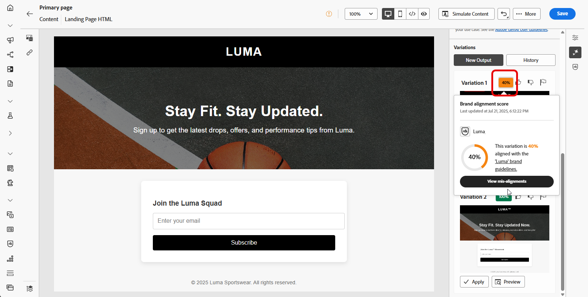
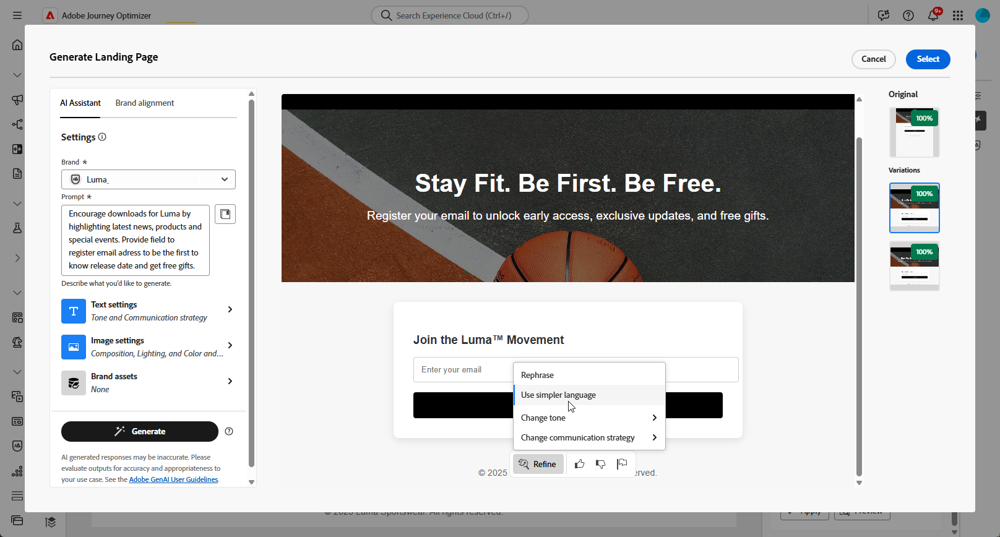

# Generazione della pagina di destinazione con l’Assistente IA {#generative-lp}

>[!IMPORTANT]
>
>* Prima di iniziare a utilizzare questa funzionalità, leggi l’articolo sui relativi [Guardrail e limitazioni](gs-generative.md#generative-guardrails).
>
>
>* Prima di poter utilizzare l&#39;Assistente di intelligenza artificiale in Journey Optimizer è necessario accettare il [contratto utente](https://www.adobe.com/it/legal/licenses-terms/adobe-dx-gen-ai-user-guidelines.html). Per ulteriori informazioni, contatta il tuo rappresentante Adobe.

Trasforma le pagine di destinazione con AI Assistant in Journey Optimizer, basato sull’intelligenza artificiale generativa.

Crea contenuti di grande impatto, incluse pagine complete, frammenti di testo personalizzati e effetti visivi personalizzati che suonano bene con il tuo pubblico, aumentando il coinvolgimento e l’interazione.

Esplora le schede seguenti per scoprire come utilizzare l’Assistente IA in Journey Optimizer.

>[!BEGINTABS]

>[!TAB Generazione pagina di destinazione completa]

Nell’esempio seguente, sfrutteremo AI Assistant per perfezionare un modello di pagina di destinazione esistente.

1. Dopo aver creato e configurato la pagina di destinazione, fai clic su **[!UICONTROL Modifica contenuto]**.

   Per ulteriori informazioni su come configurare la pagina di destinazione, consulta [questa pagina](../landing-pages/create-lp.md).

1. Personalizza il layout in base alle esigenze e accedi al menu **[!UICONTROL Assistente AI]**.

   {zoomable="yes"}

1. Abilita l&#39;opzione **[!UICONTROL Usa contenuto originale]** per l&#39;Assistente AI per personalizzare nuovi contenuti in base al contenuto selezionato.

1. Ottimizzare il contenuto descrivendo cosa si desidera generare nel campo **[!UICONTROL Prompt]**.

   Se stai cercando assistenza per creare il prompt, accedi alla **[!UICONTROL Libreria prompt]** che fornisce una vasta gamma di idee per migliorare la pagina di destinazione.

   {zoomable="yes"}

1. Personalizza la richiesta con l&#39;opzione **[!UICONTROL Impostazioni testo]**:

   * **[!UICONTROL Strategia di comunicazione]**: scegli lo stile di comunicazione più adatto al testo generato.
   * **[!UICONTROL Lingue]**: scegli la lingua del contenuto generato.
   * **[!UICONTROL Tono]**: il tono della pagina di destinazione dovrebbe risuonare con il pubblico. Che tu voglia essere informativo, giocoso o persuasivo, AI Assistant può adattare il messaggio di conseguenza.

   {zoomable="yes"}

1. Scegli le **[!UICONTROL impostazioni immagine]**:

   * **[!UICONTROL Tipo di contenuto]**: categorizza la natura dell&#39;elemento visivo, distinguendo tra diverse forme di rappresentazione visiva come foto, immagini o immagini.
   * **[!UICONTROL Intensità visiva]**: è possibile controllare l&#39;impatto dell&#39;immagine regolandone l&#39;intensità. Un&#39;impostazione più bassa (2) creerà un aspetto più morbido e più contenuto, mentre un&#39;impostazione più alta (10) renderà l&#39;immagine più vibrante e visivamente potente.
   * **[!UICONTROL Colore e tono]**: l&#39;aspetto complessivo dei colori all&#39;interno di un&#39;immagine e l&#39;umore o l&#39;atmosfera che trasmette.
   * **[!UICONTROL Illuminazione]**: si riferisce al fulmine presente in un&#39;immagine, che ne forma l&#39;atmosfera ed evidenzia elementi specifici.
   * **[!UICONTROL Composizione]**: si riferisce alla disposizione degli elementi all&#39;interno della cornice di un&#39;immagine

   {zoomable="yes"}

1. Dal menu **[!UICONTROL Risorse per i marchi]**, fai clic su **[!UICONTROL Carica risorsa per i marchi]** per aggiungere qualsiasi risorsa per i marchi contenente contenuto che possa fornire un&#39;Assistente IA per l&#39;analisi del contesto aggiuntivo o selezionarne una caricata in precedenza.

   I file precedentemente caricati sono disponibili nel menu a discesa **[!UICONTROL Risorse del brand caricate]**. È sufficiente attivare o disattivare le risorse da includere nella generazione.

1. Una volta completato il prompt, fai clic su **[!UICONTROL Genera]**.

1. Sfoglia le **[!UICONTROL Varianti]** generate.

   Fai clic su **[!UICONTROL Anteprima]** per visualizzare una versione a schermo intero della variante selezionata oppure fai clic su **[!UICONTROL Applica]** per sostituire il contenuto corrente.

1. Fai clic sull&#39;icona percentuale per visualizzare il **[!UICONTROL punteggio di allineamento del brand]** e identificare eventuali disallineamenti con il brand.

   Ulteriori informazioni sul [Punteggio di allineamento del marchio](brands-score.md).

   {zoomable="yes"}

1. Passa all&#39;opzione **[!UICONTROL Perfeziona]** nella finestra **[!UICONTROL Anteprima]** per accedere ad altre funzioni di personalizzazione:

   * **[!UICONTROL Riformula]**: l&#39;Assistente di intelligenza artificiale può riformulare il messaggio in diversi modi, mantenendo la scrittura fresca e coinvolgente per diversi tipi di pubblico.

   * **[!UICONTROL Usa un linguaggio più semplice]**: sfrutta l&#39;Assistente AI per semplificare la lingua, garantendo chiarezza e accessibilità a un pubblico più ampio.

   Puoi anche modificare il **[!UICONTROL Tono]** e la **[!UICONTROL Strategia di comunicazione]** del tuo testo.

   {zoomable="yes"}

1. Apri la scheda **[!UICONTROL Allineamento marchio]** per vedere come il contenuto si allinea alle [linee guida per il marchio](brands.md).

1. Una volta trovato il contenuto appropriato, fai clic su **[!UICONTROL Seleziona]**.

1. Inserisci campi di personalizzazione per personalizzare il contenuto della pagina di destinazione in base ai dati dei profili. Quindi, fai clic sul pulsante **[!UICONTROL Simula contenuto]** per controllare il rendering e controlla le impostazioni di personalizzazione con i profili di test. [Ulteriori informazioni](../personalization/personalize.md)

Una volta che la pagina di destinazione è pronta, puoi pubblicarla per renderla disponibile per l’utilizzo in un messaggio. [Ulteriori informazioni](../landing-pages/create-lp.md#publish-landing-page)

>[!TAB Generazione solo testo]

Nell’esempio seguente, sfrutteremo AI Assistant per migliorare il contenuto della nostra pagina di destinazione.

1. Dopo aver creato e configurato la pagina di destinazione, fai clic su **[!UICONTROL Modifica contenuto]**.

   Per ulteriori informazioni su come configurare la pagina di destinazione, consulta [questa pagina](../landing-pages/create-lp.md).

1. Seleziona un **[!UICONTROL componente testo]** per eseguire il targeting solo di un contenuto specifico. e accedere al menu **[!UICONTROL Assistente AI]**.

   {zoomable="yes"}

1. Abilita l&#39;opzione **[!UICONTROL Usa contenuto originale]** per l&#39;Assistente AI per personalizzare nuovi contenuti in base al contenuto selezionato.

1. Ottimizzare il contenuto descrivendo cosa si desidera generare nel campo **[!UICONTROL Prompt]**.

   Se stai cercando assistenza per creare il prompt, accedi alla **[!UICONTROL Libreria prompt]** che fornisce una vasta gamma di idee per migliorare le pagine di destinazione.

   {zoomable="yes"}

1. Personalizza la richiesta con l&#39;opzione **[!UICONTROL Impostazioni testo]**:

   * **[!UICONTROL Strategia di comunicazione]**: scegli lo stile di comunicazione più adatto al testo generato.
   * **[!UICONTROL Lingue]**: scegli la lingua del contenuto generato.
   * **[!UICONTROL Tono]**: il tono della pagina di destinazione dovrebbe risuonare con il pubblico. Che tu voglia essere informativo, giocoso o persuasivo, AI Assistant può adattare il messaggio di conseguenza.
   * **Lunghezza testo**: utilizza il cursore per selezionare la lunghezza desiderata del testo.

   {zoomable="yes"}

1. Dal menu **[!UICONTROL Risorse per i marchi]**, fai clic su **[!UICONTROL Carica risorsa per i marchi]** per aggiungere qualsiasi risorsa per i marchi contenente contenuto che possa fornire un&#39;Assistente IA per l&#39;analisi del contesto aggiuntivo o selezionarne una caricata in precedenza.

   I file precedentemente caricati sono disponibili nel menu a discesa **[!UICONTROL Risorse del brand caricate]**. È sufficiente attivare o disattivare le risorse da includere nella generazione.

1. Una volta completato il prompt, fai clic su **[!UICONTROL Genera]**.

1. Sfoglia le **[!UICONTROL Varianti]** generate.

   Fai clic su **[!UICONTROL Anteprima]** per visualizzare una versione a schermo intero della variante selezionata oppure fai clic su **[!UICONTROL Applica]** per sostituire il contenuto corrente.

1. Fai clic sull&#39;icona percentuale per visualizzare il **[!UICONTROL punteggio di allineamento del brand]** e identificare eventuali disallineamenti con il brand.

   Ulteriori informazioni sul [Punteggio di allineamento del marchio](brands-score.md).

   {zoomable="yes"}

1. Passa all&#39;opzione **[!UICONTROL Perfeziona]** nella finestra **[!UICONTROL Anteprima]** per accedere ad altre funzioni di personalizzazione:

   * **[!UICONTROL Utilizza come contenuto di riferimento]**: la variante scelta fungerà da contenuto di riferimento per generare altri risultati.

   * **[!UICONTROL Elaborare]**: l&#39;Assistente AI può aiutarti a espandere argomenti specifici, fornendo ulteriori dettagli per una migliore comprensione e coinvolgimento.

   * **[!UICONTROL Riepiloga]**: informazioni lunghe possono sovraccaricare i destinatari della pagina di destinazione. Utilizza l’Assistente AI per condensare i punti chiave in riepiloghi chiari e concisi che catturano l’attenzione e li incoraggiano a leggere ulteriormente.

   * **[!UICONTROL Riformula]**:The L&#39;Assistente AI può riformulare il messaggio in diversi modi, mantenendo la scrittura fresca e coinvolgente per diversi tipi di pubblico.

   * **[!UICONTROL Usa un linguaggio più semplice]**: sfrutta l&#39;Assistente AI per semplificare la lingua, garantendo chiarezza e accessibilità a un pubblico più ampio.

   Puoi anche modificare il **[!UICONTROL Tono]** e la **[!UICONTROL Strategia di comunicazione]** del tuo testo.

   {zoomable="yes"}

1. Apri la scheda **[!UICONTROL Allineamento marchio]** per vedere come il contenuto si allinea alle [linee guida per il marchio](brands.md).

1. Una volta trovato il contenuto appropriato, fai clic su **[!UICONTROL Seleziona]**.

1. Inserisci campi di personalizzazione per personalizzare il contenuto della pagina di destinazione in base ai dati dei profili. Quindi, fai clic sul pulsante **[!UICONTROL Simula contenuto]** per controllare il rendering e controlla le impostazioni di personalizzazione con i profili di test. [Ulteriori informazioni](../personalization/personalize.md)

Una volta che la pagina di destinazione è pronta, puoi pubblicarla per renderla disponibile per l’utilizzo in un messaggio. [Ulteriori informazioni](../landing-pages/create-lp.md#publish-landing-page)

>[!TAB Generazione solo immagine]

Nell’esempio seguente, scopri come sfruttare l’Assistente AI per ottimizzare e migliorare le risorse, garantendo un’esperienza più semplice da usare.

1. Dopo aver creato e configurato la pagina di destinazione, fai clic su **[!UICONTROL Modifica contenuto]**.

   Per ulteriori informazioni su come configurare la pagina di destinazione, consulta [questa pagina](../landing-pages/create-lp.md).

1. Seleziona la risorsa da modificare con l’Assistente AI.

1. Dal menu di destra, selezionare **[!UICONTROL Assistente AI]**.

   {zoomable="yes"}

1. Abilita l&#39;opzione **[!UICONTROL Stile riferimento]** affinché l&#39;Assistente AI personalizzi nuovi contenuti in base al contenuto di riferimento. Puoi anche caricare un’immagine per aggiungere contesto alla variante.

1. Ottimizzare il contenuto descrivendo cosa si desidera generare nel campo **[!UICONTROL Prompt]**.

   Se stai cercando assistenza per creare il prompt, accedi alla **[!UICONTROL Libreria prompt]** che fornisce una vasta gamma di idee per migliorare le pagine di destinazione.

   {zoomable="yes"}

1. Personalizza il prompt con l&#39;opzione **[!UICONTROL Impostazioni immagine]**:

   * **[!UICONTROL Proporzioni]**: determina la larghezza e l&#39;altezza della risorsa. È possibile scegliere tra rapporti comuni quali 16:9, 4:3, 3:2 o 1:1 oppure immettere una dimensione personalizzata.
   * **[!UICONTROL Tipo di contenuto]**: categorizza la natura dell&#39;elemento visivo, distinguendo tra diverse forme di rappresentazione visiva come foto, immagini o immagini.
   * **[!UICONTROL Intensità visiva]**: è possibile controllare l&#39;impatto dell&#39;immagine regolandone l&#39;intensità. Un&#39;impostazione più bassa (2) creerà un aspetto più morbido e più contenuto, mentre un&#39;impostazione più alta (10) renderà l&#39;immagine più vibrante e visivamente potente.
   * **[!UICONTROL Colore e tono]**: l&#39;aspetto complessivo dei colori all&#39;interno di un&#39;immagine e l&#39;umore o l&#39;atmosfera che trasmette.
   * **[!UICONTROL Illuminazione]**: si riferisce al fulmine presente in un&#39;immagine, che ne forma l&#39;atmosfera ed evidenzia elementi specifici.
   * **[!UICONTROL Composizione]**: si riferisce alla disposizione degli elementi all&#39;interno della cornice di un&#39;immagine

   {zoomable="yes"}

1. Dal menu **[!UICONTROL Risorse per i marchi]**, fai clic su **[!UICONTROL Carica risorsa per i marchi]** per aggiungere qualsiasi risorsa per i marchi contenente contenuto che possa fornire un&#39;Assistente IA per l&#39;analisi del contesto aggiuntivo o selezionarne una caricata in precedenza.

   I file precedentemente caricati sono disponibili nel menu a discesa **[!UICONTROL Risorse del brand caricate]**. È sufficiente attivare o disattivare le risorse da includere nella generazione.

1. Una volta completata la configurazione del prompt, fai clic su **[!UICONTROL Genera]**.

1. Sfoglia le **[!UICONTROL Varianti]** generate.

   Fai clic su **[!UICONTROL Anteprima]** per visualizzare una versione a schermo intero della variante selezionata oppure fai clic su **[!UICONTROL Applica]** per sostituire il contenuto corrente.

1. Fai clic sull&#39;icona percentuale per visualizzare il **[!UICONTROL punteggio di allineamento del brand]** e identificare eventuali disallineamenti con il brand.

   Ulteriori informazioni sul [Punteggio di allineamento del marchio](brands-score.md).

   {zoomable="yes"}

1. Passa all&#39;opzione **[!UICONTROL Perfeziona]** nella finestra **[!UICONTROL Anteprima]** per accedere ad altre funzioni di personalizzazione:

   * **[!UICONTROL Genera simili]** per visualizzare le immagini correlate a questa variante.
   * **[!UICONTROL Modifica in Adobe Express]** per personalizzare ulteriormente la risorsa.

[Ulteriori informazioni sull’integrazione di Adobe Express](../integrations/express.md)

   * **[!UICONTROL Salva]** per archiviare le risorse per un accesso successivo.

   {zoomable="yes"}

1. Apri la scheda **[!UICONTROL Allineamento marchio]** per vedere come il contenuto si allinea alle [linee guida per il marchio](brands.md).

1. Una volta trovato il contenuto appropriato, fai clic su **[!UICONTROL Seleziona]**.

1. Dopo aver definito il contenuto del messaggio, fai clic sul pulsante **[!UICONTROL Simula contenuto]** per controllare il rendering e verifica le impostazioni di personalizzazione con i profili di test. [Ulteriori informazioni](../personalization/personalize.md)

Una volta che la pagina di destinazione è pronta, puoi pubblicarla per renderla disponibile per l’utilizzo in un messaggio. [Ulteriori informazioni](../landing-pages/create-lp.md#publish-landing-page)

>[!ENDTABS]
