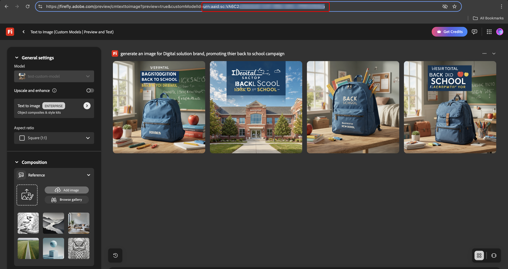

# Creare e gestire modelli generativi {#generative-models}

Espandi le funzionalità di creazione delle immagini AI con modelli incorporati, modelli Firefly personalizzati e provider di generazione di immagini di terze parti per soddisfare esigenze specifiche e migliorare l’allineamento del brand.

Scegli il modello giusto per le tue esigenze:

- **[!UICONTROL Adobe model]**, con tecnologia Firefly Image Model 4, è fornito pronto all&#39;uso e pronto per la generazione immediata di immagini senza ulteriori configurazioni.
- Il **[!UICONTROL modello partner]**, basato sul Flash Gemini 2.5, offre funzionalità specializzate per casi d&#39;uso specifici.
- **[!UICONTROL I modelli personalizzati]** sono modelli specifici del marchio preparati sulle risorse personali e aggiunti dall&#39;organizzazione.

  Ulteriori informazioni sui **[!UICONTROL modelli personalizzati]** in [documentazione di Adobe Firefly](https://helpx.adobe.com/it/firefly/web/work-with-enterprise-features/train-custom-models/custom-models-overview.html)

Una volta configurata, puoi selezionare uno qualsiasi dei tuoi modelli generativi durante la creazione di immagini nei tuoi contenuti. [Ulteriori informazioni sulla generazione delle immagini](generative-image.md).

## Gestire i modelli generativi

Gestisci i tuoi modelli generativi da una posizione centralizzata. Visualizza tutti i modelli disponibili, filtra e cerca quelli specifici e configurane le impostazioni per i tuoi marchi.

1. Dal menu **[!UICONTROL Marchi]**, seleziona la scheda **[!UICONTROL Modelli generativi]**.

   {zoomable="yes"}

1. Fare clic sull&#39;icona  per accedere al menu del filtro. Filtra i modelli in base a **[!UICONTROL Tipo]** o **[!UICONTROL Stato]**.

   {zoomable="yes"}

1. Utilizza la barra di ricerca per trovare un modello generativo specifico per nome.

1. Fare clic sull&#39;icona  per accedere al menu avanzato, in cui è possibile attivare o disattivare il modello oppure eliminarlo.

   È possibile eliminare solo **[!UICONTROL modelli personalizzati]**.

   {zoomable="yes"}

1. Fai clic su **[!UICONTROL Aggiungi modello]** per creare un nuovo modello generativo da zero.

Ora puoi selezionare uno qualsiasi dei tuoi modelli generativi durante la creazione di immagini nei tuoi contenuti. [Ulteriori informazioni sulla generazione delle immagini](generative-image.md).

## Aggiungere un modello generativo

>[!IMPORTANT]
>
>La creazione di modelli di Firefly personalizzati richiede un accordo di ETLA del Firefly.

I modelli personalizzati di Firefly sono modelli di intelligenza artificiale specifici per il brand formati sulle risorse personali, che consentono di generare immagini in linea con l’identità del brand, lo stile e le linee guida visive.

Creando provider di modelli Firefly personalizzati, puoi espandere le funzionalità di intelligenza artificiale oltre i modelli predefiniti e garantire che i contenuti generati riflettano in modo coerente i requisiti estetici e specifici del tuo marchio.

➡️ [Scopri come addestrare il tuo modello personalizzato](https://helpx.adobe.com/it/firefly/web/work-with-enterprise-features/train-custom-models/train-firefly-custom-models.html)

1. Dal menu **[!UICONTROL Marchi]**, accedi alla scheda **[!UICONTROL Modelli generativi]** e fai clic su **[!UICONTROL Aggiungi modello]**.

   {zoomable="yes"}

1. Immetti un **[!UICONTROL Nome]** per il modello.

1. Immetti il tuo **[!UICONTROL ID modello]**.

   +++ Trovare l&#39;ID del modello di Firefly

   1. Accedi al sito Web del Firefly e seleziona i modelli selezionati.
   1. Accedi al menu [Anteprima e test](https://helpx.adobe.com/it/firefly/web/work-with-enterprise-features/train-custom-models/train-firefly-custom-models.html#preview-and-test).
   1. Nell&#39;URL individuare il valore dopo `customModelId=`. Copia questo valore per utilizzarlo come ID modello.

   Per ulteriori informazioni, consulta la [documentazione dei modelli personalizzati di Firefly](https://helpx.adobe.com/it/firefly/web/work-with-enterprise-features/train-custom-models/manage-custom-models.html).

   {zoomable="yes"}

   +++

    

   {zoomable="yes"}

1. Facoltativamente, immetti una **[!UICONTROL Descrizione]** per identificare il modello.

1. Fai clic su **[!UICONTROL Verifica connessione]** per verificare la configurazione del modello.

1. Una volta completato il test di connessione, fai clic su **[!UICONTROL Salva]** per salvare la configurazione del modello.

   {zoomable="yes"}

1. Dopo il salvataggio, il modello personalizzato viene aggiunto all’elenco dei modelli. Puoi disattivarla o eliminarla in qualsiasi momento.

   {zoomable="yes"}

<!--
1. Once the connection test is successful, choose whether to enable the model for selected brands.

1. Enable or disable the option to connect the model to all brands.

    If disabled, select which brands this model should be applied to.
-->

Una volta configurato, puoi selezionare uno qualsiasi dei modelli generativi personalizzati durante la creazione di immagini nei tuoi contenuti. [Ulteriori informazioni sulla generazione di immagini](generative-image.md).

{zoomable="yes"}
