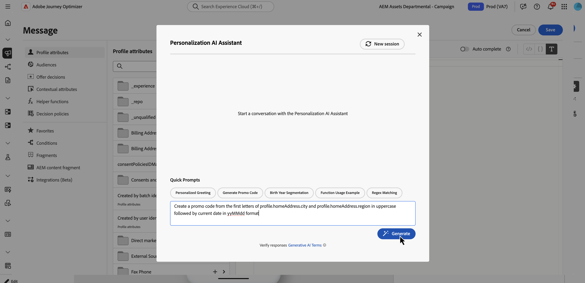
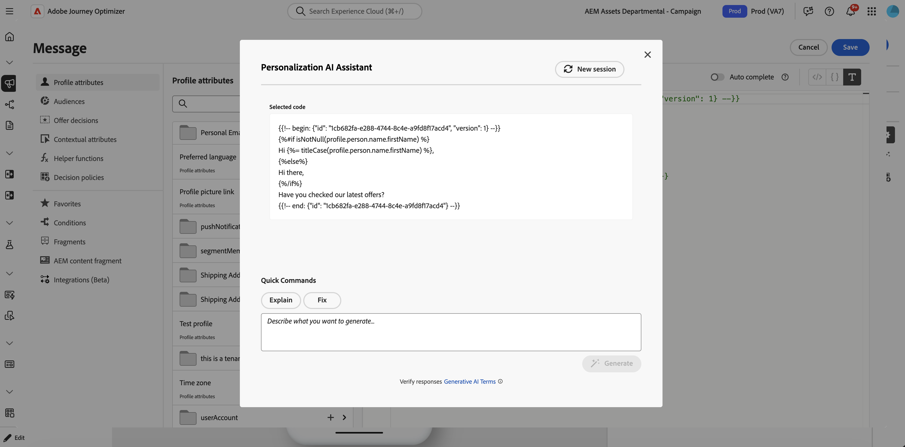
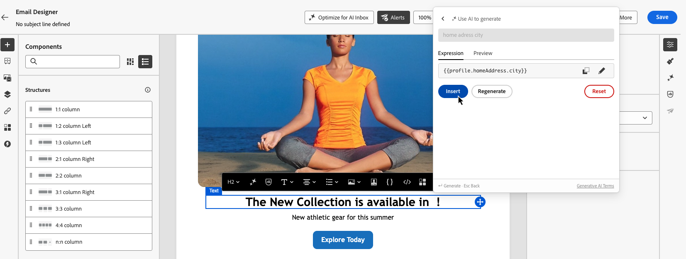

# Assistente IA per le espressioni di personalizzazione{#generative-personalization-expressions}

>[!IMPORTANT]
>
>Prima di iniziare a utilizzare questa funzionalità, leggi le [protezioni e limitazioni](gs-generative.md#generative-guardrails) correlate.
> 
>
>Prima di poter utilizzare l&#39;Assistente di intelligenza artificiale in Journey Optimizer, devi accettare un [contratto utente](https://www.adobe.com/it/legal/licenses-terms/adobe-dx-gen-ai-user-guidelines.html). Per ulteriori informazioni, contatta il tuo rappresentante Adobe.

## Panoramica {#where-available}

[!UICONTROL Assistente AI] consente di generare nuove personalizzazioni dal linguaggio semplice, spiegare le funzioni delle espressioni esistenti e risolvere i problemi nel codice selezionato, in modo da dedicare meno tempo alla sintassi e all&#39;individuazione manuale dei campi. Puoi anche eseguire iterazioni su una selezione o chiedere altre modifiche nella conversazione. È disponibile in due modi:

* **[!UICONTROL Editor di Personalization]**: ovunque l&#39;editor sia disponibile tra canali diversi (oggetto, corpo e altri campi che lo aprono). Questo è il percorso generale per la personalizzazione basata sull’intelligenza artificiale. Per sapere dove e come aprire l&#39;editor, consulta [Aggiungi personalizzazione](../personalization/personalization-build-expressions.md#where).
* **Barra degli strumenti di E-mail Designer**: quando si creano e-mail in E-mail Designer, selezionare un componente e utilizzare **[!UICONTROL Aggiungi espressione]** nella barra degli strumenti contestuale per aprire l&#39;assistente in una casella degli strumenti senza prima aprire l&#39;editor completo. Questo punto di ingresso non è disponibile all’esterno dell’authoring di e-mail. Vedi [Genera da e-mail Designer](#generate-email-designer).

Per una configurazione e lingue più ampie dell&#39;Assistente di intelligenza artificiale, vedere [Introduzione all&#39;Assistente di intelligenza artificiale](gs-generative.md). Per i concetti di personalizzazione, consulta [Introduzione alla personalizzazione](../personalization/personalize.md). Per suggerimenti, vedere [Best practice per la richiesta di IA](ai-assistant-prompting-guide.md).

A seconda del contesto della campagna o del percorso, l&#39;assistente può lavorare con i dati e costruisce l&#39;[!UICONTROL Editor Personalization] già esposto, ad esempio attributi di profilo, appartenenza ai segmenti, funzioni di assistenza e origini di personalizzazione correlate.

>[!NOTE]
>
>L&#39;assistente mantiene il contesto dalle richieste solo mentre [!UICONTROL Assistente IA] rimane aperto nella sessione. Se si chiude l&#39;assistente o l&#39;editor, la conversazione verrà annullata. Alla successiva apertura dell&#39;assistente, verrà avviata una nuova conversazione.

## Generare espressioni di personalizzazione {#generate}

Questi passaggi descrivono come generare espressioni di personalizzazione da zero. Per utilizzare il codice già presente nell&#39;editor, vedere [Modifica, correzione o spiegazione del codice esistente](#edit-existing).

1. Nel messaggio o nel contenuto, apri **[!UICONTROL Personalization Editor]**.

1. Posiziona il cursore nell&#39;editor in cui desideri inserire il codice di personalizzazione generato, quindi fai clic sul pulsante **[!UICONTROL Assistente AI]**.

   

1. Nel campo di testo, descrivere l&#39;espressione di personalizzazione desiderata in linguaggio semplice, ad esempio gli attributi di profilo, i segmenti o la logica necessari, quindi fare clic su **[!UICONTROL Genera]**.

   È inoltre possibile utilizzare i prompt pronti all&#39;uso della sezione **[!UICONTROL Prompt rapidi]**, ad esempio messaggi di saluto personalizzati, generazione di codice promozionale e altro ancora.

   

   >[!NOTE]
   >
   >Qualsiasi richiesta o domanda non correlata restituisce un errore fuori ambito. Regola il prompt e poni una domanda rilevante sulla personalizzazione necessaria.

1. Puoi continuare a discutere con l’assistente in una conversazione a più turni: mantiene il contesto dalle tue richieste in modo da poter perfezionare la stessa espressione passo dopo passo. Per ricominciare, fai clic sul pulsante **[!UICONTROL Nuova sessione]**.

   

1. Dopo aver generato un&#39;espressione, fare clic su **[!UICONTROL Mostra anteprime per i profili di esempio]** per visualizzare il modo in cui l&#39;espressione viene valutata rispetto al profilo di esempio sintetico **one** e per visualizzare il payload associato come JSON. L&#39;anteprima è un **controllo a campione singolo** che ti consente di verificare che il codice si risolva come previsto. **non** simula più destinatari, dati variabili o copertura completa. I dati di esempio non vengono salvati o memorizzati nell’organizzazione.

   Se devi modificare l&#39;esempio (ad esempio, se sono stati enfatizzati attributi diversi), descrivi ciò che ti serve nella discussione con l&#39;assistente e includi la parola chiave **preview** nel prompt.

   

   +++Esempio di anteprima

   

   >[!NOTE]
   >
   >Non aspettarti più righe di anteprima o scenari esaustivi qui. Il controllo è intenzionalmente limitato a **una** valutazione di esempio per un controllo del codice rapido, non a una copertura parziale in molti profili. La richiesta di un set di anteprime di dimensioni non realistiche potrebbe non riuscire.

   +++

   >[!NOTE]
   >
   >Questo controllo serve per controllare rapidamente il codice di personalizzazione nell’editor e non per visualizzare un’anteprima completa dei messaggi relativi al contenuto. Per la convalida completa dell’esperienza, utilizza il flusso di simulazione abituale. [Scopri come visualizzare in anteprima e verificare il contenuto](../content-management/preview-test.md)

1. Per implementare l&#39;output nell&#39;espressione di personalizzazione, fare clic su **[!UICONTROL Applica]**. L’output dell’assistente viene inserito nella posizione del cursore nell’editor di personalizzazione. Per sostituire il codice già presente, selezionalo prima nell&#39;editor, quindi utilizza **[!UICONTROL Modifica con Assistente AI]** (vedi [Modifica, correggi o spiega il codice esistente](#edit-existing)).

   Puoi anche copiare l&#39;output e incollarlo dove necessario utilizzando l&#39;icona .

## Modifica, correggi o spiega il codice esistente {#edit-existing}

Puoi selezionare un’espressione di personalizzazione esistente e utilizzare l’Assistente AI per risolvere i problemi di personalizzazione, spiegare cosa fa il codice o richiedere altre modifiche.

1. Seleziona il codice di personalizzazione esistente nell’editor.

1. Fare clic con il pulsante destro del mouse sulla selezione e scegliere **[!UICONTROL Modifica con Assistente IA]** in modo che l&#39;assistente utilizzi la selezione come contesto.

   

1. **[!UICONTROL Assistente AI]** verrà aperto. In **[!UICONTROL Comandi rapidi]**, fare clic su **[!UICONTROL Spiega]** o **[!UICONTROL Correggi]** oppure utilizzare il campo di testo per richiedere altre modifiche e avviare una conversazione.

   

1. Quando utilizzi **[!UICONTROL Correzione]**, fai clic su **[!UICONTROL Mostra dettagli correzione]** nella discussione per visualizzare una spiegazione della correzione e una riga per riga prima e dopo l&#39;anteprima.

   

1. Come quando generi un&#39;espressione di personalizzazione, fai clic su **[!UICONTROL Applica]** per implementare l&#39;output dell&#39;assistente. Sostituisce il codice selezionato nell’editor di personalizzazione. Ad esempio, se hai richiesto una spiegazione del codice, applicando aggiungerai commenti nell’espressione che descrivono ciò che fa.

## Genera dalla barra degli strumenti di E-mail Designer {#generate-email-designer}

>[!NOTE]
>
>Questa sezione si applica solo quando si modifica il contenuto di **e-mail** nel Designer di posta elettronica. Per gli altri canali, utilizzare **[!UICONTROL Personalization Editor]**.

In E-mail Designer puoi utilizzare [!UICONTROL L&#39;Assistente AI per le espressioni di personalizzazione] dalla barra degli strumenti contestuale senza prima aprire l&#39;[!UICONTROL Editor di Personalization] completo.

1. In E-mail Designer, seleziona il componente che desideri personalizzare e fai clic nel percorso in cui desideri inserire l’espressione.

1. Nella barra degli strumenti contestuale fare clic su **[!UICONTROL Aggiungi espressione]**.

   

1. Viene visualizzata una casella degli strumenti in cui è possibile richiedere la personalizzazione dell’Assistente AI. Digita ciò di cui hai bisogno in un linguaggio semplice; l’assistente ti consiglia campi di profilo e altri attributi che corrispondono al tuo prompt, in modo da poter creare l’espressione più velocemente.

1. L&#39;assistente genera l&#39;espressione.

   

   Puoi eseguire le seguenti azioni:

   * Convalida l&#39;output dell&#39;espressione con un valore di esempio. Utilizzare la scheda **[!UICONTROL Anteprima]**.
   * Genera un altro suggerimento dallo stesso prompt. Utilizzare **[!UICONTROL Rigenera]**.
   * Cancellare la discussione e ricominciare. Utilizzare **[!UICONTROL Reimposta]**.
   * Ridefinisci l&#39;espressione nell&#39;editor completo. Fai clic sull&#39;icona  per aprire **[!UICONTROL Personalization Editor]**.

1. Quando si è soddisfatti del risultato, fare clic su **[!UICONTROL Inserisci]** per aggiungere l&#39;espressione al contenuto.
