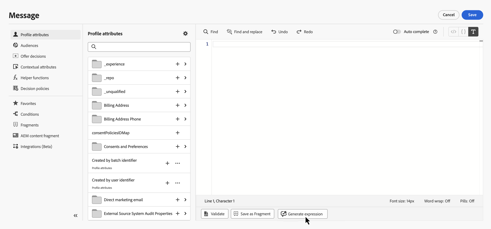
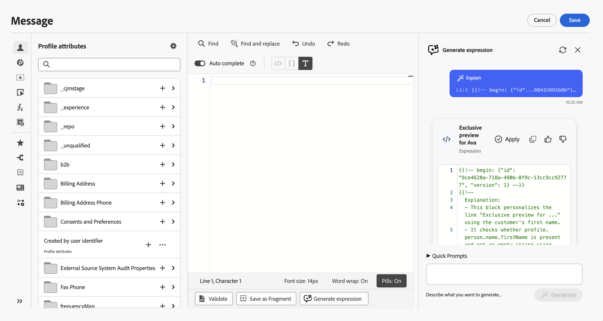
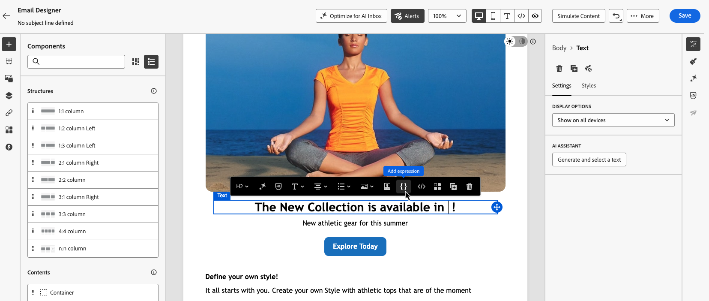

# Generare contenuti per le espressioni di personalizzazione{#generative-personalization-expressions}

>[!BEGINSHADEBOX]

**In questa pagina:** Scopri come utilizzare Genera contenuto in Adobe Journey Optimizer per generare, correggere e spiegare le espressioni di personalizzazione dal linguaggio naturale nell&#39;editor di Personalization e nel Designer di posta elettronica.

>[!ENDSHADEBOX]

>[!IMPORTANT]
>
>Prima di iniziare a utilizzare questa funzionalità, leggi l’articolo sui relativi [Guardrail e limitazioni](gs-generative.md#generative-guardrails).
> 
>
>È necessario accettare un [contratto utente](https://www.adobe.com/it/legal/licenses-terms/adobe-dx-gen-ai-user-guidelines.html) prima di poter utilizzare Genera contenuto in Journey Optimizer. Per ulteriori informazioni, contatta il tuo rappresentante Adobe.

## Panoramica {#where-available}

[!UICONTROL Genera contenuto] consente di generare nuove personalizzazioni dal linguaggio semplice, spiegare le funzioni delle espressioni esistenti e risolvere i problemi nel codice selezionato, in modo da dedicare meno tempo alla sintassi e all&#39;individuazione manuale dei campi. Puoi anche eseguire iterazioni su una selezione o chiedere altre modifiche nella conversazione. È disponibile in due modi:

* **[!UICONTROL Editor di Personalization]**: ovunque l&#39;editor sia disponibile tra canali diversi (oggetto, corpo e altri campi che lo aprono). Questo è il percorso generale per la personalizzazione basata sull’intelligenza artificiale. Per sapere dove e come aprire l&#39;editor, consulta [Aggiungi personalizzazione](../personalization/personalization-build-expressions.md#where).
* **Barra degli strumenti di E-mail Designer**: quando si creano e-mail in E-mail Designer, selezionare un componente e utilizzare **[!UICONTROL Aggiungi espressione]** nella barra degli strumenti contestuale per aprire il generatore di espressioni in una casella degli strumenti senza prima aprire l&#39;editor completo. Questo punto di ingresso non è disponibile all’esterno dell’authoring di e-mail. Vedi [Genera da e-mail Designer](#generate-email-designer).

Per informazioni più ampie sulla configurazione e le lingue di generazione dei contenuti, vedere [Introduzione a Generazione dei contenuti](gs-generative.md). Per i concetti di personalizzazione, consulta [Introduzione alla personalizzazione](../personalization/personalize.md). Per scrivere i prompt che producono espressioni utilizzabili, vedere [Scrivere i prompt effettivi per le espressioni di personalizzazione](#prompt-best-practices). Per idee di prompt per la generazione di contenuti (tono, stile, marchio), vedere [Generare best practice per prompt di contenuti](ai-assistant-prompting-guide.md).

A seconda del contesto della campagna o del percorso, [!UICONTROL Genera contenuto] può funzionare con i dati e costruisce l&#39;[!UICONTROL Editor Personalization] già esposto, ad esempio gli attributi del profilo, l&#39;appartenenza ai segmenti, le funzioni di assistenza e le origini di personalizzazione correlate.

>[!NOTE]
>
>[!UICONTROL Genera contenuto] mantiene il contesto dalle richieste solo mentre rimane aperto nella sessione. Chiudendo [!UICONTROL Genera contenuto] o l&#39;editor cancella la conversazione. Alla successiva apertura, si avvia una nuova conversazione.

## Generare espressioni di personalizzazione {#generate}

Questi passaggi descrivono come generare espressioni di personalizzazione da zero. Per utilizzare il codice già presente nell&#39;editor, vedere [Modifica, correzione o spiegazione del codice esistente](#edit-existing).

1. Nel messaggio o nel contenuto, apri **[!UICONTROL Personalization Editor]**.

1. Posiziona il cursore nell&#39;editor in cui desideri inserire il codice di personalizzazione generato, quindi fai clic sul pulsante **[!UICONTROL Genera contenuto]**.

   

1. Nel campo di testo, descrivere l&#39;espressione di personalizzazione desiderata in linguaggio semplice, ad esempio gli attributi di profilo, i segmenti o la logica necessari, quindi fare clic su **[!UICONTROL Genera]**.

   È inoltre possibile utilizzare i prompt pronti all&#39;uso della sezione **[!UICONTROL Prompt rapidi]**, ad esempio messaggi di saluto personalizzati, generazione di codice promozionale e altro ancora.

   

   >[!NOTE]
   >
   >Qualsiasi richiesta o domanda non correlata restituisce un errore fuori ambito. Regola il prompt e poni una domanda rilevante sulla personalizzazione necessaria.

1. Puoi continuare a discutere con [!UICONTROL Generare contenuto] in una conversazione a più riprese: mantiene il contesto dai prompt in modo da poter perfezionare la stessa espressione passo dopo passo. Per ricominciare, fai clic sul pulsante **[!UICONTROL Nuova sessione]**.

   

1. Utilizza il pulsante **[!UICONTROL Aggiungi spiegazione]** per aggiungere la documentazione in linea che illustra il funzionamento dell&#39;espressione.

   

1. Fai clic sul pulsante **[!UICONTROL Anteprima]** per vedere come l&#39;espressione valuta rispetto a un profilo di esempio e per visualizzare il payload associato come JSON.

   

   Questo controllo serve per controllare rapidamente il codice di personalizzazione nell’editor e non per visualizzare un’anteprima completa dei messaggi relativi al contenuto. Per la convalida completa dell’esperienza, utilizza il flusso di simulazione abituale. [Scopri come visualizzare in anteprima e verificare il contenuto](../content-management/preview-test.md)

   Se è necessario modificare l&#39;esempio (ad esempio, evidenziando attributi diversi), descrivere ciò che è necessario nella discussione con [!UICONTROL Genera contenuto] e includere la parola chiave **anteprima** nel prompt.

   >[!NOTE]
   >
   >Non aspettarti più righe di anteprima o scenari esaustivi qui. Il controllo è intenzionalmente limitato a **una** valutazione di esempio per un controllo del codice rapido, non a una copertura parziale in molti profili. La richiesta di un set di anteprime di dimensioni non realistiche potrebbe non riuscire.

1. Per implementare l&#39;output nell&#39;espressione di personalizzazione, fare clic su **[!UICONTROL Applica]**. L’output viene inserito nella posizione del cursore nell’editor di personalizzazione. Per sostituire il codice già presente, selezionalo prima nell&#39;editor, quindi usa **[!UICONTROL Modifica con Genera contenuto]** (vedi [Modifica, correggi o spiega il codice esistente](#edit-existing)).

   Puoi anche copiare l&#39;output e incollarlo dove necessario utilizzando l&#39;icona .

## Modifica, correggi o spiega il codice esistente {#edit-existing}

Puoi selezionare un’espressione di personalizzazione esistente e utilizzare Genera contenuto per risolvere i problemi di personalizzazione, spiegare cosa fa il codice o richiedere altre modifiche.

1. Seleziona il codice di personalizzazione esistente nell’editor.

1. Fai clic con il pulsante destro del mouse sulla selezione e scegli **[!UICONTROL Modifica con Genera contenuto]** in modo che [!UICONTROL Genera contenuto] utilizzi la selezione come contesto.

   

1. Apertura di **[!UICONTROL Generate Content]**. Seleziona il pulsante **[!UICONTROL Spiega]** o **[!UICONTROL Correggi]** oppure utilizza il campo di testo per richiedere altre modifiche e avviare una conversazione.

   

1. Quando selezioni **[!UICONTROL Correzione]**, fai clic su **[!UICONTROL Mostra dettagli correzione]** nella discussione per visualizzare una spiegazione della correzione e una riga per riga prima e dopo l&#39;anteprima.

   

1. Come quando generi un&#39;espressione di personalizzazione, fai clic su **[!UICONTROL Applica]** per implementare l&#39;output generato. Sostituisce il codice selezionato nell’editor di personalizzazione. Ad esempio, se hai richiesto una spiegazione del codice, applicando aggiungerai commenti nell’espressione che descrivono ciò che fa.

## Genera dalla barra degli strumenti di E-mail Designer {#generate-email-designer}

>[!NOTE]
>
>Questa sezione si applica solo quando si modifica il contenuto di **e-mail** nel Designer di posta elettronica. Per gli altri canali, utilizzare **[!UICONTROL Personalization Editor]**.

In E-mail Designer puoi utilizzare [!UICONTROL Generare contenuti per espressioni di personalizzazione] dalla barra degli strumenti contestuale senza prima aprire l&#39;[!UICONTROL Editor di Personalization] completo.

1. In E-mail Designer, seleziona il componente che desideri personalizzare e fai clic nel percorso in cui desideri inserire l’espressione.

1. Nella barra degli strumenti contestuale fare clic su **[!UICONTROL Aggiungi espressione]**.

   

1. Viene visualizzata una casella degli strumenti in cui è possibile richiedere Genera contenuto per la personalizzazione. Digita ciò che ti serve in linguaggio semplice e [!UICONTROL Genera contenuto] suggerisce campi di profilo e altri attributi che corrispondono al tuo prompt in modo da poter creare l&#39;espressione più velocemente.

1. [!UICONTROL Genera contenuto] genera l&#39;espressione.

   

   Puoi eseguire le seguenti azioni:

   * Convalida l&#39;output dell&#39;espressione con un valore di esempio. Utilizzare la scheda **[!UICONTROL Anteprima]**.
   * Genera un altro suggerimento dallo stesso prompt. Utilizzare **[!UICONTROL Rigenera]**.
   * Cancellare la discussione e ricominciare. Utilizzare **[!UICONTROL Reimposta]**.
   * Ridefinisci l&#39;espressione nell&#39;editor completo. Fai clic sull&#39;icona  per aprire **[!UICONTROL Personalization Editor]**.

1. Quando si è soddisfatti del risultato, fare clic su **[!UICONTROL Inserisci]** per aggiungere l&#39;espressione al contenuto.

## Scrivi prompt effettivi per le espressioni di personalizzazione {#prompt-best-practices}

I prompt per le espressioni di personalizzazione sono diversi dai prompt di generazione dei contenuti, che si basano su tono, stile e marchio. Poiché [!UICONTROL Genera contenuto] crea una logica modello che viene risolta in base ai dati contestuali e di profilo, il prompt deve descrivere con precisione tale logica. Inizia dall&#39;esperienza del cliente che desideri consegnare, quindi esprimilo in termini [!UICONTROL Genera contenuto] che può tradursi in un&#39;espressione.

Un prompt effettivo definisce generalmente quattro elementi:

* **Origine dati**: attributo di profilo, dati contestuali, segmento, offerta o altra risorsa da valutare. Includere il percorso esatto del campo quando lo si conosce, ad esempio `profile.person.name.firstName`.
* **Condizione**: la logica da applicare, ad esempio se un valore esiste o corrisponde a un criterio specifico.
* **Output**: cosa visualizzare quando viene soddisfatta la condizione, incluso qualsiasi formato richiesto.
* **Fallback**: cosa visualizzare quando mancano i dati o la condizione non viene soddisfatta.

Ad esempio, una richiesta per *accettare la data di rinnovo del cliente, aggiungere un anno, formattarlo come MM/gg/aa e non visualizzare nulla quando la data di rinnovo non è presente* fornisce un&#39;origine dati, una trasformazione, un formato di output e un fallback. Per tutto [!UICONTROL Generare contenuto] è necessario produrre un&#39;espressione utilizzabile.

### Consigli {#prompt-recommendations}

Per ottenere i risultati più rilevanti:

* Mantenere ogni prompt incentrato su una singola regola di personalizzazione anziché combinare più regole non correlate in una richiesta.
* Fai riferimento solo a campi, frammenti, offerte e set di dati esistenti nell’ambiente. [!UICONTROL Genera contenuto] funziona con ciò che l&#39;editor espone e non crea origini dati per te.
* Descrivi il comportamento di fallback per dati facoltativi o potenzialmente mancanti, in modo che l’espressione venga risolta correttamente per ogni profilo.
* Indica esplicitamente la struttura di output prevista quando è importante, ad esempio le chiavi che un payload dell’offerta deve restituire come JSON.
* Quando modifichi il codice esistente, fornisci solo l&#39;espressione rilevante come contesto invece di un intero messaggio e utilizza **[!UICONTROL Spiega]** per comprendere il codice prima di applicare una **[!UICONTROL Correzione]** o un&#39;altra modifica.

## Requisiti di dati e configurazione {#requirements}

[!UICONTROL Genera contenuto] genera espressioni dalle risorse già esposte da [!UICONTROL Personalization Editor], pertanto i dati sottostanti devono essere configurati e disponibili. Se un prompt non restituisce un’espressione utilizzabile, verifica che:

* il campo a cui si fa riferimento appartiene a uno schema attivo nel proprio ambiente,
* qualsiasi frammento che desideri riutilizzare viene pubblicato,
* qualsiasi set di dati utilizzato per una ricerca è abilitato per le ricerche e
* la richiesta si riferisce alla personalizzazione del modello piuttosto che a un’altra attività.

Quando la configurazione è corretta, perfeziona il prompt chiarendo l’origine dati, la condizione, l’output e il fallback, quindi genera di nuovo.
