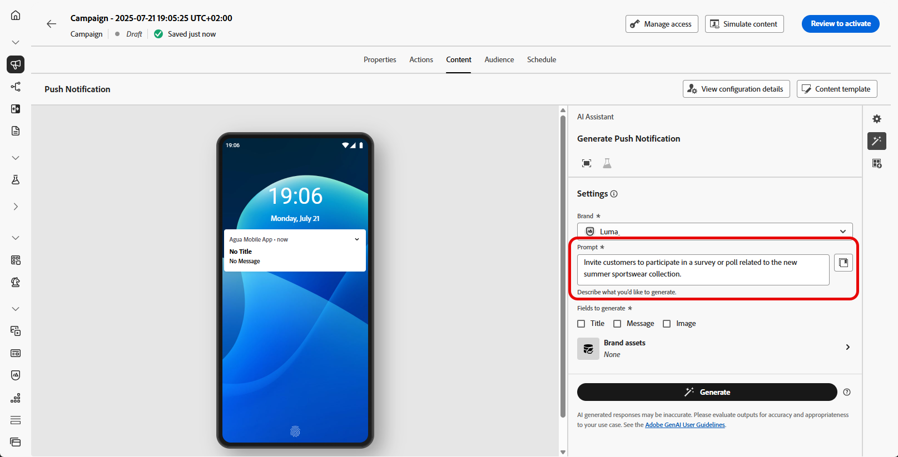
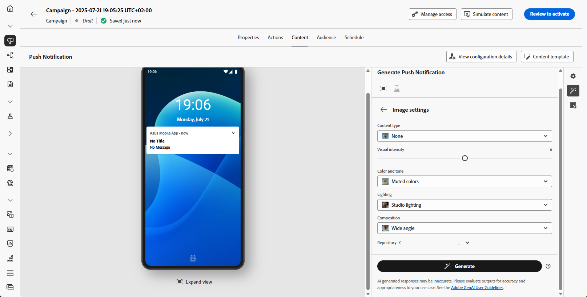
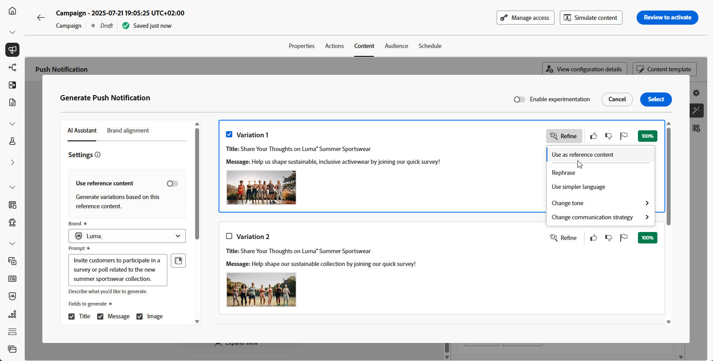

# Generazione push con Assistente IA {#generative-push}

>[!IMPORTANT]
>
>Prima di iniziare a utilizzare questa funzionalità, leggi l’articolo sui relativi [Guardrail e limitazioni](gs-generative.md#generative-guardrails).
> 
>
>Prima di poter utilizzare l&#39;Assistente di intelligenza artificiale in Journey Optimizer, devi accettare un [contratto utente](https://www.adobe.com/it/legal/licenses-terms/adobe-dx-gen-ai-user-guidelines.html). Per ulteriori informazioni, contatta il tuo rappresentante Adobe.

Dopo aver creato e personalizzato i messaggi, porta il contenuto delle notifiche push a un livello successivo con l’Assistente AI in Journey Optimizer.

Esplora le schede seguenti per scoprire come utilizzare l’Assistente IA in Journey Optimizer.

>[!BEGINTABS]

>[!TAB Generazione push completa]

In questo esempio particolare, scopri come inviare una notifica push coinvolgente utilizzando l’Assistente all’intelligenza artificiale in Journey Optimizer.

Segui questi passaggi:

1. Dopo aver creato e configurato la campagna di notifica push, fai clic su **[!UICONTROL Modifica contenuto]**.

   Per ulteriori informazioni su come configurare la campagna di notifica push, consulta [questa pagina](../push/create-push.md).

1. Compila i **[!UICONTROL Dettagli di base]** per la tua campagna. Al termine, fai clic su **[!UICONTROL Modifica contenuto]**.

1. Personalizza la notifica push in base alle esigenze. [Ulteriori informazioni](../push/design-push.md)

1. Accedere al menu **[!UICONTROL Mostra Assistente AI]**.

   {zoomable="yes"}

1. Abilita l&#39;opzione **[!UICONTROL Usa contenuto originale]** per l&#39;Assistente AI per personalizzare il nuovo contenuto in base al contenuto selezionato.

1. Seleziona il tuo **[!UICONTROL marchio]** per garantire che i contenuti generati dall&#39;intelligenza artificiale siano in linea con le specifiche del tuo marchio. [Ulteriori informazioni](brands.md) sui marchi.

   La funzione Marchi viene rilasciata come versione beta privata e sarà progressivamente disponibile per tutti i clienti nelle versioni future.

1. Ottimizzare il contenuto descrivendo cosa si desidera generare nel campo **[!UICONTROL Prompt]**.

   Se stai cercando assistenza per creare il prompt, accedi alla **[!UICONTROL Libreria prompt]** che fornisce una vasta gamma di idee per migliorare le campagne.

   {zoomable="yes"}

1. Scegli il campo da generare: **[!UICONTROL Titolo]**, **[!UICONTROL Messaggio]** e/o **[!UICONTROL Immagine]**.

1. Personalizza la richiesta con l&#39;opzione **[!UICONTROL Impostazioni testo]**:

   * **[!UICONTROL Strategia di comunicazione]**: scegli lo stile di comunicazione più adatto al testo generato.
   * **[!UICONTROL Lingue]**: scegli la lingua del contenuto generato.
   * **[!UICONTROL Tono]**: il tono delle notifiche push dovrebbe risuonare con il pubblico. Che tu voglia essere informativo, giocoso o persuasivo, AI Assistant può adattare il messaggio di conseguenza.

   {zoomable="yes"}

1. Scegli le **[!UICONTROL impostazioni immagine]**:

   * **[!UICONTROL Tipo di contenuto]**: categorizza la natura dell&#39;elemento visivo, distinguendo tra diverse forme di rappresentazione visiva come foto, immagini o immagini.
   * **[!UICONTROL Intensità visiva]**: è possibile controllare l&#39;impatto dell&#39;immagine regolandone l&#39;intensità. Un&#39;impostazione più bassa (2) creerà un aspetto più morbido e più contenuto, mentre un&#39;impostazione più alta (10) renderà l&#39;immagine più vibrante e visivamente potente.
   * **[!UICONTROL Colore e tono]**: l&#39;aspetto complessivo dei colori all&#39;interno di un&#39;immagine e l&#39;umore o l&#39;atmosfera che trasmette.
   * **[!UICONTROL Illuminazione]**: si riferisce al fulmine presente in un&#39;immagine, che ne forma l&#39;atmosfera ed evidenzia elementi specifici.
   * **[!UICONTROL Composizione]**: si riferisce alla disposizione degli elementi all&#39;interno della cornice di un&#39;immagine

   {zoomable="yes"}

1. Dal menu **[!UICONTROL Risorse per i marchi]**, fai clic su **[!UICONTROL Carica risorsa per i marchi]** per aggiungere qualsiasi risorsa per i marchi contenente contenuto che possa fornire un&#39;Assistente IA per l&#39;analisi del contesto aggiuntivo o selezionarne una caricata in precedenza.

   I file precedentemente caricati sono disponibili nel menu a discesa **[!UICONTROL Risorse del brand caricate]**. È sufficiente attivare o disattivare le risorse da includere nella generazione.

1. Una volta completato il prompt, fai clic su **[!UICONTROL Genera]**.

1. Sfoglia le **[!UICONTROL Varianti]** generate.

   Fai clic su **[!UICONTROL Anteprima]** per visualizzare una versione a schermo intero della variante selezionata oppure fai clic su **[!UICONTROL Applica]** per sostituire il contenuto corrente.

1. Fai clic sull&#39;icona percentuale per visualizzare il **[!UICONTROL punteggio di allineamento del brand]** e identificare eventuali disallineamenti con il brand.

   Ulteriori informazioni sul [Punteggio di allineamento del marchio](brands-score.md).

   {zoomable="yes"}

1. Passa all&#39;opzione **[!UICONTROL Perfeziona]** nella finestra **[!UICONTROL Anteprima]** per accedere ad altre funzioni di personalizzazione:

   * **[!UICONTROL Utilizza come contenuto di riferimento]**: la variante scelta fungerà da contenuto di riferimento per generare altri risultati.

   * **[!UICONTROL Riformula]**: l&#39;Assistente di intelligenza artificiale può riformulare il messaggio in diversi modi, mantenendo la scrittura fresca e coinvolgente per diversi tipi di pubblico.

   * **[!UICONTROL Usa un linguaggio più semplice]**: sfrutta l&#39;Assistente AI per semplificare la lingua, garantendo chiarezza e accessibilità a un pubblico più ampio.

   Puoi anche modificare il **[!UICONTROL Tono]** e la **[!UICONTROL Strategia di comunicazione]** del tuo testo.

   {zoomable="yes"}

1. Apri la scheda **[!UICONTROL Allineamento marchio]** per vedere come il contenuto si allinea alle [linee guida per il marchio](brands.md).

1. Una volta trovato il contenuto appropriato, fai clic su **[!UICONTROL Seleziona]**.

   Puoi anche abilitare l’esperimento per il contenuto. [Ulteriori informazioni](generative-experimentation.md)

1. Inserisci campi di personalizzazione per personalizzare il contenuto delle notifiche push in base ai dati dei profili. Quindi, fai clic sul pulsante **[!UICONTROL Simula contenuto]** per controllare il rendering e controlla le impostazioni di personalizzazione con i profili di test. [Ulteriori informazioni](../personalization/personalize.md)

Una volta definiti il contenuto, il pubblico e la pianificazione, sei pronto per preparare la tua campagna push. [Ulteriori informazioni](../campaigns/review-activate-campaign.md)

>[!TAB Generazione solo testo]

In questo esempio particolare, scopri come utilizzare l’Assistente IA in Journey Optimizer per contenuti specifici. Segui questi passaggi:

1. Dopo aver creato e configurato la campagna di notifica push, fai clic su **[!UICONTROL Modifica contenuto]**.

   Per ulteriori informazioni su come configurare la campagna push, consulta [questa pagina](../push/create-push.md).

1. Compila i **[!UICONTROL Dettagli di base]** per la tua campagna. Al termine, fai clic su **[!UICONTROL Modifica contenuto]**.

1. Personalizza la notifica push in base alle esigenze. [Ulteriori informazioni](../push/design-push.md)

1. Accedi al menu **[!UICONTROL Modifica testo con Assistente AI]** accanto ai tuoi campi **[!UICONTROL Titolo]** o **[!UICONTROL Messaggio]**.

   {zoomable="yes"}

1. Abilita l&#39;opzione **[!UICONTROL Usa contenuto di riferimento]** per l&#39;Assistente AI per personalizzare nuovi contenuti in base al contenuto selezionato.

1. Seleziona il tuo **[!UICONTROL marchio]** per garantire che i contenuti generati dall&#39;intelligenza artificiale siano in linea con le specifiche del tuo marchio. [Ulteriori informazioni](brands.md) sui marchi.

   La funzione Marchi viene rilasciata come versione beta privata e sarà progressivamente disponibile per tutti i clienti nelle versioni future.

1. Ottimizzare il contenuto descrivendo cosa si desidera generare nel campo **[!UICONTROL Prompt]**.

   Se stai cercando assistenza per creare il prompt, accedi alla **[!UICONTROL Libreria prompt]** che fornisce una vasta gamma di idee per migliorare le campagne.

   {zoomable="yes"}

1. Personalizza la richiesta con l&#39;opzione **[!UICONTROL Impostazioni testo]**:

   * **[!UICONTROL Strategia di comunicazione]**: scegli lo stile di comunicazione più adatto al testo generato.
   * **[!UICONTROL Lingue]**: scegli la lingua del contenuto generato.
   * **[!UICONTROL Tono]**: il tono della notifica push dovrebbe risuonare con il pubblico. Che tu voglia essere informativo, giocoso o persuasivo, AI Assistant può adattare il messaggio di conseguenza.
   * **[!UICONTROL Lunghezza]**: seleziona la lunghezza del contenuto utilizzando il cursore di intervallo.

   {zoomable="yes"}

1. Dal menu **[!UICONTROL Risorse per i marchi]**, fai clic su **[!UICONTROL Carica risorsa per i marchi]** per aggiungere qualsiasi risorsa per i marchi contenente contenuto che possa fornire un&#39;Assistente IA per l&#39;analisi del contesto aggiuntivo o selezionarne una caricata in precedenza.

   I file precedentemente caricati sono disponibili nel menu a discesa **[!UICONTROL Risorse del brand caricate]**. È sufficiente attivare o disattivare le risorse da includere nella generazione.

1. Una volta completato il prompt, fai clic su **[!UICONTROL Genera]**.

1. Sfoglia le **[!UICONTROL Varianti]** generate.

1. Fai clic sull&#39;icona percentuale per visualizzare il **[!UICONTROL punteggio di allineamento del brand]** e identificare eventuali disallineamenti con il brand.

   Ulteriori informazioni sul [Punteggio di allineamento del marchio](brands-score.md).

   {zoomable="yes"}

1. Passa all&#39;opzione **[!UICONTROL Perfeziona]** nella finestra **[!UICONTROL Anteprima]** per accedere ad altre funzioni di personalizzazione:

   * **[!UICONTROL Utilizza come contenuto di riferimento]**: la variante scelta fungerà da contenuto di riferimento per generare altri risultati.

   * **[!UICONTROL Elaborare]**: l&#39;Assistente AI può aiutarti a espandere argomenti specifici, fornendo ulteriori dettagli per una migliore comprensione e coinvolgimento.

   * **[!UICONTROL Riepiloga]**: le informazioni lunghe possono sovraccaricare i destinatari. Utilizza l’Assistente AI per condensare i punti chiave in riepiloghi chiari e concisi che catturano l’attenzione e li incoraggiano a leggere ulteriormente.

   * **[!UICONTROL Riformula]**:The L&#39;Assistente AI può riformulare il messaggio in diversi modi, mantenendo la scrittura fresca e coinvolgente per diversi tipi di pubblico.

   * **[!UICONTROL Usa un linguaggio più semplice]**: sfrutta l&#39;Assistente AI per semplificare la lingua, garantendo chiarezza e accessibilità a un pubblico più ampio.

   Puoi anche modificare il **[!UICONTROL Tono]** e la **[!UICONTROL Strategia di comunicazione]** del tuo testo.

   {zoomable="yes"}

1. Apri la scheda **[!UICONTROL Allineamento marchio]** per vedere come il contenuto si allinea alle [linee guida per il marchio](brands.md).

1. Una volta trovato il contenuto appropriato, fai clic su **[!UICONTROL Seleziona]**.

   Puoi anche abilitare l’esperimento per il contenuto. [Ulteriori informazioni](generative-experimentation.md)

1. Inserisci campi di personalizzazione per personalizzare il contenuto delle notifiche push in base ai dati dei profili. Quindi, fai clic sul pulsante **[!UICONTROL Simula contenuto]** per controllare il rendering e controlla le impostazioni di personalizzazione con i profili di test. [Ulteriori informazioni](../personalization/personalize.md)

Una volta definiti il contenuto, il pubblico e la pianificazione, sei pronto per preparare la tua campagna push. [Ulteriori informazioni](../campaigns/review-activate-campaign.md)

>[!TAB Generazione solo immagini]

1. Dopo aver creato e configurato la campagna di notifica push, fai clic su **[!UICONTROL Modifica contenuto]**.

   Per ulteriori informazioni su come configurare la campagna di notifica push, consulta [questa pagina](../push/create-push.md).

1. Compila i **[!UICONTROL Dettagli di base]** per la tua campagna. Al termine, fai clic su **[!UICONTROL Modifica contenuto]**.

1. Personalizza la notifica push in base alle esigenze. [Ulteriori informazioni](../push/design-push.md)

1. Accedi al menu **[!UICONTROL Aggiungi file multimediali]**.

   {zoomable="yes"}

1. Abilita l&#39;opzione **[!UICONTROL Stile riferimento]** affinché l&#39;Assistente AI personalizzi nuovi contenuti in base al contenuto di riferimento. Puoi anche caricare un’immagine per aggiungere contesto alla variante.

1. Seleziona il tuo **[!UICONTROL marchio]** per garantire che i contenuti generati dall&#39;intelligenza artificiale siano in linea con le specifiche del tuo marchio. [Ulteriori informazioni](brands.md) sui marchi.

   La funzione Marchi viene rilasciata come versione beta privata e sarà progressivamente disponibile per tutti i clienti nelle versioni future.

1. Ottimizzare il contenuto descrivendo cosa si desidera generare nel campo **[!UICONTROL Prompt]**.

   Se stai cercando assistenza per creare il prompt, accedi alla **[!UICONTROL Libreria prompt]** che fornisce una vasta gamma di idee per migliorare le campagne.

   {zoomable="yes"}

1. Scegli le **[!UICONTROL impostazioni immagine]**:

   * **[!UICONTROL Tipo di contenuto]**: categorizza la natura dell&#39;elemento visivo, distinguendo tra diverse forme di rappresentazione visiva come foto, immagini o immagini.
   * **[!UICONTROL Intensità visiva]**: è possibile controllare l&#39;impatto dell&#39;immagine regolandone l&#39;intensità. Un&#39;impostazione più bassa (2) creerà un aspetto più morbido e più contenuto, mentre un&#39;impostazione più alta (10) renderà l&#39;immagine più vibrante e visivamente potente.
   * **[!UICONTROL Colore e tono]**: l&#39;aspetto complessivo dei colori all&#39;interno di un&#39;immagine e l&#39;umore o l&#39;atmosfera che trasmette.
   * **[!UICONTROL Illuminazione]**: si riferisce al fulmine presente in un&#39;immagine, che ne forma l&#39;atmosfera ed evidenzia elementi specifici.
   * **[!UICONTROL Composizione]**: si riferisce alla disposizione degli elementi all&#39;interno della cornice di un&#39;immagine

1. Dal menu **[!UICONTROL Risorse per i marchi]**, fai clic su **[!UICONTROL Carica risorsa per i marchi]** per aggiungere qualsiasi risorsa per i marchi contenente contenuto che possa fornire un&#39;Assistente IA per l&#39;analisi del contesto aggiuntivo o selezionarne una caricata in precedenza.

   I file precedentemente caricati sono disponibili nel menu a discesa **[!UICONTROL Risorse del brand caricate]**. È sufficiente attivare o disattivare le risorse da includere nella generazione.

1. Una volta completato il prompt, fai clic su **[!UICONTROL Genera]**.

1. Sfoglia le **[!UICONTROL Varianti]** generate.

1. Fai clic sull&#39;icona percentuale per visualizzare il **[!UICONTROL punteggio di allineamento del brand]** e identificare eventuali disallineamenti con il brand.

   Ulteriori informazioni sul [Punteggio di allineamento del marchio](brands-score.md).

1. Passa all&#39;opzione **[!UICONTROL Perfeziona]** nella finestra **[!UICONTROL Anteprima]** per accedere ad altre funzioni di personalizzazione:

   * **[!UICONTROL Genera simili]** per visualizzare le immagini correlate a questa variante.
   * **[!UICONTROL Modifica in Adobe Express]** per personalizzare ulteriormente la risorsa.

[Ulteriori informazioni sull’integrazione di Adobe Express](../integrations/express.md)

   * **[!UICONTROL Salva]** per archiviare le risorse per un accesso successivo.

   {zoomable="yes"}

1. Apri la scheda **[!UICONTROL Allineamento marchio]** per vedere come il contenuto si allinea alle [linee guida per il marchio](brands.md).

1. Una volta trovato il contenuto appropriato, fai clic su **[!UICONTROL Seleziona]**.

   Puoi anche abilitare l’esperimento per il contenuto. [Ulteriori informazioni](generative-experimentation.md)

Una volta definiti il contenuto, il pubblico e la pianificazione, sei pronto per preparare la tua campagna push. [Ulteriori informazioni](../campaigns/review-activate-campaign.md)

>[!ENDTABS]
