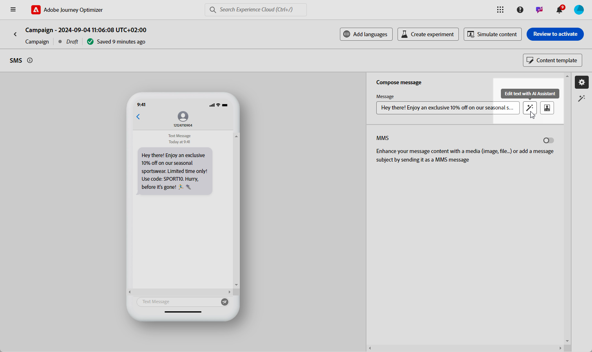

# Generazione di SMS con l’Assistente IA {#generative-sms}

>[!BEGINSHADEBOX]

**Sommario**

* [Introduzione all’assistente IA](gs-generative.md)
* [Generazione di e-mail con l’Assistente IA](generative-email.md)
* Generazione di SMS con l’Assistente IA
* [Generazione push con l’Assistente AI](generative-push.md)
* [Esperimento sui contenuti con l’Assistente AI](generative-experimentation.md)

>[!ENDSHADEBOX]

Dopo aver creato e personalizzato i messaggi SMS in base alle preferenze del pubblico, eleva la comunicazione con l’Assistente AI in Journey Optimizer.

Questa risorsa offre consigli dettagliati per ottimizzare i contenuti, aiutando la riproduzione dei messaggi e massimizzando il coinvolgimento.

Esplora le schede seguenti per scoprire come utilizzare l’Assistente IA in Journey Optimizer.

>[!NOTE]
>
>Prima di iniziare a utilizzare questa funzionalità, leggi l’articolo sui relativi [Guardrail e limitazioni](gs-generative.md#generative-guardrails).

>[!BEGINTABS]

>[!TAB Generazione SMS completa]

1. Dopo aver creato e configurato la campagna SMS, fai clic su **[!UICONTROL Modifica contenuto]**.

   Per ulteriori informazioni su come configurare la campagna SMS, consulta [questa pagina](../sms/create-sms.md).

1. Compila il **[!UICONTROL Dettagli di base]** per la tua campagna. Al termine, fai clic su **[!UICONTROL Modifica contenuto]**.

1. Personalizza il messaggio SMS in base alle esigenze. [Ulteriori informazioni](../sms/create-sms.md)

1. Accedere a **[!UICONTROL Mostra Assistente IA]** menu.

   {zoomable=&quot;yes&quot;}

1. Abilita **[!UICONTROL Usa contenuto originale]** Opzione per l’Assistente AI per personalizzare i nuovi contenuti in base al contenuto della campagna, al nome e al pubblico selezionato.

   La richiesta deve essere sempre associata a un contesto specifico.

1. Ottimizza il contenuto descrivendo cosa desideri generare nel **[!UICONTROL Prompt]** campo.

   Se stai cercando assistenza per creare il tuo prompt, accedi al **[!UICONTROL Libreria dei prompt]** che offre una vasta gamma di idee per migliorare le tue campagne.

   {zoomable=&quot;yes&quot;}

1. Seleziona **[!UICONTROL Carica risorsa marchio]** per aggiungere qualsiasi risorsa del brand contenente contenuti che possano fornire ulteriore contesto all’Assistente AI.

1. Personalizza il prompt con le diverse opzioni:

   * **[!UICONTROL Strategia di comunicazione]**: seleziona l’approccio di comunicazione desiderato per il testo generato.
   * **[!UICONTROL Lingua]**: scegli la lingua per il contenuto della variante.
   * **[!UICONTROL Tono]**: assicurati che il testo sia appropriato per il pubblico e lo scopo.
   * **[!UICONTROL Lunghezza]**: seleziona la lunghezza del contenuto utilizzando il cursore intervallo.

   {zoomable=&quot;yes&quot;}

1. Una volta completato il prompt, fai clic su **[!UICONTROL Genera]**.

1. Sfoglia il generato **[!UICONTROL Varianti]** e fai clic su **[!UICONTROL Anteprima]** per visualizzare una versione a schermo intero della variante selezionata.

1. Accedi a **[!UICONTROL Perfeziona]** all&#39;interno del **[!UICONTROL Anteprima]** finestra per accedere a funzioni di personalizzazione aggiuntive e perfezionare la variante in base alle preferenze:

   * **[!UICONTROL Utilizza come contenuto di riferimento]**: la variante scelta fungerà da contenuto di riferimento per la generazione di altri risultati.

   * **[!UICONTROL Riformula]**:L’Assistente AI può riformulare il messaggio in diversi modi, mantenendo la scrittura fresca e coinvolgente per diversi tipi di pubblico.

   * **[!UICONTROL Utilizza un linguaggio più semplice]**: sfrutta l’Assistente AI per semplificare la lingua, garantendo chiarezza e accessibilità a un pubblico più ampio.

   {zoomable=&quot;yes&quot;}

1. Una volta trovato il contenuto appropriato, fai clic su **[!UICONTROL Seleziona]**.

   Puoi anche abilitare l’esperimento per il contenuto. [Ulteriori informazioni](generative-experimentation.md)

1. Inserisci campi di personalizzazione per personalizzare il contenuto SMS in base ai dati dei profili. [Ulteriori informazioni sulla personalizzazione dei contenuti](../personalization/personalize.md)

1. Dopo aver definito il contenuto del messaggio, fai clic sul pulsante **[!UICONTROL Simula contenuto]** per controllare il rendering e verifica le impostazioni di personalizzazione con i profili di test. [Ulteriori informazioni](../personalization/personalize.md)

Una volta definiti il contenuto, il pubblico e la pianificazione, sei pronto per preparare la tua campagna SMS. [Ulteriori informazioni](../campaigns/review-activate-campaign.md)

>[!TAB Generazione testo]

1. Dopo aver creato e configurato la campagna SMS, fai clic su **[!UICONTROL Modifica contenuto]**.

   Per ulteriori informazioni su come configurare la campagna SMS, consulta [questa pagina](../sms/create-sms.md).

1. Compila il **[!UICONTROL Dettagli di base]** per la tua campagna. Al termine, fai clic su **[!UICONTROL Modifica contenuto]**.

1. Personalizza il messaggio SMS in base alle esigenze. [Ulteriori informazioni](../sms/create-sms.md)

1. Accedere a **[!UICONTROL Modificare il testo con l’Assistente AI]** menu accanto al **[!UICONTROL Messaggio]** campo.

   {zoomable=&quot;yes&quot;}

1. Abilita **[!UICONTROL Utilizza contenuto di riferimento]** Opzione per l’Assistente AI per personalizzare i nuovi contenuti in base al contenuto della campagna, al nome e al pubblico selezionato.

   La richiesta deve essere sempre associata a un contesto specifico.

1. Ottimizza il contenuto descrivendo cosa desideri generare nel **[!UICONTROL Prompt]** campo.

   Se stai cercando assistenza per creare il tuo prompt, accedi al **[!UICONTROL Libreria dei prompt]** che offre una vasta gamma di idee per migliorare le tue campagne.

   {zoomable=&quot;yes&quot;}

1. Seleziona **[!UICONTROL Carica risorsa marchio]** per aggiungere qualsiasi risorsa del brand contenente contenuti che possano fornire ulteriore contesto all’Assistente AI.

1. Personalizza il prompt con le diverse opzioni:

   * **[!UICONTROL Strategia di comunicazione]**: seleziona l’approccio di comunicazione desiderato per il testo generato.
   * **[!UICONTROL Lingua]**: scegli la lingua per il contenuto della variante.
   * **[!UICONTROL Tono]**: assicurati che il testo sia appropriato per il pubblico e lo scopo.
   * **[!UICONTROL Lunghezza]**: seleziona la lunghezza del contenuto utilizzando il cursore intervallo.

   {zoomable=&quot;yes&quot;}

1. Una volta completato il prompt, fai clic su **[!UICONTROL Genera]**.

1. Sfoglia il generato **[!UICONTROL Varianti]** e fai clic su **[!UICONTROL Anteprima]** per visualizzare una versione a schermo intero della variante selezionata.

1. Accedi a **[!UICONTROL Perfeziona]** all&#39;interno del **[!UICONTROL Anteprima]** finestra per accedere a funzioni di personalizzazione aggiuntive e perfezionare la variante in base alle preferenze:

   * **[!UICONTROL Utilizza come contenuto di riferimento]**: la variante scelta fungerà da contenuto di riferimento per la generazione di altri risultati.

   * **[!UICONTROL Riformula]**:L’Assistente AI può riformulare il messaggio in diversi modi, mantenendo la scrittura fresca e coinvolgente per diversi tipi di pubblico.

   * **[!UICONTROL Utilizza un linguaggio più semplice]**: sfrutta l’Assistente AI per semplificare la lingua, garantendo chiarezza e accessibilità a un pubblico più ampio.

   {zoomable=&quot;yes&quot;}

1. Una volta trovato il contenuto appropriato, fai clic su **[!UICONTROL Seleziona]**.

   Puoi anche abilitare l’esperimento per il contenuto. [Ulteriori informazioni](generative-experimentation.md)

1. Inserisci campi di personalizzazione per personalizzare il contenuto SMS in base ai dati dei profili. [Ulteriori informazioni sulla personalizzazione dei contenuti](../personalization/personalize.md)

1. Dopo aver definito il contenuto del messaggio, fai clic su **[!UICONTROL Simula contenuto]** per controllare il rendering e controllare le impostazioni di personalizzazione con i profili di test.

Una volta definiti il contenuto, il pubblico e la pianificazione, sei pronto per preparare la tua campagna SMS. [Ulteriori informazioni](../campaigns/review-activate-campaign.md)

>[!ENDTABS]
