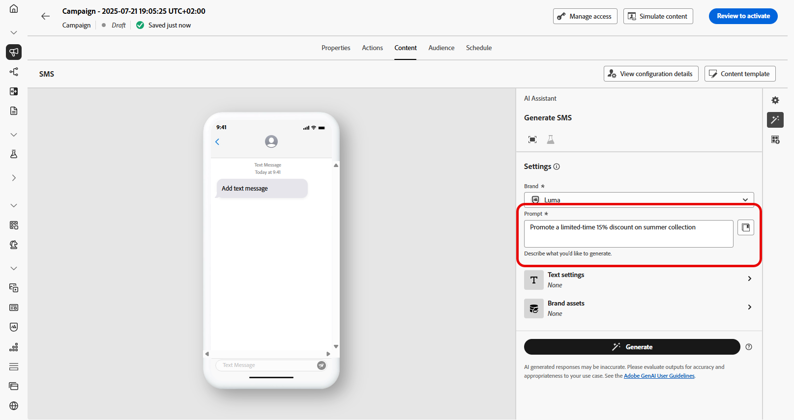

# Generazione di SMS con l’Assistente IA in Journey Optimizer {#generative-sms}

>[!IMPORTANT]
>
>Prima di iniziare a utilizzare questa funzionalità, leggi l’articolo sui relativi [Guardrail e limitazioni](gs-generative.md#generative-guardrails).
> 
>
>Prima di poter utilizzare l&#39;Assistente all&#39;intelligenza artificiale in Journey Optimizer, devi accettare un [contratto utente](https://www.adobe.com/legal/licenses-terms/adobe-dx-gen-ai-user-guidelines.html). Per ulteriori informazioni, contatta il tuo rappresentante Adobe.

Dopo aver creato e personalizzato i messaggi SMS in base alle preferenze del pubblico, eleva la comunicazione con l’Assistente AI in Journey Optimizer.

Questa risorsa offre consigli dettagliati per ottimizzare i contenuti, aiutando la riproduzione dei messaggi e massimizzando il coinvolgimento.

Esplora le schede seguenti per scoprire come utilizzare l’Assistente IA in Journey Optimizer.

>[!BEGINTABS]

>[!TAB Generazione SMS completa]

1. Dopo aver creato e configurato la tua campagna SMS, fai clic su **[!UICONTROL Modifica contenuto]**.

   Per ulteriori informazioni su come configurare la campagna SMS, consulta [questa pagina](../sms/create-sms.md).

1. Compila i **[!UICONTROL Dettagli di base]** per la tua campagna. Al termine, fai clic su **[!UICONTROL Modifica contenuto]**.

1. Personalizza il messaggio SMS in base alle esigenze. [Ulteriori informazioni](../sms/create-sms.md)

1. Accedere al menu **[!UICONTROL Mostra Assistente AI]**.

   {zoomable="yes"}

1. Ottimizzare il contenuto descrivendo cosa si desidera generare nel campo **[!UICONTROL Prompt]**.

   Se stai cercando assistenza per creare il prompt, accedi alla **[!UICONTROL Libreria prompt]** che fornisce una vasta gamma di idee per migliorare le campagne.

   {zoomable="yes"}

1. Personalizza la richiesta con l&#39;opzione **[!UICONTROL Impostazioni testo]**:

   * **[!UICONTROL Strategia di comunicazione]**: selezionare l&#39;approccio di comunicazione desiderato per il testo generato.
   * **[!UICONTROL Lingua]**: scegli la lingua per il contenuto della variante.
   * **[!UICONTROL Tono]**: verifica che il testo sia appropriato per il pubblico e lo scopo.
   * **[!UICONTROL Lunghezza]**: seleziona la lunghezza del contenuto utilizzando il cursore di intervallo.

   {zoomable="yes"}

1. Dal menu **[!UICONTROL Risorse per i marchi]**, fai clic su **[!UICONTROL Carica risorsa per i marchi]** per aggiungere eventuali risorse per i marchi contenenti contenuto che possa fornire ulteriore contesto all&#39;Assistente IA o selezionarne una caricata in precedenza.

   I file precedentemente caricati sono disponibili nel menu a discesa **[!UICONTROL Risorse del brand caricate]**. È sufficiente attivare o disattivare le risorse da includere nella generazione.

1. Una volta completato il prompt, fai clic su **[!UICONTROL Genera]**.

1. Sfoglia le **[!UICONTROL Varianti]** generate.

1. Passa all&#39;opzione **[!UICONTROL Perfeziona]** nella finestra **[!UICONTROL Anteprima]** per accedere ad altre funzioni di personalizzazione e perfezionare la variante in base alle tue preferenze:

   * **[!UICONTROL Utilizza come contenuto di riferimento]**: la variante scelta fungerà da contenuto di riferimento per generare altri risultati.

   * **[!UICONTROL Riformula]**: l&#39;Assistente AI può riformulare il messaggio in diversi modi, mantenendo la scrittura fresca e coinvolgente per diversi tipi di pubblico.

   * **[!UICONTROL Usa un linguaggio più semplice]**: sfrutta l&#39;Assistente AI per semplificare la lingua, garantendo chiarezza e accessibilità a un pubblico più ampio.

   Puoi anche modificare il **[!UICONTROL Tono]** e la **[!UICONTROL Strategia di comunicazione]** del tuo testo.

   {zoomable="yes"}

1. Una volta trovato il contenuto appropriato, fai clic su **[!UICONTROL Seleziona]**.

   Puoi anche abilitare l’esperimento per il contenuto. [Ulteriori informazioni](generative-experimentation.md)

1. Inserisci campi di personalizzazione per personalizzare il contenuto SMS in base ai dati dei profili. [Ulteriori informazioni sulla personalizzazione dei contenuti](../personalization/personalize.md)

1. Dopo aver definito il contenuto del messaggio, fai clic sul pulsante **[!UICONTROL Simula contenuto]** per controllare il rendering e verifica le impostazioni di personalizzazione con i profili di test. [Ulteriori informazioni](../personalization/personalize.md)

Una volta definiti il contenuto, il pubblico e la pianificazione, sei pronto per preparare la tua campagna SMS. [Ulteriori informazioni](../campaigns/review-activate-campaign.md)

>[!TAB Generazione solo testo]

1. Dopo aver creato e configurato la tua campagna SMS, fai clic su **[!UICONTROL Modifica contenuto]**.

   Per ulteriori informazioni su come configurare la campagna SMS, consulta [questa pagina](../sms/create-sms.md).

1. Compila i **[!UICONTROL Dettagli di base]** per la tua campagna. Al termine, fai clic su **[!UICONTROL Modifica contenuto]**.

1. Personalizza il messaggio SMS in base alle esigenze. [Ulteriori informazioni](../sms/create-sms.md)

1. Accedi al menu **[!UICONTROL Modifica testo con Assistente AI]** accanto al campo **[!UICONTROL Messaggio]**.

   {zoomable="yes"}

1. Abilita l&#39;opzione **[!UICONTROL Usa contenuto di riferimento]** per l&#39;Assistente AI per personalizzare nuovi contenuti in base al contenuto selezionato.

1. Ottimizzare il contenuto descrivendo cosa si desidera generare nel campo **[!UICONTROL Prompt]**.

   Se stai cercando assistenza per creare il prompt, accedi alla **[!UICONTROL Libreria prompt]** che fornisce una vasta gamma di idee per migliorare le campagne.

   {zoomable="yes"}

1. Personalizza la richiesta con l&#39;opzione **[!UICONTROL Impostazioni testo]**:

   * **[!UICONTROL Strategia di comunicazione]**: selezionare l&#39;approccio di comunicazione desiderato per il testo generato.
   * **[!UICONTROL Lingua]**: scegli la lingua per il contenuto della variante.
   * **[!UICONTROL Tono]**: verifica che il testo sia appropriato per il pubblico e lo scopo.
   * **[!UICONTROL Lunghezza]**: seleziona la lunghezza del contenuto utilizzando il cursore di intervallo.

   {zoomable="yes"}

1. Dal menu **[!UICONTROL Risorse per i marchi]**, fai clic su **[!UICONTROL Carica risorsa per i marchi]** per aggiungere eventuali risorse per i marchi contenenti contenuto che possa fornire ulteriore contesto all&#39;Assistente IA o selezionarne una caricata in precedenza.

   I file precedentemente caricati sono disponibili nel menu a discesa **[!UICONTROL Risorse del brand caricate]**. È sufficiente attivare o disattivare le risorse da includere nella generazione.

1. Una volta completato il prompt, fai clic su **[!UICONTROL Genera]**.

1. Sfoglia le **[!UICONTROL Varianti]** generate e fai clic su **[!UICONTROL Anteprima]** per visualizzare una versione a schermo intero della variante selezionata.

1. Passa all&#39;opzione **[!UICONTROL Perfeziona]** nella finestra **[!UICONTROL Anteprima]** per accedere ad altre funzioni di personalizzazione e perfezionare la variante in base alle tue preferenze:

   * **[!UICONTROL Utilizza come contenuto di riferimento]**: la variante scelta fungerà da contenuto di riferimento per generare altri risultati.

   * **[!UICONTROL Riformula]**: l&#39;Assistente AI può riformulare il messaggio in diversi modi, mantenendo la scrittura fresca e coinvolgente per diversi tipi di pubblico.

   * **[!UICONTROL Usa un linguaggio più semplice]**: sfrutta l&#39;Assistente AI per semplificare la lingua, garantendo chiarezza e accessibilità a un pubblico più ampio.

   {zoomable="yes"}

1. Una volta trovato il contenuto appropriato, fai clic su **[!UICONTROL Seleziona]**.

   Puoi anche abilitare l’esperimento per il contenuto. [Ulteriori informazioni](generative-experimentation.md)

1. Inserisci campi di personalizzazione per personalizzare il contenuto SMS in base ai dati dei profili. [Ulteriori informazioni sulla personalizzazione dei contenuti](../personalization/personalize.md)

1. Dopo aver definito il contenuto del messaggio, fai clic sul pulsante **[!UICONTROL Simula contenuto]** per controllare il rendering e controlla le impostazioni di personalizzazione con i profili di test.

Una volta definiti il contenuto, il pubblico e la pianificazione, sei pronto per preparare la tua campagna SMS. [Ulteriori informazioni](../campaigns/review-activate-campaign.md)

>[!ENDTABS]
