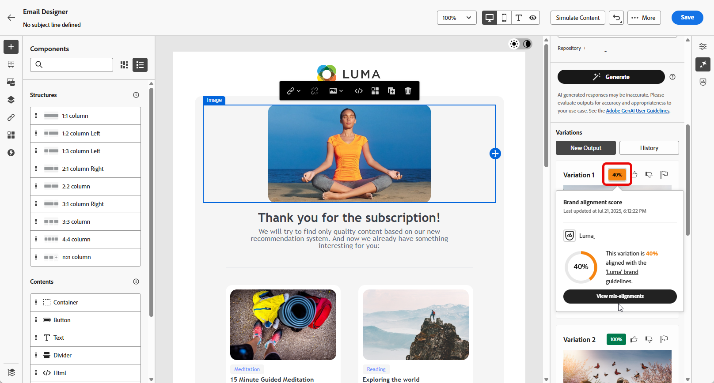

# Generazione di pagine web con l’Assistente AI {#generative-web}

>[!BEGINSHADEBOX]

**Sommario**

* [Introduzione all’assistente IA](gs-generative.md)
* [Generazione di e-mail con l’assistente IA](generative-email.md)
* [Generazione di SMS con l’assistente IA](generative-SMS.md)
* [Generazione di push con l’assistente IA](generative-push.md)
* Generazione di pagine web con l’Assistente AI
* [Esperimento contenuti con l’assistente IA](generative-experimentation.md)

>[!ENDSHADEBOX]

Dopo aver creato e personalizzato le e-mail, utilizza l’Assistente per l’intelligenza artificiale in Adobe Journey Optimizer basato sull’intelligenza artificiale generativa per portare il contenuto al livello successivo.

L’Assistente AI può aiutarti a ottimizzare l’impatto delle consegne suggerendo contenuti diversi che hanno maggiori probabilità di risuonare con il pubblico.

>[!NOTE]
>
>Prima di iniziare a utilizzare questa funzionalità, leggi l’articolo sui relativi [Guardrail e limitazioni](generative-gs.md#guardrails-and-limitations).

>[!BEGINTABS]

>[!TAB Generazione completa della pagina Web]

Nell’esempio seguente, sfrutteremo l’assistente AI per perfezionare un’e-mail esistente, personalizzandola per un evento speciale.

1. Dopo aver creato e configurato la consegna e-mail, fai clic su **[!UICONTROL Modifica contenuto]**.

   Per ulteriori informazioni su come configurare la consegna e-mail, consulta [questa pagina](../email/create-email-content.md).

1. Personalizza l&#39;e-mail in base alle esigenze e accedi al menu **[!UICONTROL Assistente AI]**.

   {zoomable="yes"}

1. Abilita l&#39;opzione **[!UICONTROL Usa contenuto originale]** affinché l&#39;Assistente AI personalizzi nuovi contenuti in base alla consegna, al nome della consegna e al pubblico selezionato.

   La richiesta deve essere sempre associata a un contesto specifico.

1. Ottimizzare il contenuto descrivendo cosa si desidera generare nel campo **[!UICONTROL Prompt]**.

   Se stai cercando assistenza per creare il prompt, accedi alla **[!UICONTROL Libreria prompt]** che fornisce una vasta gamma di idee per migliorare le consegne.

   {zoomable="yes"}

1. Puoi attivare/disattivare la **[!UICONTROL riga oggetto]** o **[!UICONTROL Preheader]** per includerli nella generazione della variante.

1. Fai clic su **[!UICONTROL Carica risorsa per il brand]** per aggiungere una risorsa per il brand contenente contenuto che possa fornire ulteriore contesto all&#39;Assistente all&#39;intelligenza artificiale o selezionarne una caricata in precedenza.

   {zoomable="yes"}

1. Personalizza il prompt con le diverse opzioni:

   * **[!UICONTROL Strategia di comunicazione]**: scegli lo stile di comunicazione più adatto al testo generato.
   * **[!UICONTROL Lingua]**: seleziona la lingua in cui desideri generare il contenuto.
   * **[!UICONTROL Tono]**: il tono dell&#39;e-mail dovrebbe risuonare con il pubblico. Che tu voglia essere informativo, giocoso o persuasivo, l’Assistente AI può adattare il messaggio di conseguenza.
   * **[!UICONTROL Lunghezza]**: scegli la lunghezza desiderata del contenuto utilizzando il cursore di intervallo.

   {zoomable="yes"}

1. Una volta completato il prompt, fai clic su **[!UICONTROL Genera]**.

1. Sfoglia le **[!UICONTROL Varianti]** generate e fai clic su **[!UICONTROL Anteprima]** per visualizzare una versione a schermo intero della variante selezionata.

1. Passa all&#39;opzione **[!UICONTROL Perfeziona]** nella finestra **[!UICONTROL Anteprima]** per accedere ad altre funzioni di personalizzazione:

   * **[!UICONTROL Riformula]**: l&#39;Assistente di intelligenza artificiale può riformulare il messaggio in diversi modi, mantenendo la scrittura fresca e coinvolgente per diversi tipi di pubblico.

   * **[!UICONTROL Usa linguaggio semplice]**: sfrutta l&#39;Assistente AI per semplificare la lingua, garantendo chiarezza e accessibilità a un pubblico più ampio.

   {zoomable="yes"}

1. Una volta trovato il contenuto appropriato, fai clic su **[!UICONTROL Seleziona]**.

1. Inserisci campi di personalizzazione per personalizzare il contenuto delle e-mail in base ai dati dei profili. Quindi, fai clic sul pulsante **[!UICONTROL Simula contenuto]** per controllare il rendering e controlla le impostazioni di personalizzazione con i profili di test. [Ulteriori informazioni](../preview-test/preview-content.md)

   {zoomable="yes"}

Una volta definiti il contenuto, il pubblico e la pianificazione, puoi preparare la consegna e-mail. [Ulteriori informazioni](../monitor/prepare-send.md)

>[!TAB Generazione testo pagina Web]

Nell’esempio seguente, sfrutteremo l’assistente AI per migliorare il contenuto del nostro invito e-mail per il nostro evento imminente.

1. Dopo aver creato e configurato la consegna e-mail, fai clic su **[!UICONTROL Modifica contenuto]**.

   Per ulteriori informazioni su come configurare la consegna e-mail, consulta [questa pagina](../email/create-email-content.md).

1. Seleziona un **[!UICONTROL componente testo]** per eseguire il targeting solo di un contenuto specifico. e accedere al menu **[!UICONTROL Assistente AI]**.

   {zoomable="yes"}

1. Abilita l&#39;opzione **[!UICONTROL Usa contenuto originale]** affinché l&#39;Assistente AI personalizzi nuovi contenuti in base alla consegna, al nome della consegna e al pubblico selezionato.

   La richiesta deve essere sempre associata a un contesto specifico.

1. Ottimizzare il contenuto descrivendo cosa si desidera generare nel campo **[!UICONTROL Prompt]**.

   Se stai cercando assistenza per creare il prompt, accedi alla **[!UICONTROL Libreria prompt]** che fornisce una vasta gamma di idee per migliorare le consegne.

   {zoomable="yes"}

1. Fai clic su **[!UICONTROL Carica risorsa marchio]** per aggiungere qualsiasi risorsa marchio contenente contenuto che possa fornire ulteriore contesto all&#39;Assistente IA per l&#39;intelligenza artificiale.

   {zoomable="yes"}

1. Personalizza il prompt con le diverse opzioni:

   * **[!UICONTROL Strategia di comunicazione]**: selezionare l&#39;approccio di comunicazione desiderato per il testo generato.
   * **[!UICONTROL Lingua]**: scegli la lingua per il contenuto della variante.
   * **[!UICONTROL Tono]**: verifica che il testo sia appropriato per il pubblico e lo scopo.
   * **[!UICONTROL Lunghezza]**: seleziona la lunghezza del contenuto utilizzando il cursore di intervallo.

   {zoomable="yes"}

1. Una volta completato il prompt, fai clic su **[!UICONTROL Genera]**.

1. Sfoglia le **[!UICONTROL Varianti]** generate e fai clic su **[!UICONTROL Anteprima]** per visualizzare una versione a schermo intero della variante selezionata.

1. Passa all&#39;opzione **[!UICONTROL Perfeziona]** nella finestra **[!UICONTROL Anteprima]** per accedere ad altre funzioni di personalizzazione:

   * **Utilizza come contenuto di riferimento**: la variante scelta fungerà da contenuto di riferimento per generare altri risultati.

   * **Elaborare**: l&#39;Assistente AI può aiutarti a espandere argomenti specifici, fornendo ulteriori dettagli per una migliore comprensione e coinvolgimento.

   * **Riepiloga**: informazioni lunghe possono sovraccaricare i destinatari delle e-mail. Utilizza l’Assistente per l’intelligenza artificiale per condensare i punti chiave in riepiloghi chiari e concisi che catturino l’attenzione e li incoraggino a leggere ulteriormente.

   * **Riformula**: l&#39;Assistente AI può riformulare il messaggio in diversi modi, mantenendo la scrittura fresca e coinvolgente per diversi tipi di pubblico.

   * **Usa linguaggio semplice**: sfrutta l&#39;Assistente AI per semplificare la lingua, garantendo chiarezza e accessibilità a un pubblico più ampio.

   {zoomable="yes"}

1. Una volta trovato il contenuto appropriato, fai clic su **[!UICONTROL Seleziona]**.

1. Inserisci campi di personalizzazione per personalizzare il contenuto delle e-mail in base ai dati dei profili. Quindi, fai clic sul pulsante **[!UICONTROL Simula contenuto]** per controllare il rendering e controlla le impostazioni di personalizzazione con i profili di test. [Ulteriori informazioni](../preview-test/preview-content.md)

   {zoomable="yes"}

Una volta definiti il contenuto, il pubblico e la pianificazione, puoi preparare la consegna e-mail. [Ulteriori informazioni](../monitor/prepare-send.md)

>[!TAB Generazione immagine pagina Web]

Nell’esempio seguente, scopri come sfruttare l’Assistente AI per ottimizzare e migliorare le risorse, garantendo un’esperienza più semplice da usare.

1. Dopo aver creato e configurato la consegna e-mail, fai clic su **[!UICONTROL Modifica contenuto]**.

   Per ulteriori informazioni su come configurare la consegna e-mail, consulta [questa pagina](../email/create-email-content.md).

1. Compila i **[!UICONTROL Dettagli di base]** per la consegna. Al termine, fai clic su **[!UICONTROL Modifica contenuto e-mail]**.

1. Seleziona la risorsa da modificare con l’Assistente AI.

1. Dal menu di destra, selezionare **[!UICONTROL Assistente AI]**.

   {zoomable="yes"}

1. Ottimizzare il contenuto descrivendo cosa si desidera generare nel campo **[!UICONTROL Prompt]**.

   Se stai cercando assistenza per creare il prompt, accedi alla **[!UICONTROL Libreria prompt]** che fornisce una vasta gamma di idee per migliorare le consegne.

   {zoomable="yes"}

1. Fai clic su **[!UICONTROL Carica risorsa marchio]** per aggiungere qualsiasi risorsa marchio contenente contenuto che possa fornire ulteriore contesto all&#39;Assistente IA per l&#39;intelligenza artificiale.

   La richiesta deve essere sempre associata a un contesto specifico.

1. Personalizza il prompt con le diverse opzioni:

   * **[!UICONTROL Proporzioni]**: determina la larghezza e l&#39;altezza della risorsa. È possibile scegliere tra rapporti comuni, ad esempio 16:9, 4:3, 3:2 o 1:1, oppure immettere una dimensione personalizzata.
   * **[!UICONTROL Colore e tono]**: l&#39;aspetto complessivo dei colori all&#39;interno di un&#39;immagine e l&#39;umore o l&#39;atmosfera che trasmette.
   * **[!UICONTROL Tipo di contenuto]**: categorizza la natura dell&#39;elemento visivo, distinguendo tra diverse forme di rappresentazione visiva come foto, immagini o immagini.
   * **[!UICONTROL Illuminazione]**: si riferisce al fulmine presente in un&#39;immagine, che ne forma l&#39;atmosfera ed evidenzia elementi specifici.
   * **[!UICONTROL Composizione]**: si riferisce alla disposizione degli elementi all&#39;interno della cornice di un&#39;immagine

   {zoomable="yes"}

1. Una volta completata la configurazione del prompt, fai clic su **[!UICONTROL Genera]**.

1. Sfoglia i **[!UICONTROL suggerimenti varianti]** per trovare la risorsa desiderata.

   Fai clic su **[!UICONTROL Anteprima]** per visualizzare una versione a schermo intero della variante selezionata.

   {zoomable="yes"}

1. Scegliere **[!UICONTROL Mostra simili]** se si desidera visualizzare le immagini correlate a questa variante.

1. Una volta trovato il contenuto appropriato, fai clic su **[!UICONTROL Seleziona]**.

   {zoomable="yes"}

1. Dopo aver definito il contenuto del messaggio, fai clic sul pulsante **[!UICONTROL Simula contenuto]** per controllare il rendering e verificare le impostazioni di personalizzazione con i profili di test.  [Ulteriori informazioni](../preview-test/preview-content.md)

   {zoomable="yes"}

1. Una volta definiti il contenuto, il pubblico e la pianificazione, puoi preparare la consegna e-mail. [Ulteriori informazioni](../monitor/prepare-send.md)

>[!ENDTABS]

