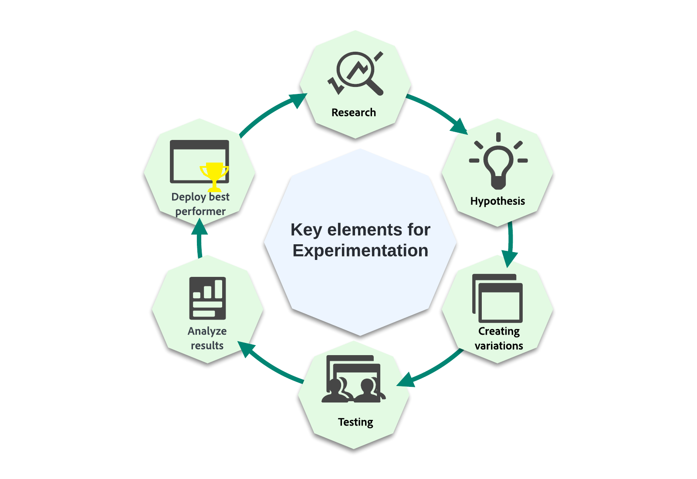
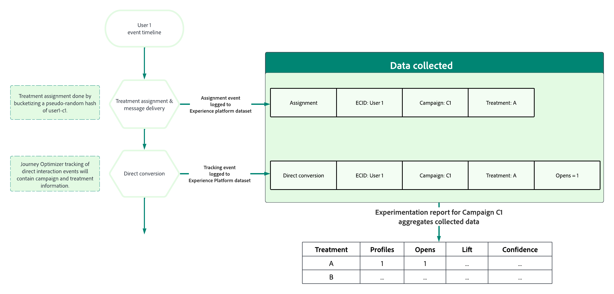
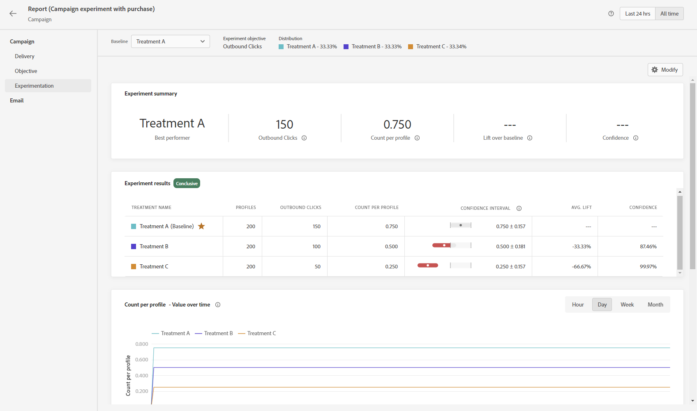

# Introduzione agli esperimenti sui contenuti {#get-started-experiment}

## Che cos’è un esperimento contenuti?

Gli esperimenti contenuti consentono di ottimizzare il contenuto per le azioni nelle campagne.

Gli esperimenti sono un set di test randomizzati, che nel contesto dei test online, significa che alcuni utenti selezionati in modo casuale sono esposti a una determinata variazione di un messaggio e un altro set selezionato in modo casuale di utenti a un altro trattamento. Dopo aver inviato il messaggio, puoi quindi misurare le metriche del risultato che ti interessano, ad esempio aperture di e-mail o clic.

➡️ In [questa sezione](../experience-decisioning/experience-decisioning-uc.md) è presentato un caso d’uso end-to-end che mostra come utilizzare gli esperimenti di contenuto per confrontare le decisioni con il canale di esperienza basata su codice.

## Perché eseguire gli esperimenti?

Gli esperimenti consentono di isolare le modifiche che portano a miglioramenti delle metriche. Come illustrato nell’immagine precedente: alcuni utenti selezionati in modo casuale sono esposti a ciascun gruppo di trattamento, il che significa che in media i gruppi condivideranno le stesse caratteristiche. Così, qualsiasi differenza di risultati può essere interpretata come dovuta alle differenze nei trattamenti ricevuti, cioè, si è in grado di stabilire un nesso causale tra i cambiamenti che hai fatto e i risultati a cui sei interessato.

Questo consente di prendere decisioni basate sui dati per ottimizzare gli obiettivi aziendali.

Per gli esperimenti sui contenuti in Adobe Journey Optimizer, puoi sottoporre a test idee come:

* **Oggetto**: quale potrebbe essere l’impatto di un cambiamento nel tono o nel grado di personalizzazione di un oggetto?
* **Contenuto del messaggio**: la modifica del layout visivo di un’e-mail comporterà un maggior numero di clic sull’e-mail?

## Come funziona l’esperimento contenuti? {#content-experiment-work}

### Assegnazione casuale

L’esperimento contenuti in Adobe Journey Optimizer utilizza un hash pseudo-casuale dell’identità del visitatore per eseguire l’assegnazione casuale degli utenti nel pubblico di destinazione a uno dei trattamenti definiti. Il meccanismo di hashing assicura che, negli scenari in cui il visitatore accede a una campagna più volte, riceva in modo deterministico lo stesso trattamento.

In dettaglio, l’algoritmo a 32 bit MumurHash3 viene utilizzato per eseguire l’hash della stringa di identità dell’utente in uno dei 10.000 bucket. In un esperimento contenuti con il 50% del traffico assegnato a ogni trattamento, gli utenti che cadono in bucket 1- 5.000 riceveranno il primo trattamento, mentre gli utenti nei bucket 5.001 - 10.000 riceveranno il secondo trattamento. Poiché viene utilizzato un hashing pseudo-casuale, le suddivisioni dei visitatori che si osservano potrebbero non essere esattamente 50-50; tuttavia, la suddivisione sarà statisticamente equivalente alla percentuale di suddivisione target.

Tieni presente che, come parte della configurazione di ogni campagna con esperimento contenuti, devi scegliere uno spazio dei nomi delle identità da cui selezionare l’ID utente per l’algoritmo di randomizzazione. Questo è indipendente dagli [indirizzi di esecuzione](../configuration/primary-email-addresses.md).

### Raccolta e analisi dei dati

Al momento dell’assegnazione, ovvero quando il messaggio viene inviato nei canali in uscita o quando l’utente accede alla campagna nei canali in entrata, viene registrato un “record di assegnazione” nel set di dati di sistema appropriato. In questo modo verrà registrato a quale trattamento è stato assegnato all’utente, insieme agli identificatori di esperimento e campagna.

Le metriche obiettivo possono essere raggruppate in due classi principali:

* metriche dirette, in cui l’utente reagisce direttamente al trattamento, ad esempio, aprendo un’e-mail o facendo clic su un collegamento.
* metriche indirette o “bottom of funnel” che si verificano dopo che l’utente è stato esposto al trattamento.

Per le metriche degli obiettivi diretti in cui Adobe Journey Optimizer tiene traccia dei messaggi, gli eventi di risposta degli utenti finali vengono automaticamente taggati con gli identificatori della campagna e del trattamento, consentendo l’associazione diretta della metrica di risposta con un trattamento. [Ulteriori informazioni sul tracciamento](../email/message-tracking.md).

Per gli obiettivi indiretti o “bottom of funnel”, come gli acquisti, gli eventi di risposta degli utenti finali non sono contrassegnati con gli identificatori della campagna e del trattamento, ovvero, un evento di acquisto si verifica dopo l’esposizione a un trattamento, non c’è associazione diretta di quell’acquisto con un’assegnazione di trattamento precedente. Per queste metriche, Adobe associa il trattamento all’evento di conversione bottom of funnel se:

* L’identità dell&#39;utente è la stessa al momento dell’evento di conversione e assegnazione.
* La conversione avviene entro sette giorni dall’assegnazione del trattamento.

Adobe Journey Optimizer utilizza quindi metodi statistici “sempre validi” avanzati per interpretare questi dati di reporting non elaborati, che consentono di interpretare i rapporti sulla sperimentazione. Per ulteriori informazioni, consulta [questa pagina](../content-management/experiment-calculations.md).

## Suggerimenti per l’esecuzione di esperimenti

Quando esegui gli esperimenti, è importante seguire alcune best practice. Di seguito sono riportati alcuni suggerimenti per l’esecuzione di questi esperimenti:

+++Isolare le variabili che stai tentando di testare

Formulare alcune ipotesi che si intende testare e limitare questa ipotesi al minor numero possibile di modifiche per determinare cosa ha avuto un impatto sulla consegna.

Ad esempio, una buona ipotesi può essere se la personalizzazione nell’oggetto dell’e-mail determina tassi di apertura migliori. Tuttavia, l’aggiunta di una modifica al contenuto del messaggio o nelle immagini può causare una conclusione confusa.
+++

+++Assicurati di utilizzare la metrica corretta

Determina la metrica di cui desideri eseguire il targeting e se le modifiche apportate possono avere un impatto diretto su questa metrica.

Ad esempio, è improbabile che la modifica del contenuto del corpo del messaggio influisca sui tassi di apertura delle e-mail.
+++

+++Esegui il test sulla giusta dimensione di pubblico o per un periodo di tempo sufficiente

Se esegui i test per più tempo, sarai in grado di rilevare differenze minori nella metrica di obiettivo tra i trattamenti. Tuttavia, se il valore della linea di base della metrica di obiettivo è piccolo, avrai bisogno di dimensioni di campione più grandi.
Il numero di utenti da includere nell’esperimento dipende dalle dimensioni dell’effetto che desideri rilevare, dalla varianza o dalla diffusione della metrica di obiettivo, nonché dalla tolleranza di errori falsi positivi e falsi negativi. In esperimenti classici, puoi utilizzare un [calcolatore delle dimensioni del campione](https://experienceleague.adobe.com/tools/calculator/testcalculator.html?lang=it){_blank} per determinare quanto tempo devi eseguire il test.
+++ 

+++Comprendere l’incertezza statistica

Se esegui un esperimento in cui 1000 utenti hanno visto un solo trattamento e il tasso di conversione è impostato sul 5%. Questo sarebbe il tasso di conversione reale se fossero inclusi tutti gli utenti? Quale sarebbe il vero tasso di conversione?
I metodi statistici ci danno un modo per formalizzare questa incertezza. Uno dei concetti più importanti da comprendere durante l’esecuzione di esperimenti online, è che i tassi di conversione osservati sono coerenti con un intervallo di tassi di conversione reali sottostanti, il che significa che devi attendere che tali stime siano abbastanza precise, prima di tentare di trarre una conclusione. Gli intervalli di affidabilità e l’affidabilità stessa ci aiutano a quantificare questa incertezza.
+++

+++Formulare nuove ipotesi e testare in modo continuo

Per ottenere informazioni aziendali reali, devi attenerti a un solo esperimento. Al contrario, segui gli esperimenti formulando nuove ipotesi ed eseguendo nuovi test con modifiche diverse su tipi di pubblico diversi ed esaminando l’impatto sulle diverse metriche.
+++

## Interpreta i risultati degli esperimenti {#interpret-results}

>[!CONTEXTUALHELP]
>id="ajo_campaigns_content_experiment_summary"
>title="Widget di riepilogo"
>abstract="Il widget di riepilogo fornisce una panoramica dei risultati dell’esperimento, specificando se sono conclusivi o meno. Offre un modo rapido e semplice per comprendere il risultato dell’esperimento."

Questa sezione descrive i rapporti degli esperimenti e come comprendere le varie quantità statistiche presentate.

Seguono alcune linee guida per interpretare i risultati dell’esperimento contenuti.

Si noti che una descrizione completa dei risultati dovrebbe considerare tutte le prove disponibili (ovvero, dimensioni dei campioni, tassi di conversione, intervalli di affidabilità, ecc.), e non solo la dichiarazione conclusiva o meno. Anche quando un risultato non è ancora conclusivo, ci possono essere prove convincenti che un trattamento sia diverso da un altro.

Per comprendere i calcoli statistici, fare riferimento a questa [pagina](../content-management/experiment-calculations.md).

### &#x200B;1. Confrontare le metriche normalizzate {#normalized-metrics}

Quando confronti le prestazioni di due trattamenti, confronta sempre le metriche normalizzate per tenere conto di eventuali differenze nel numero di profili esposti a ciascun trattamento.

Ad esempio, se l’obiettivo dell’esperimento è impostato su **[!UICONTROL Aperture univoche]** e un dato trattamento è stato mostrato a 10.000 profili con 200 aperture univoche registrate, questo rappresenta un **[!UICONTROL tasso di conversione]** del 2%. Per le metriche non univoche, ad esempio la metrica delle aperture, la metrica normalizzata viene visualizzata come **[!UICONTROL Conteggio per profilo]**, mentre per le metriche continue come Totale prezzo, la metrica normalizzata viene visualizzata come **[!UICONTROL Totale per profilo]**.

### &#x200B;2. Concentrarsi sugli intervalli di affidabilità {#confidence-intervals}

Quando esegui esperimenti su campioni dei profili, il tasso di conversione osservato per un dato trattamento rappresenta una stima del tasso di conversione reale sottostante.

Ad esempio, se il Trattamento A ha una **[!UICONTROL tasso di conversione]** del 3%, mentre il Trattamento B ha un **[!UICONTROL tasso di conversione]** del 2%, il Trattamento A è un più performante del Trattamento B? Per rispondere a questa domanda, dobbiamo innanzitutto quantificare l’incertezza dei tassi di conversione osservati.

Gli intervalli di affidabilità contribuiscono a quantificare l’ammontare di incertezza nei tassi di conversione stimati, ma intervalli di confidenza più ampi implicano maggiore incertezza. Man mano che vengono aggiunti più profili all’esperimento, gli intervalli diventeranno più piccoli, rappresentando una stima più precisa. L’intervallo di affidabilità rappresenta un intervallo di tassi di conversione compatibili con i dati osservati.

Se gli intervalli di affidabilità per due trattamenti si sovrappongono appena, ciò significa che i due trattamenti hanno tassi di conversione diversi. Ma, se c’è molta sovrapposizione tra gli intervalli di affidabilità per due trattamenti, allora è più probabile che i due trattamenti abbiano lo stesso tasso di conversione.

Adobe utilizza il 95% di Intervalli di affidabilità validi in ogni momento o Sequenze di affidabilità, il che significa che i risultati possono essere visualizzati in modo sicuro in qualsiasi momento durante l’esperimento.

### &#x200B;3. Comprendere l’incremento {#understand-lift}

Il riepilogo del rapporto Esperimento mostra l’**[!UICONTROL Incremento rispetto alla linea di base]**, che è una misura del miglioramento percentuale del tasso di conversione di un determinato trattamento rispetto alla linea di base. Più precisamente, rappresenta la differenza di prestazioni tra un determinato trattamento e la linea di base, divisa per le prestazioni della linea di base, espressa in percentuale.

### &#x200B;3. Comprendere l’affidabilità {#understand-confidence}

Mentre dovresti concentrarti principalmente sull’**[!UICONTROL Intervallo di affidabilità]** per le prestazioni di ciascun trattamento, Adobe mostra anche l’affidabilità, che è una misura probabilistica di quanta evidenza vi sia che un dato trattamento sia uguale al trattamento della linea di base. Una maggiore affidabilità indica meno prove dell’ipotesi che i trattamenti della linea di base e non abbiano prestazioni uguali. Più precisamente, l’affidabilità visualizzata rappresenta la probabilità (espressa in percentuale) di osservare una differenza minore nei tassi di conversione tra un dato trattamento e la linea di base, se in realtà non vi è alcuna differenza negli effettivi tassi di conversione sottostanti. In termini di valori p, l’affidabilità visualizzata è 1 - valore p.

In Adobe viene utilizzata l’affidabilità “valida in ogni momento” e i valori p “validi in ogni momento” coerenti con le sequenze di affidabilità descritte in precedenza.

### &#x200B;4. Rilevanza statistica

Durante l’esecuzione di Esperimenti, un risultato è considerato statisticamente significativo se era molto improbabile che fosse osservato data un’ipotesi nulla che un dato trattamento e la linea di base hanno lo stesso tasso di conversione/prestazioni sottostanti.

Adobe dichiara un esperimento conclusivo quando l’affidabilità è superiore al 95%.

## Cosa fare dopo aver eseguito un esperimento

Dopo aver eseguito l’esperimento, ci sono diverse azioni di follow-up possibili:

* **Distribuire idee vincenti**

  Con un risultato non ambiguo, puoi distribuire questa idea vincente, sia trasmettendo il trattamento più performante a tutti i clienti o creando nuove campagne in cui viene replicata la struttura del trattamento con le prestazioni migliori.
   Si noti che in un ambiente dinamico, ciò che funziona bene una volta, potrebbe non funzionare bene in un secondo momento.

* **Eseguire test di follow-up**

  A volte i risultati degli esperimenti possono essere inconcludenti, sia perché non vi erano abbastanza profili inclusi per rilevare eventuali differenze nei trattamenti sia perché i trattamenti definiti non erano sufficientemente diversi.

  Se l’ipotesi che stavi testando è ancora rilevante, eseguire un test di follow-up su un pubblico più ampio o diverso o modificare i trattamenti in modo che ci siano differenze più chiare potrebbe essere l’azione di follow-up migliore.

* **Eseguire analisi più approfondite**

  Il trattamento che funziona bene per un pubblico può a volte non essere il miglior trattamento per un altro pubblico. Effettuare analisi più approfondite sul modo in cui i trattamenti si comportano per tipi di pubblico diversi, aiuta a generare idee per nuovi test.

  Allo stesso modo, lo studio delle prestazioni di ogni trattamento con diverse metriche può anche dare una visione più completa degli esperimenti.

  >[!CAUTION]
  >
  >Ulteriori analisi indicano una maggiore probabilità di rilevare un effetto spurio o falso positivo.

## Risorse aggiuntive

* **[Crea esperimenti di contenuto](content-experiment.md)** - Scopri come progettare e configurare test A/B per ottimizzare le prestazioni dei messaggi.
* **[Calcoli dell&#39;esperimento](experiment-calculations.md)** - Comprendere i metodi e le metriche statistiche utilizzati nell&#39;analisi della sperimentazione.
* **[Test A/B e slot machine](mab-vs-ab.md)**: confronta diversi approcci di sperimentazione e quando utilizzare ogni metodo.
* **[Acceleratore esperimento](experiment-accelerator-gs.md)** - Scopri come accelerare la sperimentazione con l’ottimizzazione basata sull’intelligenza artificiale.
* **[Calcoli del rapporto esperimenti](experiment-report-calculations.md)** - Scopri come interpretare i risultati dell’esperimento e la rilevanza statistica.
* **[Tutorial sulla sperimentazione](https://experienceleague.adobe.com/it/docs/journey-optimizer-learn/tutorials/content-management/experimentation-overview){target="_blank"}**: esplora esercitazioni video dettagliate sulla sperimentazione dei contenuti e sulle best practice.
