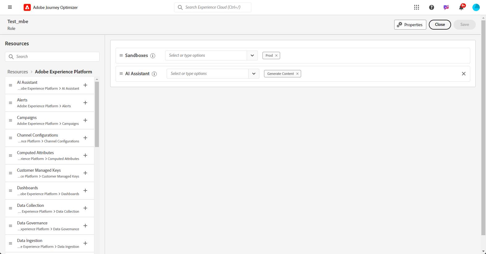

# Introduzione all’Assistente IA {#gs-content-assistant}

>[!CONTEXTUALHELP]
>id="ajo_ai_generation_settings"
>title="Assistente IA in Journey Optimizer"
>abstract="Dopo aver creato e personalizzato la consegna, puoi utilizzare l’Assistente IA in Journey Optimizer per ottimizzare il contenuto. Questa funzione semplifica il processo di personalizzazione e miglioramento dei contenuti consentendoti di perfezionarli descrivendo cosa desideri generare."

>[!CONTEXTUALHELP]
>id="ajo_ai_generation_context"
>title="Carica risorsa del brand"
>abstract="Il menu Carica risorsa del brand consente di aggiungere qualunque risorsa del brand contenente contenuti che possano fornire ulteriore contesto per l’Assistente IA in Journey Optimizer, oppure di selezionare una risorsa caricata in precedenza. Questa opzione garantisce che l’Assistente IA abbia accesso a tutti i materiali necessari, migliorando la propria funzionalità e rilevanza."

>[!CONTEXTUALHELP]
>id="ajo_ai_generation_start"
>title="Condizioni per l’IA generativa di Adobe"
>abstract="L’accesso a questa funzione è soggetto al consenso alle Linee guida per l’utente dell’IA generativa di Adobe Experience Cloud. Controlla l’accuratezza degli output generati da questa funzione e assicurati che siano appropriati al tuo caso d’uso."
>additional-url="https://www.adobe.com/it/legal/licenses-terms/adobe-dx-gen-ai-user-guidelines.html" text="Linee guida per l’utente sull’intelligenza artificiale generativa di Adobe"

>[!INFO]
>
>Immergiti in un’esperienza pratica con [la nostra anteprima della funzione live](https://experienceleague.adobe.com/it/apps/journey-optimizer/ai-assistant-content-accelerator){target="_blank"}, progettata per permetterti di esplorarla in prima persona e comprenderne appieno le funzionalità.

L’Assistente IA in Adobe Journey Optimizer, basato su Microsoft Azure OpenAI e Adobe Firefly, offre suggerimenti proattivi per creare varianti di contenuti per il testo e le immagini. Questa nuova funzionalità fornisce una **generazione di testo e immagini basata su prompt**. La generazione di immagini è gestita con Adobe Firefly.

L’Assistente IA supporta la generazione **in più lingue**, consentendoti di raggiungere e coinvolgere diversi tipi di pubblico globali. L’Assistente IA è disponibile nelle seguenti lingue:

<table style="table-layout:fixed; margin-top: 0px; margin-bottom: 0px;">
  <tbody>
    <tr style="border: 0;background-color: #FFFFFF;">
      <td>
        <ul>
          <li>Cinese (Hong Kong)</li>
          <li>Cinese (semplificato)</li>
          <li>Cinese (Taiwan)</li>
          <li>Olandese</li>
        </ul>
      </td>
      <td>
        <ul>
          <li>Francese</li>
          <li>Tedesco</li>
          <li>Italiano</li>
          <li>Giapponese</li>
        </ul>
      </td>
      <td>
        <ul>
          <li>Norvegese</li>
          <li>Portoghese</li>
          <li>Spagnolo</li>
          <li>Svedese</li>
        </ul>
      </td>
    </tr>
  </tbody>
</table>

Utilizza l’Assistente IA in Adobe Journey Optimizer per ottimizzare l’impatto del messaggio sperimentando con diversi titoli e immagini. Genera più varianti e crea un esperimento per confrontarle. Sfruttando l’**esperimento sui contenuti di Journey Optimizer**, puoi definire più trattamenti per i messaggi al fine di misurare quale funziona meglio per il tuo pubblico target. Puoi scegliere di variare il contenuto della consegna o l’oggetto. Il pubblico del messaggio viene allocato in modo casuale a ciascun trattamento per determinare quale funziona meglio nei termini della metrica specificata. Per ulteriori informazioni sull’esperimento contenuti, consulta [questa sezione](../content-management/content-experiment.md).

>[!IMPORTANT]
>
>* Prima di iniziare a utilizzare questa funzionalità, leggi l’articolo su [guardrail e limitazioni](#generative-guardrails) correlati.
>
>
>* Prima di poter utilizzare l’Assistente IA in Adobe Journey Optimizer, devi accettare un [accordo utente](https://www.adobe.com/it/legal/licenses-terms/adobe-dx-gen-ai-user-guidelines.html){target="_blank"}. Per ulteriori informazioni, contatta il tuo rappresentante Adobe.

## Accedere all’Assistente IA {#generative-access}

Per accedere alla funzione dell’Assistente IA in Adobe Journey Optimizer, agli utenti deve essere concessa l’autorizzazione **Genera contenuto**. [Ulteriori informazioni](../administration/permissions.md)

+++  Scopri come assegnare le autorizzazioni relative alla generazione di contenuti

1. Nel prodotto **Autorizzazioni**, passa alla scheda **Ruoli** e seleziona il **Ruolo** desiderato.

1. Fai clic su **Modifica** per modificare le autorizzazioni.

1. Aggiungi la risorsa **Assistente IA**, quindi seleziona **Genera contenuto** dal menu a discesa.

   {zoomable="yes"}

1. Fai clic su **Salva** per applicare le modifiche.

   Le autorizzazioni degli utenti già assegnati a questo ruolo verranno aggiornate automaticamente.

1. Per assegnare questo ruolo a nuovi utenti, passa alla scheda **Utenti** nella dashboard **Ruoli** e fai clic su **Aggiungi utente**.

1. Immetti il nome o l’indirizzo e-mail dell’utente o sceglilo dall’elenco e fai clic su **Salva**.

1. Se l’utente non è già stato creato in precedenza, consulta [questa documentazione](https://experienceleague.adobe.com/it/docs/experience-platform/access-control/abac/permissions-ui/users).

L’utente riceverà un’e-mail con istruzioni per accedere all’istanza.

+++

## Guardrail e limitazioni {#generative-guardrails}

Di seguito sono elencate alcune linee guida generali su come utilizzare l’Assistente IA in Journey Optimizer per la generazione di e-mail:

### Canali supportati

* Disponibile solo per i canali e-mail, push, web e SMS.

### Qualità dei contenuti, prompt e feedback

* La qualità del contenuto generato è fortemente influenzata dall’obiettivo/prompt di marketing che definisci. Utilizza un prompt ben definito per interpretare con precisione il modello GenAI. 
* I contenuti GenAI potrebbero non essere sempre accurati: condividi il tuo feedback per permettere ai nostri tecnici di perfezionare i modelli.
* Assicurati di segnalare eventuali risultati problematici utilizzando le icone con il pollice su, il pollice giù o un flag durante la selezione delle varianti.

### Risorse per brand

* Carica la risorsa del brand in modo che sia accurata per il relativo contenuto. Altrimenti, il contenuto si basa su informazioni disponibili pubblicamente. Il contenuto caricato può essere nei seguenti formati: file PDF, JPEG, PNG o ZIP (con formati di file supportati).
* La dimensione massima per risorsa del marchio caricata è 50 MB. È possibile utilizzare anche file di dimensioni maggiori o numerose immagini, ma questo comporterà tempi di elaborazione più lunghi.
* Puoi caricare più risorse del brand, ma puoi sfruttarne una sola per una generazione specifica.

### Immagini e modelli di e-mail

* Utilizza un modello personalizzato o specifico di un brand per creare il contenuto delle e-mail utilizzando l’Assistente IA in Adobe Journey Optimizer. Si consiglia di utilizzare un modello e-mail con un massimo di 8-10 immagini.

### Uso legale e trasparenza

* L’utilizzo dell’Assistente IA è soggetto alle linee guida per l’utente sull’intelligenza artificiale generativa di Adobe Experience Cloud. [Ulteriori informazioni](https://www.adobe.com/it/legal/licenses-terms/adobe-dx-gen-ai-user-guidelines.html)
* Nell’ambito dell’impegno di Adobe per la promozione della trasparenza nell’utilizzo di strumenti di intelligenza artificiale generativa durante la creazione di contenuti multimediali, Adobe applicherà Content Credential ogni volta che verranno scaricati o esportati contenuti o progetti in cui è inclusa una risorsa generata dal Firefly. [Ulteriori informazioni](https://helpx.adobe.com/it/firefly/using/content-credentials.html)

### Assistente IA per le espressioni di personalizzazione {#ai-assistant-personalization-editor-guardrails}

I seguenti guardrail si applicano all’[Assistente IA per le espressioni di personalizzazione](generative-personalization-expressions.md) nell’[!UICONTROL editor di personalizzazione] e in E-mail designer.

* **Offerta e Decisioni per le esperienze**: non supportati.
* **Preferiti**: non supportati.
* **Condizioni salvate**: non supportate.
* **Frammenti di contenuto di Adobe Experience Manager**: non supportati.

## Funzionalità per la generazione di contenuti dell’Assistente IA {#generative-features}

<table style="table-layout:fixed"><tr style="border: 0;">
<td>

<a href="generative-full-content.md"><strong>Generare contenuti completi</strong></a>

</td>
<td>

<a href="generative-text.md"><strong>Generare testo</strong>

</td>
<td>

<a href="generative-image.md"><strong>Generare immagini</strong></a>

</td>
</tr></table>

## Risorse aggiuntive

* **[Casi d’uso dell’Assistente IA](generative-uc.md)**: scopri come utilizzare l’Assistente AI tramite i casi d’uso
* **[Tutorial sull’Assistente IA](https://experienceleague.adobe.com/it/docs/journey-optimizer-learn/tutorials/introduction-to-journey-optimizer/ai-assistant){target="_blank"}**: esplora i tutorial video dettagliati sulle funzioni e sulle best practice dell’Assistente IA.
