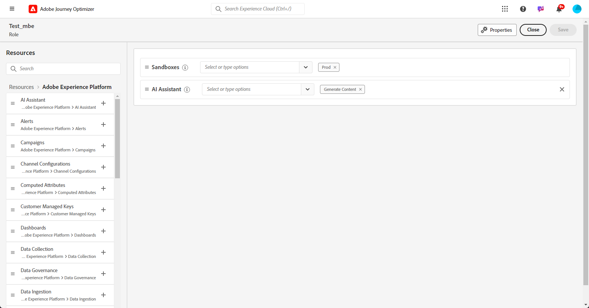

# Introduzione all’assistente IA {#gs-content-assistant}

>[!CONTEXTUALHELP]
>id="ajo_ai_generation_settings"
>title="Assistente AI in Journey Optimizer"
>abstract="Dopo aver creato e personalizzato la consegna, puoi utilizzare l’Assistente per l’intelligenza artificiale in Journey Optimizer per migliorare i contenuti. Questa funzione semplifica il processo di personalizzazione e miglioramento dei contenuti consentendoti di perfezionarli descrivendo cosa desideri generare."

>[!CONTEXTUALHELP]
>id="ajo_ai_generation_context"
>title="Carica risorsa del brand"
>abstract="Il menu Carica risorse marchio consente di aggiungere qualsiasi risorsa marchio contenente contenuti che possano fornire ulteriore contesto per l’Assistente IA in Journey Optimizer o di selezionare una risorsa caricata in precedenza. Grazie a questa opzione, Assistente IA può accedere a tutto il materiale necessario per migliorarne la funzionalità e la rilevanza."

>[!CONTEXTUALHELP]
>id="ajo_ai_generation_start"
>title="Termini sull’intelligenza artificiale generativa di Adobe"
>abstract="L’accesso a questa funzione è soggetto al consenso delle linee guida per l’utente sull’intelligenza artificiale generativa di Adobe Experience Cloud. Controlla l’accuratezza degli output generati da questa funzione e assicurati che siano appropriati al tuo caso d’uso."
>additional-url="https://www.adobe.com/legal/licenses-terms/adobe-dx-gen-ai-user-guidelines.html" text="Linee guida per l’utente sull’intelligenza artificiale generativa di Adobe"

>[!INFO]
>
>Immergiti in un’esperienza pratica con [la nostra anteprima della funzione live](https://experienceleague.adobe.com/it/apps/journey-optimizer/ai-assistant-content-accelerator){target="_blank"}, progettata per permetterti di esplorarla in prima persona e comprenderne appieno le funzionalità.

L&#39;Assistente IA in Adobe Journey Optimizer, con tecnologia Microsoft Azure OpenAI e Adobe Firefly, offre suggerimenti proattivi per la variazione dei contenuti per testo e immagini. È disponibile per i canali e-mail, push e SMS. Questa nuova funzionalità fornisce una generazione di testo e immagini basata su prompt. La generazione di immagini è gestita con Adobe Firefly.

Utilizza l’Assistente AI in Adobe Journey Optimizer per ottimizzare l’impatto del messaggio sperimentando diversi titoli e immagini principali. Genera più varianti e crea un esperimento per confrontarle. Sfruttando l’esperimento con contenuti di Journey Optimizer, puoi definire più trattamenti per i messaggi al fine di misurare quale funziona meglio per il tuo pubblico di destinazione. Puoi scegliere di variare il contenuto della consegna o l’oggetto. Il pubblico del messaggio viene allocato in modo casuale a ciascun trattamento per determinare quale funziona meglio nei termini della metrica specificata. Per ulteriori informazioni sull’esperimento contenuti, consulta [questa sezione](../content-management/content-experiment.md).

>[!IMPORTANT]
>
>* Prima di iniziare a utilizzare questa funzionalità, leggi l’articolo sui relativi [Guardrail e limitazioni](#generative-guardrails).
>
>
>* Prima di poter utilizzare l&#39;Assistente all&#39;intelligenza artificiale in Adobe Journey Optimizer, devi accettare un [contratto utente](https://www.adobe.com/legal/licenses-terms/adobe-dx-gen-ai-user-guidelines.html){target="_blank"}. Per ulteriori informazioni, contatta il tuo rappresentante Adobe.

## Accedere all’Assistente AI {#generative-access}

Per accedere all&#39;Assistente AI in Adobe Journey Optimizer, è necessario concedere agli utenti l&#39;autorizzazione **Genera contenuto**. [Ulteriori informazioni](../administration/permissions.md)

+++  Scopri come assegnare le autorizzazioni relative alla generazione di contenuti

1. Nel prodotto **Autorizzazioni**, passa alla scheda **Ruoli** e seleziona il **Ruolo** desiderato.

1. Fai clic su **Modifica** per modificare le autorizzazioni.

1. Aggiungi la risorsa **Assistente IA**, quindi seleziona **Genera contenuto** dal menu a discesa.

   {zoomable="yes"}

1. Fai clic su **Salva** per applicare le modifiche.

   Le autorizzazioni degli utenti già assegnati a questo ruolo verranno aggiornate automaticamente.

1. Per assegnare questo ruolo a nuovi utenti, passa alla scheda **Utenti** nella dashboard **Ruoli** e fai clic su **Aggiungi utente**.

1. Immetti il nome o l’indirizzo e-mail dell’utente o sceglilo dall’elenco e fai clic su **Salva**.

1. Se l’utente non è già stato creato in precedenza, consulta [questa documentazione](https://experienceleague.adobe.com/it/docs/experience-platform/access-control/abac/permissions-ui/users).

L’utente riceverà un’e-mail con istruzioni per accedere all’istanza.

+++

## Guardrail e limitazioni {#generative-guardrails}

Di seguito sono elencate le linee guida generali per l’utilizzo dell’Assistente IA in Adobe Journey Optimizer per la generazione di e-mail:

* La qualità del contenuto generato è fortemente influenzata dall’obiettivo/prompt di marketing che definisci. Utilizza un prompt ben definito per interpretare con precisione il modello GenAI. 
* Carica la risorsa del brand in modo che sia accurata per il relativo contenuto. Altrimenti, il contenuto si basa su informazioni disponibili pubblicamente. Il contenuto caricato può essere nei seguenti formati: file PDF, JPEG, PNG o ZIP (con formati di file supportati).
* La dimensione massima per risorsa del marchio caricata è 50 MB.È possibile utilizzare anche file di dimensioni maggiori o numerose immagini, ma questo comporterà tempi di elaborazione più lunghi.
* Utilizza un modello personalizzato o specifico per il brand per creare il contenuto delle e-mail utilizzando l’Assistente per l’intelligenza artificiale in Adobe Journey Optimizer. Si consiglia di utilizzare un modello e-mail con un massimo di 8-10 immagini.
* Assicurati di segnalare eventuali output problematici utilizzando le icone con il pollice su, il pollice giù o un flag durante la selezione delle varianti.
* L’utilizzo dell’assistente IA è soggetto alle linee guida per l’utente sull’intelligenza artificiale generativa di Adobe Experience Cloud. [Ulteriori informazioni](https://www.adobe.com/legal/licenses-terms/adobe-dx-gen-ai-user-guidelines.html)
* Nell’ambito dell’impegno di Adobe per la promozione della trasparenza nell’utilizzo di strumenti di intelligenza artificiale generativa durante la creazione di contenuti multimediali, Adobe applicherà Content Credential ogni volta che verranno scaricati o esportati contenuti o progetti in cui è inclusa una risorsa generata dal Firefly. [Ulteriori informazioni](https://helpx.adobe.com/it/firefly/using/content-credentials.html)

Le seguenti limitazioni si applicano all’Assistente IA in Adobe Journey Optimizer:

* È supportata solo la lingua inglese. Gli input non inglesi possono produrre risultati incoerenti o errati. Al momento, le questioni derivanti da risposte non in lingua inglese non saranno affrontate o migliorate.
* Disponibile solo per i canali e-mail, push, web e SMS.
* Il contenuto GenAI potrebbe non risultare sempre accurato: condividi il tuo feedback in modo che i nostri tecnici possano perfezionare i modelli.
* Puoi caricare più risorse del marchio, ma puoi sfruttarne una sola per una generazione specifica.

## Funzionalità per la generazione di contenuti dell’Assistente IA {#generative-features}

<table style="table-layout:fixed"><tr style="border: 0;">
<td>

<a href="generative-email.md"><strong>Generazione di e-mail</strong></a>

</td>
<td>

<a href="generative-sms.md"><strong>Generazione di SMS</strong>

</td>
<td>

<a href="generative-push.md"><strong>Generazione di notifiche push</strong></a>

</td>
<td>

<a href="generative-web.md"><strong>Generazione di pagine web</strong>

</td>
</tr></table>
