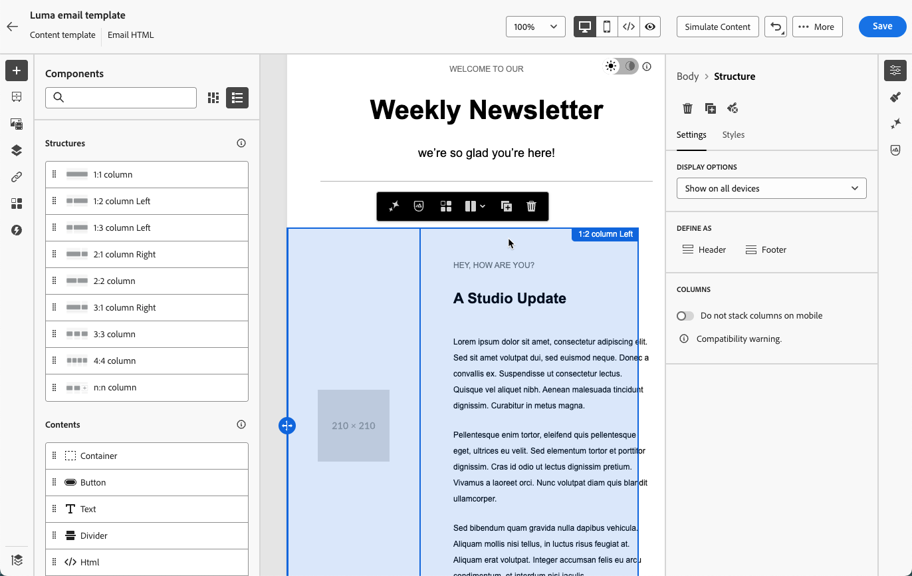

# Conversione di immagini in modelli di contenuto e-mail {#image-to-html}

>[!AVAILABILITY]
>
>Questa funzionalità è in disponibilità limitata. Per ottenere l’accesso, contatta il rappresentante Adobe.

[!DNL Journey Optimizer] consente di velocizzare notevolmente la creazione di e-mail convertendo le progettazioni di immagini statiche in modelli di contenuto e-mail modulari completamente personalizzabili.

>[!NOTE]
>
>Questa funzione è disponibile solo per il canale e-mail.

Sfruttando la tecnologia di intelligenza artificiale generativa, uno strumento integrato analizza il layout, la composizione tipografica, i colori e gli elementi visivi dell&#39;immagine e genera contenuti HTML puliti e modulari che mantengono la fedeltà di progettazione garantendo al contempo la piena modificabilità con [E-mail Designer](../email/get-started-email-design.md).

Questa funzionalità senza codice consente agli addetti al marketing di trasformare le risorse visive da designer grafici o strumenti di progettazione in modelli e-mail dinamici e modificabili che possono essere salvati e riutilizzati in più percorsi e campagne, senza richiedere competenze tecniche.

I principali vantaggi sono i seguenti:

* **Codifica più veloce di quella manuale**: il convertitore trasforma le immagini in contenuto modificabile in pochi minuti, così da poter saltare il flusso di lavoro manuale da mockup a HTML.
* **Non sono necessarie competenze tecniche** - Gli addetti al marketing possono produrre e modificare modelli senza supporto per progettazione o sviluppo.
* **Riutilizzabile in più campagne** - Salva i modelli nella libreria e utilizzali in qualsiasi percorso o campagna.
* **Fedeltà alla progettazione** - L&#39;output corrisponde al layout e allo stile dell&#39;utente, pur essendo completamente compatibile con E-mail Designer.

<!--* **Design fidelity**: Maintain visual consistency with your original design while creating fully editable content
* **Email compatibility**: Generate HTML that works seamlessly with the Email Designer and across email clients-->

+++ Casi d’uso comuni

Il convertitore immagine-HTML è ideale per:

* **Migrazione piattaforma**: migrazione da un&#39;altra piattaforma di e-mail marketing? Converti le progettazioni e-mail esistenti in modelli HTML pronti per [!DNL Journey Optimizer] senza ricompilare da zero.
* **Conversione di modelli di progettazione**: trasforma i modelli di progettazione da strumenti come Photoshop, Figma o altri software di progettazione in modelli e-mail funzionali.
* **Creazione rapida di modelli**: genera rapidamente modelli e-mail per campagne sensibili al tempo senza attendere risorse per sviluppatori.
* **Creazione di librerie di modelli**: crea una libreria completa di modelli coerenti con il marchio che i membri del team non tecnici possono personalizzare e distribuire.
* **Riduzione delle dipendenze tecniche**: consenti agli addetti al marketing di creare e ripetere in modo indipendente i modelli e-mail, velocizzando l&#39;esecuzione della campagna.

+++

## Guardrail e consigli {#limitations}

Tieni presente le seguenti limitazioni durante la conversione di immagini in modelli di contenuto e-mail.

* **Interpretazione IA**: l&#39;intelligenza artificiale genera contenuto HTML statico in base all&#39;interpretazione visiva dell&#39;immagine. Fornisce un punto di partenza importante per la creazione di e-mail, ma deve essere rivisto e perfezionato utilizzando E-mail Designer per garantire che soddisfi esattamente le tue esigenze. Se necessario, aggiungi manualmente personalizzazione, contenuto dinamico e tracciamento dopo la conversione.

* **Precisione del testo**: mentre l&#39;intelligenza artificiale tenta di riconoscere e riprodurre il testo con precisione, verifica sempre il contenuto del testo e apporta le correzioni necessarie.

* **Layout complessi**: le progettazioni molto complesse con livelli complessi, forme insolite o elementi non standard potrebbero non convertirsi perfettamente. Le progettazioni più semplici danno generalmente risultati migliori.

* **Tempo di elaborazione**: il processo di conversione può richiedere fino a 5 minuti a seconda della complessità e delle dimensioni dell&#39;immagine. L’elaborazione basata su IA viene eseguita in background, consentendoti di lavorare su altre attività senza mantenere aperta la schermata. Una volta completata la conversione, il modello viene salvato automaticamente come bozza.

* **Disponibilità limitata**: la funzionalità Disponibilità limitata migliora continuamente il convertitore. Le funzionalità e la precisione possono variare e il feedback fornito consente di migliorare la funzionalità.

## Convertire un&#39;immagine in un modello HTML {#convert-image}

Per convertire una progettazione di immagini in un modello di contenuto e-mail completamente personalizzabile, segui i passaggi seguenti.

1. Assicurati di disporre di un file di immagine in formato JPEG o PNG contenente la progettazione dell’e-mail.

   >[!NOTE]
   >
   >Per ottenere risultati ottimali, utilizza immagini di alta qualità con elementi visivi chiari e testo leggibile. Le immagini dovrebbero idealmente avere una larghezza compresa tra 600 e 800 pixel, in modo da corrispondere alle dimensioni standard delle e-mail.

1. Accedere all&#39;elenco dei modelli di contenuto selezionando **[!UICONTROL Gestione contenuto]** > **[!UICONTROL Modelli di contenuto]** dal menu a sinistra.

1. Fare clic su **[!UICONTROL Crea modello]**.

1. Inserisci i dettagli del modello e seleziona **[!UICONTROL E-mail]** come canale, quindi fai clic su **[!UICONTROL Crea]**.

1. Nella sezione **[!UICONTROL Converti immagine in modello]** eseguire la procedura seguente:

   * Journey Optimizer (Facoltativo) Se nell’organizzazione sono definiti dei temi del brand, puoi selezionare un tema come input in modo che il HTML generato abbia uno stile in base ai parametri del tema del brand. [Ulteriori informazioni sui temi](../email/apply-email-themes.md)

     Al modello generato verranno applicati stili quali il colore di sfondo, il colore del pulsante, i caratteri, l’interlinea, i margini e la spaziatura interna, riducendo il lavoro di progettazione aggiuntivo e creando un modello pronto all’uso con modifiche minime.

   * Per caricare un’immagine, accertati che non contenga dati personali (PII, personally identifiable information) né altri dati sensibili, quindi seleziona l’opzione corrispondente per confermare di aver rivisto il file.

   * Fai clic sul pulsante **[!UICONTROL Carica immagine]** per selezionare il file di immagine.

     

     >[!CAUTION]
     >
     >Quando carichi un’immagine per la conversione, tutto il contenuto attualmente aggiunto all’e-mail verrà eliminato e sostituito con il modello generato.

1. Dopo aver selezionato l&#39;immagine, fai clic su **[!UICONTROL Apri]** per avviare il processo di conversione basato sull&#39;intelligenza artificiale.

   >[!NOTE]
   >
   >Il processo di generazione può richiedere fino a 5 minuti a seconda della complessità e delle dimensioni del progetto dell’immagine. Mentre la conversione è in corso, puoi spostarti da questa schermata e lavorare su altre attività.

1. Una volta completata la conversione, il modello di contenuto viene salvato automaticamente come bozza.

   

1. Fai clic su **[!UICONTROL Modifica corpo dell&#39;e-mail]**. Il modello convertito si apre in [E-mail Designer](../email/get-started-email-design.md) con funzionalità di modifica complete. Ora puoi:

   * Rivedere, modificare il contenuto di testo e applicare la personalizzazione
   * Modificare le immagini e aggiungere collegamenti
   * Regolazione di colori, caratteri e stile
   * Aggiungere, rimuovere o ridisporre i componenti di contenuto
   * Sfrutta tutte le funzioni di E-mail Designer come con qualsiasi altro modello

   

1. Apporta le modifiche necessarie per perfezionare il modello e allinearlo alle linee guida del tuo marchio.

1. Una volta completato il modello, fai clic su **[!UICONTROL Salva]**.

Il modello è ora disponibile nella libreria dei modelli di contenuto e può essere utilizzato durante la creazione di e-mail in percorsi o campagne. [Scopri come utilizzare i modelli di contenuto](../email/use-email-templates.md)

## Best practice {#best-practices}

Per ottenere risultati ottimali durante la conversione di immagini in modelli di contenuto e-mail, segui queste raccomandazioni.

+++Prima di iniziare

* **Salva contenuto esistente**: la conversione di un&#39;immagine sostituisce tutto il contenuto esistente nel modello e-mail. Salvare sempre il lavoro corrente prima di utilizzare questa funzione.
* **Pianifica il flusso di lavoro**: utilizza questa funzione all&#39;inizio del processo di creazione dell&#39;e-mail oppure assicurati di essere pronto a sostituire tutto il contenuto corrente.

+++

+++Preparazione immagine

* **Risoluzione**: utilizza immagini ad alta risoluzione (larga almeno 1200 px) per migliorare il riconoscimento di testo e il rilevamento degli elementi
* **Chiarezza**: verifica che il testo sia chiaramente leggibile e che gli elementi visivi siano ben definiti
* **Larghezza**: progettare immagini con larghezze di posta elettronica standard (600-800 px) corrispondenti ai requisiti tipici del client di posta elettronica
* **Formato file**: usa il formato JPEG o PNG - evita le immagini compresse o di bassa qualità
* **Progettazione completa**: include la progettazione completa delle e-mail in un&#39;unica immagine, dall&#39;intestazione al piè di pagina

+++

+++Considerazioni di progettazione

* **Layout semplici**: layout più semplici e ben strutturati consentono di convertire in modo più accurato rispetto a progetti molto complessi
* **Elementi standard**: utilizza modelli di progettazione comuni per le e-mail (intestazione, sezioni del corpo, CTA, piè di pagina)
* **Leggibilità del testo**: garantire un contrasto sufficiente tra testo e sfondi
* **Tipi di carattere sicuri per il Web**: le progettazioni che utilizzano tipi di carattere comuni sicuri per il Web saranno più fedeli
* **Evita elementi sovrapposti**: separa chiaramente gli elementi di progettazione per un migliore riconoscimento della struttura

+++

+++Dopo la conversione

* **Rivedi la bozza**: una volta completata la conversione, il modello viene salvato automaticamente come bozza. Esamina attentamente i contenuti generati per verificarne la precisione
* **Verifica completa**: verifica l&#39;e-mail tra client e dispositivi diversi
* **Perfeziona manualmente**: apporta le modifiche necessarie utilizzando le funzionalità di modifica completa di E-mail Designer
* **Allineamento marchio**: verifica che colori, font e stile corrispondano alle linee guida del tuo marchio
* **Personalization**: aggiungi contenuto dinamico e token di personalizzazione come richiesto
* **Accessibilità**: rivedere e migliorare le funzioni di accessibilità se necessario

+++

## Domande frequenti {#faq}

+++Cosa succede al contenuto e-mail esistente quando converto un’immagine in un modello di contenuto?

Tutto il contenuto esistente nel messaggio e-mail verrà eliminato e sostituito con il modello appena generato quando carichi un’immagine per la conversione. Prima di utilizzare questa funzione, assicurati di salvare tutti i contenuti importanti. È consigliabile utilizzare questa funzionalità all’inizio del processo di creazione delle e-mail.

+++

+++Quali formati di file sono supportati?

Il convertitore supporta i formati di immagine JPEG (.jpg, .jpeg) e PNG (.png).

+++

+++Quanto tempo ci vuole per il processo di conversione?

La conversione può richiedere fino a 5 minuti, a seconda della complessità e delle dimensioni del design dell’immagine. L’elaborazione basata su intelligenza artificiale avviene in background, per consentirti di spostarti e lavorare su altre attività senza dover tenere aperta la schermata. Una volta completata la conversione, il file verrà automaticamente salvato come bozza da rivedere e modificare.

+++

+++Posso modificare il modello generato?

Sì! Il modello di contenuto generato si apre in E-mail Designer con funzionalità di modifica complete. È possibile modificare tutti gli aspetti del modello, inclusi testo, immagini, stile, layout e struttura.

+++

+++Cosa succede se la conversione non corrisponde esattamente al mio progetto?

L’intelligenza artificiale fa del suo meglio per interpretare accuratamente il tuo progetto, ma potrebbe essere necessario un qualche perfezionamento manuale. Utilizza E-mail Designer per modificare tutti gli elementi che richiedono un’ottimizzazione.

+++

+++Posso utilizzare questa funzione per pagine di destinazione o altri tipi di contenuto?

Il convertitore da immagine a HTML è attualmente progettato in modo specifico per i modelli di contenuto e-mail. Per altri tipi di contenuto, utilizza le opzioni standard di progettazione e importazione disponibili in E-mail Designer.

+++

+++Sono necessarie autorizzazioni speciali per utilizzare questa funzione?

Questa funzionalità è in disponibilità limitata. Per ottenere l’accesso, contatta il rappresentante Adobe.

+++

+++È possibile riutilizzare i modelli convertiti in più campagne?

Sì! I modelli creati con l’immagine nel convertitore HTML vengono salvati automaticamente nella libreria Modelli di contenuto. Puoi accedervi e riutilizzarli in qualsiasi e-mail nei tuoi percorsi e campagne. [Ulteriori informazioni](content-templates.md)

+++

+++Posso utilizzarlo per la migrazione della piattaforma?

Sì! L’immagine al convertitore HTML è ideale per la migrazione da altre piattaforme di e-mail marketing. È sufficiente esportare o visualizzare le progettazioni delle e-mail esistenti dalla piattaforma precedente e convertirle in modelli HTML pronti per AJO senza doverle ricreare da zero.

+++

## Argomenti correlati {#related-topics}

* [Introduzione ai modelli di contenuto](content-templates.md)
* [Creare modelli di contenuto](create-content-templates.md)
* [Utilizzare modelli di e-mail](../email/use-email-templates.md)
* [Sfruttare i temi delle e-mail](../email/apply-email-themes.md)
* [Introduzione alla progettazione delle e-mail](../email/get-started-email-design.md)
* [Importa il contenuto delle e-mail](../email/existing-content.md)
* [Creare contenuti da zero](../email/content-from-scratch.md)
