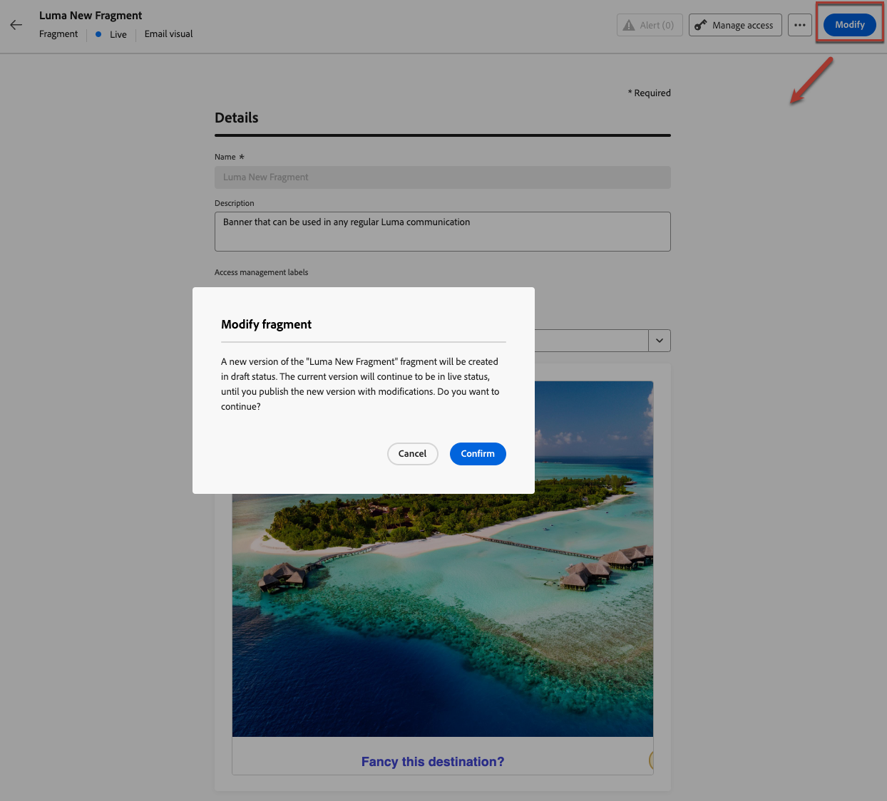
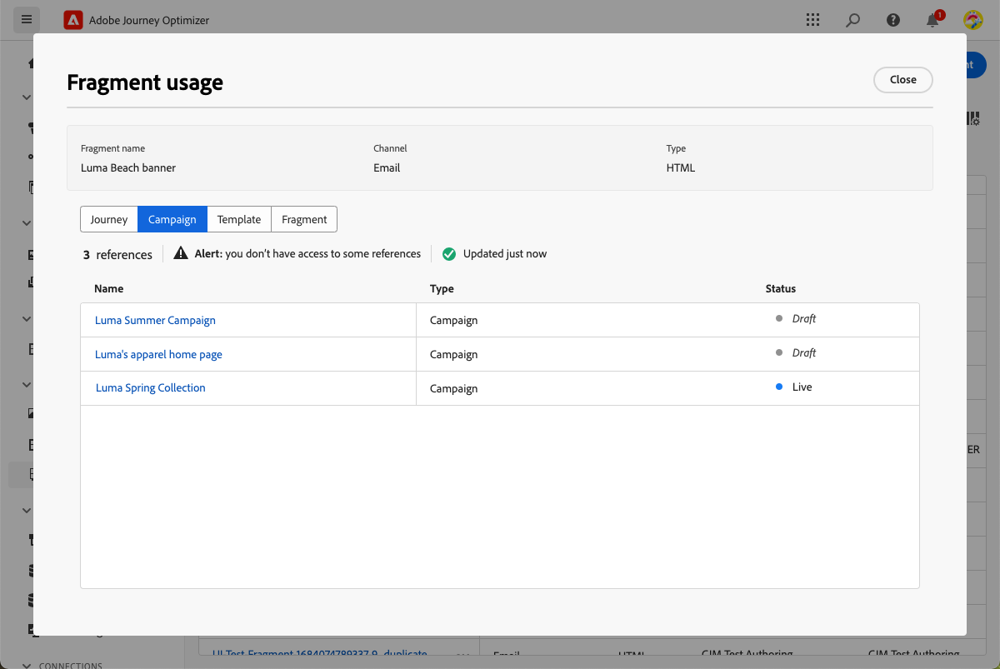

# Gestire i frammenti {#manage-fragments}

Per gestire i frammenti, accedi all&#39;elenco di frammenti dal menu a sinistra **[!UICONTROL Gestione contenuto]** > **[!UICONTROL Frammenti]**.

Vengono visualizzati tutti i frammenti creati nella sandbox corrente, ovvero [dal menu **[!UICONTROL Frammenti]**](#create-fragments), utilizzando l&#39;opzione [Salva come frammento](#save-as-fragment).

Puoi filtrare i frammenti in base ai seguenti elementi:

* Stato (bozza o in tempo reale)
* Tipo (visivo o espressione)
* Data di creazione o modifica
* Stato (archiviato o meno)
* Tag

Puoi anche scegliere di visualizzare tutti i frammenti o solo gli elementi creati o modificati dall’utente corrente.

Dal pulsante **[!UICONTROL Altre azioni]** accanto a ogni frammento, puoi:

<!--* Add to package
* Open draft version-->
* Duplica il frammento.
* Utilizza l&#39;opzione **[!UICONTROL Esplora riferimenti]** per visualizzare i percorsi, le campagne o i modelli in cui viene utilizzato. [Ulteriori informazioni](#explore-references)
* Archivia il frammento. [Ulteriori informazioni](#archive-fragments)
* Modifica i tag del frammento. [Scopri come utilizzare i tag unificati](../start/search-filter-categorize.md#tags)

## Stati dei frammenti

>[!CONTEXTUALHELP]
>id="ajo_fragment_statuses"
>title="Nuovi stati dei frammenti"
>abstract="Poiché gli stati **Bozza** e **Live** sono stati introdotti con la versione di giugno di Journey Optimizer, tutti i frammenti creati prima di questa versione hanno lo stato **Bozza**, anche se vengono utilizzati in un percorso o in una campagna. Se apporti modifiche a questi frammenti, devi pubblicarli per renderli **Live** e propagare le modifiche alle campagne e ai percorsi associati. È necessario creare anche una nuova versione di percorso/campagna e pubblicarla.  La pubblicazione richiede l’autorizzazione utente <a href="https://experienceleague.adobe.com/it/docs/journey-optimizer/using/access-control/privacy/ootb-product-profiles#content-library-manage">Pubblica frammento</a>."
>additional-url="https://experienceleague.adobe.com/it/docs/journey-optimizer/using/access-control/privacy/ootb-product-profiles#content-library-manager" text="Ulteriori informazioni sulle autorizzazioni per i frammenti di contenuto"

I frammenti possono avere più stati:

* **[!UICONTROL Bozza]**: il frammento è in fase di modifica e non è stato approvato.

* **[!UICONTROL Live]**: il frammento è stato approvato ed è attivo. [Scopri come pubblicare un frammento](../content-management/create-fragments.md#publish)

  Quando si modifica un frammento live, viene visualizzata un’icona specifica accanto al relativo stato. Fai clic su questa icona per aprire la versione bozza del frammento.

* **[!UICONTROL Pubblicazione]**: il frammento è stato approvato ed è in fase di pubblicazione.
* **[!UICONTROL Archiviato]**: frammento archiviato. [Scopri come archiviare i frammenti](#archive-fragments)

>[!CAUTION]
>
>Poiché gli stati **Bozza** e **Live** sono stati introdotti con la versione di giugno di Journey Optimizer, tutti i frammenti creati prima di questa versione hanno lo stato **Bozza**, anche se vengono utilizzati in un percorso o in una campagna. Se apporti modifiche a questi frammenti, devi pubblicarli per renderli **Live** e propagare le modifiche alle campagne e ai percorsi associati. È necessario creare anche una nuova versione di percorso/campagna e pubblicarla. La pubblicazione richiede l&#39;autorizzazione utente [Frammento di Publish](../administration/ootb-product-profiles.md#content-library-manager).

## Modificare i frammenti {#edit-fragments}

>[!CONTEXTUALHELP]
>id="ajo_fragments_update_campaigns"
>title="Aggiornamento frammenti nelle campagne"
>abstract="Questa campagna non verrà aggiornata se pubblichi modifiche al frammento. Richiede la pubblicazione di una nuova versione, in modo da poter supportare la funzionalità di aggiornamento dei frammenti."

>[!CONTEXTUALHELP]
>id="ajo_fragments_update_journeys"
>title="Aggiornamento frammenti nei percorsi"
>abstract="Questo percorso non verrà aggiornato se pubblichi modifiche al frammento. Richiede la pubblicazione di una nuova versione, in modo da poter supportare la funzionalità di aggiornamento dei frammenti."

Per modificare un frammento, effettua le seguenti operazioni.

1. Fare clic sul frammento desiderato dall&#39;elenco **[!UICONTROL Frammenti]**. Viene visualizzata la schermata delle proprietà del frammento con un’anteprima del relativo contenuto.

1. Per controllare l&#39;elenco dei percorsi, delle campagne e dei modelli di contenuto in cui il frammento è attualmente utilizzato, seleziona l&#39;opzione **[!UICONTROL Esplora riferimenti]**. [Ulteriori informazioni](#explore-references)

   

1. Se il frammento in fase di modifica è in stato **[!UICONTROL Live]**, fare clic sul pulsante **[!UICONTROL Modifica]** per creare una versione bozza del frammento.

   <!---->

   >[!NOTE]
   >
   >La versione corrente del frammento continuerà a essere attiva fino a quando non pubblicherai la nuova versione aggiornata.

1. Apporta al frammento le modifiche desiderate.

1. Per modificare il contenuto, fai clic sul pulsante **[!UICONTROL Modifica]** e aggiorna il contenuto come faresti quando crei un frammento da zero. [Scopri come creare un frammento](#create-from-scratch)

   

   >[!NOTE]
   >
   >Quando modifichi un frammento pubblicato, puoi rimuovere qualsiasi campo di personalizzazione, ma non puoi aggiungerne di nuovi al contenuto del frammento. Se desideri aggiungere attributi personalizzati, devi duplicare il frammento. [Ulteriori informazioni](#adding-new-attributes)

1. Quando le modifiche sono pronte, salvale e fai clic sul pulsante **Publish** per rendere attive le modifiche.

Quando modifichi un frammento, le modifiche vengono propagate automaticamente a tutti i contenuti che lo utilizzano, inclusi percorsi live e campagne, ad eccezione dei contenuti per i quali è stata interrotta l’ereditarietà dal frammento originale.

>[!NOTE]
>
>Scopri come interrompere l’ereditarietà nelle sezioni [Aggiungi frammenti visivi alle e-mail](../email/use-visual-fragments.md#break-inheritance) e [Sfrutta i frammenti di espressione](../personalization/use-expression-fragments.md#break-inheritance).

## Aggiunta di nuovi attributi a un frammento live {#adding-new-attributes}

>[!WARNING]
>
>L&#39;aggiunta di nuovi [attributi personalizzati](../personalization/personalization-build-expressions.md) a un frammento live non è supportata.

Dopo la pubblicazione di un frammento, il set di attributi personalizzati o contestuali viene bloccato per tutte le campagne e i percorsi che vi fanno riferimento.

Per incorporare attributi aggiuntivi in un frammento live, segui i passaggi indicati di seguito.

1. Duplica il frammento esistente utilizzando il pulsante **[!UICONTROL Altre azioni]**.

   

1. [Aggiungere i nuovi attributi desiderati](../personalization/personalization-build-expressions.md#add) alla versione della bozza duplicata.

1. Publish la nuova versione. [Scopri come](create-fragments.md#publish)

1. Aggiorna eventuali campagne o percorsi per fare riferimento al frammento aggiornato in cui sono stati aggiunti i nuovi attributi.

## Esplora riferimenti {#explore-references}

Puoi visualizzare l’elenco dei percorsi, delle campagne e dei modelli di contenuto che attualmente utilizzano un frammento. A tale scopo, selezionare **[!UICONTROL Esplora riferimenti]** dal menu **[!UICONTROL Altre azioni]** nell&#39;elenco dei frammenti o dalla schermata delle proprietà dei frammenti.

Seleziona una scheda per scegliere tra percorsi, campagne, modelli e frammenti. Puoi visualizzarne lo stato e fare clic su un nome da reindirizzare all’elemento corrispondente in cui si fa riferimento al frammento.

>[!NOTE]
>
>Se il frammento viene utilizzato in un percorso, una campagna o un modello con un’etichetta che impedisce l’accesso, viene visualizzato un messaggio di avviso sopra la scheda selezionata. [Ulteriori informazioni sul controllo degli accessi a livello di oggetto (OLAC)](../administration/object-based-access.md)

## Archivia frammenti {#archive-fragments}

Puoi eliminare dall’elenco i frammenti gli elementi che non sono più rilevanti per il tuo marchio.

A tale scopo, fai clic sul pulsante **[!UICONTROL Altre azioni]** accanto al frammento desiderato e seleziona **[!UICONTROL Archivia]**. Scomparirà dall’elenco dei frammenti, impedendo agli utenti di utilizzarlo in e-mail o modelli futuri.

>[!NOTE]
>
>Se si archivia un frammento utilizzato in un contenuto, <!--it will remain in the email or template, but you won't be able to select it from the fragment list to edit it--> tale contenuto non verrà modificato.

Per annullare l&#39;archiviazione di un frammento, filtrare gli elementi **[!UICONTROL Archiviati]** e selezionare **[!UICONTROL Annulla archiviazione]** dal menu **[!UICONTROL Altre azioni]**. Ora è nuovamente accessibile dall’elenco dei frammenti e può essere utilizzato in qualsiasi e-mail o modello.

## Esportare i frammenti in un’altra sandbox {#export}

Journey Optimizer consente di copiare un frammento da una sandbox all’altra. Ad esempio, puoi copiare un frammento dall’ambiente sandbox di Stage alla sandbox di produzione.

Il processo di copia viene eseguito tramite un **pacchetto di esportazione e importazione** tra le sandbox di origine e di destinazione. Informazioni dettagliate su come esportare oggetti e importarli in una sandbox di destinazione sono disponibili in questa sezione: [Copia oggetti in un&#39;altra sandbox](../configuration/copy-objects-to-sandbox.md)
