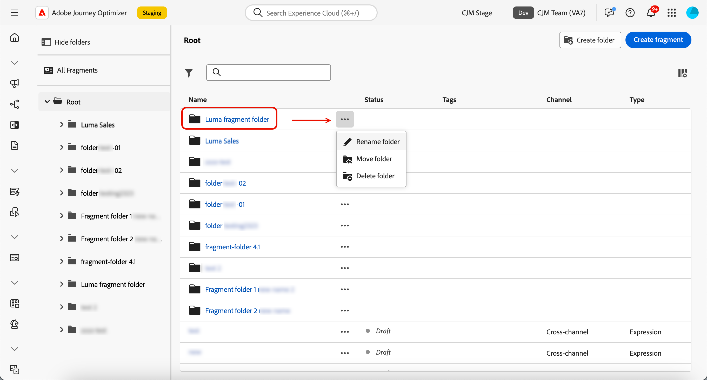

# Gestire i frammenti {#manage-fragments}

## Frammenti di accesso {#access-fragments}

Per gestire i frammenti, accedi all&#39;elenco di frammenti dal menu a sinistra **[!UICONTROL Gestione contenuto]** > **[!UICONTROL Frammenti]**.

Vengono visualizzati tutti i frammenti creati nella sandbox corrente, ovvero [dal menu **[!UICONTROL Frammenti]**](create-fragments.md#create-fragments), utilizzando l&#39;opzione [Salva come frammento](save-fragments.md).

Il riquadro a sinistra consente di organizzare i frammenti in cartelle. Per impostazione predefinita, vengono visualizzati tutti i frammenti. Quando selezioni una cartella, vengono visualizzati solo i frammenti e le cartelle inclusi nella cartella selezionata. [Ulteriori informazioni](#folders)

Per trovare un elemento specifico, inizia a digitare un nome nel campo di ricerca. Quando è selezionata una [cartella](#folders), la ricerca viene applicata a tutti i frammenti o cartelle nel primo livello della gerarchia della cartella<!--(not nested items)-->.

Puoi filtrare i frammenti in base ai seguenti elementi:

* Stato (bozza o in tempo reale)
* Tipo (visivo o espressione)
* Data di creazione o modifica
* Stato (archiviato o meno)
* Tag

{width="90%" align="left"}

Puoi anche scegliere di visualizzare tutti i frammenti o solo gli elementi creati o modificati dall’utente corrente.

Dal pulsante **[!UICONTROL Altre azioni]** accanto a ogni frammento, puoi:

* Aggiungilo a un pacchetto per l’esportazione. [Ulteriori informazioni](#export)
* Se è in corso la modifica di un frammento attivo, apri la versione bozza del frammento. [Ulteriori informazioni](#edit-fragments)
* Duplica il frammento.
* Utilizza l&#39;opzione **[!UICONTROL Esplora riferimenti]** per visualizzare i percorsi, le campagne o i modelli in cui viene utilizzato. [Ulteriori informazioni](#explore-references)
* Archivia il frammento. [Ulteriori informazioni](#archive-fragments)
* Modifica i tag del frammento. [Scopri come utilizzare i tag unificati](../start/search-filter-categorize.md#tags)
* Sposta il frammento in una cartella. [Ulteriori informazioni](#folders)

## Utilizzare le cartelle per gestire i frammenti {#folders}

>[!CONTEXTUALHELP]
>id="ajo_fragments_folders"
>title="Organizzare i frammenti in cartelle"
>abstract="Utilizza le cartelle per categorizzare e gestire i frammenti in base alle esigenze della tua organizzazione."

Per navigare facilmente nei frammenti, puoi utilizzare le cartelle per organizzarle in modo più efficace in una gerarchia strutturata. Questo consente di categorizzare e gestire gli articoli in base alle esigenze dell&#39;organizzazione.

1. Fare clic sul pulsante **[!UICONTROL Tutti i frammenti]** per visualizzare tutti gli elementi creati in precedenza senza il raggruppamento di cartelle.

1. Fare clic sulla cartella **[!UICONTROL Root]** per visualizzare tutte le cartelle create.

   >[!NOTE]
   >
   >Se non hai ancora creato le cartelle, vengono visualizzati tutti i frammenti.

1. Fare clic su una cartella all&#39;interno della cartella **[!UICONTROL Root]** per visualizzarne il contenuto.

1. Facendo clic sulla cartella **[!UICONTROL Root]** o su qualsiasi altra cartella, viene visualizzato il pulsante **[!DNL Create folder]**. Selezionala.

   

1. Digitare un nome per la nuova cartella e fare clic su **[!UICONTROL Salva]**. La nuova cartella viene visualizzata all&#39;inizio dell&#39;elenco di frammenti all&#39;interno della cartella **[!UICONTROL Root]** o della cartella attualmente selezionata.

1. Puoi fare clic sul pulsante **[!UICONTROL Altre azioni]** per rinominare o eliminare la cartella.

   

1. Utilizzando il pulsante **[!UICONTROL Altre azioni]**, puoi anche spostare il frammento in un&#39;altra cartella esistente.

   <!---->

1. Ora puoi passare alla cartella appena creata. Ogni nuovo frammento [create](create-fragments.md) da qui viene salvato nella cartella corrente.

   

## Stati dei frammenti {#fragments-statuses}

>[!CONTEXTUALHELP]
>id="ajo_fragment_statuses"
>title="Nuovi stati dei frammenti"
>abstract="Da quando sono stati introdotti gli stati **Bozza** e **Live** con la versione di giugno di Journey Optimizer, tutti i frammenti creati prima di questa versione hanno lo stato **Bozza**, anche se vengono utilizzati in un percorso o in una campagna. Se apporti modifiche a questi frammenti, è necessario pubblicarli per renderli **live** e propagare le modifiche alle campagne e ai percorsi associati. È necessario creare anche una nuova versione di percorso/campagna e pubblicarla.  La pubblicazione richiede l’autorizzazione utente <a href="https://experienceleague.adobe.com/it/docs/journey-optimizer/using/access-control/ootb-product-profiles#content-library-manage">Pubblica frammento</a>."
>additional-url="https://experienceleague.adobe.com/it/docs/journey-optimizer/using/access-control/ootb-product-profiles#content-library-manager" text="Ulteriori informazioni sulle autorizzazioni per i frammenti di contenuto"

I frammenti possono avere più stati:

* **[!UICONTROL Bozza]**: il frammento è in fase di modifica e non è stato approvato.

* **[!UICONTROL Live]**: il frammento è stato approvato ed è attivo. [Scopri come pubblicare un frammento](../content-management/create-fragments.md#publish)

  Quando si modifica un frammento live, viene visualizzata un’icona specifica accanto al relativo stato. Fai clic su questa icona per aprire la versione bozza del frammento.

* **[!UICONTROL Pubblicazione]**: il frammento è stato approvato ed è in fase di pubblicazione.
* **[!UICONTROL Archiviato]**: frammento archiviato. [Scopri come archiviare i frammenti](#archive-fragments)

>[!CAUTION]
>
>Poiché gli stati **Bozza** e **Live** sono stati introdotti con la versione di giugno 2024 di Journey Optimizer, tutti i frammenti creati prima di questa versione hanno lo stato **Bozza**, anche se vengono utilizzati in un percorso o in una campagna. Se apporti modifiche a questi frammenti, è necessario pubblicarli per renderli **live** e propagare le modifiche alle campagne e ai percorsi associati. È necessario creare anche una nuova versione di percorso/campagna e pubblicarla. La pubblicazione richiede l&#39;autorizzazione utente [Pubblica frammento](../administration/ootb-product-profiles.md#content-library-manager).

## Modificare un frammento {#edit-fragments}

>[!CONTEXTUALHELP]
>id="ajo_fragments_update_campaigns"
>title="Aggiornamento frammenti nelle campagne"
>abstract="Questa campagna non verrà aggiornata se pubblichi modifiche al frammento. Richiede la pubblicazione di una nuova versione, in modo da poter supportare la funzionalità di aggiornamento dei frammenti."

>[!CONTEXTUALHELP]
>id="ajo_fragments_update_journeys"
>title="Aggiornamento frammenti nei percorsi"
>abstract="Questo percorso non verrà aggiornato se pubblichi modifiche al frammento. Richiede la pubblicazione di una nuova versione, in modo da poter supportare la funzionalità di aggiornamento dei frammenti."

Per modificare un frammento, effettua le seguenti operazioni.

1. Fare clic sul frammento desiderato dall&#39;elenco **[!UICONTROL Frammenti]**. Viene visualizzata la schermata delle proprietà del frammento con un’anteprima del relativo contenuto.

1. Puoi controllare l’elenco dei percorsi, delle campagne e dei modelli di contenuto in cui il frammento è attualmente utilizzato. A tale scopo, selezionare l&#39;opzione **[!UICONTROL Esplora riferimenti]** dal pulsante Altro. [Ulteriori informazioni](#explore-references)

1. Se il frammento in fase di modifica è in stato **[!UICONTROL Live]**, fare clic sul pulsante **[!UICONTROL Modifica]** per creare una versione bozza del frammento. Fai clic su **[!UICONTROL Conferma]**.

   {width="70%" align="left"}

   >[!NOTE]
   >
   >La versione corrente del frammento continuerà a essere attiva fino a quando non pubblicherai la nuova versione aggiornata.

1. Se necessario, apporta le modifiche desiderate ai dettagli del frammento.

1. Per modificare il contenuto del frammento, fai clic sul pulsante **[!UICONTROL Modifica]** e aggiorna il contenuto come faresti quando crei un frammento da zero. [Scopri come creare un frammento](create-fragments.md#content)

   {width="70%" align="left"}

   >[!NOTE]
   >
   >Quando modifichi un frammento pubblicato, puoi rimuovere qualsiasi campo di personalizzazione, ma non puoi aggiungerne di nuovi al contenuto del frammento. Se desideri aggiungere attributi personalizzati, devi duplicare il frammento. [Ulteriori informazioni](#adding-new-attributes)

1. Quando le modifiche sono pronte, salvale e fai clic sul pulsante **[!UICONTROL Pubblica]** per rendere attive le modifiche. [Ulteriori informazioni](create-fragments.md#publish)

Quando modifichi un frammento, le modifiche vengono propagate automaticamente a tutti i contenuti che lo utilizzano, inclusi percorsi live e campagne, ad eccezione dei contenuti per i quali è stata interrotta l’ereditarietà dal frammento originale.

>[!NOTE]
>
>Scopri come interrompere l’ereditarietà nelle sezioni [Aggiungi frammenti visivi alle e-mail](../email/use-visual-fragments.md#break-inheritance) e [Sfrutta i frammenti di espressione](../personalization/use-expression-fragments.md#break-inheritance).

### Aggiungere nuovi attributi a un frammento live {#adding-new-attributes}

>[!WARNING]
>
>L&#39;aggiunta di nuovi [attributi personalizzati](../personalization/personalization-build-expressions.md) a un frammento live non è supportata.

Dopo la pubblicazione di un frammento, il set di attributi personalizzati o contestuali viene bloccato per tutte le campagne e i percorsi che vi fanno riferimento.

Per incorporare attributi aggiuntivi in un frammento live, segui i passaggi indicati di seguito.

1. Duplica il frammento esistente utilizzando il pulsante **[!UICONTROL Altre azioni]**.

   {width="70%" align="left"}

1. Seleziona il frammento duplicato per aprirlo e fai clic sul pulsante **[!UICONTROL Modifica]**.

1. [Aggiungi i nuovi attributi desiderati](../personalization/personalization-build-expressions.md#add) al frammento duplicato, ad esempio i campi di personalizzazione.

   {width="70%" align="left"}

1. Salva le modifiche e pubblica il nuovo frammento. [Scopri come](create-fragments.md#publish)

1. Aggiorna eventuali campagne o percorsi per fare riferimento al frammento aggiornato in cui sono stati aggiunti i nuovi attributi.

   * [Scopri come utilizzare i frammenti visivi](../email/use-visual-fragments.md)
   * [Scopri come utilizzare i frammenti di espressione](../personalization/use-expression-fragments.md)

## Esplora riferimenti {#explore-references}

Puoi visualizzare l’elenco dei percorsi, delle campagne e dei modelli di contenuto che attualmente utilizzano un frammento. A tale scopo, selezionare **[!UICONTROL Esplora riferimenti]** dal menu **[!UICONTROL Altre azioni]** nell&#39;elenco dei frammenti o nella schermata delle proprietà dei frammenti.

{width="70%" align="left"}

Seleziona una scheda per scegliere tra percorsi, campagne, modelli e frammenti. Puoi visualizzarne lo stato e fare clic su un nome da reindirizzare all’elemento corrispondente in cui si fa riferimento al frammento.

{width="70%" align="left"}

>[!NOTE]
>
>Se il frammento viene utilizzato in un percorso, una campagna o un modello con un’etichetta che impedisce l’accesso, viene visualizzato un messaggio di avviso sopra la scheda selezionata. [Ulteriori informazioni sul controllo degli accessi a livello di oggetto (OLAC)](../administration/object-based-access.md)

## Archivia frammenti {#archive-fragments}

Puoi eliminare dall’elenco i frammenti gli elementi che non sono più rilevanti per il tuo marchio.

A tale scopo, fai clic sul pulsante **[!UICONTROL Altre azioni]** accanto al frammento desiderato e seleziona **[!UICONTROL Archivia]**. Scomparirà dall’elenco dei frammenti, impedendo agli utenti di utilizzarlo in e-mail o modelli futuri.

{width="70%" align="left"}

>[!NOTE]
>
>Se si archivia un frammento utilizzato in un contenuto, <!--it will remain in the email or template, but you won't be able to select it from the fragment list to edit it--> tale contenuto non verrà modificato.

Per annullare l&#39;archiviazione di un frammento, filtrare gli elementi **[!UICONTROL Archiviati]** e selezionare **[!UICONTROL Annulla archiviazione]** dal menu **[!UICONTROL Altre azioni]**. Ora è nuovamente accessibile dall’elenco dei frammenti e può essere utilizzato in qualsiasi e-mail o modello.

{width="70%" align="left"}

## Esportare i frammenti in un’altra sandbox {#export}

Journey Optimizer consente di copiare un frammento da una sandbox all’altra. Ad esempio, puoi copiare un frammento dall’ambiente sandbox di Stage alla sandbox di produzione.

Il processo di copia viene eseguito tramite un **pacchetto di esportazione e importazione** tra le sandbox di origine e di destinazione. Informazioni dettagliate su come esportare oggetti e importarli in una sandbox di destinazione sono disponibili in questa sezione: [Copia oggetti in un&#39;altra sandbox](../configuration/copy-objects-to-sandbox.md).
