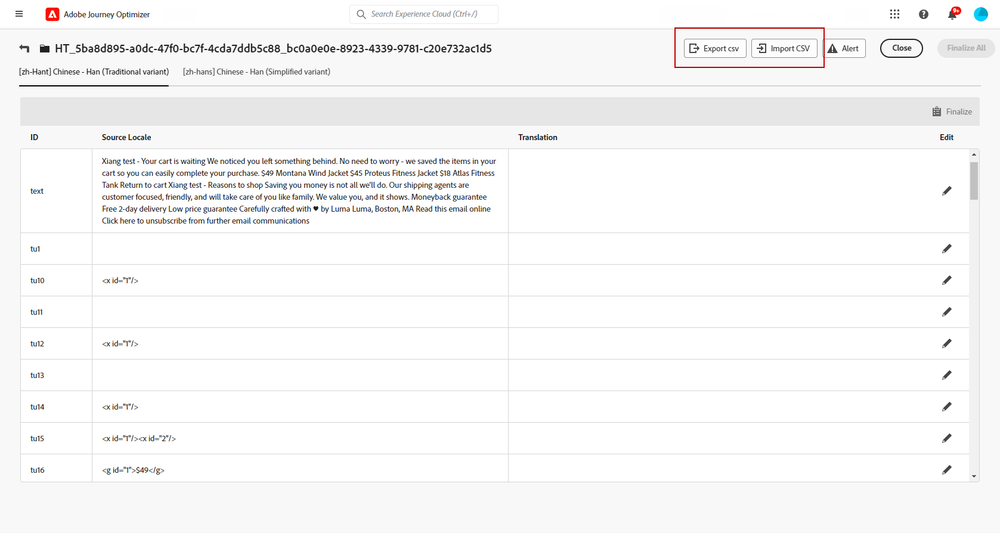

# Creare contenuto multilingue con traduzione automatica {#multilingual-automated}

>[!CONTEXTUALHELP]
>id="ajo_multi_add_provider"
>title="Aggiungere provider"
>abstract="Aggiungi provider di traduzione e lingue in base alle esigenze. Questo consente di gestire quali provider e lingue sono attivi per il progetto, offrendo la flessibilità di regolare le risorse e indirizzare i tipi di pubblico in base ai requisiti correnti e all’ambito del progetto."

>[!CONTEXTUALHELP]
>id="ajo_multi_edit_provider"
>title="Modificare provider"
>abstract="Modifica i provider di traduzione esistenti e aggiungi le lingue in base alle esigenze. Questa funzionalità consente di controllare quali provider e impostazioni internazionali sono attivi per il progetto, offrendo la flessibilità di regolare le risorse e indirizzare tipi di pubblico specifici in base alle esigenze correnti e agli obiettivi del progetto."

>[!IMPORTANT]
>
>Per il flusso automatizzato, gli utenti devono disporre delle autorizzazioni relative alla funzionalità **[!UICONTROL Servizio di traduzione]**. [Ulteriori informazioni sulle autorizzazioni](../administration/permissions.md)

Utilizzando il flusso automatizzato, è sufficiente selezionare la lingua di destinazione e il provider della lingua. Il contenuto viene quindi inviato direttamente alla traduzione, pronto per una revisione finale al completamento.

Per creare contenuti multilingue mediante la traduzione automatica, segui la procedura riportata di seguito:

1. [Aggiungere il provider](multilingual-provider.md)

1. [Aggiungi impostazioni internazionali (facoltativo)](multilingual-locale.md)

1. [Creare un progetto lingua](#create-translation-project)

1. [Creare le impostazioni della lingua](#create-language-settings)

1. [Creare un contenuto multilingue](#create-a-multilingual-campaign)

1. [Rivedere l’attività di traduzione (facoltativo)](#review-translation-project)

## Creare progetto di traduzione {#translation-project}

>[!CONTEXTUALHELP]
>id="ajo_multi_create_project"
>title="Creare progetto"
>abstract="Per iniziare a creare contenuti multilingue, inizia il progetto di traduzione identificando la lingua di destinazione, selezionando la lingua o il dialetto regionale appropriato per il pubblico. Dopodiché, scegli un provider di traduzione che sia in linea con le esigenze del progetto."

>[!CONTEXTUALHELP]
>id="ajo_multi_edit_project"
>title="Modificare progetti"
>abstract="Aggiorna il progetto di traduzione per incorporare altre lingue, che consentono di espandere il contenuto per raggiungere un pubblico più ampio."

Avvia il progetto di traduzione specificando la lingua di Target, che indica la lingua o l’area geografica specifica per il contenuto. Puoi quindi scegliere il provider di traduzione.

1. Dal menu **[!UICONTROL Traduzione]** in **[!UICONTROL Gestione contenuto]**, fare clic su **[!UICONTROL Crea progetto]** nella scheda **[!UICONTROL Progetti]**.

   

1. Digitare un **[!UICONTROL Nome]** e una **[!UICONTROL Descrizione]**.

1. Selezionare le **[!UICONTROL impostazioni locali di Source]**.

   

1. Scegli se desideri abilitare le seguenti opzioni:

   * **[!UICONTROL Pubblica automaticamente le traduzioni approvate]**: una volta approvate, le traduzioni vengono automaticamente integrate nella campagna senza la necessità di un intervento manuale.
   * **[!UICONTROL Abilita flusso di lavoro di revisione]**: applicabile solo alle lingue tradotte dall&#39;utente. Questo consente a un revisore interno di valutare e approvare o rifiutare in modo efficiente i contenuti tradotti. [Ulteriori informazioni](#review-translation-project)

1. Fai clic su **[!UICONTROL Aggiungi impostazioni locali]** per accedere al menu e definire le lingue per il progetto di traduzione.

   Se manca una **[!UICONTROL Lingua]**, puoi crearla manualmente in anticipo dal menu **[!UICONTROL Traduzione]** o tramite API. Consulta [Crea una nuova lingua](#create-locale).

   

1. Seleziona dall&#39;elenco le tue **[!UICONTROL impostazioni locali di destinazione]** e scegli quale **[!UICONTROL provider di traduzione]** desideri utilizzare per ciascuna impostazione locale.

   È possibile accedere alle impostazioni del **[!UICONTROL provider di traduzione]** dal menu **[!UICONTROL Traduzione]** nella sezione del menu **[!UICONTROL Amministrazione]**.

   >[!NOTE]
   >
   >La gestione dei contratti con il fornitore di traduzione esula dall’ambito di questa funzione. Assicurati di disporre di un contratto valido e attivo con il partner di traduzione designato.
   >
   ></br>Il fornitore di traduzione è responsabile della qualità del contenuto tradotto.

1. Fare clic su **[!UICONTROL Aggiungi una lingua]** al termine del collegamento delle impostazioni locali di destinazione con il provider di traduzione corretto. Quindi fare clic su **[!UICONTROL Salva]**.

   Si noti che se un provider è disattivato per una lingua di destinazione, indica che il provider non supporta tale lingua specifica.

   

1. Fai clic su **[!UICONTROL Salva]** quando il progetto di traduzione è configurato.

Il progetto di traduzione viene ora creato e può essere utilizzato in una campagna multilingue.

## Creare le impostazioni della lingua {#language-settings}

>[!CONTEXTUALHELP]
>id="ajo_multi_custom_conditional"
>title="Impostazioni condizionali personalizzate"
>abstract="Le impostazioni condizionali personalizzate sono set di regole che determinano in quale lingua verrà visualizzato il contenuto, in base a criteri specifici. Queste impostazioni consentono di controllare la visualizzazione del contenuto in base a fattori quali la posizione dell’utente, le preferenze della lingua o altri elementi contestuali."

>[!CONTEXTUALHELP]
>id="ajo_multi_fallback"
>title="Preferenze di fallback"
>abstract="La scelta di una preferenza di fallback è fondamentale per migliorare l’esperienza dell’utente. Se non viene selezionato alcun fallback e un profilo non soddisfa i requisiti necessari, il contenuto non verrà consegnato. Selezionando un fallback appropriato, puoi garantire una distribuzione coerente dei contenuti, anche quando i profili non corrispondono ai criteri iniziali."

In questa sezione puoi impostare diverse lingue per la gestione dei contenuti multilingue. Puoi anche scegliere l’attributo da utilizzare per cercare le informazioni relative alla lingua del profilo.

1. Dal menu **[!UICONTROL Amministrazione]**, accedere a **[!UICONTROL Canale]** > **[!UICONTROL Impostazioni generali]**.

1. Nel menu **[!UICONTROL Impostazioni lingua]**, fare clic su **[!UICONTROL Crea impostazioni lingua]**.

   

1. Digitare il nome delle **[!UICONTROL impostazioni lingua]** e scegliere **[!UICONTROL Progetto di traduzione]**.

1. Dal campo **[!UICONTROL Progetto di traduzione]**, fai clic su **[!UICONTROL Modifica]** e scegli il **[!UICONTROL Progetto di traduzione]** creato in precedenza.

   Le **[!UICONTROL impostazioni internazionali]** configurate in precedenza vengono importate automaticamente.

1. Seleziona **[!UICONTROL Preferenze di fallback]** per definire un&#39;opzione di backup per i profili che non soddisfano i criteri necessari per la distribuzione dei contenuti.

   Se non è selezionata alcuna opzione di fallback, la campagna o il percorso non verrà inviato.

   

1. Scegli la preferenza di invio tra le seguenti opzioni:

   * **[!UICONTROL Selezionare gli attributi delle preferenze della lingua del profilo]**
   * **[!UICONTROL Creare regole condizionali personalizzate]**

1. Se si seleziona **[!UICONTROL Seleziona attributi di preferenza lingua profilo]**, scegliere l&#39;attributo appropriato dal menu **[!UICONTROL Attributi di preferenza lingua profilo]** per cercare le informazioni sulla lingua profilo.

   

1. Se si seleziona **[!UICONTROL Crea regole condizionali personalizzate]**, selezionare le impostazioni locali per le quali si desidera creare le condizioni. Quindi, crea regole in base a fattori come la posizione dell’utente, le preferenze della lingua o altri elementi contestuali.

   

1. Inizia a creare le condizioni aggiungendo un attributo, un evento o un pubblico per definire il gruppo target.

   >[!IMPORTANT]
   >
   >I dati contestuali sono disponibili esclusivamente per i canali Web, In-App, basati su codice per le schede di esperienza e di contenuto. Se utilizzata per i canali E-mail, SMS, Notifica push o Direct mail, senza attributi aggiuntivi, la campagna o il percorso verrà inviato nella lingua della prima opzione dell’elenco.

   

   +++Prerequisiti per l’utilizzo di eventi contestuali nelle condizioni

   Quando gli utenti visualizzano il contenuto, viene inviata una richiesta di personalizzazione insieme all’evento esperienza. Per sfruttare i dati contestuali nelle tue condizioni, devi allegare dati aggiuntivi al payload della richiesta di personalizzazione. A questo scopo, devi creare una regola in Raccolta dati di Adobe Experience Platform per specificare: SE viene inviata una richiesta di personalizzazione, ALLORA allega dati aggiuntivi alla richiesta, definendo l’attributo da abbinare al campo della lingua nello schema.

   >[!NOTE]
   >
   >Questi prerequisiti sono necessari solo per i canali delle schede in-app e di contenuto.

   1. In Raccolta dati di Adobe Experience Platform, accedi alle proprietà del tag.

   1. Accedi al menu **[!UICONTROL Regole]** e crea una nuova regola. Informazioni dettagliate su come creare regole sono disponibili nella [!DNL Adobe Experience Platform] [documentazione sulla raccolta dati](https://experienceleague.adobe.com/en/docs/experience-platform/collection/e2e#create-a-rule){target="_blank"}

   1. Nella sezione **[!UICONTROL IF]** della regola, aggiungi un evento configurato come segue:

      

      * Scegli l&#39;**[!UICONTROL estensione]** con cui stai lavorando.
      * Nel campo **[!UICONTROL Tipo evento]**, seleziona &quot;Evento richiesta AEP&quot;.
      * Nel riquadro a destra, seleziona &quot;XDM Event Type equals personalization.request&quot;
      * Fai clic sul pulsante **[!UICONTROL Mantieni modifiche]** per confermare.

   1. Nella sezione **[!UICONTROL THEN]** della regola, aggiungi un&#39;azione configurata come segue:

      

      * Scegli l&#39;**[!UICONTROL estensione]** con cui stai lavorando.
      * Nel campo **[!UICONTROL Tipo azione]**, selezionare &quot;Allega dati&quot;.
      * Nella sezione del payload JSON, accertati che l’attributo utilizzato per recuperare il linguaggio da utilizzare (nell’esempio seguente &quot;lingua&quot;) corrisponda al nome dell’attributo specificato nello schema in cui il flusso di dati della raccolta dati si propaga.

        ```JSON
        {
            "xdm":{
                "application":{
                    "_dc":{
                        "language":"{%%Language%%}"
                    }
                }
            }
        }
        ```

      * Fai clic sul pulsante **[!UICONTROL Mantieni modifiche]** per confermare e salvare la regola.

   +++

1. Trascina e rilascia le impostazioni locali per riordinarle e gestirne la priorità nell’elenco.

1. Fai clic su **[!UICONTROL Invia]** per creare le **[!UICONTROL impostazioni lingua]**.

Dopo aver impostato le preferenze della lingua, non sarà più possibile modificarle.

<!--
1. Access the **[!UICONTROL channel configurations]** menu and create a new channel configuration or select an existing one.

1. In the **[!UICONTROL Header parameters]** section, select the **[!UICONTROL Enable multilingual]** option.


1. Select your **[!UICONTROL Locales dictionary]** and add as many as needed.
-->

## Creare un contenuto multilingue {#create-multilingual-campaign}

>[!AVAILABILITY]
>
> Al momento non è disponibile un’anteprima per il contenuto di esperienze basate su codice e schede di contenuto con il flusso automatizzato.

Dopo aver configurato il progetto di traduzione e le impostazioni della lingua, puoi creare la campagna o il percorso e personalizzare il contenuto per le diverse lingue.

1. Inizia creando e configurando la tua notifica e-mail, SMS o push [campagna](../campaigns/create-campaign.md) o [percorso](../building-journeys/journeys-message.md) in base alle tue esigenze.

1. Una volta creato il contenuto principale, fai clic su **[!UICONTROL Salva]** e torna alla schermata di configurazione della campagna.

1. Fare clic su **[!UICONTROL Aggiungi lingue]**.  [Ulteriori informazioni](#create-language-settings)

   

1. Seleziona le **[!UICONTROL Impostazioni lingua]** create in precedenza.

   

1. Dopo aver importato le impostazioni internazionali, fai clic su **[!UICONTROL Invia per tradurre]** per inoltrare il contenuto al provider di traduzione selezionato in precedenza.

   

1. Una volta inviato per la traduzione, il contenuto non è più modificabile. Per apportare modifiche al contenuto originale, fai clic sull’icona del lucchetto.

   Tieni presente che se desideri apportare modifiche a questo contenuto, dovrai creare un nuovo progetto di traduzione e inviarlo di nuovo per la traduzione.

   

1. Fai clic su **[!UICONTROL Apri traduzione]** per accedere al progetto di traduzione e rivederlo.

   

1. In questa pagina, segui lo stato del progetto di traduzione:

   * **[!UICONTROL Traduzione in corso]**: il provider di servizi sta lavorando attivamente alla traduzione.

     Se hai selezionato **Insourcing** durante la configurazione delle **impostazioni lingua**, puoi tradurre il contenuto direttamente nel progetto di traduzione. [Ulteriori informazioni](#manage-ht-project)

   * **[!UICONTROL Pronto per la revisione]**: il processo di revisione è pronto per iniziare, consentendo di accedere alla traduzione e di rifiutarla o approvarla.

     Se hai selezionato **[!UICONTROL Abilita flusso di lavoro di revisione]** nel **[!UICONTROL progetto di traduzione]**, puoi rivedere la traduzione direttamente in Journey Optimizer dopo il completamento da parte del provider di traduzione selezionato. [Ulteriori informazioni](#review-translation-project)

   * **[!UICONTROL Rivisto]**: la traduzione è stata approvata e pronta per essere pubblicata e inviata alla campagna.

   * **[!UICONTROL Pronto per la pubblicazione]**: la traduzione automatica è stata completata e ora può essere inviata alla tua campagna.

   * **[!UICONTROL Completato]**: la traduzione è ora disponibile nella tua campagna.

   

1. Una volta completata la traduzione, il contenuto multilingue è pronto per essere inviato.

   

1. Fai clic su **[!UICONTROL Rivedi per attivare]** per visualizzare un riepilogo della campagna.

   Il riepilogo ti consente di modificare la campagna, se necessario, e di verificare se un parametro è errato o mancante.

1. Sfoglia i contenuti multilingue per visualizzare il rendering in ogni lingua.

   

1. Verifica che la tua campagna sia configurata correttamente, quindi fai clic su **[!UICONTROL Attiva]**.

   >[!IMPORTANT]
   >
   > Se la campagna è soggetta a un criterio di approvazione, per poter inviare la campagna multilingue dovrai richiedere l’approvazione. [Ulteriori informazioni](../test-approve/gs-approval.md)

Ora puoi attivare la campagna o il percorso. Una volta inviato, puoi misurare l’impatto del percorso multilingue o della campagna all’interno dei rapporti.

## Gestire insourcing progetto di traduzione {#manage-ht-project}

>[!CONTEXTUALHELP]
>id="ajo_multi_insourcing_project"
>title="Insourcing progetto di traduzione"
>abstract="L’insourcing del progetto di traduzione consente di gestire ed eseguire le traduzioni direttamente all’interno del progetto di traduzione, semplificando il processo e mantenendo un maggiore controllo sulla qualità e la coerenza della traduzione."

Se hai selezionato Insourcing durante la configurazione delle impostazioni della lingua, puoi tradurre il contenuto direttamente nel progetto di traduzione.

1. Dal **[!UICONTROL progetto di traduzione]**, accedi al menu **[!UICONTROL Altre azioni]** e seleziona **[!UICONTROL Insourcing]**.

   

1. Puoi esportare il file CSV per la traduzione utilizzando un software di traduzione esterno. In alternativa, puoi importare nuovamente il file CSV nel progetto di traduzione facendo clic sul pulsante **[!UICONTROL Importa CSV]**.

   

1. Fai clic su **[!UICONTROL Modifica]** per aggiungere il contenuto della traduzione.

   

1. Se si è pronti a pubblicare il testo tradotto, fare clic su **[!UICONTROL Finalizza]**.

## Rivedere il progetto di traduzione {#review-translation-project}

>[!CONTEXTUALHELP]
>id="ajo_multi_review_project"
>title="Rivedere il progetto di traduzione"
>abstract="Una volta che il provider di traduzione scelto ha completato la traduzione, puoi rivedere i risultati direttamente in Journey Optimizer. Questo consente di valutare l’accuratezza e la qualità della traduzione, garantendo che sia allineata alle aspettative e ai requisiti del progetto prima di finalizzarla."

>[!CONTEXTUALHELP]
>id="ajo_multi_preview_project"
>title="Anteprima del progetto di traduzione"
>abstract="La finestra Anteprima consente di visualizzare il modo in cui il contenuto tradotto viene visualizzato in ogni lingua. Questa funzione consente di esaminare il rendering e garantire che il contenuto venga visualizzato correttamente ed efficacemente in tutte le lingue selezionate."

Se hai selezionato **[!UICONTROL Abilita flusso di lavoro di revisione]** nel **[!UICONTROL progetto di traduzione]**, puoi rivedere la traduzione direttamente in Journey Optimizer dopo il completamento da parte del provider di traduzione selezionato.

Se questa opzione è disabilitata, al termine della traduzione da parte del provider, lo stato dell&#39;attività di traduzione viene impostato automaticamente su **[!UICONTROL Rivisto]**, consentendo di procedere rapidamente facendo clic su **[!UICONTROL Pubblica]**.

1. Una volta completata la traduzione dal provider di servizi, puoi accedere alla traduzione per la revisione dal **[!UICONTROL progetto di traduzione]** o direttamente dalla **[!UICONTROL Campaign]**.

   Dal menu **[!UICONTROL Altre azioni]**, fai clic su **[!UICONTROL Rivedi]**.

   

1. Dalla finestra Revisione, sfoglia il contenuto tradotto e accetta o rifiuta ogni stringa di traduzione.

   

1. Fai clic su **[!UICONTROL Modifica]** per modificare il contenuto della stringa di traduzione.

   

1. Immetti la traduzione aggiornata e fai clic su **[!UICONTROL Conferma]** al termine.

   

1. Puoi anche scegliere di **[!UICONTROL Rifiutare tutti]** o **[!UICONTROL Approvare tutti]** direttamente.

   Quando selezioni **[!UICONTROL Rifiuta tutto]**, aggiungi un commento e fai clic su **[!UICONTROL Rifiuta]**.

1. Fai clic su **[!UICONTROL Anteprima]** per verificare il rendering del contenuto tradotto in ogni lingua.

1. Se si è pronti a pubblicare il testo tradotto, fare clic su **[!UICONTROL Finalizza]**.

   

1. Dal **[!UICONTROL progetto di traduzione]**, seleziona uno dei tuoi progetti per accedere a ulteriori dettagli. Se hai rifiutato la traduzione, puoi scegliere di inviarla nuovamente alla traduzione.

   

1. Una volta impostato lo stato di **[!UICONTROL Progetto di traduzione]** su Rivisto, puoi inviarlo alla tua campagna.

   Dal menu **[!UICONTROL Altre azioni]**, fai clic su **[!UICONTROL Pubblica]**.

   

1. Nella campagna, verifica che lo stato della traduzione sia cambiato in **[!UICONTROL Traduzione completata]**. Ora puoi inviare contenuti multilingue, fai riferimento al passaggio 10 in [questa sezione](#create-multilingual-campaign).

   

<!--
# Create a multilingual journey {#create-multilingual-journey}

1. Create your journey with a Delivery and personalize your content as needed.
1. From your delivery action, click Edit content.
1. Click Add languages.


-->
