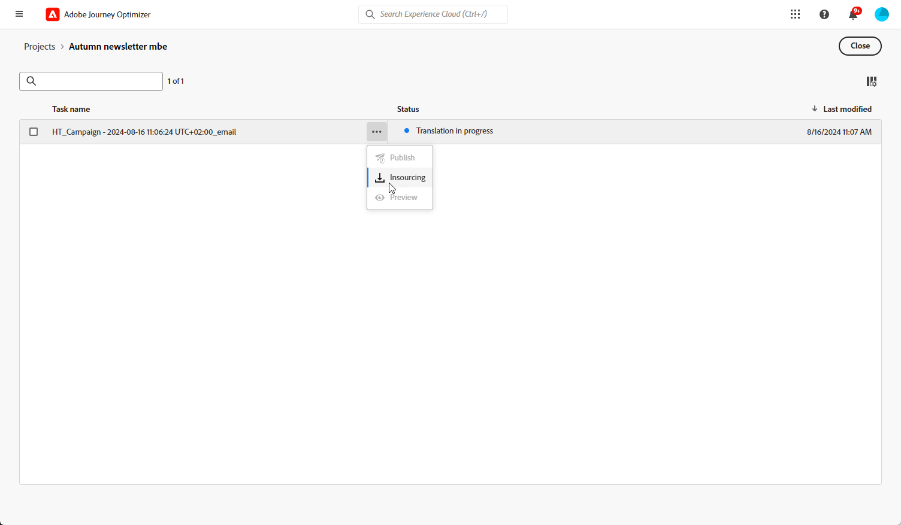

# Creare contenuto multilingue con traduzione automatica {#multilingual-automated}

>[!BEGINSHADEBOX]

**Sommario**

* [Introduzione al contenuto multilingue](multilingual-gs.md)
* [Creare contenuto multilingue con traduzione manuale](multilingual-manual.md)
* Creare contenuto multilingue con traduzione automatica
* [Rapporto campagna multilingue](multilingual-report.md)

>[!ENDSHADEBOX]

Utilizzando il flusso automatizzato, è sufficiente selezionare la lingua di destinazione e il provider della lingua. Il contenuto viene quindi inviato direttamente alla traduzione, pronto per una revisione finale al completamento.

Per creare contenuti multilingue mediante la traduzione automatica, segui la procedura riportata di seguito:

1. [Creare le impostazioni locali](#create-locale).

1. [Creare un progetto lingua](#create-translation-project).

1. [Creare le impostazioni della lingua](#create-language-settings).

1. [Creare una campagna multilingue](#create-a-multilingual-campaign).

1. [Rivedere l’attività di traduzione (facoltativo)](#review-translation-project).

## Crea lingua {#create-locale}

Durante la configurazione delle impostazioni della lingua, come descritto in [Creare le impostazioni della lingua](#language-settings) , se non è disponibile una lingua specifica per il contenuto multilingue, è possibile creare il numero di lingue desiderato utilizzando **[!UICONTROL Traduzione]** menu.

1. Dalla sezione **[!UICONTROL Amministrazione]** menu, accesso **[!UICONTROL Canale]**.

   Il menu delle traduzioni consente di accedere all’elenco delle lingue attivate.

1. Dalla sezione **[!UICONTROL Dizionario impostazioni internazionali]** , fare clic su **[!UICONTROL Aggiungi lingua]**.

   

1. Selezionare il codice di impostazioni internazionali dall&#39; **[!UICONTROL Lingua]** e il relativo **[!UICONTROL Regione]**.

1. Clic **[!UICONTROL Salva]** per creare la lingua.

   

## Crea progetto di traduzione {#translation-project}

Avvia il progetto di traduzione specificando la lingua di Target, che indica la lingua o l’area geografica specifica per il contenuto. Puoi quindi scegliere il provider di traduzione.

1. Dalla sezione **[!UICONTROL Progetti di traduzione]** menu in **[!UICONTROL Gestione dei contenuti]**, fai clic su **[!UICONTROL Crea progetto]**.

   

1. Digitare a **[!UICONTROL Nome]** e **[!UICONTROL Descrizione]**.

1. Seleziona la **[!UICONTROL Lingua di origine]**.

   

1. Scegli se desideri abilitare le seguenti opzioni:

   * **[!UICONTROL Pubblica automaticamente traduzioni approvate]**: una volta approvate, le traduzioni vengono automaticamente integrate nella campagna senza la necessità di un intervento manuale.
   * **[!UICONTROL Abilita flusso di lavoro di revisione]**: applicabile solo alle lingue tradotte dall’uomo. Questo consente a un revisore interno di valutare e approvare o rifiutare in modo efficiente i contenuti tradotti. [Ulteriori informazioni](#review-translation-project)

1. Clic **[!UICONTROL Aggiungi lingua]** per accedere al menu e definire le lingue per il progetto di traduzione.

   Se un **[!UICONTROL Lingua]** mancante, è possibile crearlo manualmente in anticipo dalla **[!UICONTROL Traduzione]** menu o tramite API. Fai riferimento a [Crea una nuova lingua](#create-locale).

   

1. Seleziona dall’elenco il tuo **[!UICONTROL Impostazioni locali di destinazione]** e scegliere quale **[!UICONTROL Provider traduzione]** si desidera utilizzare per ogni lingua.

   **[!UICONTROL Provider traduzione]** è possibile accedere alle impostazioni da **[!UICONTROL Traduzione]** menu in **[!UICONTROL Amministrazione]** menu.

   >[!NOTE]
   >
   >La gestione dei contratti con il fornitore di traduzione esula dall’ambito di questa funzione. Assicurati di disporre di un contratto valido e attivo con il partner di traduzione designato.
   >
   > Il fornitore di traduzione è responsabile della qualità del contenuto tradotto.

1. Clic **[!UICONTROL Aggiungi una lingua]** una volta terminato il collegamento delle impostazioni internazionali di Target con il provider di traduzione corretto. Quindi, fai clic su **[!UICONTROL Salva]**.

   Si noti che se un provider è disattivato per una lingua di destinazione, indica che il provider non supporta tale lingua specifica.

   

1. Clic **[!UICONTROL Salva]** quando il progetto di traduzione è configurato.

Il progetto di traduzione viene ora creato e può essere utilizzato in una campagna multilingue.

## Creare le impostazioni della lingua {#language-settings}

In questa sezione puoi impostare la lingua principale e le lingue associate per la gestione dei contenuti multilingue. Puoi anche scegliere l’attributo da utilizzare per cercare le informazioni relative alla lingua del profilo.

1. Dalla sezione **[!UICONTROL Amministrazione]** menu, accesso **[!UICONTROL Canale]**.

1. In **[!UICONTROL Impostazioni lingua]** menu, fai clic su **[!UICONTROL Creare le impostazioni della lingua]**.

   

1. Digita il nome della tua **[!UICONTROL Impostazioni lingua]**.

1. Scegli la **[!UICONTROL Progetto di traduzione]** opzione.

1. Dalla sezione **[!UICONTROL Progetto di traduzione]** , fare clic su **[!UICONTROL Modifica]** e scegli il creato in precedenza **[!UICONTROL Progetto di traduzione]**.

   Le impostazioni internazionali configurate in precedenza vengono importate automaticamente.

   

1. Dalla sezione **[!UICONTROL Preferenza di invio]** selezionare l&#39;attributo che si desidera cercare per trovare informazioni sulle lingue del profilo.

1. Clic **[!UICONTROL Modifica]** accanto al tuo **[!UICONTROL Lingua]** per personalizzarlo ulteriormente e aggiungere **[!UICONTROL Preferenze profilo]**.

   

1. Se il **[!UICONTROL Progetto di traduzione]** viene aggiornato, fai clic su **[!UICONTROL Aggiorna]** per riflettere queste modifiche nel **[!UICONTROL Impostazioni lingua]**.

   

1. Clic **[!UICONTROL Invia]** per creare **[!UICONTROL Impostazioni lingua]**.

<!--
1. Access the **[!UICONTROL Channel surfaces]** menu and create a new channel surface or select an existing one.

1. In the **[!UICONTROL Header parameters]** section, select the **[!UICONTROL Enable multilingual]** option.

1. Select your **[!UICONTROL Locales dictionary]** and add as many as needed.
-->

## Creare una campagna multilingue {#create-multilingual-campaign}

Dopo aver configurato il progetto di traduzione e le impostazioni della lingua, puoi creare la campagna e personalizzare il contenuto per le diverse lingue.

1. Inizia creando e configurando la tua campagna di notifica e-mail, SMS o push in base alle tue esigenze. [Ulteriori informazioni](../campaigns/create-campaign.md)

1. Una volta creato il contenuto principale, fai clic su **[!UICONTROL Salva]** e torna alla schermata di configurazione della campagna.

1. Clic **[!UICONTROL Aggiungi lingue]**.  [Ulteriori informazioni](#create-language-settings)

   

1. Seleziona il creato in precedenza **[!UICONTROL Impostazioni lingua]**.

   

1. Dopo aver importato le impostazioni internazionali, fai clic su **[!UICONTROL Invia per tradurre]** per inoltrare il contenuto al provider di traduzione selezionato in precedenza.

   

1. Una volta inviato per la traduzione, il contenuto non è più modificabile. Per apportare modifiche al contenuto originale, fai clic sull’icona del lucchetto.

   Tieni presente che se desideri apportare modifiche a questo contenuto, dovrai creare un nuovo progetto di traduzione e inviarlo di nuovo per la traduzione.

   

1. Clic **[!UICONTROL Apri traduzione]** per accedere al progetto di traduzione e rivederlo.

   

1. In questa pagina, segui lo stato del progetto di traduzione:

   * **[!UICONTROL Traduzione in corso]**: il provider di servizi sta lavorando attivamente alla traduzione.

     Se hai selezionato **Traduzione interna** durante la configurazione **Impostazioni lingua**, puoi tradurre i contenuti direttamente nel progetto di traduzione. [Ulteriori informazioni](#manage-ht-project)

   * **[!UICONTROL Pronto per la revisione]**: il processo di revisione è pronto per iniziare, dandoti la possibilità di accedere alla traduzione e di rifiutarla o approvarla.

     Se hai selezionato **[!UICONTROL Abilita flusso di lavoro di revisione]** nel tuo **[!UICONTROL Progetto di traduzione]**, puoi rivedere la traduzione direttamente in Journey Optimizer dopo il completamento da parte del provider di traduzione selezionato. [Ulteriori informazioni](#review-translation-project)

   * **[!UICONTROL Esaminato]**: la traduzione è stata approvata e pronta per essere pubblicata e inviata alla campagna.

   * **[!UICONTROL Pronto per la pubblicazione]**: la traduzione automatica è stata completata e ora può essere inviata alla tua campagna.

   * **[!UICONTROL Completato]**: la traduzione è ora disponibile nella campagna.

   

1. Una volta completata la traduzione, il contenuto multilingue è pronto per essere inviato.

   

1. Clic **[!UICONTROL Controlla per attivare]** per visualizzare un riepilogo della campagna.

   Il riepilogo ti consente di modificare la campagna, se necessario, e di verificare se un parametro è errato o mancante.

1. Sfoglia i contenuti multilingue per visualizzare il rendering in ogni lingua.

   

1. Verifica che la campagna sia configurata correttamente, quindi fai clic su **[!UICONTROL Attiva]**.

La campagna è ora attivata. Il messaggio configurato nella campagna viene inviato immediatamente o alla data specificata. Non è possibile modificare la campagna non appena è attiva. Per riutilizzare il contenuto, puoi duplicare la campagna.

Una volta inviato, puoi misurare l’impatto delle campagne all’interno dei rapporti sulle campagne.

## Gestisci progetto di traduzione interna {#manage-ht-project}

Se hai selezionato la traduzione interna durante la configurazione delle impostazioni di lingua, puoi tradurre il contenuto direttamente nel progetto di traduzione.

1. Dal tuo **[!UICONTROL Progetto di traduzione]**, accedere a **[!UICONTROL Altre azioni]** menu e seleziona **[!UICONTROL Traduzione interna]**.

   

1. Puoi esportare il file CSV per la traduzione utilizzando un software di traduzione esterno. In alternativa, puoi importare nuovamente il file CSV nel progetto di traduzione facendo clic sul pulsante **[!UICONTROL Importa CSV]** pulsante.

   

1. Clic **[!UICONTROL Modifica]** per aggiungere il contenuto della traduzione.

   

1. Se sei pronto a pubblicare il testo tradotto, fai clic su **[!UICONTROL Finalizza]**.

## Rivedi il progetto di traduzione {#review-translation-project}

Se hai selezionato **[!UICONTROL Abilita flusso di lavoro di revisione]** nel tuo **[!UICONTROL Progetto di traduzione]**, puoi rivedere la traduzione direttamente in Journey Optimizer dopo il completamento da parte del provider di traduzione selezionato.

Se questa opzione è disabilitata, al termine della traduzione da parte del provider, lo stato dell’attività di traduzione viene impostato automaticamente su **[!UICONTROL Esaminato]**, per procedere rapidamente facendo clic su **[!UICONTROL Pubblica]**.

1. Una volta completata la traduzione dal provider di servizi, puoi accedere alla traduzione per la revisione dal tuo **[!UICONTROL Progetto di traduzione]** o direttamente dal tuo **[!UICONTROL Campagna]**.

   Dalla sezione **[!UICONTROL Altre azioni]** menu, fai clic su **[!UICONTROL Revisione]**.

   

1. Dalla finestra Revisione, sfoglia il contenuto tradotto e accetta o rifiuta ogni stringa di traduzione.

   

1. Clic **[!UICONTROL Modifica]** per modificare il contenuto della stringa di traduzione.

   

1. Inserisci la traduzione aggiornata e fai clic su **[!UICONTROL Conferma]** al termine.

   

1. Puoi anche scegliere di **[!UICONTROL Rifiuta tutto]** o **[!UICONTROL Approva tutto]** direttamente.

   Durante la selezione **[!UICONTROL Rifiuta tutto]**, aggiungi un commento e fai clic su **[!UICONTROL Rifiuta]**.

1. Clic **[!UICONTROL Anteprima]** per controllare il rendering del contenuto tradotto in ogni lingua.

1. Se sei pronto a pubblicare il testo tradotto, fai clic su **[!UICONTROL Finalizza]**.

   

1. Dal tuo **[!UICONTROL Progetto di traduzione]**, seleziona uno dei progetti per accedere a ulteriori dettagli. Se hai rifiutato la traduzione, puoi scegliere di inviarla nuovamente alla traduzione.

   

1. Una volta **[!UICONTROL Progetto di traduzione]** Lo stato è impostato su Rivisto, puoi inviarlo alla tua campagna.

   Dalla sezione **[!UICONTROL Altre azioni]** menu, fai clic su **[!UICONTROL Pubblica]**.

   

1. Nella campagna, verifica che lo stato di traduzione sia stato modificato in **[!UICONTROL Traduzione completata]**. Ora puoi inviare contenuti multilingue, fai riferimento al passaggio 10 in [questa sezione](#create-multilingual-campaign).

   

<!--
# Create a multilingual journey {#create-multilingual-journey}

1. Create your journey with a Delivery and personalize your content as needed.
1. From your delivery action, click Edit content.
1. Click Add languages.

-->
