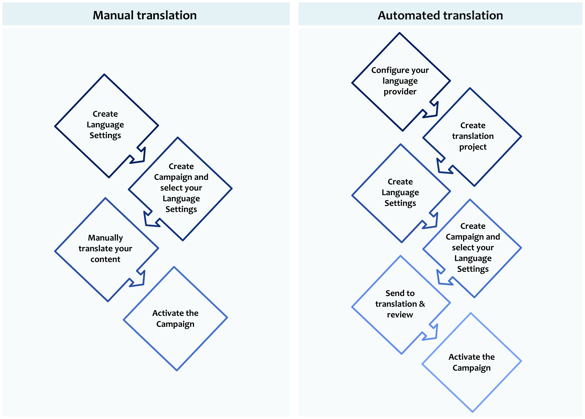
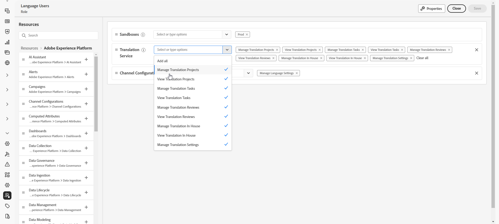
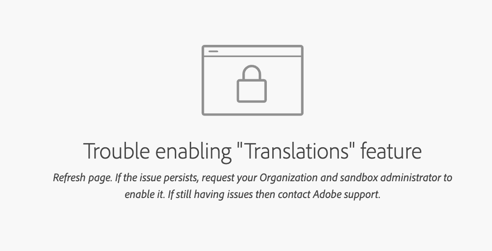

# Introduzione al contenuto multilingue {#multilingual-gs}

>[!BEGINSHADEBOX]

**In questa pagina:** Introduzione al contenuto multilingue per la creazione di messaggi in più lingue all&#39;interno di una singola campagna o di un singolo percorso, mediante la traduzione manuale o automatica, ed esame dei prerequisiti richiesti.

>[!ENDSHADEBOX]

>[!CONTEXTUALHELP]
>id="ajo_multi_translation_homepage"
>title="Traduzioni"
>abstract="La funzione di multilingue consente di creare facilmente contenuti in più lingue all’interno di una campagna o di un percorso. Tramite la pagina Traduzioni è possibile configurare progetti, selezionare provider di traduzione o gestire dizionari specifici per ogni lingua."

La funzione multilingue consente di creare facilmente contenuti in più lingue all’interno di una singola campagna o percorso. Grazie a questa funzione, è possibile cambiare lingua durante la modifica della campagna, semplificando l’intero processo di modifica e migliorando la capacità di gestire in modo efficiente i contenuti multilingue.

Con Journey Optimizer, puoi creare contenuti multilingue attraverso due metodi distinti:

* **Traduzione manuale**: traduci il contenuto direttamente nel Designer e-mail o importa contenuto multilingue esistente. [Ulteriori informazioni](multilingual-manual.md)

* **Traduzione automatica**: invia contenuto al provider della lingua preferita per la traduzione automatica. [Ulteriori informazioni](multilingual-automated.md)

 

## Prerequisiti {#prerequisites}

>[!CONTEXTUALHELP]
>id="ajo_multi_translation_error"
>title="Errore di traduzione"
>abstract="Se non riesci ad accedere alla pagina Traduzione, è probabile che la funzione Traduzione non sia abilitata. Per risolvere questo problema, assicurati che la funzione di traduzione sia attivata dall’amministratore organizzazione e sandbox."

Adobe Journey Optimizer attualmente si integra con i provider di traduzioni, che offrono servizi di traduzione di terze parti (traduzione automatica o umana) indipendenti da Adobe Journey Optimizer.

Prima di aggiungere il provider di traduzione selezionato, è necessario creare un account con tale provider applicabile.

L’utilizzo dei servizi di traduzione di un fornitore di traduzione è soggetto a termini e condizioni aggiuntivi da parte del fornitore applicabile.  In qualità di soluzioni di terze parti, i servizi di traduzione sono disponibili per gli utenti di Adobe Journey Optimizer tramite un’integrazione.  Adobe non controlla e non è responsabile per i prodotti di terze parti.

Per eventuali problemi o richieste di assistenza relativi alle traduzioni, contatta il fornitore di traduzione competente.

Per il contenuto multilingue, è necessario definire le seguenti impostazioni:

* Per utilizzare la funzione di traduzione in Journey Optimizer, devi assegnare l’API al ruolo corrispondente. [Ulteriori informazioni](https://experienceleague.adobe.com/it/docs/experience-platform/landing/platform-apis/api-authentication#assign-api-to-a-role)

* Per iniziare a creare contenuti multilingue, è necessario concedere agli utenti l&#39;autorizzazione **[!UICONTROL Gestione impostazioni lingua]**. Per il flusso automatizzato, gli utenti avranno bisogno anche di autorizzazioni relative alle funzionalità di **[!UICONTROL Servizio di traduzione]**. [Ulteriori informazioni sulle autorizzazioni](../administration/permissions.md)

  +++ Scopri come assegnare autorizzazioni correlate multilingue

   1. Nel prodotto **Autorizzazioni**, passa alla scheda **Ruoli** e seleziona il **Ruolo** desiderato.

   1. Fai clic su **Modifica** per modificare le autorizzazioni.

   1. Aggiungi la risorsa **Servizio di traduzione**, quindi seleziona le autorizzazioni multilingue appropriate dal menu a discesa.

      {zoomable="yes"}

   1. Fai clic su **Salva** per applicare le modifiche.

      Le autorizzazioni degli utenti già assegnati a questo ruolo verranno aggiornate automaticamente.

   1. Per assegnare questo ruolo a nuovi utenti, passa alla scheda **Utenti** nella dashboard **Ruoli** e fai clic su **Aggiungi utente**.

   1. Immetti il nome o l’indirizzo e-mail dell’utente o sceglilo dall’elenco e fai clic su **Salva**.

   1. Se l’utente non è già stato creato in precedenza, consulta [questa documentazione](https://experienceleague.adobe.com/it/docs/experience-platform/access-control/abac/permissions-ui/users).

  +++

* Se non riesci ad accedere alla pagina di traduzione, devi abilitare la funzione di traduzione e ricevere **[!UICONTROL le autorizzazioni relative al servizio di traduzione]**. [Ulteriori informazioni](../administration/ootb-permissions.md)

  +++ Scopri come abilitare la funzione di traduzione

   1. Se viene visualizzata la pagina di errore seguente, significa che la funzionalità **[!UICONTROL Traduzione]** non è ancora stata abilitata. Per richiedere l’accesso, contatta l’amministratore della tua organizzazione e della sandbox.

  

   1. L&#39;amministratore dovrà passare al menu **[!UICONTROL Traduzione]** nella barra laterale a sinistra.

      Il sistema attiverà automaticamente la funzione di traduzione.

   1. Una volta abilitata la funzionalità, potrai accedere alla pagina **[!UICONTROL Traduzione]** insieme alle schede **[!UICONTROL Progetti]**, **[!UICONTROL Provider]** e **[!UICONTROL Impostazioni internazionali]**.

   1. Se questa procedura non è riuscita, verrà comunque visualizzata la stessa pagina di errore. In tal caso, contatta il rappresentante Adobe per ulteriore assistenza.

  +++

## Video introduttivo {#video}

Scopri come creare contenuti in più lingue all’interno di una singola campagna o percorso.

>[!VIDEO](https://video.tv.adobe.com/v/3452121?captions=ita)
