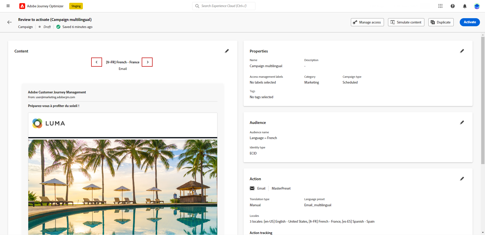

# Creare contenuti multilingue {#multilingual}

La funzione multilingue consente di creare facilmente contenuti in più lingue all’interno di una singola campagna. Grazie a questa funzione, è possibile cambiare lingua durante la modifica della campagna, semplificando l’intero processo di modifica e migliorando la capacità di gestire in modo efficiente i contenuti multilingue.

## Crea lingua {#create-locale}

Durante la configurazione delle impostazioni della lingua, come descritto in [Creare le impostazioni della lingua](#language-settings) , se non è disponibile una lingua specifica per il contenuto multilingue, è possibile creare il numero di lingue desiderato utilizzando **[!UICONTROL Traduzione]** menu.

1. Dalla sezione **[!UICONTROL Amministrazione]** menu, accesso **[!UICONTROL Canale]**.

   Il menu delle traduzioni consente di accedere all’elenco delle lingue attivate.

1. Dalla sezione **[!UICONTROL Dizionario impostazioni internazionali]** , fare clic su **[!UICONTROL Aggiungi lingua]**.

   

1. Selezionare il codice di impostazioni internazionali dall&#39; **[!UICONTROL Lingua]** e il relativo **[!UICONTROL Regione]**.

1. Clic **[!UICONTROL Salva]** per creare la lingua.

   

## Creare le impostazioni della lingua {#language-settings}

In questa sezione puoi impostare la lingua principale e le lingue associate per la gestione dei contenuti multilingue. Puoi anche scegliere l’attributo da utilizzare per cercare le informazioni relative alla lingua del profilo

1. Dalla sezione **[!UICONTROL Amministrazione]** menu, accesso **[!UICONTROL Canale]**.

1. In **[!UICONTROL Impostazioni lingua]** menu, fai clic su **[!UICONTROL Creare le impostazioni della lingua]**.

   

1. Digita il nome della tua **[!UICONTROL Impostazioni lingua]**.

1. Seleziona la **[!UICONTROL Impostazioni internazionali]** associato a queste impostazioni. Puoi aggiungere un massimo di 50 impostazioni internazionali.

   Se un **[!UICONTROL Lingua]** mancante, è possibile crearlo manualmente in anticipo dalla **[!UICONTROL Traduzione]** menu o tramite API. Fai riferimento a [Crea una nuova lingua](#create-locale).

   

1. Dalla sezione **[!UICONTROL Preferenza di invio]** selezionare l&#39;attributo che si desidera cercare per trovare informazioni sulle lingue del profilo.

   

1. Clic **[!UICONTROL Modifica]** accanto al tuo **[!UICONTROL Lingua]** per personalizzarlo ulteriormente e aggiungere **[!UICONTROL Preferenze profilo]**.

   

1. Seleziona altro **[!UICONTROL Impostazioni internazionali]** dal menu a discesa Preferenze profilo e fai clic su **[!UICONTROL Aggiungere profili]**.

1. Accedi al menu avanzato del **[!UICONTROL Lingua]** per definire **[!UICONTROL Impostazioni locali principali]**, ovvero la lingua predefinita se l’attributo del profilo non è specificato.

   È inoltre possibile eliminare le impostazioni locali da questo menu avanzato.

   

1. Clic **[!UICONTROL Invia]** per creare **[!UICONTROL Impostazioni lingua]**.

<!--
1. Access the **[!UICONTROL Channel surfaces]** menu and create a new channel surface or select an existing one.

1. In the **[!UICONTROL Header parameters]** section, select the **[!UICONTROL Enable multilingual]** option.

1. Select your **[!UICONTROL Locales dictionary]** and add as many as needed.
-->

## Creare una campagna multilingue {#create-multilingual-campaign}

1. Inizia creando e configurando la campagna in base alle tue esigenze. [Ulteriori informazioni](../campaigns/create-campaign.md)

1. Accedi a **[!UICONTROL Azioni]** e selezionare **[!UICONTROL Modifica contenuto]**.

   

1. Crea o importa il contenuto originale e personalizzalo in base alle esigenze.

1. Una volta creato il contenuto principale, fai clic su **[!UICONTROL Salva]** e torna alla schermata di configurazione della campagna.

   

1. Clic **[!UICONTROL Aggiungi lingue]** e seleziona il creato in precedenza **[!UICONTROL Impostazioni lingua]**. [Ulteriori informazioni](#create-language-settings)

   

1. Accedi alle impostazioni avanzate di **[!UICONTROL Impostazioni internazionali]** menu e seleziona **[!UICONTROL Copia principale in tutte le lingue]**.

   

1. Ora che il contenuto principale viene duplicato in tutto il file selezionato  **[!UICONTROL Impostazioni internazionali]**, accedere alle impostazioni locali e fare clic su **[!UICONTROL Modifica corpo dell’e-mail]** per tradurre il contenuto.

   

1. È possibile scegliere di disabilitare o abilitare le impostazioni internazionali con **[!UICONTROL Altre azioni]** nel menu della lingua selezionata.

   

1. Per disattivare la configurazione multilingue, fai clic su **[!UICONTROL Aggiungi lingue]** e selezionare la lingua da mantenere come lingua locale.

   

1. Clic **[!UICONTROL Controlla per attivare]** per visualizzare un riepilogo della campagna.

   Il riepilogo ti consente di modificare la campagna, se necessario, e di verificare se un parametro è errato o mancante.

1. Sfoglia i contenuti multilingue per visualizzare il rendering in ogni lingua.

   

1. Verifica che la campagna sia configurata correttamente, quindi fai clic su **[!UICONTROL Attiva]**.

La campagna è ora attivata. Il messaggio configurato nella campagna viene inviato immediatamente o alla data specificata. Non è possibile modificare la campagna non appena è attiva. Per riutilizzare il contenuto, puoi duplicare la campagna.

Una volta inviato, puoi misurare l’impatto delle campagne all’interno dei rapporti sulle campagne.

## Rapporto campagna multilingue {#multilingual-campaign-report}

Rapporti globali, accessibili dalla **Sempre** , visualizza gli eventi che si sono verificati almeno due ore fa e copre gli eventi in un periodo di tempo selezionato. Il rapporto globale della campagna è accessibile direttamente dalla campagna con **[!UICONTROL Visualizza rapporto]** pulsante.

Per ulteriori informazioni sui dati disponibili nel rapporto della campagna, consulta [questa pagina](../reports/campaign-global-report.md).

+++Ulteriori informazioni sulle diverse metriche e widget disponibili per i contenuti multilingue.

Il **[!UICONTROL Statistiche sull’invio di e-mail per lingue]** Il widget descrive il successo della consegna in base alla **[!UICONTROL Impostazioni internazionali]**:

* **[!UICONTROL Consegnato]**: numero di messaggi inviati correttamente rispetto al numero totale di messaggi inviati.

* **[!UICONTROL Mancati recapiti]**: totale degli errori accumulati durante la consegna e l’elaborazione automatica dei messaggi restituiti rispetto al numero totale di messaggi inviati.

* **[!UICONTROL Errori]**: numero totale di errori che si sono verificati durante una consegna e che ne hanno impedito l’invio ai profili.

Il **[!UICONTROL Statistiche di tracciamento e-mail per lingue]** Il widget contiene i dati disponibili per l’attività del destinatario per la consegna in base al **[!UICONTROL Impostazioni internazionali]**:

* **[!UICONTROL Annulla iscrizione]**: numero di clic sul collegamento di annullamento dell’abbonamento.

* **[!UICONTROL Aperture]**: numero di volte in cui il messaggio è stato aperto.

* **[!UICONTROL Clic]**: numero di volte in cui è stato fatto clic su un contenuto.
+++

<!--
# Create a multilingual journey {#create-multilingual-journey}

1. Create your journey with a Delivery and personalize your content as needed.
1. From your delivery action, click Edit content.
1. Click Add languages.

# Translation project/ Create translation project:

1. From the Translation projects menu, click Create project.
1. Type-in a Name and Description.
1. Select the Source locale.
1. Click Add language to access the menu and define the languages for your translation project.
1. Select from the list your Target locale(s) and choose which Translation provider you want to use.
1. Click Add language when you finished linking your Target locale with the correct Translation provider.
1. Click Save.
1. From the Advanced menu of your Translation project, you can choose to Edit, deactive or delete it.
-->
