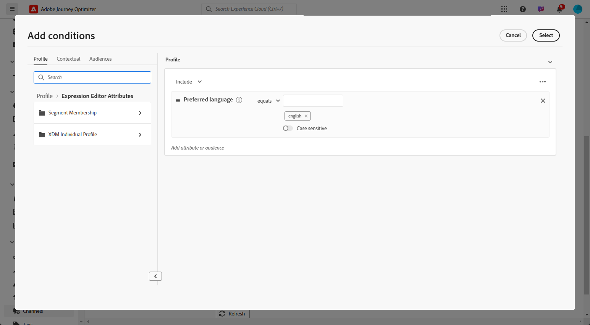

# Creare contenuto multilingue con traduzione manuale {#multilingual-manual}

>[!IMPORTANT]
>
>Per il flusso manuale, è necessario concedere agli utenti l&#39;autorizzazione **[!UICONTROL Gestione impostazioni lingua]**.

Utilizzando il flusso manuale, puoi tradurre facilmente i contenuti direttamente nelle campagne e nei percorsi, offrendoti opzioni precise di controllo e personalizzazione per i messaggi multilingue. Inoltre, è possibile importare facilmente contenuti multilingue preesistenti con l’opzione Importa HTML.

Per creare contenuti multilingue mediante la traduzione manuale, segui la procedura riportata di seguito:

1. [Aggiungere il provider (facoltativo)](multilingual-provider.md)

1. [Aggiungi impostazioni internazionali (facoltativo)](multilingual-locale.md)

1. [Creare le impostazioni della lingua](#language-settings)

1. [Creare un contenuto multilingue](#create-multilingual-campaign)

## Creare le impostazioni della lingua {#language-settings}

In questa sezione puoi impostare diverse lingue per la gestione dei contenuti multilingue. Puoi anche scegliere l’attributo da utilizzare per cercare le informazioni relative alla lingua del profilo

1. Dal menu **[!UICONTROL Amministrazione]**, accedere a **[!UICONTROL Canale]** > **[!UICONTROL Impostazioni generali]**.

1. Nel menu **[!UICONTROL Impostazioni lingua]**, fare clic su **[!UICONTROL Crea impostazioni lingua]**.

   

1. Digitare il nome delle **[!UICONTROL impostazioni lingua]** e scegliere **[!UICONTROL Traduzione manuale]**.

1. Seleziona le **[!UICONTROL impostazioni internazionali]** associate a queste impostazioni. Puoi aggiungere un massimo di 50 impostazioni internazionali.

   Se manca una **[!UICONTROL Lingua]**, puoi crearla manualmente in anticipo dal menu **[!UICONTROL Traduzione]** o tramite API. Consulta [Crea una nuova lingua](multilingual-locale.md).

   

1. Seleziona **[!UICONTROL Preferenze di fallback]** per definire un&#39;opzione di backup per i profili che non soddisfano i criteri necessari per la distribuzione dei contenuti.

   Se non è selezionata alcuna opzione di fallback, la campagna o il percorso non verrà inviato.

1. Scegli la preferenza di invio tra le seguenti opzioni:

   * **[!UICONTROL Selezionare gli attributi delle preferenze della lingua del profilo]**
   * **[!UICONTROL Creare regole condizionali personalizzate]**

1. Se si seleziona **[!UICONTROL Seleziona attributi di preferenza lingua profilo]**, scegliere l&#39;attributo appropriato dal menu **[!UICONTROL Attributi di preferenza lingua profilo]** per cercare le informazioni sulla lingua profilo.

   

1. Se si seleziona **[!UICONTROL Crea regole condizionali personalizzate]**, selezionare le impostazioni locali per le quali si desidera creare le condizioni. Quindi, crea regole in base a fattori come la posizione dell’utente, le preferenze della lingua o altri elementi contestuali.

   

1. Inizia a creare le condizioni aggiungendo un attributo, un evento o un pubblico per definire il gruppo target.

   >[!IMPORTANT]
   >
   >I dati contestuali sono disponibili esclusivamente per i canali Web, In-App, basati su codice per le schede di esperienza e di contenuto. Se utilizzata per i canali E-mail, SMS, Notifica push o Direct mail, senza attributi aggiuntivi, la campagna o il percorso verrà inviato nella lingua della prima opzione dell’elenco.

   

   +++Prerequisiti per l’utilizzo di eventi contestuali nelle condizioni

   Quando gli utenti visualizzano il contenuto, viene inviata una richiesta di personalizzazione insieme all’evento esperienza. Per sfruttare i dati contestuali nelle tue condizioni, devi allegare dati aggiuntivi al payload della richiesta di personalizzazione. A questo scopo, devi creare una regola in Raccolta dati di Adobe Experience Platform per specificare: SE viene inviata una richiesta di personalizzazione, ALLORA allega dati aggiuntivi alla richiesta, definendo l’attributo da abbinare al campo della lingua nello schema.

   >[!NOTE]
   >
   >Questi prerequisiti sono necessari solo per i canali delle schede in-app e di contenuto.

   1. In Raccolta dati di Adobe Experience Platform, accedi al menu **[!UICONTROL Regole]** e crea una nuova regola. Informazioni dettagliate su come creare regole sono disponibili nella [!DNL Adobe Experience Platform] [documentazione sulla raccolta dati](https://experienceleague.adobe.com/it/docs/experience-platform/collection/e2e#create-a-rule){target="_blank"}

   2. Nella sezione **[!UICONTROL IF]** della regola, aggiungi un evento configurato come segue:

      

      * Scegli l&#39;**[!UICONTROL estensione]** con cui stai lavorando.
      * Nel campo **[!UICONTROL Tipo evento]**, seleziona &quot;Evento richiesta AEP&quot;.
      * Nel riquadro a destra, seleziona &quot;XDM Event Type equals personalization.request&quot;
      * Fai clic sul pulsante **[!UICONTROL Mantieni modifiche]** per confermare.

   3. Nella sezione **[!UICONTROL THEN]** della regola, aggiungi un&#39;azione configurata come segue:

      

      * Scegli l&#39;**[!UICONTROL estensione]** con cui stai lavorando.
      * Nel campo **[!UICONTROL Tipo azione]**, selezionare &quot;Allega dati&quot;.
      * Nella sezione del payload JSON, accertati che l’attributo utilizzato per recuperare il linguaggio da utilizzare (nell’esempio seguente &quot;lingua&quot;) corrisponda al nome dell’attributo specificato nello schema in cui il flusso di dati della raccolta dati si propaga.

        ```JSON
        {
            "xdm":{
                "application":{
                    "_dc":{
                        "language":"{%%Language%%}"
                    }
                }
            }
        }
        ```

      * Fai clic sul pulsante **[!UICONTROL Mantieni modifiche]** per confermare e salvare la regola.

   +++

1. Trascina e rilascia le impostazioni locali per riordinarle e gestirne la priorità nell’elenco.

1. Per eliminare una lingua, fare clic sull&#39;icona del raccoglitore.

   

1. Fai clic su **[!UICONTROL Invia]** per creare le **[!UICONTROL impostazioni lingua]**.

Dopo aver impostato le preferenze della lingua, non sarà più possibile modificarle.

<!--
1. Access the **[!UICONTROL channel configurations]** menu and create a new channel configuration or select an existing one.


1. In the **[!UICONTROL Header parameters]** section, select the **[!UICONTROL Enable multilingual]** option.

1. Select your **[!UICONTROL Locales dictionary]** and add as many as needed.
-->

## Creare un contenuto multilingue {#create-multilingual-campaign}

Dopo aver configurato il contenuto multilingue, puoi creare la campagna o il percorso e personalizzarne il contenuto per ciascuna delle lingue selezionate.

1. Inizia creando e configurando la tua notifica e-mail, SMS o push [campagna](../campaigns/create-campaign.md) o [percorso](../building-journeys/journeys-message.md) in base alle tue esigenze.

   >[!IMPORTANT]
   >
   >Si consiglia di includere un solo progetto di traduzione al percorso.

1. Crea o importa il contenuto originale e personalizzalo in base alle esigenze.

1. Una volta creato il contenuto, fai clic su **[!UICONTROL Salva]** e torna alla schermata di configurazione della campagna.

   

1. Fai clic su **[!UICONTROL Aggiungi lingue]** e seleziona le **[!UICONTROL Impostazioni lingua]** create in precedenza. [Ulteriori informazioni](#language-settings)

   

1. Scegli le impostazioni locali desiderate dal menu a discesa da applicare al contenuto creato esistente.

1. Accedi alle impostazioni avanzate del menu **[!UICONTROL Impostazioni internazionali]** e seleziona **[!UICONTROL Copia in tutte le impostazioni internazionali]**.

   

1. Ora che il contenuto è duplicato in tutte le **[!UICONTROL Impostazioni locali]** selezionate, accedi a tutte le impostazioni locali e fai clic su **[!UICONTROL Modifica corpo dell&#39;e-mail]** per tradurre il contenuto.

   

1. Puoi scegliere di disabilitare o abilitare le impostazioni internazionali con il menu **[!UICONTROL Ulteriori azioni]** della lingua selezionata.

   

1. Per disattivare la configurazione multilingue, fare clic su **[!UICONTROL Aggiungi lingue]** e selezionare la lingua da mantenere come lingua locale.

   

1. Fai clic su **[!UICONTROL Rivedi per attivare]** per visualizzare un riepilogo della campagna.

   Il riepilogo ti consente di modificare la campagna, se necessario, e di verificare se un parametro è errato o mancante.

1. Sfoglia i contenuti multilingue per visualizzare il rendering in ogni lingua.

   

Ora puoi attivare la campagna o il percorso. Una volta inviato, puoi misurare l’impatto del percorso multilingue o della campagna all’interno dei rapporti.

>[!IMPORTANT]
>
> Se la campagna è soggetta a un criterio di approvazione, per poter inviare la campagna o il percorso multilingue dovrai richiedere l’approvazione. [Ulteriori informazioni](../test-approve/gs-approval.md)

<!--
# Create a multilingual journey {#create-multilingual-journey}

1. Create your journey with a Delivery and personalize your content as needed.
1. From your delivery action, click Edit content.
1. Click Add languages.

-->
