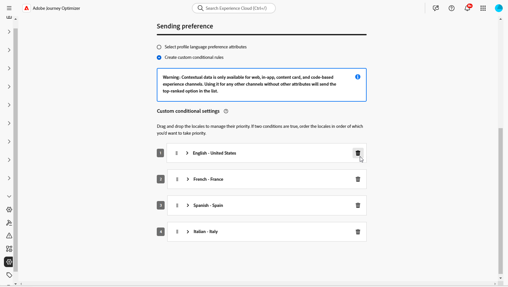

# Creare contenuto multilingue con traduzione manuale {#multilingual-manual}

>[!BEGINSHADEBOX]

**Sommario**

* [Introduzione al contenuto multilingue](multilingual-gs.md)
* Creare contenuto multilingue con traduzione manuale
* [Creare contenuto multilingue con traduzione automatica](multilingual-automated.md)
* [Rapporto campagna multilingue](multilingual-report.md)

>[!ENDSHADEBOX]

Utilizzando il flusso manuale, puoi tradurre facilmente il contenuto direttamente nella tua campagna e-mail, notifica push o SMS, offrendoti opzioni precise di controllo e personalizzazione per i messaggi multilingue. Inoltre, puoi importare facilmente contenuti multilingue preesistenti con l’opzione Importa HTML.

Per creare contenuti multilingue mediante la traduzione manuale, segui la procedura riportata di seguito:

1. [Creare le impostazioni locali](#create-locale).

1. [Creare le impostazioni della lingua](#create-language-settings).

1. [Creare una campagna multilingue](#create-a-multilingual-campaign).

## Crea lingua {#create-locale}

Durante la configurazione delle impostazioni della lingua, come descritto in [Creare le impostazioni della lingua](#language-settings) , se non è disponibile una lingua specifica per il contenuto multilingue, è possibile creare il numero di lingue desiderato utilizzando **[!UICONTROL Traduzione]** menu.

1. Dalla sezione **[!UICONTROL Amministrazione]** menu, accesso **[!UICONTROL Canale]**.

   Il menu delle traduzioni consente di accedere all’elenco delle lingue attivate.

1. Dalla sezione **[!UICONTROL Dizionario impostazioni internazionali]** , fare clic su **[!UICONTROL Aggiungi lingua]**.

   

1. Selezionare il codice di impostazioni internazionali dall&#39; **[!UICONTROL Lingua]** e il relativo **[!UICONTROL Regione]**.

1. Clic **[!UICONTROL Salva]** per creare la lingua.

   

## Creare le impostazioni della lingua {#language-settings}

In questa sezione puoi impostare la lingua principale e le lingue associate per la gestione dei contenuti multilingue. Puoi anche scegliere l’attributo da utilizzare per cercare le informazioni relative alla lingua del profilo

1. Dalla sezione **[!UICONTROL Amministrazione]** menu, accesso **[!UICONTROL Canale]**.

1. In **[!UICONTROL Impostazioni lingua]** menu, fai clic su **[!UICONTROL Creare le impostazioni della lingua]**.

   

1. Digita il nome della tua **[!UICONTROL Impostazioni lingua]**.

1. Seleziona la **[!UICONTROL Impostazioni internazionali]** associato a queste impostazioni. Puoi aggiungere un massimo di 50 impostazioni internazionali.

   Se un **[!UICONTROL Lingua]** mancante, è possibile crearlo manualmente in anticipo dalla **[!UICONTROL Traduzione]** menu o tramite API. Fai riferimento a [Crea una nuova lingua](#create-locale).

   

1. Dalla sezione **[!UICONTROL Preferenza di invio]** selezionare l&#39;attributo che si desidera cercare per trovare informazioni sulle lingue del profilo.

   

1. Clic **[!UICONTROL Modifica]** accanto al tuo **[!UICONTROL Lingua]** per personalizzarlo ulteriormente e aggiungere **[!UICONTROL Preferenze profilo]**.

   

1. Seleziona altro **[!UICONTROL Impostazioni internazionali]** dal menu a discesa Preferenze profilo e fai clic su **[!UICONTROL Aggiungere profili]**.

1. Accedi al menu avanzato del **[!UICONTROL Lingua]** per definire **[!UICONTROL Impostazioni locali principali]**, ovvero la lingua predefinita se l’attributo del profilo non è specificato.

   È inoltre possibile eliminare le impostazioni locali da questo menu avanzato.

   

1. Clic **[!UICONTROL Invia]** per creare **[!UICONTROL Impostazioni lingua]**.

<!--
1. Access the **[!UICONTROL Channel surfaces]** menu and create a new channel surface or select an existing one.

1. In the **[!UICONTROL Header parameters]** section, select the **[!UICONTROL Enable multilingual]** option.

1. Select your **[!UICONTROL Locales dictionary]** and add as many as needed.
-->

## Creare una campagna multilingue {#create-multilingual-campaign}

Dopo aver configurato il contenuto multilingue, puoi creare la campagna e personalizzarne il contenuto per ciascuna lingua selezionata.

1. Inizia creando e configurando la tua campagna di notifica e-mail, SMS o push in base alle tue esigenze. [Ulteriori informazioni](../campaigns/create-campaign.md)

1. Accedi a **[!UICONTROL Azioni]** e selezionare **[!UICONTROL Modifica contenuto]**.

   

1. Crea o importa il contenuto originale e personalizzalo in base alle esigenze.

1. Una volta creato il contenuto principale, fai clic su **[!UICONTROL Salva]** e torna alla schermata di configurazione della campagna.

   

1. Clic **[!UICONTROL Aggiungi lingue]** e seleziona il creato in precedenza **[!UICONTROL Impostazioni lingua]**. [Ulteriori informazioni](#create-language-settings)

   

1. Accedi alle impostazioni avanzate di **[!UICONTROL Impostazioni internazionali]** menu e seleziona **[!UICONTROL Copia principale in tutte le lingue]**.

   

1. Ora che il contenuto principale viene duplicato in tutto il file selezionato  **[!UICONTROL Impostazioni internazionali]**, accedere alle impostazioni locali e fare clic su **[!UICONTROL Modifica corpo dell’e-mail]** per tradurre il contenuto.

   

1. È possibile scegliere di disabilitare o abilitare le impostazioni internazionali con **[!UICONTROL Altre azioni]** nel menu della lingua selezionata.

   

1. Per disattivare la configurazione multilingue, fai clic su **[!UICONTROL Aggiungi lingue]** e selezionare la lingua da mantenere come lingua locale.

   

1. Clic **[!UICONTROL Controlla per attivare]** per visualizzare un riepilogo della campagna.

   Il riepilogo ti consente di modificare la campagna, se necessario, e di verificare se un parametro è errato o mancante.

1. Sfoglia i contenuti multilingue per visualizzare il rendering in ogni lingua.

   

1. Verifica che la campagna sia configurata correttamente, quindi fai clic su **[!UICONTROL Attiva]**.

La campagna è ora attivata. Il messaggio configurato nella campagna viene inviato immediatamente o alla data specificata. Non è possibile modificare la campagna non appena è attiva. Per riutilizzare il contenuto, puoi duplicare la campagna.

Una volta inviato, puoi misurare l’impatto delle campagne all’interno dei rapporti sulle campagne.

<!--
# Create a multilingual journey {#create-multilingual-journey}

1. Create your journey with a Delivery and personalize your content as needed.
1. From your delivery action, click Edit content.
1. Click Add languages.

-->
