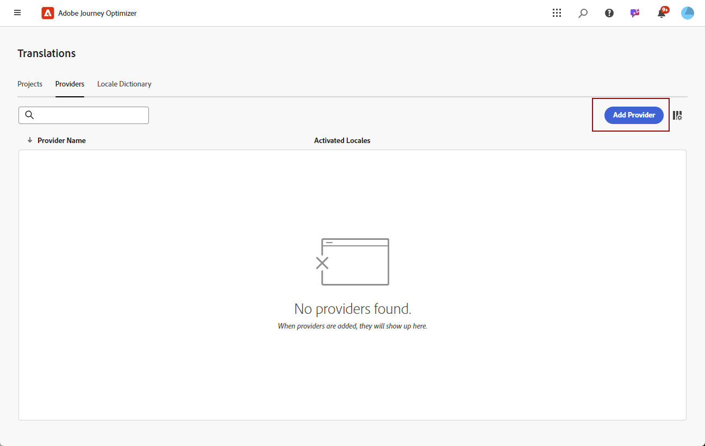
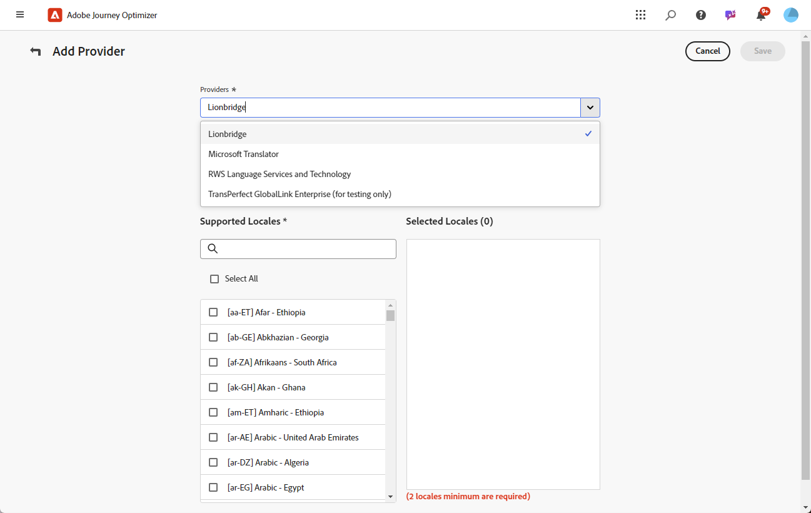

# Aggiungi provider di lingue {#multilingual-provider}

>[!IMPORTANT]
>
> L’utilizzo dei servizi di traduzione di un fornitore di traduzione è soggetto a termini e condizioni aggiuntivi da parte del fornitore applicabile. In qualità di soluzioni di terze parti, i servizi di traduzione sono disponibili per gli utenti di Adobe Journey Optimizer tramite un’integrazione. Adobe non controlla e non è responsabile per i prodotti di terze parti.

Adobe Journey Optimizer si integra con fornitori di traduzioni di terze parti che offrono servizi di traduzione automatica e umana, indipendenti da Adobe Journey Optimizer.

Prima di aggiungere il provider di traduzione scelto, assicurati di aver creato un account con il rispettivo provider.

1. Nel menu **[!UICONTROL Gestione contenuto]**, passa a **[!UICONTROL Traduzione]**.

1. Accedere alla scheda **[!UICONTROL Provider]** e fare clic su **[!UICONTROL Aggiungi provider]**.

   

1. Dall&#39;elenco a discesa **[!UICONTROL Provider]**, scegliere il provider desiderato.

   >[!NOTE]
   >
   >Per aggiungere un nuovo **Provider** all&#39;elenco, puoi chiedere al tuo **Provider** di seguire le istruzioni descritte in [questo documento](https://developer.adobe.com/gcs/partner/) per completare il processo di onboarding.

   

1. Se utilizzi Microsoft Translator come provider, inserisci la **[!UICONTROL chiave di abbonamento]** e l&#39;**[!UICONTROL URL endpoint]**.

   

1. Seleziona le **impostazioni internazionali supportate** applicabili.

   

1. Dopo aver completato la configurazione, fai clic su **[!UICONTROL Salva]** per finalizzare l&#39;installazione.
