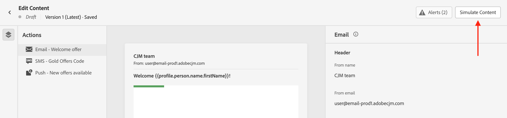

# Anteprima e test del contenuto {#preview-test}

>[!BEGINSHADEBOX]

**In questa pagina:** scopri come visualizzare in anteprima e testare il contenuto del messaggio in Adobe Journey Optimizer utilizzando profili di test o dati di input di esempio per verificarne il rendering, la personalizzazione e l’accuratezza prima dell’invio.

>[!ENDSHADEBOX]

>[!CONTEXTUALHELP]
>id="ac_preview_testprofiles"
>title="Controllare come viene eseguito il rendering del contenuto"
>abstract="Una volta definito il contenuto, puoi utilizzare i profili di test per visualizzarne l’anteprima e verificare se il rendering è corretto in base al canale in uso."

>[!CONTEXTUALHELP]
>id="ajo_preview_simulate"
>title="Controllare come viene eseguito il rendering del contenuto"
>abstract="Una volta definito il contenuto, puoi visualizzarne l’anteprima e verificare se il rendering è corretto in base al canale in uso."

Una volta definito il contenuto, puoi visualizzarne l’anteprima prima di inviare il messaggio. Questo è un passaggio fondamentale per garantire che sia accurato ma anche privo di errori, sia nelle impostazioni del contenuto che della personalizzazione.

Puoi anche inviare le consegne di test dei messaggi e-mail a destinatari o iscritti specifici a scopo di test e convalida, e verificarne il rendering nei più diffusi client per desktop, dispositivi mobili e basati su web. Inoltre, puoi valutare aspetti generali della qualità dei contenuti, come leggibilità ed efficacia. [Ulteriori informazioni sulla convalida della qualità dei contenuti](brands-score.md#validate-quality)

Tutte queste azioni possono essere eseguite utilizzando il pulsante **[!UICONTROL Simula contenuto]**, accessibile dalla schermata di modifica del contenuto del messaggio, oppure dai designer di e-mail e web per i rispettivi canali. Fai clic su **[!UICONTROL Simula contenuto]** per testare le varianti di contenuto utilizzando dati di input di esempio. Per visualizzare in anteprima con i profili di test, inviare bozze o verificare il rendering delle e-mail, seleziona **[!UICONTROL Simula contenuto (profili AEP)]** dal menu a discesa.

>[!IMPORTANT]
>
>Se utilizzi **[!UICONTROL Simula contenuto]** da un’attività di canale di una **campagna orchestrata**, consulta la sezione [Controllare e testare il contenuto](../orchestrated/activities/channels.md#simulate-content-test-profiles) per ulteriori informazioni e note importanti.

## Test tramite dati dei profili di test o dati di input di esempio {#methods}

Journey Optimizer offre due esperienze per testare il contenuto:

* **Test del contenuto tramite i dati dei profili di test**

  Puoi utilizzare i profili di test per visualizzare in anteprima il contenuto, inviare bozze di e-mail e verificare il rendering delle e-mail. Se hai aggiunto campi personalizzati, puoi verificarne la visualizzazione utilizzando i dati del profilo di test. Per ulteriori informazioni, consulta queste sezioni:

  ➡️ [Selezionare i profili di test](test-profiles.md)
➡️ [Visualizzare l’anteprima utilizzando i profili di test](preview.md)
➡️ [Inviare bozze e-mail](proofs.md)
➡️ [Controllare il rendering delle e-mail](rendering.md)
➡️ [Anteprima e bozza dell’e-mail (video)](#video-preview)

* **Verifica delle varianti di contenuto tramite dati di input di esempio**

  [!DNL Journey optimizer] consente di visualizzare in anteprima e inviare le bozze di diverse varianti del contenuto utilizzando i dati di input di esempio caricati da un file CSV o JSON o aggiunti manualmente.

  Tutti gli attributi dei profili utilizzati nel contenuto per la personalizzazione vengono rilevati automaticamente dal sistema e possono essere utilizzati per i test per creare più varianti.

  ➡️ [Simulare varianti di contenuto](../test-approve/simulate-sample-input.md)

## Da leggere

* **Autorizzazioni richieste**: devi disporre dell’autorizzazione **[!DNL Manage Simulate Content]** inclusa nel profilo di prodotto **[!DNL Content Library Manager]**. [Ulteriori informazioni](../administration/ootb-product-profiles.md#content-library-manager).

  Per inviare le bozze, devi disporre delle autorizzazioni di **approvazione e pubblicazione** per la risorsa specifica (campagna o percorso) associata all’e-mail. Inoltre, per inviare bozze in un percorso, è necessaria anche l’autorizzazione per la **pubblicazione del percorso**. [Ulteriori informazioni sulle autorizzazioni](../administration/ootb-permissions.md).

* **Personalizzazione con dati contestuali**: quando si visualizza l’anteprima di un messaggio o si inviano le bozze, vengono visualizzati solo i dati di personalizzazione del profilo. La personalizzazione basata su dati contestuali, come le informazioni sugli eventi, può essere testata solo nel contesto di un percorso. Scopri come in [questo caso d’uso](../personalization/personalization-use-case.md).

* **Anteprima del contenuto con più varianti condizionali**: durante la simulazione o il rendering delle bozze per le e-mail contenenti più varianti condizionali, Journey Optimizer potrebbe richiedere più tempo di elaborazione. In caso di timeout o messaggi di errore, considera di ridurre il numero totale di varianti o di semplificare le regole condizionali. Per ulteriori informazioni sui contenuti condizionali, consulta [questa pagina](../personalization/dynamic-content.md).

## Video dimostrativo {#video-preview}

Scopri come utilizzare i profili di test per testare il rendering delle e-mail nelle caselle in entrata, visualizzare in anteprima le e-mail personalizzate rispetto ai profili di test e inviare bozze.

>[!VIDEO](https://video.tv.adobe.com/v/3430338?captions=ita&quality=12)
