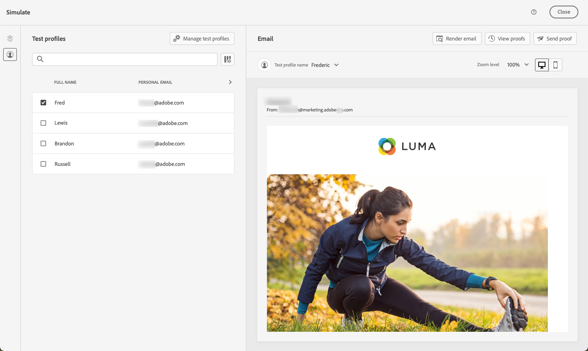

# Visualizzare l’anteprima del contenuto utilizzando i profili di test {#preview}

Dopo aver selezionato i [profili di test](test-profiles.md), puoi visualizzare l&#39;anteprima del contenuto utilizzando i relativi dati. Segui questi passaggi:

1. Dalla schermata Modifica contenuto del messaggio o nel Designer e-mail, fai clic su **[!UICONTROL Simula contenuto]**, quindi seleziona **[!UICONTROL Simula contenuto (profili AEP)]** dal menu a discesa.

1. Seleziona un profilo di test. Puoi controllare i valori disponibili nelle colonne. Utilizza le frecce destra/sinistra per sfogliare i dati.

   

   >[!NOTE]
   >
   >Per aggiungere altri profili di test, selezionare **[!UICONTROL Gestisci profili di test]**. [Ulteriori informazioni](test-profiles.md)

1. Fai clic sull&#39;icona **[!UICONTROL Seleziona dati]** sopra l&#39;elenco per aggiungere o rimuovere colonne.

   Puoi visualizzare i campi di personalizzazione specifici del messaggio corrente alla fine dell’elenco. In questo esempio, la città del profilo, il nome e il cognome. Seleziona questi campi e assicurati che questi valori siano popolati nei profili di test.

   

1. Nell’anteprima del messaggio, gli elementi personalizzati vengono sostituiti dai dati del profilo di test selezionati. Ad esempio, per questo messaggio, sia il contenuto che l’oggetto dell’e-mail sono personalizzati:

   

1. Seleziona altri profili di test per visualizzare in anteprima il messaggio e-mail per ogni variante del messaggio.

   >[!NOTE]
   >
   >Se viene rilevato un errore nei dettagli della configurazione, fare clic sul pulsante **[!UICONTROL Visualizza dettagli configurazione]**. [Ulteriori informazioni](../email/surface-personalization.md#check-configuration)

Quando crei esperienze basate su codice, puoi visualizzare in anteprima i contenuti personalizzati direttamente sul browser o sui dispositivi mobili, per una simulazione reale. [Ulteriori informazioni](../code-based/test-code-based.md#preview-on-device)

>[!NOTE]
>
>[!DNL Journey optimizer] consente inoltre di testare diverse varianti del contenuto visualizzandolo in anteprima e inviando bozze utilizzando dati di input di esempio caricati da un file CSV / JSON o aggiunti manualmente. [Scopri come simulare varianti di contenuto](../test-approve/simulate-sample-input.md)
