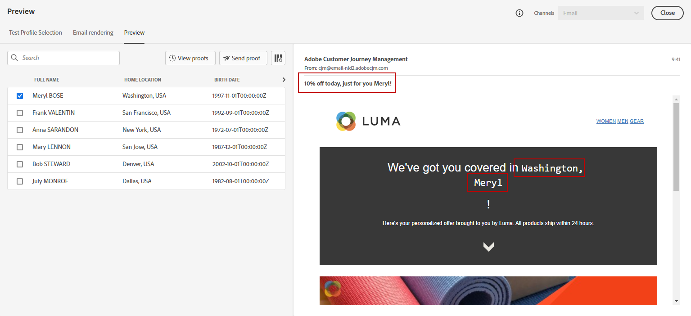

# Anteprima del contenuto {#preview}

Una volta [profili di test](test-profiles.md) , è possibile visualizzare in anteprima il contenuto. Effettua le seguenti operazioni:

1. Dalla schermata di modifica del contenuto del messaggio o in E-mail Designer, fai clic su **[!UICONTROL Simula contenuto]** pulsante.

1. Seleziona un profilo di test. Puoi controllare i valori disponibili nelle colonne. Utilizza le frecce destra/sinistra per sfogliare i dati.

   

   >[!NOTE]
   >
   >Per aggiungere altri profili di test, seleziona **[!UICONTROL Gestire i profili di test]**. [Ulteriori informazioni](test-profiles.md)

1. Fai clic su **[!UICONTROL Seleziona dati]** sopra l&#39;elenco per aggiungere o rimuovere colonne.

   Puoi visualizzare i campi di personalizzazione specifici del messaggio corrente alla fine dell’elenco. In questo esempio, la città del profilo, il nome e il cognome. Seleziona questi campi e assicurati che questi valori siano popolati nei profili di test.

   

1. Nell’anteprima del messaggio, gli elementi personalizzati vengono sostituiti dai dati del profilo di test selezionati. Ad esempio, per questo messaggio, sia il contenuto che l’oggetto dell’e-mail sono personalizzati:

   

1. Seleziona altri profili di test per visualizzare in anteprima il messaggio e-mail per ogni variante del messaggio.
