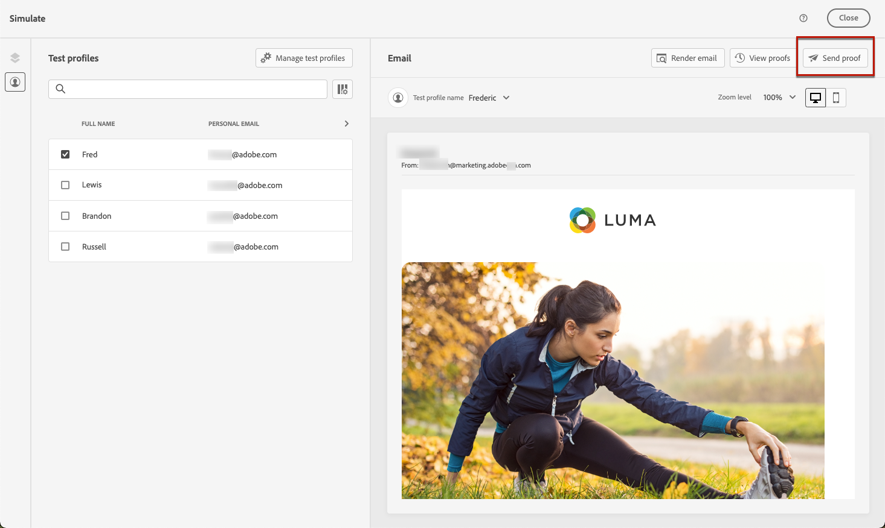
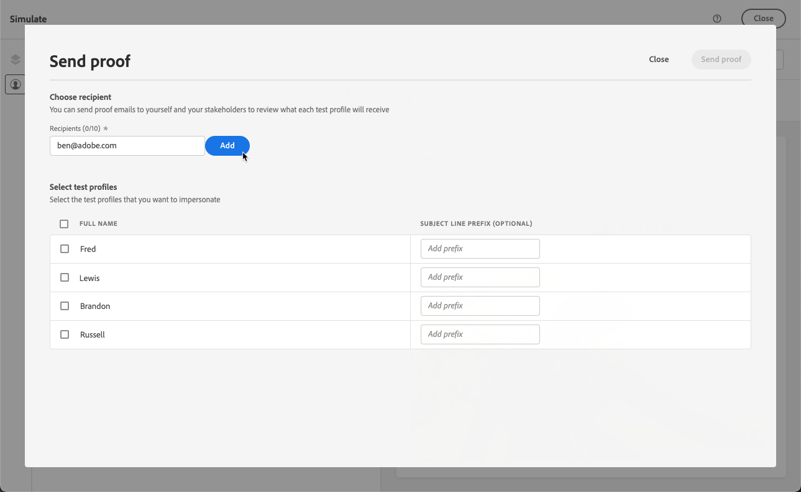

# Inviare bozze utilizzando i dati dei profili di test {#send-proofs}

Una bozza è un messaggio specifico che consente di testare un messaggio prima che venga inviato al pubblico principale. I destinatari della bozza hanno il compito di approvare il messaggio: rendering, contenuto, impostazioni di personalizzazione, configurazione.

>[!NOTE]
>
>[!DNL Journey optimizer] consente inoltre di testare diverse varianti del contenuto visualizzandolo in anteprima e inviando bozze utilizzando dati di input di esempio caricati da un file CSV / JSON o aggiunti manualmente. [Scopri come simulare varianti di contenuto](../test-approve/simulate-sample-input.md)

Per inviare bozze delle e-mail utilizzando i dati dei profili di test, devi prima selezionare [profili di test](test-profiles.md). Quindi, segui questi passaggi:

1. Nella schermata **[!UICONTROL Simula]**, fai clic sul pulsante **[!UICONTROL Invia bozza]**.

   

1. Dalla finestra **[!UICONTROL Invia bozza]**, digita nell&#39;e-mail del destinatario e fai clic su **[!UICONTROL Aggiungi]** per inviare la bozza a te stesso o a membri delle tue organizzazioni.

   Puoi aggiungere fino a dieci destinatari per la consegna della bozza.

   

1. Seleziona i **Profili di test** da utilizzare per personalizzare il contenuto del messaggio.

   Ogni destinatario della bozza riceve tanti messaggi quanti sono i profili di test selezionati. Ad esempio, se hai aggiunto cinque e-mail dei destinatari e hai selezionato dieci profili di test, invierai cinquanta messaggi di bozza e ogni destinatario ne riceverà dieci.

1. Se necessario, puoi aggiungere un prefisso alla riga dell’oggetto della bozza. Solo caratteri alfanumerici e caratteri speciali come . - _ ( ) [ ] sono consentiti come prefisso per la riga dell&#39;oggetto.

1. Fai clic su **[!UICONTROL Invia bozza]**.

   

1. Nella schermata **[!UICONTROL Simula]**, fai clic sul pulsante **[!UICONTROL Visualizza bozze]** per verificare lo stato.

   

Si consiglia di inviare le bozze dopo ogni modifica al contenuto del messaggio.

>[!NOTE]
>
>* Nella bozza inviata, il collegamento alla pagina speculare non è attivo. Viene attivato solo nei messaggi finali.
>
>* Assets/Immagini sono accessibili nei contenuti consegnati o nei contenuti della bozza per un massimo di 2 anni (730 giorni) dalla loro prima pubblicazione in qualsiasi frammento/messaggio in linea. È necessaria una ripubblicazione dopo questo periodo di scadenza (ogni volta dopo 730 giorni) per mantenerli accessibili per altri 2 anni. Qualsiasi ripubblicazione effettuata entro 730 giorni dalla prima pubblicazione non prolunga la scadenza delle risorse/immagini ai successivi 730 giorni.
