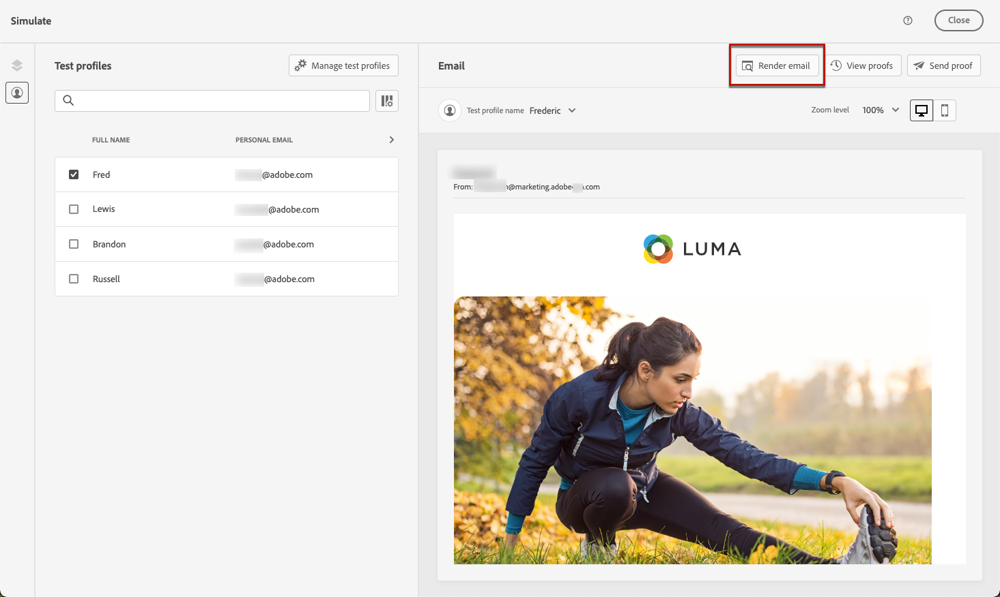

# Testare il rendering delle e-mail {#email-rendering}

Puoi sfruttare il tuo account **Litmus** in [!DNL Journey Optimizer] per visualizzare all&#39;istante l&#39;anteprima del **rendering di e-mail** nei client e-mail più diffusi. Puoi quindi verificare che il contenuto dell’e-mail si presenti e funzioni correttamente in ogni casella in entrata.

Per verificare il rendering di e-mail, effettua le seguenti operazioni:

1. Dalla schermata Modifica contenuto del messaggio o nel Designer e-mail, fai clic su **[!UICONTROL Simula contenuto]**, quindi seleziona **[!UICONTROL Simula contenuto (profili AEP)]** dal menu a discesa.

1. Seleziona il pulsante **[!UICONTROL Rendering dell’e-mail]**.

   

1. Fai clic su **Connetti il tuo account Litmus** nella sezione superiore destra.

   

1. Immetti le credenziali e accedi.

   

1. Fai clic su **Esegui test** per generare anteprime e-mail.

1. Verifica il contenuto delle e-mail nei client desktop, mobili e basati su web più diffusi.

   

>[!CAUTION]
>
>Quando connetti il tuo account **Litmus** con [!DNL Journey Optimizer], accetti che i messaggi di prova vengano inviati a Litmus: una volta inviati, questi messaggi non vengono più gestiti da Adobe. Di conseguenza, i criteri di conservazione dei dati Litmus si applicano a queste e-mail, inclusi i dati di personalizzazione che possono essere inclusi in questi messaggi di test.
