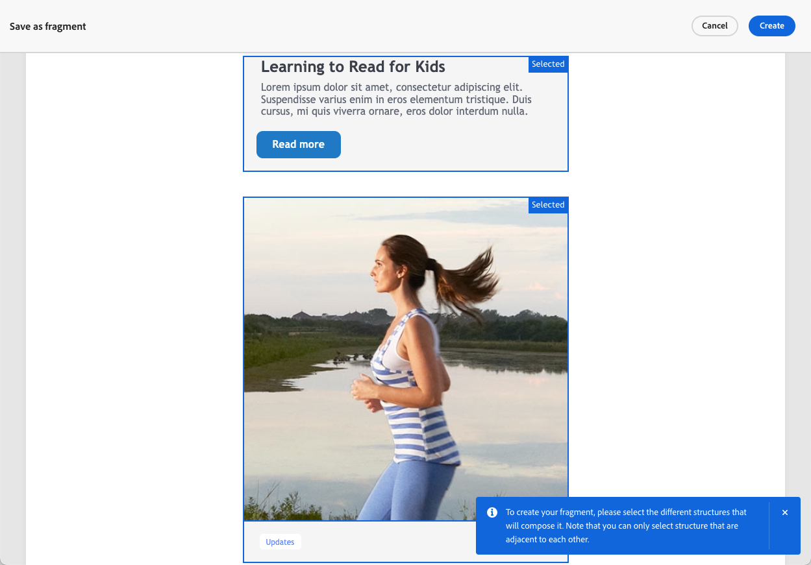
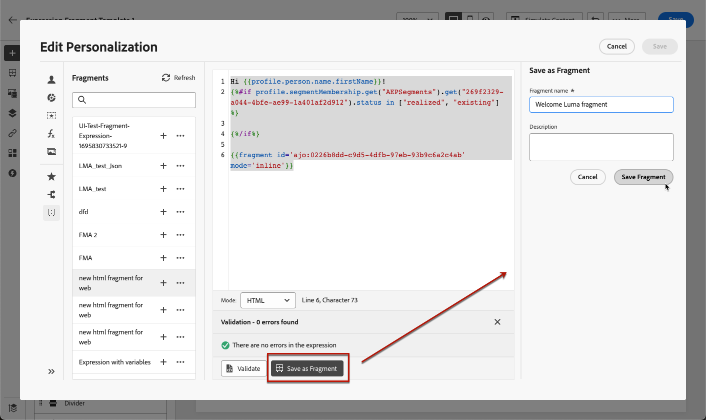

# Salva contenuto come frammento {#save-as-fragment}

>[!BEGINSHADEBOX]

**In questa pagina:** scopri come salvare tutto o parte del contenuto come frammenti visivi o di espressione in Adobe Journey Optimizer in modo da poterlo riutilizzare tra percorsi e campagne.

>[!ENDSHADEBOX]

Quando modifichi il contenuto in [!DNL Journey Optimizer], puoi salvare tutto o parte del contenuto come frammento per riutilizzarlo in futuro. È possibile salvare il contenuto come frammento [da E-mail Designer](#save-as-visual-fragment) o [dall&#39;editor espressioni](#save-as-expression-fragment).

>[!NOTE]
>
>[Gli attributi contestuali](../personalization/personalization-build-expressions.md) non sono supportati nei frammenti.
>
>Quando il tracciamento è abilitato in un percorso o in una campagna, se i collegamenti sono presenti in un frammento salvato e se il frammento viene utilizzato in un messaggio, questi collegamenti vengono tracciati come tutti gli altri collegamenti inclusi nel messaggio. [Ulteriori informazioni su collegamenti e tracciamento](../email/message-tracking.md)

## Salva come frammento visivo {#save-as-visual-fragment}

Per salvare il contenuto da E-mail Designer come frammento, effettua le seguenti operazioni:

1. In [E-mail Designer](../email/get-started-email-design.md), fai clic sui puntini di sospensione in alto a destra dello schermo.

1. Seleziona **[!UICONTROL Salva come frammento]** dal menu a discesa.

   

   >[!NOTE]
   >
   >I frammenti visivi non possono superare i 100 KB.

1. Viene visualizzata la schermata **[!UICONTROL Salva come frammento]**. Seleziona gli elementi da includere nel frammento, inclusi i campi di personalizzazione e il contenuto dinamico.

   

   >[!CAUTION]
   >
   >Puoi selezionare solo le sezioni adiacenti l’una all’altra. Non puoi selezionare una struttura vuota o un altro frammento.

1. Fai clic su **[!UICONTROL Crea]** e compila il nome e la descrizione del frammento (se necessario).

1. Per assegnare etichette di utilizzo dei dati personalizzate o di base al frammento, fare clic sul pulsante **[!UICONTROL Gestisci accesso]** nella sezione superiore della schermata. [Ulteriori informazioni sul controllo degli accessi a livello di oggetto](../administration/object-based-access.md).

1. Seleziona o crea tag Adobe Experience Platform dal campo **Tag** per categorizzare il modello ai fini di una ricerca migliorata. [Ulteriori informazioni](../start/search-filter-categorize.md#tags)

1. Fai clic su **[!UICONTROL Crea]**. Il frammento viene aggiunto all&#39;elenco di frammenti  con lo stato **Bozza**. Diventa un frammento indipendente che può essere utilizzato come qualsiasi altro frammento visivo da tale elenco.

   >[!NOTE]
   >
   >Eventuali modifiche apportate al nuovo frammento non vengono propagate all’e-mail o al modello di origine. Allo stesso modo, quando il contenuto originale viene modificato all’interno dell’e-mail o del modello, il nuovo frammento non viene modificato.

1. Per poter utilizzare il frammento nei percorsi e nelle campagne, devi renderlo live. [Scopri come visualizzare in anteprima e pubblicare un frammento](../content-management/create-fragments.md#publish)

## Salva come frammento di espressione {#save-as-expression-fragment}

>[!CONTEXTUALHELP]
>id="ajo_perso_library"
>title="Salva come frammento di espressione"
>abstract="L’editor di personalizzazione di [!DNL Journey Optimizer] ti consente di salvare il contenuto come frammenti di espressione. Queste espressioni sono quindi disponibili per generare contenuti personalizzati."

L’editor di personalizzazione di [!DNL Journey Optimizer] ti consente di salvare il contenuto come frammenti di espressione. Queste espressioni sono quindi disponibili per generare contenuti personalizzati.

Per salvare il contenuto come frammento di espressione, effettua le seguenti operazioni.

1. Nell&#39;interfaccia dell&#39;[editor personalizzazione](../personalization/personalization-build-expressions.md), genera un&#39;espressione, quindi fai clic su **[!UICONTROL Salva come frammento]**.

   >[!NOTE]
   >
   >Le espressioni non possono superare i 200 KB.

1. Nel riquadro di destra, immettere un nome e una descrizione per l&#39;espressione in modo che gli utenti possano trovarla più facilmente.

   

1. Fare clic su **[!UICONTROL Salva frammento]**.

   <!--An expression fragment cannot be nested inside another fragment.-->

1. Il frammento viene aggiunto all&#39;elenco di frammenti  con lo stato **Bozza**. Diventa un frammento indipendente che può essere utilizzato come qualsiasi altro frammento di espressione di tale elenco.

1. Per poter utilizzare il frammento nei percorsi e nelle campagne, devi renderlo live. [Scopri come visualizzare in anteprima e pubblicare un frammento](../content-management/create-fragments.md#publish)
