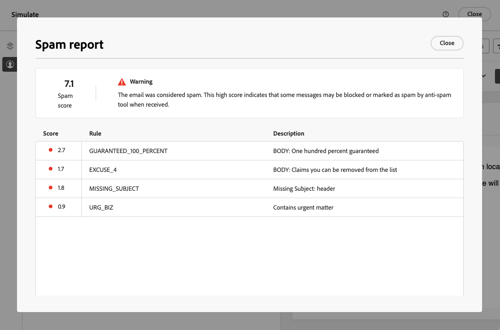
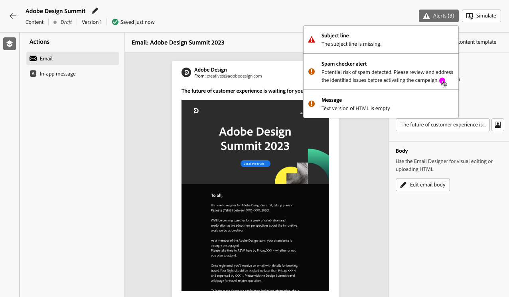

# Usare il rapporto spam {#spam-report}

>[!AVAILABILITY]
>
>La funzione di rapporto Spam è attualmente disponibile come versione beta solo per alcuni utenti. Per partecipare al programma beta, contatta l’Assistenza clienti Adobe.

[!DNL Journey Optimizer] consente di controllare le prestazioni del contenuto rispetto al filtro anti-spam e di assicurarsi che i messaggi arrivino nelle caselle in entrata dei clienti, non nella posta indesiderata.

>[!CAUTION]
>
>* Questa funzione è attualmente disponibile solo per il canale e-mail.
>
>* Per il momento l’analisi del rapporto spam può essere eseguita solo per il contenuto in inglese.

Quando modifichi o visualizzi in anteprima il contenuto, il **[!UICONTROL Rapporto spam]** fornisce un punteggio e consigli per migliorare i punteggi di ogni singolo elemento elencato.

Ciò ti consente di determinare se un messaggio corre il rischio di essere considerato come spam dagli strumenti anti-spam utilizzati al momento della ricezione e di intraprendere azioni in caso contrario.

>[!CAUTION]
>
>Il rapporto Spam fornisce solo indicazioni e avvisi. Nota che non ti viene impedito di inviare messaggi se il rapporto Spam indica che il contenuto è considerato come spam. È tua scelta agire in base al punteggio e ai miglioramenti suggeriti.

Per utilizzare **[!UICONTROL Rapporto spam]** , attieniti alla procedura seguente.

<!--For example spam scoring tool can tell that there are too many Images compared to the text. Retailers tend to do this even though the spam score gets worse because the content is more engaging.-->

<!--Michael, who is a marketer with NIKE works along with Tara from testing team to ensure that the emails being sent as part of the campaign/journey don't get categorised as SPAM.

They need an integration within AJO's marketing system to show how the curated content is doing against different SPAM compliance pillars like for SPAM trigger words, HTML Body content and layout, subject line etc.

They should be able to get scores for each individual items as shown by market standard SPAM filtering tools like Spam Assassin, Symantec etc.

They should also get suggestions on how to improve the score better to be confident that the messages don't get categorised as spam.-->

1. Dalla sezione **[!UICONTROL Simula]** , fare clic su **[!UICONTROL Rapporto spam]** pulsante.

   

<!--
    You can also open the [Email Designer](../email/content-from-scratch.md), click the **[!UICONTROL More]** button and select **[!UICONTROL Check spam score]** from the menu.

    
-->

1. Viene automaticamente eseguito un controllo anti-spam e **[!UICONTROL Rapporto spam]** visualizza i risultati. Mostra come funziona il contenuto in termini di layout del corpo, struttura, dimensioni dell’immagine, parole attivatrici di spam, se presenti, ecc.

   

1. Controlla i punteggi e le descrizioni di ogni elemento.

   Se il punteggio è superiore a 5, viene visualizzato un avviso. Indica che alcuni messaggi ricevuti possono essere bloccati o contrassegnati come spam da strumenti anti-spam.

1. In base a tale punteggio, se ritieni che alcuni elementi possano essere migliorati, vai al contenuto utilizzando [E-mail Designer](../email/content-from-scratch.md) e apportare gli aggiornamenti necessari.

1. Al termine delle modifiche, torna a **[!UICONTROL Rapporto spam]** per garantire che il punteggio sia migliorato.

   

<!--You can also check the message's alerts for warnings on potential risk of spam detection. Follow the steps below.

1. Click the **[!UICONTROL Alerts]** button on top right of the screen. [Learn more on email alerts](../email/create-email.md#check-email-alerts)

1. If **[!UICONTROL Spam checker alert]** is displayed, you should check your content for a potential risk of spam using the **[!UICONTROL Spam report]** feature as detailed above.

    
-->
