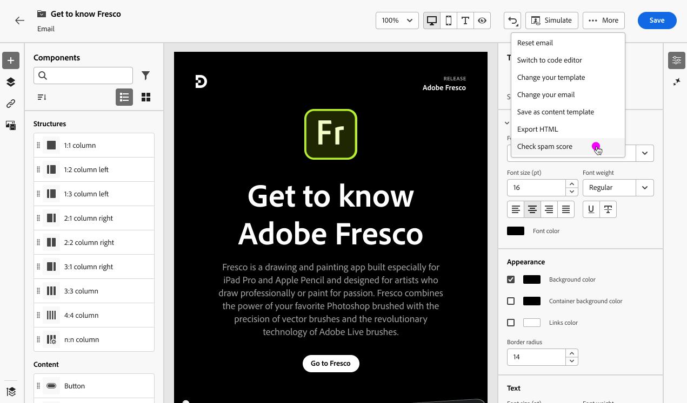

# Rapporto posta indesiderata {#spam-report}

>[!CONTEXTUALHELP]
>id="ajo_simulate_spam_report"
>title="Rapporto posta indesiderata"
>abstract="Il rapporto Spam consente di controllare il punteggio di posta indesiderata del contenuto delle e-mail. Questo punteggio indica se gli ISP o i provider di cassette postali considereranno il messaggio come spam o meno. Più basso è il punteggio, meglio è. Se il punteggio del contenuto dell’e-mail è superiore a 2, è consigliabile risolvere i problemi che impediscono il corretto funzionamento dei test."

Puoi controllare il punteggio di posta indesiderata in un report spam dedicato. Utilizzo di [SpamAssassin](https://spamassassin.apache.org/){target="_blank"}, Adobe Journey Optimizer può testare il contenuto delle e-mail e assegnargli un punteggio per indicare se gli ISP o i provider di cassette postali lo considereranno come spam o meno.

>[!AVAILABILITY]
>
>Questa funzionalità è disponibile nella versione beta e solo per clienti beta. Per partecipare al programma beta, contatta l’Assistenza clienti di Adobe.

Quando modifichi o visualizzi in anteprima il contenuto delle e-mail, il **[!UICONTROL Rapporto spam]** fornisce un punteggio e consigli per migliorare i punteggi di ogni singolo elemento elencato.

Questa funzionalità ti consente di determinare se un messaggio può essere considerato come spam dagli strumenti anti-spam utilizzati al momento della ricezione e di intraprendere azioni in tal caso. Molti provider di posta in arrivo utilizzano gli strumenti come parte del processo di filtraggio della posta indesiderata. L’invio di e-mail con un punteggio errato può influire notevolmente sulla consegna dei messaggi.

Per accedere al **[!UICONTROL Rapporto spam]**, segui la procedura indicata di seguito.

1. Dalla sezione **[!UICONTROL Simula]** , fare clic su **[!UICONTROL Rapporto spam]** pulsante.

   

<!--
    You can also open the [Email Designer](../email/content-from-scratch.md), click the **[!UICONTROL More]** button and select **[!UICONTROL Check spam score]** from the menu.

    
-->

1. Viene automaticamente eseguito un controllo anti-spam e **[!UICONTROL Rapporto spam]** visualizza i risultati. Mostra come funziona il contenuto in termini di layout del corpo, struttura, dimensioni dell’immagine, parole attivatrici di spam, se presenti, ecc.

   

1. Controlla i punteggi e le descrizioni di ogni elemento.

   Più basso è il punteggio, meglio è. Se il punteggio è superiore a 5, viene visualizzato un avviso: indica che alcuni messaggi potrebbero essere bloccati o contrassegnati come spam al momento della ricezione. Si consiglia di avere un punteggio inferiore a 2.

1. In base a tale punteggio, se ritieni che alcuni elementi possano essere migliorati, modifica il contenuto in [E-mail Designer](../email/content-from-scratch.md) e apporta gli aggiornamenti necessari.

1. Al termine delle modifiche, torna a **[!UICONTROL Rapporto spam]** per garantire che il punteggio sia migliorato.

   

<!--You can also check the message's alerts for warnings on potential risk of spam detection. Follow the steps below.

1. Click the **[!UICONTROL Alerts]** button on top right of the screen. [Learn more on email alerts](../email/create-email.md#check-email-alerts)

1. If **[!UICONTROL Spam checker alert]** is displayed, you should check your content for a potential risk of spam using the **[!UICONTROL Spam report]** feature as detailed above.

    
-->
