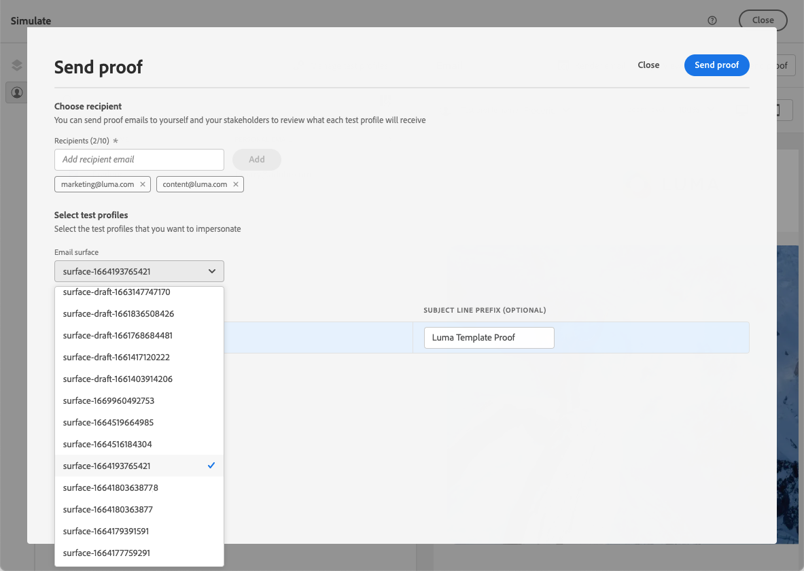

# Test dei modelli di contenuto e-mail {#test-template}

Puoi testare il rendering di alcuni modelli e-mail, creati da zero o da un contenuto esistente. A questo scopo, segui i passaggi riportati qui sotto.

1. Accedi all&#39;elenco dei modelli di contenuto tramite il menu **[!UICONTROL Gestione contenuto]** > **[!UICONTROL Modelli di contenuto]** e seleziona un modello di e-mail.

1. Fai clic su **[!UICONTROL Modifica contenuto]** dalle **[!UICONTROL proprietà modello]**.

1. Fai clic su **[!UICONTROL Simula contenuto]** e seleziona un profilo di test per verificare il rendering. [Ulteriori informazioni](../content-management/preview-test.md)

   

   >[!NOTE]
   >
   >[!DNL Journey optimizer] consente inoltre di testare diverse varianti dei modelli di contenuto visualizzandoli in anteprima e inviando bozze utilizzando dati di input di esempio caricati da un file CSV / JSON o aggiunti manualmente. [Scopri come simulare varianti di contenuto](../test-approve/simulate-sample-input.md)

1. Puoi inviare una bozza per testare il contenuto e farla approvare da alcuni utenti interni prima di utilizzarla in un percorso o in una campagna.

   * A tale scopo, fare clic sul pulsante **[!UICONTROL Invia bozza]** e seguire i passaggi descritti in [questa sezione](../content-management/proofs.md).

   * Prima di inviare la bozza, è necessario selezionare la [configurazione e-mail](../configuration/channel-surfaces.md) che verrà utilizzata per verificare il contenuto.

     

>[!CAUTION]
>
>Il tracciamento attuale non è supportato durante il test dei modelli di contenuto e-mail, il che significa che gli eventi di tracciamento, i parametri UTM e i collegamenti alle pagine di destinazione non saranno efficaci nelle bozze inviate da un modello. Per verificare il tracciamento, [utilizza il modello di contenuto](../email/use-email-templates.md) in un messaggio e-mail e invia una bozza utilizzando i profili di test, oppure dati di input di esempio caricati da un file CSV/JSON o aggiunti manualmente. [Scopri come visualizzare in anteprima e verificare il contenuto](../content-management/preview-test.md)
