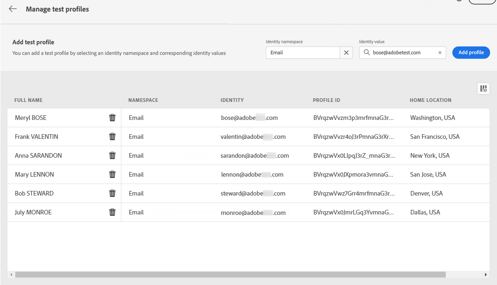

# Selezionare i profili di test {#select-test-profiles}

>[!CONTEXTUALHELP]
>id="ajo_preview_test_profiles"
>title="Utilizza i profili di test per verificare il contenuto"
>abstract="Utilizza i profili di test per visualizzare in anteprima e verificare il contenuto. Se hai aggiunto campi personalizzati, puoi controllarne la visualizzazione utilizzando i dati dei profili di test."

Prima di visualizzare l’anteprima o testare il contenuto, devi selezionare i profili di test, che sono destinatari aggiuntivi che non corrispondono ai criteri di targeting definiti. [Scopri come creare profili di test](../audience/creating-test-profiles.md)

Per selezionare i profili di test, effettua le seguenti operazioni:

1. Dalla schermata di modifica del contenuto del messaggio o in E-mail Designer, fai clic su **[!UICONTROL Simula contenuto]** pulsante.

1. Fai clic su **[!UICONTROL Gestire i profili di test]** quindi selezionare lo spazio dei nomi da utilizzare per identificare i profili di test facendo clic sul pulsante **[!UICONTROL Spazio dei nomi dell’identità]** icona di selezione. [Ulteriori informazioni sugli spazi dei nomi delle identità di Adobe Experience Platform](../audience/get-started-identity.md).

   Nell’esempio seguente utilizziamo **E-mail** spazio dei nomi.

   

1. Utilizza il campo di ricerca per trovare lo spazio dei nomi, selezionalo e fai clic su **[!UICONTROL Seleziona]**

   

1. In **[!UICONTROL Valore identità]** , immetti il valore (qui l’indirizzo e-mail) per identificare il profilo di test e fai clic su **[!UICONTROL Aggiungi profilo]**.

   <!---->

1. Se hai aggiunto la personalizzazione al messaggio, aggiungi altri profili in modo da poter testare diverse varianti del messaggio a seconda dei dati del profilo. Una volta aggiunti, i profili vengono elencati nei campi selezionati.

   

   In base agli elementi di personalizzazione del messaggio, questo elenco visualizza i dati per ciascun profilo di test nelle colonne correlate.
