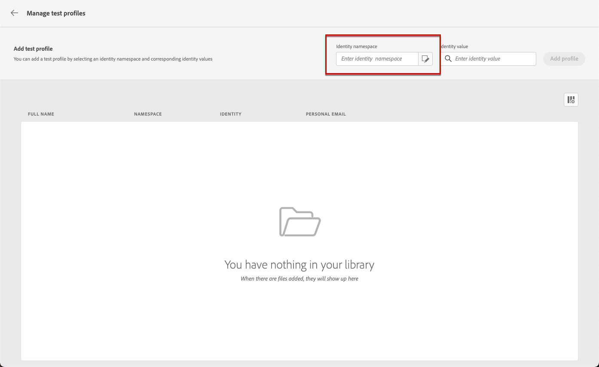

# Selezionare i profili di test {#select-test-profiles}

>[!CONTEXTUALHELP]
>id="ajo_preview_test_profiles"
>title="Utilizza i profili di test per verificare il contenuto"
>abstract="Utilizza i profili di test per visualizzare in anteprima e verificare il contenuto. Se hai aggiunto campi personalizzati, puoi controllarne la visualizzazione utilizzando i dati dei profili di test."

I profili di test sono destinatari aggiuntivi che non corrispondono ai criteri di targeting definiti. [Scopri come creare i profili di test](../audience/creating-test-profiles.md)

Prima di utilizzare i profili di test per testare il contenuto, è necessario selezionarli. Per farlo, segui questi passaggi:

1. Dalla schermata Modifica contenuto del messaggio o nel Designer e-mail, fai clic su **[!UICONTROL Simula contenuto]**, quindi seleziona **[!UICONTROL Simula contenuto (profili AEP)]** dal menu a discesa.

1. Fai clic sul pulsante **[!UICONTROL Gestisci profili di test]**, quindi seleziona lo spazio dei nomi da utilizzare per identificare i profili di test facendo clic sull&#39;icona di selezione **[!UICONTROL Spazio dei nomi identità]**. [Ulteriori informazioni sugli spazi dei nomi delle identità di Adobe Experience Platform](../audience/get-started-identity.md).

   Nell&#39;esempio seguente viene utilizzato lo spazio dei nomi **E-mail**.

   

1. Utilizza il campo di ricerca per trovare lo spazio dei nomi, selezionalo e fai clic su **[!UICONTROL Seleziona]**

   

1. Nel campo **[!UICONTROL Valore identità]** immettere il valore (in questo caso l&#39;indirizzo di posta elettronica) per identificare il profilo di test e fare clic su **[!UICONTROL Aggiungi profilo]**.

   <!---->

1. Se hai aggiunto la personalizzazione al messaggio, aggiungi altri profili in modo da poter testare diverse varianti del messaggio a seconda dei dati del profilo. Una volta aggiunti, i profili vengono elencati nei campi selezionati.

   

   In base agli elementi di personalizzazione del messaggio, questo elenco visualizza i dati per ciascun profilo di test nelle colonne correlate.

>[!NOTE]
>
>Oltre ai profili di test, [!DNL Journey optimizer] consente anche di testare diverse varianti del contenuto visualizzandolo in anteprima e inviando bozze utilizzando dati di input di esempio caricati da un file CSV / JSON o aggiunti manualmente. [Scopri come simulare varianti di contenuto](../test-approve/simulate-sample-input.md)
