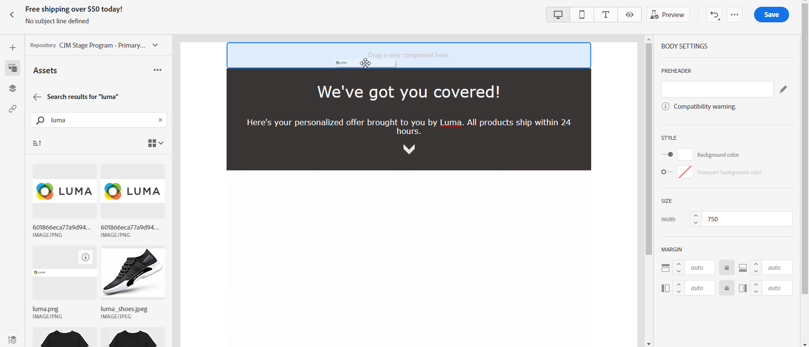
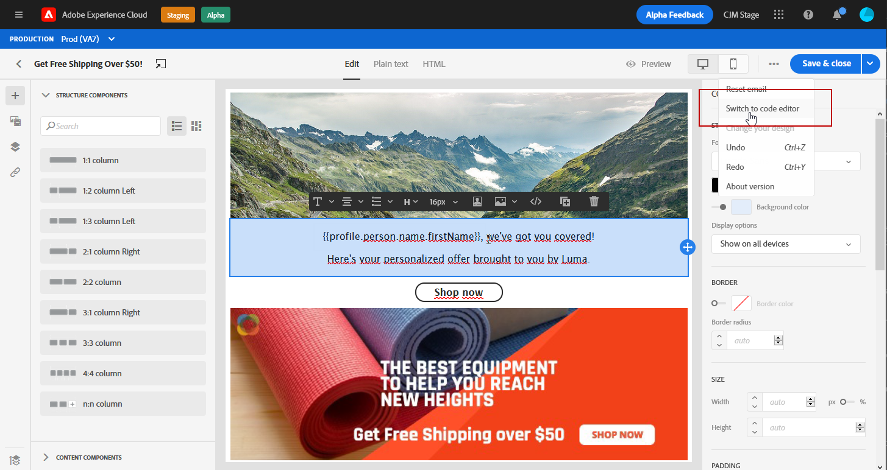

# Progettazione del contenuto delle e-mail nell’interfaccia utente {#create-email-content}

Dopo aver [creato il messaggio](create-message.md), puoi iniziare a creare il contenuto dell&#39;e-mail.

1. Dal messaggio appena creato, seleziona **[!UICONTROL Email designer]** nella sezione **[!UICONTROL Body]** .

   

1. Nella home page di E-mail Designer, scegli come desideri progettare l’e-mail tra le seguenti opzioni:

   * Seleziona **[!UICONTROL Design from scratch]** per utilizzare le funzionalità di e-mail designer per creare il contenuto delle e-mail. [Ulteriori informazioni](#design-scratch)

   * Seleziona **[!UICONTROL Start from template]** per creare il messaggio e-mail da un elenco di modelli incorporato. Non è possibile creare altri modelli.

   * Seleziona **[!UICONTROL Code your own]** per inserire o incollare il codice HTML non elaborato. [Ulteriori informazioni](existing-content.md#import-raw-html-code).

   * Seleziona **[!UICONTROL Import HTML]** per importare un file HTML o una cartella .zip. [Ulteriori informazioni](existing-content.md#import-html-content-from-file).

   

## Progettazione da zero {#design-scratch}

>[!CONTEXTUALHELP]
>id="ac_structure_components"
>title="Informazioni sui componenti Struttura"
>abstract="I componenti struttura definiscono il layout del messaggio e-mail."

>[!CONTEXTUALHELP]
>id="ac_edition_columns"
>title="Definizione delle colonne e-mail"
>abstract="E-mail Designer consente di definire facilmente il layout dell’e-mail definendo la struttura delle colonne."

E-mail Designer consente di definire facilmente la struttura dell’e-mail. Aggiungendo e spostando elementi strutturali con semplici azioni di trascinamento, puoi progettare la forma del messaggio e-mail in pochi secondi.

Per iniziare a creare il contenuto delle e-mail con e-mail designer, segui i passaggi seguenti:

1. Dopo aver selezionato l’opzione **[!UICONTROL Design from scratch]** , inizia a progettare il contenuto dell’e-mail trascinando **[!UICONTROL Structure components]** per definire il layout dell’e-mail.

   >[!NOTE]
   >
   >Tieni presente che una pila di colonne non è compatibile con tutti i programmi e-mail. Se non è supportato, le colonne non verranno sovrapposte.
   >
   >Una volta inseriti nell’e-mail, non puoi spostare né rimuovere i componenti a meno che non sia già presente un componente di contenuto o un frammento all’interno.

   

1. Aggiungi tutti i **[!UICONTROL Structure components]** necessari.

   Seleziona il componente **[!UICONTROL n:n column]** per definire il numero di colonne desiderato (tra 3 e 10). È inoltre possibile definire la larghezza di ogni colonna spostando le frecce nella parte inferiore di ciascuna colonna.

   >[!NOTE]
   >
   >Le dimensioni di ogni colonna non possono essere inferiori al 10% della larghezza totale del componente struttura. Non è possibile rimuovere una colonna non vuota.

1. Dal menu a discesa **[!UICONTROL Content components]** puoi aggiungere tutti i **[!UICONTROL Content components]** necessari nel componente struttura. [Ulteriori informazioni sui componenti](content-components.md) contenuto.

   

1. Ogni componente può essere ulteriormente personalizzato con la sezione **[!UICONTROL Component settings]** . Ad esempio, puoi modificare lo stile del testo, la spaziatura o il margine del componente. [Ulteriori informazioni sull’allineamento e la spaziatura](#adjusting-vertical-alignment-and-padding).

   

1. Dal **[!UICONTROL Assets picker]**, puoi aggiungere direttamente all’e-mail le risorse memorizzate in **[!UICONTROL Assets library]**. [Ulteriori informazioni sulla gestione](assets-essentials.md) delle risorse.

   Fai doppio clic sulla cartella contenente le risorse e trascina e rilascia la risorsa da aggiungere all’e-mail.

   

1. Aggiungi campi di personalizzazione per personalizzare il contenuto dai dati dei profili. [Ulteriori informazioni sulla personalizzazione dei contenuti](personalization/personalize.md).

   

1. Nella scheda **[!UICONTROL Links]** del riquadro a sinistra, controlla l’elenco di tutti gli URL del contenuto che verranno tracciati. Se necessario, puoi modificarne i valori **[!UICONTROL Tracking Type]**, **[!UICONTROL Label]** e **[!UICONTROL Tags]**.

   

   >[!NOTE]
   >
   >Ulteriori informazioni sui collegamenti e il tracciamento dei messaggi in [questa pagina](message-tracking.md).

1. Se necessario, puoi passare all’editor di codice per personalizzare ulteriormente l’e-mail facendo clic su **[!UICONTROL Switch to code editor]** nel menu avanzato. Per ulteriori informazioni sull&#39;editor di codice, consulta questa [pagina](existing-content.md#import-raw-html-code).

   >[!NOTE]
   >
   >Dopo il passaggio all’editor di codice, non potrai utilizzare la finestra di progettazione visiva per questa e-mail.

   

1. Fai clic su **[!UICONTROL Show preview]** per controllare il rendering delle e-mail. È possibile scegliere la visualizzazione desktop o mobile.

   Per ulteriori informazioni su come visualizzare in anteprima il messaggio e-mail, consulta [Anteprima e verifica i messaggi](preview.md).

   

1. Quando l’e-mail è pronta, fai clic su **[!UICONTROL Save & Close]**.

Il contenuto dell’e-mail può ora essere utilizzato in un messaggio. [Scopri come inviare un messaggio](publish-manage-message.md).

## Creare la versione testuale di un messaggio e-mail {#generate-text-version}

Si consiglia di creare una versione testuale del corpo dell’e-mail, che viene utilizzata quando il contenuto HTML non può essere visualizzato.

Per impostazione predefinita, E-mail Designer crea una versione **[!UICONTROL Plain text]** del messaggio e-mail, inclusi i campi di personalizzazione. Questa versione viene generata automaticamente e sincronizzata con la versione HTML del contenuto.

Se preferisci utilizzare un contenuto diverso per la versione di testo normale, segui la procedura seguente:

1. Dal messaggio e-mail, seleziona la scheda **[!UICONTROL Plain text]** .

   

1. Utilizza l&#39;interruttore **[!UICONTROL Sync with HTML]** per disabilitare la sincronizzazione.

   

1. Fai clic sul segno di spunta per confermare la scelta.

   

1. Puoi quindi modificare la versione di testo normale come desiderato.

>[!CAUTION]
>
>* Le modifiche apportate nella visualizzazione **[!UICONTROL Plain text]** non vengono riportate nella visualizzazione HTML.
   >
   >
* Se riattivi l’opzione **[!UICONTROL Sync with HTML]** dopo l’aggiornamento del contenuto di testo normale, le modifiche andranno perse e verranno sostituite con il contenuto di testo generato dalla versione HTML.

## Utilizzare una preintestazione {#preheader}

>[!CONTEXTUALHELP]
>id="ac_edition_preheader"
>title="Utilizzo di una preintestazione"
>abstract="La preintestazione consente di configurare un breve testo di riepilogo che consente di tenere traccia e personalizzare meglio le e-mail."

>[!NOTE]
>
>I preintestazioni non sono compatibili con tutti i client e-mail. Se non supportato, la preintestazione non viene visualizzata.

Una preintestazione è un breve testo di riepilogo che segue l’oggetto quando visualizzi un’e-mail dal client e-mail. La preintestazione può aiutarti a tenere traccia e personalizzare meglio le e-mail.

1. Dalla finestra di progettazione e-mail, aggiungi un **[!UICONTROL Structure components]** per iniziare a progettare l’e-mail.

   

1. Dal riquadro a destra **[!UICONTROL Body settings]**, fai clic su **Modifica** accanto al campo **[!UICONTROL Preheader]** per aggiungere contenuto.

   

1. Aggiungi la tua preintestazione. Per personalizzare ulteriormente la pagina, fai clic sull’icona **[!UICONTROL Add personalization]** .

   

1. Dalla finestra **[!UICONTROL Edit Personalization]** è possibile aggiungere **[!UICONTROL Content block]**, **[!UICONTROL Dynamic content]** o **[!UICONTROL Personalization fields]**.

1. Fai clic su **[!UICONTROL Validate]** per controllare la sintassi di personalizzazione.

   

1. Fai clic su **[!UICONTROL Save]**.

La preintestazione è ora configurata per l’e-mail.

## Impostazioni di sfondo {#about-backgrounds}

>[!CONTEXTUALHELP]
>id="ac_edition_backgroundimage"
>title="Impostazioni di sfondo"
>abstract="La finestra di progettazione e-mail ti consente di personalizzare il colore di sfondo o l’immagine di sfondo per il contenuto.Nota che l’immagine di sfondo non è supportata da tutti i client e-mail."
>additional-url="https://docs.google.com/spreadsheets/d/1TLo62YKm3tThUWDOIliCQFWs3dpNjpDfw6DdTr1oGOw/edit#gid=0" text="Informazioni aggiuntive"

Quando si tratta di impostare gli sfondi con E-mail Designer, l’Adobe consiglia quanto segue:

1. Se richiesto dalla progettazione, applica un colore di sfondo al corpo dell’e-mail.
1. Nella maggior parte dei casi, imposta i colori di sfondo a livello di colonna.
1. Prova a non utilizzare i colori di sfondo su componenti immagine o testo in quanto sono difficili da gestire.

Di seguito sono riportate le impostazioni di sfondo disponibili che è possibile utilizzare.

* Imposta un **[!UICONTROL Background color]** per l’intera e-mail. Assicurati di selezionare le impostazioni del corpo nella struttura di navigazione accessibile dalla palette a sinistra.

* Imposta lo stesso colore di sfondo per tutti i componenti struttura selezionando **[!UICONTROL Viewport background color]**. Questa opzione consente di selezionare un’impostazione diversa dal colore di sfondo.

* Impostare un colore di sfondo diverso per ciascun componente struttura. Selezionare una struttura nell&#39;albero di navigazione accessibile dalla palette a sinistra per applicare un colore di sfondo specifico solo a tale struttura.

   Assicurati di non impostare un colore di sfondo del riquadro di visualizzazione in quanto potrebbe nascondere i colori di sfondo della struttura.

* Imposta un **[!UICONTROL Background image]** per il contenuto di un componente struttura.

   >[!NOTE]
   >
   >Alcuni programmi e-mail non supportano le immagini in background. Se non supportato, verrà utilizzato il colore di sfondo della riga. Assicurati di selezionare un colore di sfondo di fallback appropriato nel caso in cui l&#39;immagine non possa essere visualizzata.

* Imposta un colore di sfondo a livello di colonna.

   >[!NOTE]
   >
   >Questo è il caso d’uso più comune. Adobe consiglia di impostare i colori di sfondo a livello di colonna, in quanto ciò consente una maggiore flessibilità nella modifica dell’intero contenuto dell’e-mail.

   Puoi anche impostare un’immagine di sfondo a livello di colonna, ma questa viene utilizzata raramente.

## Regolare l’allineamento verticale e la spaziatura {#adjusting-vertical-alignment-and-padding}

In questo esempio, regoleremo la spaziatura e l’allineamento verticale all’interno di un componente struttura composto da tre colonne.

1. Seleziona il componente struttura direttamente nel messaggio e-mail o utilizza il **[!UICONTROL Navigation tree]** disponibile nel menu a sinistra.

   

1. Dalla barra degli strumenti, fai clic su **[!UICONTROL Select a column]** e scegli quello da modificare. È inoltre possibile selezionarlo dalla struttura ad albero.

   I parametri modificabili per quella colonna vengono visualizzati nel menu **[!UICONTROL Column settings]** .

   

1. In **[!UICONTROL Vertical alignment]**, selezionare **[!UICONTROL Bottom]**.

   Il componente contenuto si sposta nella parte inferiore della colonna.

   

1. Alla voce **[!UICONTROL Padding]**, definisci la spaziatura superiore all’interno della colonna. Fai clic sull’icona Blocca per interrompere la sincronizzazione con la spaziatura inferiore.

   Definisci la spaziatura sinistra e destra per la colonna.

   

1. Procedi in modo simile per regolare l’allineamento e la spaziatura delle altre colonne.

1. Salva le modifiche.

## Definire uno stile per i collegamenti {#about-styling-links}

È possibile sottolineare un collegamento e selezionarne il colore e la destinazione in E-mail Designer.

1. In un testo **[!UICONTROL Content component]** in cui viene inserito un collegamento, seleziona il collegamento.

1. Nel menu **[!UICONTROL Component settings]** , seleziona **[!UICONTROL Underline link]** per sottolineare il testo dell’etichetta del collegamento.

   

1. Scegli come verrà reindirizzato il pubblico con il menu a discesa **[!UICONTROL Target]** :

   * **[!UICONTROL None]**: apre il collegamento nello stesso frame in cui è stato fatto clic (impostazione predefinita).
   * **[!UICONTROL Blank]**: apre il collegamento in una nuova finestra o scheda.
   * **[!UICONTROL Self]**: apre il collegamento nello stesso frame in cui è stato fatto clic.
   * **[!UICONTROL Parent]**: apre il collegamento nel frame principale.
   * **[!UICONTROL Top]**: apre il collegamento nel corpo completo della finestra.

   

1. Per modificare il colore del collegamento, fai clic su **[!UICONTROL Link color]**.

   

1. Scegli il colore di cui hai bisogno.

1. Salva le modifiche.

## Aggiungi attributi di stile in linea {#adding-inline-styling-attributes}

Nell’interfaccia di E-mail Designer, quando selezioni un elemento e ne visualizzi le impostazioni nel pannello laterale, puoi personalizzare gli attributi in linea e il relativo valore per quell’elemento specifico.

1. Seleziona un elemento nel contenuto.
1. Nel pannello laterale, cerca le impostazioni **[!UICONTROL Styles Inline]** .

1. Modifica i valori degli attributi esistenti o aggiungi nuovi attributi utilizzando il pulsante **+** . Puoi aggiungere qualsiasi attributo e valore conforme a CSS.

Lo stile viene quindi applicato all’elemento selezionato. Se per gli elementi secondari non sono definiti attributi di stile specifici, viene ereditato lo stile dell’elemento padre.

