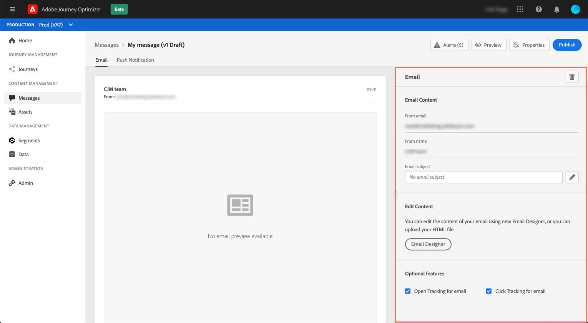

# Creare un messaggio e-mail {#configure-email}

Una volta [creato un messaggio](create-message.md), utilizza **[!UICONTROL Email]** per definire le impostazioni e il contenuto del canale e-mail.

>[!NOTE]
>
>La **[!UICONTROL From email]** e **[!UICONTROL From name]** sono di sola lettura e sono determinati dal **[!UICONTROL Preset]** che è stato selezionato quando [creazione del messaggio](create-message.md).

I passaggi per configurare un’e-mail sono i seguenti:

1. Specifica l’oggetto dell’e-mail nella **[!UICONTROL Subject line]** campo . A questo scopo, fai clic sul pulsante a destra per aprire l’editor espressioni e comporre l’oggetto dell’e-mail. Scopri come aggiungere la personalizzazione in [questa sezione](personalization/personalize.md)

1. Fai clic sul pulsante **[!UICONTROL Email Designer]** per progettare il messaggio e-mail. Scopri come progettare e-mail in [questa sezione](design-emails.md).

1. Se desideri tenere traccia del comportamento dei destinatari attraverso le aperture e/o i clic sui collegamenti, assicurati che la **[!UICONTROL Open Tracking for email]** e **[!UICONTROL Click Tracking for email]** sono abilitate. Ulteriori informazioni sul tracciamento in [questa sezione](message-tracking.md).
