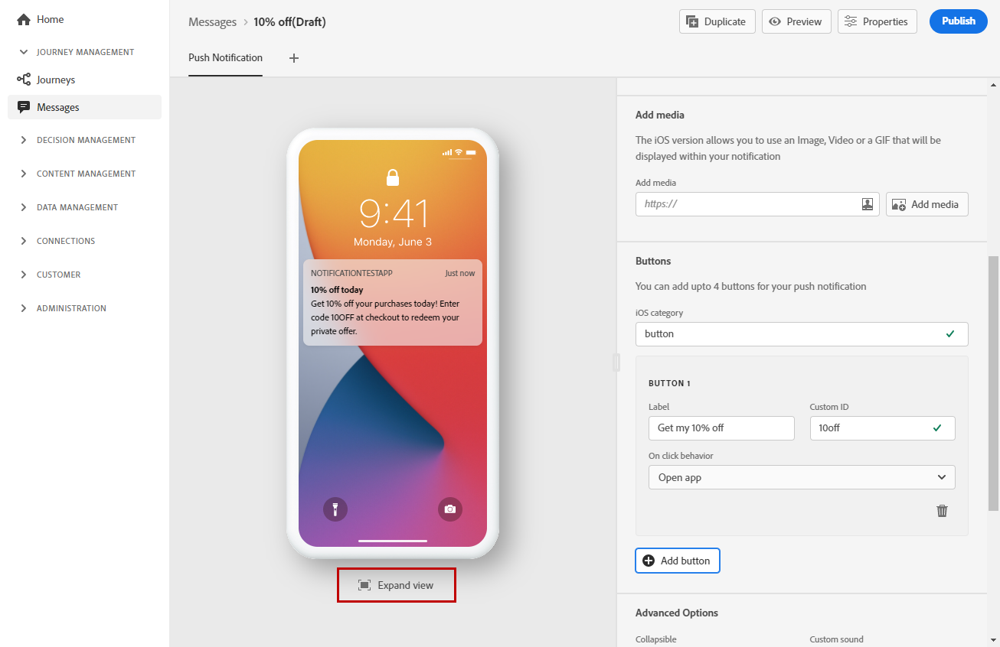

# Creare una notifica push {#create-push-notification}

Dopo aver [creato un messaggio](create-message.md), fai clic sulla scheda **[!UICONTROL Push Notification]** per definire le impostazioni e il contenuto della notifica push.

Utilizza le schede dedicate per definire le impostazioni di notifica push per i sistemi operativi **iOS** e **Android**.

>[!NOTE]
>
>La sezione **[!UICONTROL Compose Message]** è comune sia alle schede **[!UICONTROL iOS]** che **[!UICONTROL Android]**. Qualsiasi modifica in questa sezione verrà applicata a entrambe le schede.

## Titolo e corpo

Per comporre il messaggio, fai clic sui campi **[!UICONTROL Title]** e **[!UICONTROL Body]** . Utilizza l’editor espressioni per definire contenuto e dati di personalizzazione. Ulteriori informazioni sulla personalizzazione nell&#39;editor espressioni in [questa sezione](personalization/personalize.md)

Utilizza la sezione di anteprima del dispositivo per visualizzare il modo in cui la notifica push viene visualizzata sui dispositivi iOS e Android.

## Comportamento del clic {#on-click-behavior}

Seleziona il comportamento quando un destinatario fa clic sul corpo della notifica push.

* Utilizza l’opzione **[!UICONTROL Open app]** per aprire l’applicazione associata al messaggio **[!UICONTROL Preset]**.
* Utilizza l’opzione **[!UICONTROL Deeplink]** per reindirizzare il destinatario a uno specifico contenuto presente all’interno dell’applicazione. Inserisci il collegamento profondo nel campo associato.
* Utilizza l’opzione **[!UICONTROL Web URL]** per reindirizzare il destinatario a un URL esterno. Immetti l’URL nel campo associato.

## Aggiungi file multimediali

Nella versione iOS della notifica push, puoi aggiungere un’immagine, un video o un GIF da visualizzare all’interno della notifica.

Nella versione Android, puoi aggiungere solo un’icona immagine e un’immagine per le notifiche estese.

Sono disponibili due opzioni. È possibile:

* Fai clic sul pulsante **[!UICONTROL Add media]** per selezionare una risorsa in **[!DNL Adobe Experience Manager Assets Essentials]**.

   Scopri come utilizzare **[!DNL Adobe Experience Manager Assets Essentials]** in [questa pagina](assets-essentials.md).

* Oppure inserisci l&#39;URL del supporto facendo clic sul campo **[!UICONTROL Add media]** . In tal caso, puoi aggiungere la personalizzazione.

Una volta aggiunto, il contenuto multimediale viene visualizzato a destra del corpo della notifica.

## Aggiungi pulsanti

Puoi creare una notifica fruibile aggiungendo pulsanti al contenuto push.

Se la schermata del dispositivo è bloccata, questi pulsanti non vengono visualizzati: sono visibili solo il **Titolo** e il **Messaggio** della notifica. Se il dispositivo è sbloccato, i destinatari visualizzeranno i pulsanti.

Nella versione iOS è possibile aggiungere fino a 4 pulsanti. Nella versione Android, è possibile aggiungere fino a 3 pulsanti.

>[!NOTE]
>
>Per iOS, utilizza il campo **[!UICONTROL iOS category]** per associare le azioni a una categoria di notifica.

Fai clic su **[!UICONTROL Add button]** per definire le impostazioni: l’etichetta e l’azione associata. Le azioni possibili sono le stesse di [comportamento al clic](#on-click-behavior).

Fai clic su **[!UICONTROL Expand view]** per visualizzare in anteprima i pulsanti personalizzati.

## Invia una notifica silenziosa

Una notifica push silenziosa (o notifica in background) è un&#39;istruzione nascosta inviata all&#39;applicazione. Viene utilizzato, ad esempio, per notificare all’applicazione la disponibilità di nuovi contenuti o per avviare un download in background.

Seleziona l’opzione **[!UICONTROL Silent Notification]** per inviare una notifica silenziosa all’applicazione: in questo caso, la notifica viene trasferita direttamente all&#39;applicazione. Sullo schermo del dispositivo non viene visualizzato alcun avviso.

Utilizza la sezione **[!UICONTROL Custom data]** per aggiungere coppie chiave/valore.

## Dati personalizzati

Nella sezione **[!UICONTROL Custom data]** puoi aggiungere variabili personalizzate al payload, a seconda della configurazione dell’app mobile. Per ulteriori informazioni su come impostare le notifiche push in Adobe Experience Platform e Adobe Launch, consulta [questa sezione](push-gs.md)

## Opzioni avanzate

Puoi configurare **[!UICONTROL Advanced options]** per la notifica push. I parametri disponibili sono elencati di seguito:

| Parametro | Descrizione |
|---------|---------|
| **[!UICONTROL Collapsible]** (iOS / Android) | Un messaggio comprimibile è un messaggio che può essere sostituito da un nuovo messaggio se non è più aggiornato. Un caso d’uso comune di messaggi comprimibili è rappresentato dai messaggi utilizzati per indicare a un’app mobile di sincronizzare i dati dal server. Ad esempio, un’app sportiva che aggiorna gli utenti con il punteggio più recente. Solo il messaggio più recente è rilevante. D’altro canto, con un messaggio non comprimibile, ogni messaggio è importante per l’app client e deve essere consegnato. |
| **[!UICONTROL Custom sound]** (iOS / Android) | Il suono che deve essere riprodotto dal terminale mobile quando viene ricevuta la notifica. L&#39;audio deve essere incluso nell&#39;app. |
| **[!UICONTROL Badges]** (iOS / Android) | Un badge viene utilizzato per visualizzare direttamente sull’icona dell’applicazione il numero di nuove informazioni non lette.  Il valore del badge scompare non appena l’utente apre o legge il nuovo contenuto dall’applicazione. Quando un dispositivo riceve una notifica, quest’ultima può aggiornare o aggiungere un valore di badge per l’app correlata. Ad esempio, se archivi il numero di articoli non letti dei clienti, puoi sfruttare la personalizzazione per inviare il valore univoco del badge degli articoli non letti per ciascun cliente. Per ulteriori personalizzazioni, consulta [questa sezione](personalization/personalize.md). |
| **[!UICONTROL Notification group]**  (Solo iOS) | Associa un gruppo di notifiche alla notifica push. A partire da iOS 12, i gruppi di notifica ti consentono di consolidare i thread di messaggio e gli argomenti di notifica in ID thread. Ad esempio, un marchio potrebbe inviare notifiche di marketing sotto un ID gruppo, mantenendo al tempo stesso più notifiche di tipo operativo sotto uno o più ID diversi. A questo scopo, puoi disporre di groupID: 123 &quot;check out the new spring collection of sweaters&quot; e groupID: 456 Gruppi di notifica &quot;il tuo pacchetto è stato consegnato&quot;. In questo esempio, tutte le notifiche di consegna sarebbero raggruppate in ID gruppo: 456 |
| **[!UICONTROL Notification channel]** (Solo Android) | Associa un canale di notifica alla notifica push. A partire da Android 8.0 (livello API 26), tutte le notifiche devono essere assegnate a un canale per essere visualizzate. Per ulteriori informazioni, consulta la [documentazione per gli sviluppatori Android](https://developer.android.com/guide/topics/ui/notifiers/notifications#ManageChannels). |
| **[!UICONTROL Add content-availability flag]** (Solo iOS) | Invia il flag di contenuto disponibile nel payload push per garantire che l’app venga riattivata non appena riceve la notifica push, il che significa che l’app sarà in grado di accedere ai dati del payload.  Questo funziona anche se l’app è in esecuzione in background e non richiede alcuna interazione da parte dell’utente (ad esempio, toccando la notifica push). Tuttavia, questo non si applica se l’app non è in esecuzione. Per ulteriori informazioni, consulta la [documentazione per gli sviluppatori di Apple](https://developer.apple.com/library/content/documentation/NetworkingInternet/Conceptual/RemoteNotificationsPG/CreatingtheNotificationPayload.html). |
| **[!UICONTROL Add mutable-content flag]** (Solo iOS) | Invia il flag di contenuto variabile nel payload push e consente la modifica del contenuto della notifica push da parte di un&#39;estensione dell&#39;applicazione del servizio di notifica fornita nell&#39;SDK iOS. Per ulteriori informazioni, consulta la [documentazione per sviluppatori di Apple](https://developer.apple.com/library/content/documentation/NetworkingInternet/Conceptual/RemoteNotificationsPG/ModifyingNotifications.html). Puoi quindi sfruttare le estensioni dell’app mobile per modificare ulteriormente il contenuto o la presentazione delle notifiche push in arrivo inviate da [!DNL Journey Optimizer]. Ad esempio, gli utenti possono sfruttare questa opzione per decrittografare i dati, modificare il testo del corpo o del titolo di una notifica, aggiungere un identificatore di thread a una notifica e così via. |
| **[!UICONTROL Notification visibility]** (Solo Android) | Definisce la visibilità della notifica push.  <b></b> Privatemostrerà la notifica su tutti gli schermi rigidi, ma nasconderà informazioni sensibili o private sugli schermi chiusi protetti.  <b></b> La notifica verrà visualizzata interamente su tutti gli schermi rigidi.  <b></b> Il segretariato non rivelerà alcuna parte della notifica su un blocco serraturo sicuro.  Per ulteriori informazioni, consulta la documentazione per gli sviluppatori  [Android](https://developer.android.com/reference/android/app/Notification). |
| **[!UICONTROL Notification priority]** (Solo Android) | Definisce l’importanza della notifica push da Bassa a Max. Questo determina quanto sarà &quot;intrusiva&quot; la notifica push quando viene consegnata. Per ulteriori informazioni, consulta la [documentazione per gli sviluppatori Android](https://developer.android.com/guide/topics/ui/notifiers/notifications#importance) |
| **[!UICONTROL Delivery priority]** (Solo Android) | Imposta una priorità alta o normale per le notifiche push. Per ulteriori informazioni sulla priorità dei messaggi, consulta la [documentazione per gli sviluppatori di Google](https://firebase.google.com/docs/cloud-messaging/concept-options#setting-the-priority-of-a-message). |

**Argomenti correlati**

<!--
* [Understand push notification flow](push-gs.md)
-->

* [Configurare il canale push](push-gs.md)
* [Creare un nuovo messaggio](create-message.md)
* [Aggiungere un messaggio in un percorso](building-journeys/journeys-message.md)

